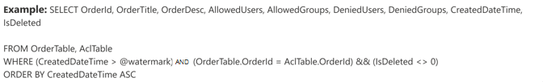

<!---Previous ms.author: vivg --->

# Azure SQL und Microsoft SQL server Graph Connectors

Der Microsoft SQL-Server oder Azure SQL Graph-Connector ermöglicht Ihrer Organisation das Ermitteln und Indizieren von Daten aus einer lokalen SQL Server-Datenbank oder einer Datenbank, die in Ihrer Azure SQL-Instanz in der Cloud gehostet wird.
Der Graph indiziert den angegebenen Inhalt in Microsoft Search. Um den Index mit Quelldaten auf dem neuesten Stand zu halten, werden regelmäßige vollständige und inkrementelle Durchforstungen unterstützt. Mit diesen SQL Connectors können Sie auch den Zugriff auf Suchergebnisse für bestimmte Benutzer einschränken.

> [!NOTE]
> Lesen Sie den Artikel Setup [**your Graph connector,**](configure-connector.md) um die Allgemeinen Anweisungen Graph Connectors zu verstehen.

Dieser Artikel gilt für alle Benutzer, die azure SQL und Microsoft SQL server Graph konfigurieren, ausgeführt und überwacht. Es ergänzt den allgemeinen Einrichtungsprozess und zeigt Anweisungen, die nur für azure SQL und Microsoft SQL server Graph gelten. Dieser Artikel enthält außerdem Informationen zu [Einschränkungen](#limitations) für den Microsoft SQL server und Azure SQL Connectors.

## Bevor Sie beginnen

### Installieren des Graph -Connector-Agents (nur für lokalen Microsoft SQL-Serverconnector erforderlich)

Um auf Ihre lokalen Drittanbieterdaten zu zugreifen, müssen Sie den Graph installieren und konfigurieren. Weitere [Informationen finden Sie unter Install the Graph connector agent.](on-prem-agent.md)  

## Schritt 1: Hinzufügen eines Graph im Microsoft 365 Admin Center

Befolgen Sie die [allgemeinen Setupanweisungen](./configure-connector.md).
<!---If the above phrase does not apply, delete it and insert specific details for your data source that are different from general setup 
instructions.-->

## Schritt 2: Benennen der Verbindung

Befolgen Sie die [allgemeinen Setupanweisungen](./configure-connector.md).
<!---If the above phrase does not apply, delete it and insert specific details for your data source that are different from general setup 
instructions.-->

## Schritt 3: Konfigurieren der Verbindungseinstellungen

### Registrieren einer App (nur für Azure SQL Connector)

Für Azure SQL müssen Sie eine App in Azure Active Directory registrieren, damit die Microsoft Search-App auf Daten für die Indizierung zugreifen kann. Weitere Informationen zum Registrieren einer App finden Sie in der Microsoft Graph zur Registrierung [einer App.](/graph/auth-register-app-v2)

Nachdem Sie die App-Registrierung abgeschlossen und den App-Namen, die Anwendungs-ID (client) und die Mandanten-ID notiert haben, müssen Sie einen neuen geheimen [Clientgeheimnis generieren.](/azure/healthcare-apis/register-confidential-azure-ad-client-app#application-secret) Der geheime Clientgeheimnis wird nur einmal angezeigt. Denken Sie daran, & den Geheimen Clientgeheimnis sicher zu speichern. Verwenden Sie die Client-ID und den geheimen Clientgeheimnis, während Sie eine neue Verbindung in Microsoft Search konfigurieren.

Zum Hinzufügen der registrierten App zu Azure SQL-Datenbank müssen Sie:

- Melden Sie sich bei Ihrer Azure SQL DB an
- Öffnen eines neuen Abfragefensters
- Erstellen sie einen neuen Benutzer, indem Sie den Befehl "BENUTZER [App-Name erstellen] VON EXTERNEM ANBIETER" ausführen
- Hinzufügen eines Benutzers zur Rolle durch Ausführen des Befehls "exec sp_addrolemember db_datareader", [App-Name]" oder "ALTER ROLE db_datareader ADD MEMBER [App-Name]"

>[!NOTE]
>Informationen zum Widerrufen des Zugriffs auf alle in Azure Active Directory registrierten Apps finden Sie in der Azure-Dokumentation zum Entfernen [einer registrierten App](/azure/active-directory/develop/quickstart-remove-app).

### Verbindungseinstellungen

Um Ihren Microsoft SQL-Serverconnector mit einer Datenquelle zu verbinden, müssen Sie den Datenbankserver, den Sie durchforsten möchten, und den on-prem-Agent konfigurieren. Anschließend können Sie eine Verbindung mit der Datenbank mit der erforderlichen Authentifizierungsmethode herstellen.

> [!NOTE] 
> Ihre Datenbank muss SQL Version 2008 oder höher ausgeführt werden, damit der Microsoft SQL-Serverconnector eine Verbindung herstellen kann.

Für den Azure SQL müssen Sie nur den Servernamen oder die IP-Adresse angeben, mit dem Sie eine Verbindung herstellen möchten. Azure SQL Connector unterstützt nur Azure Active Directory open ID connect (OIDC)-Authentifizierung, um eine Verbindung mit der Datenbank herzustellen.

Für zusätzliche Sicherheit können Sie IP-Firewallregeln für Ihre Azure-SQL oder Datenbank konfigurieren. Weitere Informationen zum Einrichten von IP-Firewallregeln finden Sie in der Dokumentation zu [IP-Firewallregeln.](/azure/azure-sql/database/firewall-configure) Fügen Sie die folgenden Client-IP-Bereiche in den Firewalleinstellungen hinzu.

| Region | IP-Bereich |
| ------------ | ------------ |
| NAM | 52.250.92.252/30, 52.224.250.216/30 |
| EUR | 20.54.41.208/30, 51.105.159.88/30 |
| APC | 52.139.188.212/30, 20.43.146.44/30 |

Zum Durchsuchen des Datenbankinhalts müssen Sie beim Konfigurieren des Connectors SQL Abfragen angeben. Diese SQL müssen alle Datenbankspalten benennen, die Sie indizieren möchten (d. h. Quelleigenschaften), einschließlich aller SQL-Verknüpfungen, die ausgeführt werden müssen, um alle Spalten zu erhalten. Um den Zugriff auf Suchergebnisse einzuschränken, müssen Sie Zugriffssteuerungslisten (Access Control Lists, ACLs) in SQL angeben, wenn Sie den Connector konfigurieren.

## Schritt 3a: Vollständige Durchforstung (erforderlich)

In diesem Schritt konfigurieren Sie die SQL, die eine vollständige Durchforstung der Datenbank ausgeführt wird. Bei der vollständigen Durchforstung werden alle Spalten oder Eigenschaften ausgewählt, in denen Sie die Optionen **Query,** **Search** oder **Retrieve auswählen möchten.** Sie können auch ACL-Spalten angeben, um den Zugriff auf Suchergebnisse auf bestimmte Benutzer oder Gruppen einzuschränken.

> [!Tip]
> Um alle benötigten Spalten zu erhalten, können Sie mehrere Tabellen verbinden.

### Auswählen von Datenspalten (erforderlich) und ACL-Spalten (Optional)

Das Beispiel veranschaulicht eine Auswahl von fünf Datenspalten, die die Daten für die Suche enthalten: OrderId, OrderTitle, OrderDesc, CreatedDateTime und IsDeleted. Zum Festlegen von Ansichtsberechtigungen für jede Datenzeile können Sie optional die folgenden ACL-Spalten auswählen: AllowedUsers, AllowedGroups, DeniedUsers und DeniedGroups. Alle diese Datenspalten verfügen auch über die Optionen **Query,** **Search** oder **Retrieve**.

Wählen Sie Datenspalten wie in dieser Beispielabfrage dargestellt aus: `SELECT OrderId, OrderTitle, OrderDesc, AllowedUsers, AllowedGroups, DeniedUsers, DeniedGroups, CreatedDateTime, IsDeleted`

Zum Verwalten des Zugriffs auf die Suchergebnisse können Sie eine oder mehrere ACL-Spalten in der Abfrage angeben. Der SQL ermöglicht es Ihnen, den Zugriff auf Datensatzebene zu steuern. Sie können dieselbe Zugriffssteuerung für alle Datensätze in einer Tabelle auswählen. Wenn die ACL-Informationen in einer separaten Tabelle gespeichert sind, müssen Sie möglicherweise eine Verknüpfung mit diesen Tabellen in Ihrer Abfrage ausführen.

Die Verwendung der einzelnen ACL-Spalten in der obigen Abfrage wird unten beschrieben. In der folgenden Liste werden die vier **Zugriffssteuerungsmechanismen erläutert.**

- **AllowedUsers**: Diese Spalte gibt die Liste der Benutzer-IDs an, die auf die Suchergebnisse zugreifen können. Im folgenden Beispiel hat die Liste der Benutzer: john@contoso.com, keith@contoso.com und lisa@contoso.com nur zugriff auf einen Datensatz mit OrderId = 12.
- **AllowedGroups**: Diese Spalte gibt die Gruppe von Benutzern an, die auf die Suchergebnisse zugreifen können. Im folgenden Beispiel haben gruppen sales-team@contoso.com nur Zugriff auf Aufzeichnungen mit OrderId = 12.
- **DeniedUsers**: Diese Spalte gibt die Liste der Benutzer an, die **keinen** Zugriff auf die Suchergebnisse haben. Im folgenden Beispiel haben Benutzer john@contoso.com und keith@contoso.com keinen Zugriff auf Aufzeichnungen mit OrderId = 13, während alle anderen Benutzer Zugriff auf diesen Datensatz haben.
- **DeniedGroups**: Diese Spalte gibt die Gruppe der Benutzer an, die **keinen** Zugriff auf die Suchergebnisse haben. Im folgenden Beispiel haben Gruppen engg-team@contoso.com und pm-team@contoso.com keinen Zugriff auf Die Aufzeichnung mit OrderId = 15, während alle anderen Benutzer Zugriff auf diesen Datensatz haben.  

### Unterstützte Datentypen

In der folgenden Tabelle sind die SQL aufgeführt, die in den MS-SQL- und Azure-SQL unterstützt werden. In der Tabelle wird auch der Indizierungsdatentyp für den unterstützten SQL zusammengefasst. Weitere Informationen zu von Microsoft Graph unterstützten Datentypen für die Indizierung finden Sie in der Dokumentation zu [Eigenschaftenressourcentypen](/graph/api/resources/property?preserve-view=true&view=graph-rest-beta#properties).

| Kategorie | Quelldatentyp | Indizierungsdatentyp |
| ------------ | ------------ | ------------ |
| Datum und Uhrzeit | date   Datum/Uhrzeit   datetime2   smalldatetime | Datum/Uhrzeit |
| Exakt numerisch | bigint   int   smallint   tinyint | int64 |
| Exakt numerisch | bit | Boolescher Wert |
| Ungefähre numerische Zahlen | Gleitkommazahl   real | double |
| Zeichenfolge | char   varchar   text | string |
| Unicode-Zeichenzeichenfolgen | nchar   nvarchar   ntext | Zeichenfolge |
| Andere Datentypen | uniqueidentifier | Zeichenfolge |

Für alle anderen Datentypen, die derzeit nicht direkt unterstützt werden, muss die Spalte explizit in einen unterstützten Datentyp umg castt werden.

### Wasserzeichen (erforderlich)

Um zu verhindern, dass die Datenbank überlastet wird, stapelt und setzt der Connector vollständige Durchforstungsabfragen mit einer Vollständigdurchforstungswasserzeichenspalte fort. Mithilfe des Werts der Wasserzeichenspalte wird jeder nachfolgende Batch abgerufen, und die Abfrage wird vom letzten Prüfpunkt fortgesetzt. Im Wesentlichen steuert dieser Mechanismus die Datenaktualisierung für vollständige Durchforstungen.

Erstellen Sie Abfrageausschnitte für Wasserzeichen, wie in den folgenden Beispielen gezeigt:

- `WHERE (CreatedDateTime > @watermark)`. Geben Sie den Namen der Wasserzeichenspalte mit dem reservierten Schlüsselwort `@watermark` an. Wenn die Sortierreihenfolge der Wasserzeichenspalte aufsteigend ist, verwenden `>` Sie ; andernfalls `<` verwenden Sie .
- `ORDER BY CreatedDateTime ASC`. Sortieren Sie nach der Wasserzeichenspalte in aufsteigender oder absteigender Reihenfolge.

In der in der folgenden Abbildung gezeigten Konfiguration `CreatedDateTime` befindet sich die ausgewählte Wasserzeichenspalte. Geben Sie zum Abrufen des ersten Zeilenbatches den Datentyp der Wasserzeichenspalte an. In diesem Fall ist der Datentyp `DateTime` .

Die erste Abfrage ruft die erste **N-Anzahl** von Zeilen mithilfe von ab: "CreatedDateTime > January 1, 1753 00:00:00" (min value of DateTime data type). Nachdem der erste Batch abgerufen wurde, wird der höchste Wert, der im Batch zurückgegeben wird, als Prüfpunkt gespeichert, wenn die Zeilen in aufsteigender `CreatedDateTime` Reihenfolge sortiert sind. Ein Beispiel ist der 1. März 2019 03:00:00. Anschließend wird der nächste Batch **von N-Zeilen** mithilfe von "CreatedDateTime > March 1, 2019 03:00:00" in der Abfrage abgerufen.

### Überspringen weich gelöschter Zeilen (Optional)

Geben Sie den Namen und Wert der Spalte "Soft-Delete" an, der angibt, dass die Zeile gelöscht wird, um die Indizierung weich gelöschter Zeilen in Ihrer Datenbank auszuschließen.

### Vollständiger Crawl: Verwalten von Suchberechtigungen

Wählen **Sie Berechtigungen verwalten** aus, um die verschiedenen Zugriffssteuerungsspalten (Access Control, ACL) auszuwählen, die den Zugriffskontrollesmechanismus angeben. Wählen Sie den Spaltennamen aus, den Sie in der vollständigen Durchforstungsabfrage SQL haben.

Jede der ACL-Spalten wird als mehrwertige Spalte erwartet. Diese werte mit mehreren IDs können durch Trennzeichen wie Semikolon (;), Komma (,) und so weiter getrennt werden. Sie müssen dieses Trennzeichen im **Werttrennfeld** angeben.

Die folgenden ID-Typen werden für die Verwendung als ACLs unterstützt:

- **Benutzerprinzipalname (User Principal Name, UPN):** Ein Benutzerprinzipalname (User Principal Name, UPN) ist der Name eines Systembenutzers in einem E-Mail-Adressformat. Ein UPN (z. B. john.doe@domain.com) besteht aus dem Benutzernamen (Anmeldename), dem Trennzeichen (dem @-Symbol) und dem Domänennamen (UPN-Suffix).
- **Azure Active Directory (AAD)-ID**: In Azure AD verfügt jeder Benutzer oder jede Gruppe über eine Objekt-ID, die etwa wie "e0d3ad3d-0000-1111-2222-3c5f5c52ab9b" aussieht.
- **Active Directory (AD)-Sicherheits-ID:** In einem lokalen AD-Setup verfügen alle Benutzer und Gruppen über einen unveränderlichen, eindeutigen Sicherheitsbezeichner, der etwa "S-1-5-21-3878594291-2115959936-132693609-65242" aussieht.

## Schritt 3b: Inkrementelle Durchforstung (Optional)

Geben Sie in diesem optionalen Schritt eine SQL, um eine inkrementelle Durchforstung der Datenbank ausführen. Bei dieser Abfrage bestimmt der SQL alle Änderungen an den Daten seit der letzten inkrementellen Durchforstung. Wählen Sie wie bei der vollständigen Durchforstung alle Spalten aus, in denen Sie die Optionen **Query,** **Search** oder **Retrieve auswählen möchten.** Geben Sie den gleichen Satz von ACL-Spalten an, den Sie in der vollständigen Durchforstungsabfrage angegeben haben.

Die Komponenten in der folgenden Abbildung ähneln den vollständigen Durchforstungskomponenten mit einer Ausnahme. In diesem Fall ist "ModifiedDateTime" die ausgewählte Wasserzeichenspalte. Überprüfen Sie [die vollständigen Durchforstungsschritte,](#step-3a-full-crawl-required) um zu erfahren, wie Sie Ihre inkrementelle Durchforstungsabfrage schreiben, und sehen Sie sich das folgende Bild als Beispiel an.

## Schritt 4: Zuweisen von Eigenschaftsbezeichnungen

Befolgen Sie die [allgemeinen Setupanweisungen](./configure-connector.md).

<!---If the above phrase does not apply, delete it and insert specific details for your data source that are different from general setup 
instructions.-->

## Schritt 5: Verwalten des Schemas

Befolgen Sie die [allgemeinen Setupanweisungen](./configure-connector.md).
<!---If the above phrase does not apply, delete it and insert specific details for your data source that are different from general setup 
instructions.-->

## Schritt 6: Verwalten von Suchberechtigungen

Sie können die im vollständigen Durchforstungsbildschirm angegebenen [ACLs](#full-crawl-manage-search-permissions) verwenden, oder Sie können sie außer Kraft setzen, um Ihre Inhalte für jeden sichtbar zu machen.

## Schritt 7: Auswählen von Aktualisierungseinstellungen

Befolgen Sie die [allgemeinen Setupanweisungen](./configure-connector.md).
<!---If the above phrase does not apply, delete it and insert specific details for your data source that are different from general setup 
instructions.-->

## Schritt 8: Überprüfen der Verbindung

Befolgen Sie die [allgemeinen Setupanweisungen](./configure-connector.md).
<!---If the above phrase does not apply, delete it and insert specific details for your data source that are different from general setup 
instructions.-->

<!---## Next steps: Customize the search results page

Create your own verticals and result types, so end users can view search results from new connections. Without this step, data from your connection won't show up on the search results page.

To learn more about how to create your verticals and MRTs, see [Search results page customization](customize-search-page.md).-->

## Problembehandlung

Im Folgenden finden Sie einen häufigen Fehler, der beim Konfigurieren des Connectors festgestellt wurde, und der mögliche Grund.

| Konfigurationsschritt | Fehlermeldung | Mögliche Gründe |
| ------------ | ------------ | ------------ |
| Vollständige Durchforstung | `Error from database server: A transport level error has occurred when receiving results from the server.` | Dieser Fehler tritt aufgrund von Netzwerkproblemen auf. Es wird empfohlen, Netzwerkprotokolle mithilfe des [Microsoft-Netzwerkmonitors zu überprüfen](https://www.microsoft.com/download/details.aspx?id=4865) und den Microsoft-Kundensupport zu erreichen. |

## Einschränkungen

Die SQL connectors haben in der Vorschauversion die folgenden Einschränkungen:

- Microsoft SQL Serverconnector: Die lokale Datenbank muss SQL Version 2008 oder höher ausgeführt werden.
- Das M365-Abonnement und das Azure-Abonnement (Das Hosten von Azure SQL-Datenbank) müssen sich innerhalb derselben Azure Active Directory.
- ACLs werden nur mithilfe eines Benutzerprinzipalnamens (User Principal Name, UPN), Azure Active Directory (Azure AD) oder Active Directory Security unterstützt.
- Die Indizierung von Rich Content in Datenbankspalten wird nicht unterstützt. Beispiele für solche Inhalte sind HTML, JSON, XML, Blobs und Dokument parsings, die als Links in den Datenbankspalten vorhanden sind.