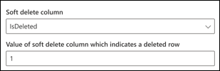
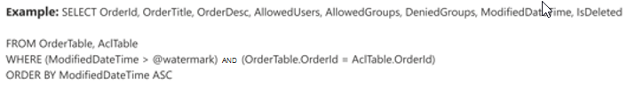

# Microsoft SQL Server-ConnectorMicrosoft SQL server connector

Mit einem Microsoft SQL Server-Connector kann Ihre Organisation Daten aus einer lokalen SQL Server Datenbank ermitteln und indizieren.With a Microsoft SQL server connector, your organization can discover and index data from an on-premises SQL Server database. Der Connector indiziert angegebene Inhalte in Microsoft Search.The connector indexes specified content into Microsoft Search. Um den Index mit den Quelldaten auf dem neuesten Stand zu halten, unterstützt er periodische vollständige und inkrementelle Crawls.To keep the index up to date with source data, it supports periodic full and incremental crawls. Mit dem SQL Server-Konnektor können Sie auch den Zugriff auf Suchergebnisse für bestimmte Benutzer einschränken.With the SQL Server connector, you can also restrict access to search results for certain users.

Dieser Artikel richtet sich an Microsoft 365-Administratoren oder Personen, die einen Microsoft SQL Server-Connector konfigurieren, ausführen und überwachen.This article is for Microsoft 365 administrators or anyone who configures, runs, and monitors a Microsoft SQL server connector. Es wird erläutert, wie Sie die Connector-und connectorfunktionen, Einschränkungen und Techniken zur Problembehandlung konfigurieren.It explains how to configure your connector and connector capabilities, limitations, and troubleshooting techniques.

## Installieren eines DatengatewaysInstall a data gateway
Um auf Ihre drittanbieterdaten zugreifen zu können, müssen Sie ein Microsoft Power BI-Gateway installieren und konfigurieren.In order to access your third-party data, you must install and configure a Microsoft Power BI gateway. Weitere Informationen finden Sie unter [Install an on-premises Gateway](https://docs.microsoft.com/data-integration/gateway/service-gateway-install) .See [Install an on-premises gateway](https://docs.microsoft.com/data-integration/gateway/service-gateway-install) to learn more.  

## Herstellen einer Verbindung mit einer DatenquelleConnect to a data source
Um den Microsoft SQL Server-Connector mit einer Datenquelle zu verbinden, müssen Sie den Datenbankserver, den Sie durchforsten möchten, und das lokale Gateway konfigurieren.To connect your Microsoft SQL server connector to a data source, you must configure the database server you want crawled and the on-premises gateway. Sie können dann mit der erforderlichen Authentifizierungsmethode eine Verbindung mit der Datenbank herstellen.You can then connect to the database with the required authentication method.

> [!NOTE]
> In der Datenbank muss SQL Server Version 2008 oder höher ausgeführt werden.Your database must run SQL server version 2008 or later.

Zum Durchsuchen des Datenbankinhalts müssen Sie beim Konfigurieren des Connectors SQL-Abfragen angeben.To search your database content, you must specify SQL queries when you configure the connector. Diese SQL-Abfragen müssen alle Datenbankspalten benennen, die Sie indizieren möchten (also Quelleigenschaften), einschließlich aller SQL-Joins, die ausgeführt werden müssen, um alle Spalten abzurufen.These SQL queries need to name all the database columns that you want to index (i.e. source properties), including any SQL joins that need to be performed to get all the columns. Wenn Sie den Zugriff auf Suchergebnisse einschränken möchten, müssen Sie Zugriffssteuerungslisten (Access Control Lists, ACLs) mit SQL-Abfragen angeben, wenn Sie den Microsoft SQL Server-Connector konfigurieren.To restrict access to search results, you must specify Access Control Lists (ACLs) with SQL queries when you configure the Microsoft SQL server connector.

## Vollständige Durchforstung (erforderlich)Full crawl (Required)
In diesem Schritt konfigurieren Sie die SQL-Abfrage, die eine vollständige Durchforstung der Datenbank ausführt.In this step, you configure the SQL query that runs a full crawl of the database. Bei der vollständigen Durchforstung werden alle Spalten oder Eigenschaften ausgewählt, die **abgefragt**, **durchsuchbar**oder **abrufbar**gemacht werden sollen.The full crawl selects all the columns or properties you want to be made **queryable**, **searchable**, or **retrievable**. Sie können auch ACL-Spalten angeben, um den Zugriff auf Suchergebnisse auf bestimmte Benutzer oder Gruppen zu beschränken.You can also specify ACL columns to restrict access of search results to specific users or groups.

> [!Tip]
> Wenn Sie alle benötigten Spalten abrufen möchten, können Sie mehreren Tabellen beitreten.To get all the columns that you need, you can join multiple tables.

### Auswählen von Datenspalten (erforderlich) und ACL-Spalten (optional)Select data columns (Required) and ACL columns (Optional)
Im Beispiel wird die Auswahl von fünf Datenspalten veranschaulicht, die die Daten für die Suche enthalten: OrderID, OrderTitle, OrderDesc, CreatedDateTime und IsDeleted.The example demonstrates selection of five data columns that hold the data for the search: OrderId, OrderTitle, OrderDesc, CreatedDateTime, and IsDeleted. Um die Ansichtsberechtigungen für jede Datenzeile festzulegen, können Sie optional diese ACL-Spalten auswählen: AllowedUsers, AllowedGroups, DeniedUsers und DeniedGroups.To set view permissions for each row of data, you can optionally select these ACL columns: AllowedUsers, AllowedGroups, DeniedUsers, and DeniedGroups. Alle diese Datenspalten können **abgefragt**, **durchsuchbar**oder **abrufbar**gemacht werden.All these data columns can be made **queryable**, **searchable**, or **retrievable**.

Wählen Sie Datenspalten aus, wie in der folgenden Beispielabfrage gezeigt:`SELECT OrderId, OrderTitle, OrderDesc, AllowedUsers, AllowedGroups, DeniedUsers, DeniedGroups, CreatedDateTime, IsDeleted`Select data columns as shown in this example query: `SELECT OrderId, OrderTitle, OrderDesc, AllowedUsers, AllowedGroups, DeniedUsers, DeniedGroups, CreatedDateTime, IsDeleted`
 
Um den Zugriff auf die Suchergebnisse zu verwalten, können Sie eine oder mehrere ACL-Spalten in der Abfrage angeben.To manage access to the search results, you can specify one or more ACL columns in the query. Mit SQL Connector können Sie den Zugriff auf Datensatzebene steuern.The SQL connector allows you to control access at per record level. Sie können auswählen, dass für alle Datensätze in einer Tabelle dieselbe Zugriffssteuerung gilt.You can choose to have the same access control for all records in a table. Wenn die ACL-Informationen in einer separaten Tabelle gespeichert werden, müssen Sie möglicherweise eine Verknüpfung mit diesen Tabellen in Ihrer Abfrage durchführen.If the ACL information is stored in a separate table, you might have to do a join with those tables in your query.

Die Verwendung der einzelnen ACL-Spalten in der obigen Abfrage wird im folgenden beschrieben.The use of each of the ACL columns in the above query is described below. In der folgenden Liste werden die vier **Zugriffssteuerungsmechanismen**erläutert.The following list explains the 4 **access control mechanisms**. 
* **AllowedUsers**: Hiermit wird die Liste der Benutzer-IDs angegeben, die auf die Suchergebnisse zugreifen können.**AllowedUsers**: This specifies the list of user IDs who will be able to access the search results. Im folgenden Beispiel würde die Liste der Benutzer: John@contoso.com, Keith@contoso.com und Lisa@contoso.com nur Zugriff auf einen Datensatz mit OrderID = 12 haben.In the following example, list of users: john@contoso.com , keith@contoso.com, and lisa@contoso.com would only have access to a record with OrderId = 12. 
* **AllowedGroups**: Hiermit wird die Benutzergruppe angegeben, die auf die Suchergebnisse zugreifen kann.**AllowedGroups**: This specifies the group of users who will be able to access the search results. Im folgenden Beispiel hätte Group Sales-Team@contoso.com nur Zugriff auf Record mit OrderID = 12.In the following example, group sales-team@contoso.com would only have access to record with OrderId = 12.
* **DeniedUsers**: Dies gibt die Liste der Benutzer an, die **keinen** Zugriff auf die Suchergebnisse haben.**DeniedUsers**: This specifies the list of users who do **not** have access to the search results. Im folgenden Beispiel haben Benutzer John@contoso.com und Keith@contoso.com keinen Zugriff auf Record mit OrderID = 13, während alle anderen Zugriff auf diesen Datensatz haben.In the following example, users john@contoso.com and keith@contoso.com do not have access to record with OrderId = 13, whereas everyone else has access to this record. 
* **DeniedGroups**: Hiermit wird die Gruppe von Benutzern angegeben, die **keinen** Zugriff auf die Suchergebnisse haben.**DeniedGroups**: This specifies the group of users who do **not** have access to the search results. Im folgenden Beispiel haben Gruppen Engg-Team@contoso.com und PM-Team@contoso.com keinen Zugriff auf Record mit OrderID = 15, während alle anderen Zugriff auf diesen Datensatz haben.In the following example, groups engg-team@contoso.com and pm-team@contoso.com do not have access to record with OrderId = 15, whereas everyone else has access to this record.  

### Wasserzeichen (erforderlich)Watermark (Required)
Um zu verhindern, dass die Datenbank überladen wird, führt der Connector Batches aus und setzt vollständige Durchforstungs Abfragen mit einer Wasserzeichen Spalte vollständig Durchforstung fort.To prevent overloading the database, the connector batches and resumes full-crawl queries with a full-crawl watermark column. Durch Verwendung des Werts der Spalte Wasserzeichen wird jeder nachfolgende Batch abgerufen, und die Abfrage wird vom letzten Prüfpunkt fortgesetzt.By using the value of the watermark column, each subsequent batch is fetched, and querying is resumed from the last checkpoint. Im Wesentlichen handelt es sich hierbei um einen Mechanismus zum Steuern der Datenaktualisierung für vollständige Durchforstungen.Essentially this is a mechanism to control data refresh for full crawls.

Erstellen Sie Abfrage Ausschnitte für Wasserzeichen, wie in den folgenden Beispielen gezeigt:Create query snippets for watermarks as shown in these examples:
* `WHERE (CreatedDateTime > @watermark)`. Zitieren Sie den Namen der Wasserzeichen Spalte `@watermark`mit dem reservierten Schlüsselwort.Cite the watermark column name with the reserved keyword `@watermark`. Wenn die Sortierreihenfolge der Wasserzeichen Spalte aufsteigend ist, verwenden Sie `>`; Andernfalls verwenden Sie `<`.If the sort order of the watermark column is ascending, use `>`; otherwise, use `<`.
* `ORDER BY CreatedDateTime ASC`. Sortieren Sie in aufsteigender oder absteigender Reihenfolge nach der Wasserzeichen Spalte.Sort on the watermark column in ascending or descending order.

In der in der folgenden Abbildung gezeigten `CreatedDateTime` Konfiguration befindet sich die ausgewählte Wasserzeichen Spalte.In the configuration shown in the following image, `CreatedDateTime` is the selected watermark column. Um den ersten Zeilenbatch abzurufen, geben Sie den Datentyp der Spalte Wasserzeichen an.To fetch the first batch of rows, specify the data type of the watermark column. In diesem Fall ist `DateTime`der Datentyp.In this case, the data type is `DateTime`.

Die erste Abfrage ruft die erste **N** -Menge von Zeilen mithilfe von: "CreatedDateTime #a0 January 1, 1753 00:00:00" (min-Wert des datetime-Datentyps) ab.The first query fetches the first **N** amount of rows by using: "CreatedDateTime > January 1, 1753 00:00:00" (min value of DateTime data type). Nachdem der erste Batch abgerufen wurde, wird der höchste im Batch `CreatedDateTime` zurückgegebene Wert als Prüfpunkt gespeichert, wenn die Zeilen in aufsteigender Reihenfolge sortiert werden.After the first batch is fetched, the highest value of `CreatedDateTime` returned in the batch is saved as the checkpoint if the rows are sorted in ascending order. Ein Beispiel ist der 1. März 2019 03:00:00.An example is March 1, 2019 03:00:00. Anschließend wird der nächste Batch von **N** Zeilen mithilfe von "CreatedDateTime #a0 March 1, 2019 03:00:00" in der Abfrage abgerufen.Then the next batch of **N** rows is fetched by using "CreatedDateTime > March 1, 2019 03:00:00" in the query.

### Überspringen von weich gelöschten Zeilen (optional)Skipping soft-deleted rows (Optional)
Um vorläufig gelöschte Zeilen in Ihrer Datenbank von der Indizierung auszuschließen, geben Sie den Namen und den Wert der Soft-Delete-Spalte an, der angibt, dass die Zeile gelöscht wird.To exclude soft-deleted rows in your database from being indexed, specify the soft-delete column name and value that indicates the row is deleted.

### Vollständige Durchforstung: Verwalten von SuchberechtigungenFull crawl: Manage search permissions
Klicken Sie auf **Berechtigungen verwalten** , um die verschiedenen Spalten der Zugriffssteuerung (ACL) auszuwählen, die den Zugriffssteuerungsmechanismus angeben.Click **Manage permissions** to select the various access control (ACL) columns which specify the access control mechanism. Wählen Sie den Spaltennamen aus, den Sie in der vollständigen Durchforstungs-SQL-Abfrage angegeben haben.Select the column name you specified in the full crawl SQL query. 

Für jede der ACL-Spalten wird eine mehrwertige Spalte erwartet.Each of the ACL columns is expected to be a multi-valued column. Diese mehrere ID-Werte können durch Trennzeichen wie Semikolon (;), Komma (,) usw. getrennt werden.These multiple ID values can be separated by separators such as semicolon (;), comma (,), and so on. Sie müssen dieses Trennzeichen im Feld **Wert Trennzeichen** angeben.You need to specify this separator in the **value separator** field.
 
Die folgenden ID-Typen werden für die Verwendung als ACLs unterstützt:The following ID types are supported for using as ACLs: 
* **Benutzerprinzipalname (UPN)**: ein Benutzerprinzipalname (UPN) ist der Name eines Systembenutzers in einem e-Mail-Adressformat.**User Principal Name (UPN)**: A User Principal Name (UPN) is the name of a system user in an email address format. Ein UPN (zum Beispiel: John.Doe@Domain.com) besteht aus dem Benutzernamen (Anmeldename), dem Trennzeichen (dem @-Symbol) und dem Domänennamen (UPN-Suffix).A UPN (for example: john.doe@domain.com) consists of the username (logon name), separator (the @ symbol), and domain name (UPN suffix). 
* **Azure Active Directory (AAD) ID**: in Aad hat jeder Benutzer oder jede Gruppe eine Objekt-ID, die so aussieht, als ob "e0d3ad3d-0000-1111-2222-3c5f5c52ab9b"**Azure Active Directory (AAD) ID**: In AAD, every user or group has an object ID which looks something like ‘e0d3ad3d-0000-1111-2222-3c5f5c52ab9b’ 
* **Active Directory (AD)-Sicherheits-ID**: in einem lokalen AD-Setup verfügt jeder Benutzer und jede Gruppe über eine unveränderliche, eindeutige Sicherheits-ID, die so ähnlich aussieht wie die-1-5-21-3878594291-2115959936-132693609-65242. "**Active Directory (AD) Security ID**: In an on-premises AD setup, every user and group has an immutable, unique security identifier which looks something like ‘S-1-5-21-3878594291-2115959936-132693609-65242.’

## Inkrementelle Durchforstung (optional)Incremental crawl (Optional)
Geben Sie in diesem optionalen Schritt eine SQL-Abfrage ein, um einen inkrementellen Crawl der Datenbank auszuführen.In this optional step, provide a SQL query to run an incremental crawl of the database. Mit dieser Abfrage nimmt der Microsoft SQL Server-Connector seit der letzten inkrementellen Durchforstung Änderungen an den Daten vor.With this query, the Microsoft SQL server connector makes any changes to the data since the last incremental crawl. Wählen Sie wie in der vollständigen Durchforstung alle Spalten aus, die **abgefragt**, **durchsuchbar**oder **abrufbar**gemacht werden sollen.As in the full crawl, select all columns that you want to be made **queryable**, **searchable**, or **retrievable**. Geben Sie dieselbe Gruppe von ACL-Spalten an, die Sie in der vollständigen Durchforstungs Abfrage angegeben haben.Specify the same set of ACL columns that you specified in the full crawl query.

Die Komponenten in der folgenden Abbildung ähneln den vollständigen Durchforstungskomponenten mit einer Ausnahme.The components in the following image resemble the full crawl components with one exception. In diesem Fall ist "ModifiedDateTime" die ausgewählte Wasserzeichen Spalte.In this case, "ModifiedDateTime" is the selected watermark column. Lesen Sie die [vollständigen Crawl Schritte](#full-crawl-required) , um zu erfahren, wie Sie Ihre inkrementelle Durchforstungs Abfrage schreiben und das folgende Bild als Beispiel betrachten.Review the [full crawl steps](#full-crawl-required) to learn how to write your incremental crawl query and see the following image as an example.

## Verwalten von SuchberechtigungenManage search permissions 
Sie können die [im vollständigen Durchforstungs Bildschirm angegebenen ACLs](#full-crawl-manage-search-permissions) verwenden, oder Sie können Sie außer Kraft setzen, damit Ihre Inhalte für alle sichtbar sind.You can choose to use the [ACLs specified in the full crawl screen](#full-crawl-manage-search-permissions) or you can override them to make your content visible to everyone.

## EinschränkungenLimitations
Der Microsoft SQL Server-Connector weist diese Einschränkungen in der Vorschauversion auf:The Microsoft SQL server connector has these limitations in the preview release:
* In der lokalen Datenbank muss SQL Server Version 2008 oder höher ausgeführt werden.The on-premises database must run SQL server version 2008 or later.
* ACLs werden nur mit einem Benutzerprinzipalnamen (User Principal Name, UPN), Azure Active Directory (Azure AD) oder Active Directory Sicherheit unterstützt.ACLs are only supported by using a User Principal Name (UPN), Azure Active Directory (Azure AD), or Active Directory Security. 
* Das Indizieren von umfangreichen Inhalten in Datenbankspalten wird nicht unterstützt.Indexing rich content inside database columns is not supported. Beispiele für solche Inhalte sind HTML-, JSON-, XML-, BLOBs-und Dokumentanalysen, die als Links in den Datenbankspalten vorhanden sind.Examples of such content are HTML, JSON, XML, blobs, and document parsings that exist as links inside the database columns.