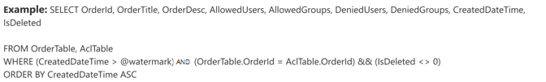
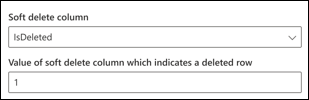

<!---Previous ms.author:vivg --->

# Oracle SQL Graph Connector

Mit dem Oracle SQL Graph Connector kann Ihre Organisation Daten aus einer lokalen Oracle-Datenbank ermitteln und indizieren. Der Connector indiziert den angegebenen Inhalt in Microsoft Search. Um den Index mit Quelldaten auf dem neuesten Stand zu halten, unterstützt er regelmäßige vollständige und inkrementelle Durchforstungen. Mit dem Oracle SQL Connector können Sie auch den Zugriff auf Suchergebnisse für bestimmte Benutzer einschränken.

> [!NOTE]
> Lesen Sie den Artikel [**"Setup for your Graph connector",**](configure-connector.md) um die allgemeinen Anweisungen zum Einrichten Graph Connectors zu verstehen.

Dieser Artikel richtet sich an alle Personen, die einen Oracle SQL Graph Connector konfigurieren, ausführen und überwachen. Es ergänzt den allgemeinen Setupprozess und zeigt Anweisungen, die nur für den Oracle SQL Graph Connector gelten. Dieser Artikel enthält auch Informationen zur [Problembehandlung](#troubleshooting) und [zu Einschränkungen.](#limitations)

## Bevor Sie beginnen

### Installieren des Graph Connector-Agents

Um auf Ihre lokalen Drittanbieterdaten zugreifen zu können, müssen Sie den Graph Connector-Agent installieren und konfigurieren. Weitere Informationen finden Sie unter [Installieren des Graph Connector-Agents.](graph-connector-agent.md)  

## Schritt 1: Hinzufügen eines Graph Connectors im Microsoft 365 Admin Center

Folgen Sie den allgemeinen [Setupanweisungen.](./configure-connector.md)
<!---If the above phrase does not apply, delete it and insert specific details for your data source that are different from general setup instructions.-->

## Schritt 2: Benennen der Verbindung

Folgen Sie den allgemeinen [Setupanweisungen.](./configure-connector.md)
<!---If the above phrase does not apply, delete it and insert specific details for your data source that are different from general setup instructions.-->

## Schritt 3: Konfigurieren der Verbindungseinstellungen

Um Den Oracle SQL Connector mit einer Datenquelle zu verbinden, müssen Sie den Datenbankserver konfigurieren, den Sie durchforsten möchten, und den lokalen Graph Connector-Agent. Anschließend können Sie mit der erforderlichen Authentifizierungsmethode eine Verbindung mit der Datenbank herstellen.

Für Oracle SQL Connector müssen Sie den Hostnamen, den Port und den Dienstnamen (Datenbank) zusammen mit der bevorzugten Authentifizierungsmethode, dem Benutzernamen und dem Kennwort angeben.

> [!NOTE]
> Ihre Datenbank muss Oracle-Datenbankversion 11g oder höher ausführen, damit der Connector eine Verbindung herstellen kann. Der Connector unterstützt Oracle-Datenbanken, die auf Windows-, Linux- und Azure-VM-Plattformen gehostet werden.

Zum Durchsuchen der Datenbankinhalte müssen Sie beim Konfigurieren des Connectors SQL Abfragen angeben. Diese SQL Abfragen müssen alle Datenbankspalten benennen, die Indiziert werden sollen (d. h. Quelleigenschaften), einschließlich aller SQL Verknüpfungen, die ausgeführt werden müssen, um alle Spalten abzurufen. Um den Zugriff auf Suchergebnisse einzuschränken, müssen Sie zugriffssteuerungslisten (Access Control Lists, ACLs) innerhalb SQL Abfragen angeben, wenn Sie den Connector konfigurieren.

## Schritt 3a: Vollständige Durchforstung (erforderlich)

In diesem Schritt konfigurieren Sie die SQL Abfrage, die eine vollständige Durchforstung der Datenbank ausführt. Die vollständige Durchforstung wählt alle Spalten oder Eigenschaften aus, in denen Sie die Optionen **Abfrage,** **Suche** oder **Abrufen** auswählen möchten. Sie können auch ACL-Spalten angeben, um den Zugriff auf Suchergebnisse auf bestimmte Benutzer oder Gruppen einzuschränken.

> [!Tip]
> Um alle benötigten Spalten abzurufen, können Sie mehrere Tabellen verknüpfen.

### Auswählen von Datenspalten (erforderlich) und ACL-Spalten (optional)

Im Beispiel wird die Auswahl von fünf Datenspalten veranschaulicht, die die Daten für die Suche enthalten: OrderId, OrderTitle, OrderDesc, CreatedDateTime und IsDeleted. Um Ansichtsberechtigungen für jede Datenzeile festzulegen, können Sie optional diese ACL-Spalten auswählen: AllowedUsers, AllowedGroups, DeniedUsers und DeniedGroups. Für alle diese Datenspalten können Sie die Optionen zum **Abfragen,** **Suchen** oder **Abrufen** auswählen.

Wählen Sie Datenspalten aus, wie in dieser Beispielabfrage gezeigt: `SELECT OrderId, OrderTitle, OrderDesc, AllowedUsers, AllowedGroups, DeniedUsers, DeniedGroups, CreatedDateTime, IsDeleted`

Um den Zugriff auf die Suchergebnisse zu verwalten, können Sie eine oder mehrere ACL-Spalten in der Abfrage angeben. Mit dem SQL Connector können Sie den Zugriff pro Datensatzebene steuern. Sie können die gleiche Zugriffssteuerung für alle Datensätze in einer Tabelle verwenden. Wenn die ACL-Informationen in einer separaten Tabelle gespeichert sind, müssen Sie möglicherweise eine Verknüpfung mit diesen Tabellen in Ihrer Abfrage durchführen.

Die Verwendung der einzelnen ACL-Spalten in der obigen Abfrage wird unten beschrieben. In der folgenden Liste werden die vier **Zugriffssteuerungsmechanismen** erläutert.

* **AllowedUsers:** Diese Option gibt die Liste der Benutzer-IDs an, die auf die Suchergebnisse zugreifen können. Im folgenden Beispiel würde die Liste der Benutzer: john@contoso.com, keith@contoso.com und lisa@contoso.com nur Zugriff auf einen Datensatz mit OrderId = 12 haben.
* **AllowedGroups:** Diese Option gibt die Gruppe von Benutzern an, die auf die Suchergebnisse zugreifen können. Im folgenden Beispiel hätten Gruppen-sales-team@contoso.com nur Zugriff auf den Datensatz mit OrderId = 12.
* **DeniedUsers:** Diese Option gibt die Liste der Benutzer an, die **keinen** Zugriff auf die Suchergebnisse haben. Im folgenden Beispiel haben Benutzer john@contoso.com und keith@contoso.com keinen Zugriff auf datensätze mit OrderId = 13, während alle anderen Benutzer Zugriff auf diesen Datensatz haben.
* **DeniedGroups:** Diese Option gibt die Gruppe von Benutzern an, die **keinen** Zugriff auf die Suchergebnisse haben. Im folgenden Beispiel haben Gruppen engg-team@contoso.com und pm-team@contoso.com keinen Zugriff auf den Datensatz mit OrderId = 15, während alle anderen Zugriff auf diesen Datensatz haben.  

### Unterstützte Datentypen

In der folgenden Tabelle sind die Datentypen zusammengefasst, die vom Oracle SQL Connector unterstützt werden. In der Tabelle wird auch der Indizierungsdatentyp für den unterstützten SQL Datentyp zusammengefasst. Weitere Informationen zu von Microsoft Graph Connectors unterstützten Datentypen für die Indizierung finden Sie in der Dokumentation zu [Eigenschaftsressourcentypen.](/graph/api/resources/property?preserve-view=true&view=graph-rest-beta#properties)

| Kategorie | Quelldatentyp | Datentyp der Indizierung |
| ------------ | ------------ | ------------ |
| Zahlendatentyp | NUMBER(p,0) | int64 (für p <= 18)   double (für p > 18) |
| Gleitkommazahlen-Datentyp | NUMBER(p,s)   FLOAT(p) | double |
| Datumsdatentyp | DATE   TIMESTAMP   TIMESTAMP(n) | Datum/Uhrzeit |
| Zeichendatentyp | CHAR(n)   VARCHAR   VARCHAR2   LANGE   CLOB   NCLOB | Zeichenfolge |
| Unicode-Zeichen-Datentyp | NCHAR   NVARCHAR | Zeichenfolge |
| RowID-Datentyp | ROWID   UROWID | Zeichenfolge |

Für alle anderen Datentypen, die derzeit nicht direkt unterstützt werden, muss die Spalte explizit in einen unterstützten Datentyp umgewandelt werden.

### Wasserzeichen (erforderlich)

Um eine Überladung der Datenbank zu verhindern, stapelt und setzt der Konnektor Vollständige Durchforstungsabfragen mit einer Vollständigdurchforstungs-Wasserzeichenspalte fort. Mithilfe des Werts der Wasserzeichenspalte wird jeder nachfolgende Batch abgerufen und die Abfrage vom letzten Prüfpunkt fortgesetzt. Im Wesentlichen ist dies ein Mechanismus zum Steuern der Datenaktualisierung für vollständige Durchforstungen.

Erstellen Sie Abfrageausschnitte für Wasserzeichen, wie in diesen Beispielen gezeigt:

* `WHERE (CreatedDateTime > @watermark)`. Geben Sie den Namen der Wasserzeichenspalte mit dem reservierten Schlüsselwort `@watermark` an. Sie können die Wasserzeichenspalte nur in aufsteigender Reihenfolge sortieren.
* `ORDER BY CreatedDateTime ASC`. Sortieren Sie die Wasserzeichenspalte in aufsteigender Reihenfolge.

In der in der folgenden Abbildung gezeigten Konfiguration `CreatedDateTime` befindet sich die ausgewählte Wasserzeichenspalte. Um den ersten Zeilenbatch abzurufen, geben Sie den Datentyp der Wasserzeichenspalte an. In diesem Fall lautet der Datentyp `DateTime` .

Die erste Abfrage ruft die erste **N-Anzahl** von Zeilen mithilfe der folgenden Methode ab: "CreatedDateTime > 1. Januar 1753 00:00:00" (Min. Wert des DateTime-Datentyps). Nachdem der erste Batch abgerufen wurde, wird der höchste im Batch zurückgegebene Wert `CreatedDateTime` als Prüfpunkt gespeichert, wenn die Zeilen in aufsteigender Reihenfolge sortiert sind. Ein Beispiel ist der 1. März 2019 03:00:00. Anschließend wird der nächste Batch von **N-Zeilen** mithilfe von "CreatedDateTime > 1. März 2019 03:00:00" in der Abfrage abgerufen.

### Überspringen vorläufig gelöschter Zeilen (optional)

Um zeilenweise gelöschte Zeilen in Ihrer Datenbank von der Indizierung auszuschließen, geben Sie den Namen und den Wert für das vorläufige Löschen der Spalte an, der angibt, dass die Zeile gelöscht wird.

### Vollständige Durchforstung: Verwalten von Suchberechtigungen

Wählen Sie **"Berechtigungen verwalten"** aus, um die verschiedenen Zugriffssteuerungsspalten (Access Control, ACL) auszuwählen, die den Zugriffsteuerungsmechanismus angeben. Wählen Sie den Spaltennamen aus, den Sie in der vollständigen Durchforstung SQL Abfrage angegeben haben.

Es wird erwartet, dass jede ACL-Spalte eine mehrwertige Spalte ist. Diese mehreren ID-Werte können durch Trennzeichen wie Semikolon (;), Komma (,) usw. getrennt werden. Sie müssen dieses Trennzeichen im **Werttrennzeichenfeld** angeben.

Die folgenden ID-Typen werden für die Verwendung als ACLs unterstützt:

* **Benutzerprinzipalname (USER Principal Name, UPN):** Ein Benutzerprinzipalname (User Principal Name, UPN) ist der Name eines Systembenutzers im E-Mail-Adressformat. Ein UPN (z. B. john.doe@domain.com) besteht aus dem Benutzernamen (Anmeldename), dem Trennzeichen (dem @-Symbol) und dem Domänennamen (UPN-Suffix).
* **Azure Active Directory (AAD)-ID:** In Azure AD verfügt jeder Benutzer oder jede Gruppe über eine Objekt-ID, die etwa wie "e0d3ad3d-0000-1111-2222-3c5f5c52ab9b" aussieht.
* **Active Directory (AD)-Sicherheits-ID:** Bei einem lokalen AD-Setup verfügen alle Benutzer und Gruppen über einen unveränderlichen, eindeutigen Sicherheitsbezeichner, der etwa wie "S-1-5-21-3878594291-211595936-132693609-65242" aussieht.

## Schritt 3b: Inkrementelle Durchforstung (optional)

Stellen Sie in diesem optionalen Schritt eine SQL Abfrage bereit, um eine inkrementelle Durchforstung der Datenbank auszuführen. Bei dieser Abfrage ermittelt der SQL Connector alle Änderungen an den Daten seit der letzten inkrementellen Durchforstung. Wählen Sie wie bei der vollständigen Durchforstung zwischen den Optionen **Abfrage,** Suchen oder Abrufen aus.   Geben Sie den gleichen Satz von ACL-Spalten an, den Sie in der vollständigen Durchforstungsabfrage angegeben haben.

Die Komponenten in der folgenden Abbildung ähneln den vollständigen Durchforstungskomponenten mit einer Ausnahme. In diesem Fall ist "ModifiedDateTime" die ausgewählte Wasserzeichenspalte. Überprüfen Sie die [vollständigen Durchforstungsschritte,](#step-3a-full-crawl-required) um zu erfahren, wie Sie die inkrementelle Durchforstungsabfrage schreiben und das folgende Bild als Beispiel anzeigen.

## Schritt 4: Zuweisen von Eigenschaftenbeschriftungen

Folgen Sie den allgemeinen [Setupanweisungen.](./configure-connector.md)
<!---If the above phrase does not apply, delete it and insert specific details for your data source that are different from general setup instructions.-->

## Schritt 5: Verwalten des Schemas

Folgen Sie den allgemeinen [Setupanweisungen.](./configure-connector.md)
<!---If the above phrase does not apply, delete it and insert specific details for your data source that are different from general setup instructions.-->

## Schritt 6: Verwalten von Suchberechtigungen

Sie können die [im vollständigen Durchforstungsbildschirm angegebenen ACLs](#full-crawl-manage-search-permissions) verwenden oder sie überschreiben, um Ihre Inhalte für alle sichtbar zu machen.

## Schritt 7: Auswählen von Aktualisierungseinstellungen

Der Oracle SQL Connector unterstützt Aktualisierungszeitpläne für vollständige und inkrementelle Durchforstungen. Es wird empfohlen, beides festzulegen.

Ein vollständiger Durchforstungszeitplan findet gelöschte Zeilen, die zuvor mit dem Microsoft Search-Index synchronisiert wurden, und alle Zeilen, die aus dem Synchronisierungsfilter verschoben wurden. Wenn Sie zum ersten Mal eine Verbindung mit der Datenbank herstellen, wird eine vollständige Durchforstung ausgeführt, um alle Zeilen zu synchronisieren, die aus der vollständigen Durchforstungsabfrage abgerufen wurden. Um neue Zeilen zu synchronisieren und Aktualisierungen vorzunehmen, müssen Sie inkrementelle Durchforstungen planen.

## Schritt 8: Überprüfen der Verbindung

Folgen Sie den allgemeinen [Setupanweisungen.](./configure-connector.md)
<!---If the above phrase does not apply, delete it and insert specific details for your data source that are different from general setup instructions.-->

<!--- ## Next steps: Customize the search results page

Create your own verticals and result types, so end users can view search results from new connections. Without this step, data from your connection won't show up on the search results page.

To learn more about how to create your verticals and MRTs, see [Search results page customization](customize-search-page.md). -->

## Problembehandlung

Darunter finden Sie eine Liste der häufigsten Fehler, die beim Konfigurieren des Connectors auftreten, und deren mögliche Ursachen.

| Konfigurationsschritt | Fehlermeldung | Mögliche Gründe |
| ------------ | ------------ | ------------ |
| Datenbankeinstellungen | Fehler vom Datenbankserver: Zeitüberschreitung der Verbindungsanforderung | Ungültiger Hostname   Host nicht erreichbar |
| Datenbankeinstellungen | Fehler vom Datenbankserver: ORA-12541: TNS: Kein Listener | Ungültiger Port |
| Datenbankeinstellungen | Fehler vom Datenbankserver: ORA-12514: TNS: Listener kennt derzeit den in der Connectorbeschreibung angeforderten Dienst nicht. | Ungültiger Dienstname (Datenbank) |
| Datenbankeinstellungen | Fehler vom Datenbankserver: Anmeldung für Benutzer ' `user` '' fehlgeschlagen. | Ungültiger Benutzername oder ungültiges Kennwort |

## Einschränkungen

Für den Oracle SQL Connector gelten die folgenden Einschränkungen in der Vorschauversion:

* Die lokale Datenbank muss Oracle Database Version 11g oder höher ausführen.
* ACLs werden nur mithilfe eines Benutzerprinzipalnamens (User Principal Name, UPN), Azure Active Directory (Azure AD) oder Active Directory Security unterstützt.
* Das Indizieren von umfangreichen Inhalten in Datenbankspalten wird nicht unterstützt. Beispiele für solche Inhalte sind HTML, JSON, XML, Blobs und Dokumentparsings, die als Links in den Datenbankspalten vorhanden sind.