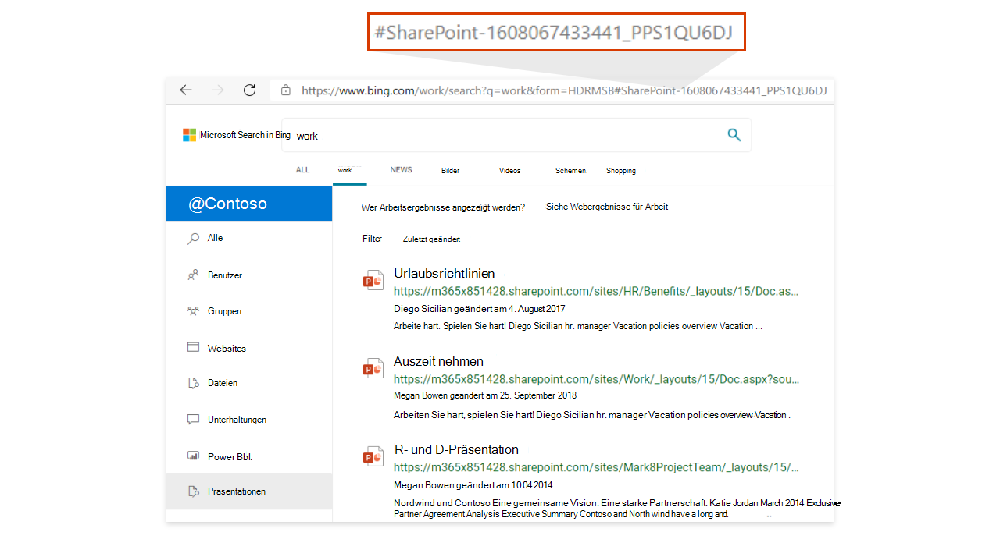

# <a name="add-a-search-box-to-your-intranet-site"></a>Hinzufügen eines Suchfelds zu Ihrer Intranetwebsite

Um Ihren Benutzern einfachen Zugriff auf Ergebnisse aus Ihrer Organisation zu ermöglichen, fügen Sie einer beliebigen Intranetwebsite oder Seite eine Microsoft Search in Bing-Suchfeld hinzu. Dies sind einige der Vorteile:

- Ein Suchfeld in Ihrem SharePoint oder Intranetportal bietet einen vertrauten, vertrauenswürdigen Einstiegspunkt, um mit der Suche zu beginnen.
- Unterstützt alle wichtigen Webbrowser, einschließlich Google Chrome und Microsoft Edge
- Nur Suchvorschläge aus Ihrer Organisation werden angezeigt, Webvorschläge werden nie einbezogen
- Führt Benutzer zu einer Microsoft Search in Bing, die Anzeigen und Webergebnisse ausschließt
- Sie steuern die Darstellung und das Verhalten des Suchfelds, einschließlich der Möglichkeit, Benutzer in einer von Ihnen erstellten Standard- oder benutzerdefinierten Vertikale zu landen.
  
## <a name="add-a-search-box-to-an-intranet-page"></a>Hinzufügen eines Suchfelds zu einer Intranetseite

Sie müssen der Seite zwei Elemente hinzfügen: ein Container für das Suchfeld und das zugrunde liegende Skript.
  
```html
<div id="bfb_searchbox"></div>
<script>
    var bfbSearchBoxConfig = {
        containerSelector: "bfb_searchbox"
    };
</script>
<script async src="https://www.bing.com/business/s?k=sb"></script>
```

Fügen Sie auf einer klassischen SharePoint-Website ein Skript-Editor-Webpart hinzu, und platzieren Sie das Skript darin.
  
## <a name="enable-the-search-box-for-mobile"></a>Aktivieren des Suchfelds für mobile Geräte

Fügen Sie für Intranetwebsites oder -seiten, die für mobile Benutzer verfügbar sind, „isMobile: true“ zum Einstellungsobjekt hinzu:
  
```html
<div id="bfb_searchbox"></div>
<script>
    var bfbSearchBoxConfig = {
        containerSelector: "bfb_searchbox", 
        isMobile: true
    };
</script>
<script async src="https://www.bing.com/business/s?k=sb"></script>
```

## <a name="put-focus-on-the-search-box-by-default"></a>Setzen des Fokus auf das Suchfeld als Standardeinstellung

Damit Benutzer schneller suchen können, platzieren Sie, wenn die Seite oder Website geladen wird, den Cursor im Suchfeld, indem Sie dem Einstellungsobjekt „focus: true“ hinzufügen:
  
```html
<div id="bfb_searchbox"></div>
<script>
    var bfbSearchBoxConfig = {
        containerSelector: "bfb_searchbox",
        focus: true
    };
</script>
<script async src="https://www.bing.com/business/s?k=sb"></script>
```

## <a name="customize-the-appearance-of-the-search-box"></a>Anpassen des Erscheinungsbilds des Suchfelds 

Sie können eine Vielzahl von Konfigurationsoptionen verwenden, um das Suchfeld an den Stil Ihres Intranets anzupassen. Kombinieren Sie je nach Bedarf verschiedene Optionen.

```html
<div id="bfb_searchbox"></div>
<script>
    var bfbSearchBoxConfig = {
        containerSelector: "bfb_searchbox",
        width: 560,                             // default: 560, min: 360, max: 650
        height: 40,                             // default: 40, min: 40, max: 72
        cornerRadius: 6,                        // default: 6, min: 0, max: 25                                   
        strokeOutline: true,                    // default: true
        dropShadow: true,                       // default: false
        iconColor: "#067FA6",                   // default: #067FA6
        title: "Search box",                    // default: "Search box"
        vertical: "Person-people",              // default: not specified, search box directs to the All vertical on the WORK results page
        companyNameInGhostText: "Contoso"       // default: not specified
                                                // when absent, ghost text will be "Search work"
                                                // when specified, text will be "Search <companyNameInGhostText>"
    };
</script>
<script async src="https://www.bing.com/business/s?k=sb"></script>
```

## <a name="direct-users-to-a-default-or-custom-vertical"></a>Direktes Verwenden einer Standard- oder benutzerdefinierten Vertikalen

Um eine einfache Integration zwischen Ihren Branchen-apps oder Intranetwebsites und Ihren Arbeitsergebnissen zu ermöglichen, können Sie das Suchfeld auch anpassen, indem Sie eine Standard- oder benutzerdefinierte Vertikale angeben, auf der Benutzer landen sollen, wenn sie auf einen Suchvorschlag klicken.

Verwenden Sie die vertikale Option in bfbSearchBoxConfig, um die zu verwendende Vertikale zu definieren. Wenn Sie beispielsweise möchten, dass Benutzer immer auf der Vertikalen Website ( einer der Standard vertikal) landen, verwenden Sie den Wert "Website-Websites".


Verwenden Sie für benutzerdefinierte Vertikalen den Hash am Ende der URL. Sie können diese Werte finden, indem Sie auf der Arbeitsseite auf Bing, auf eine vertikale Bezeichnung klicken und den Wert nach dem Nummernzeichen (#) kopieren.



## <a name="use-an-iframe-to-embed-a-search-box"></a>Verwenden eines iFrame zum Einbetten eines Suchfelds

Wenn das Einbetten eines Skripts keine Option für die Website ist, verwenden Sie einen iFrame, der dem Suchfeld hinzugefügt wird. Sie können das Suchfeld nicht anpassen.
  
```html
<iframe width="564" height="400" src="https://www.bing.com/business/searchbox"></iframe>
```

## <a name="inprivate-mode-and-conditional-access"></a>InPrivate-Modus und bedingter Zugriff

Ein eingebettetes Suchfeld wird deaktiviert, wenn die Seite oder Website in einem InPrivate-Fenster geöffnet wird. Darüber hinaus unterstützt Bing.com mit der Azure AD Conditional Access-Unterstützung in Microsoft Edge keine AAD-Anmeldung bei Verwendung des InPrivate-Modus. Weitere Informationen zum bedingten Zugriff in Edge finden Sie [unter Microsoft Edge und Conditional Access](https://docs.microsoft.com/deployedge/ms-edge-security-conditional-access#accessing-conditional-access-protected-resources-in-microsoft-edge). 