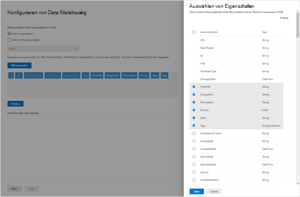

<!---Previous ms.author: shgrover --->

# Azure DevOps Graph Connector (Vorschau)

Mit dem Azure DevOps -Graph-Connector kann Ihre Organisation Arbeitsaufgaben in ihrer Instanz des Azure DevOps-Diensts indizieren. Nachdem Sie den Connector konfiguriert und Inhalte aus Azure DevOps indiziert haben, können Endbenutzer in Microsoft Search nach diesen Elementen suchen.

> [!NOTE]
> Lesen Sie [**den Artikel "Setup für Ihren Graph-Connector",**](configure-connector.md) um den allgemeinen Einrichtungsprozess für Graph Connectors zu verstehen.

Dieser Artikel ist für jeden Benutzer, der einen Azure DevOps Graph-Connector konfiguriert, ausgeführt und überwacht. Sie ergänzt den allgemeinen Einrichtungsprozess und zeigt Anweisungen, die nur für den Azure DevOps Graph-Connector gelten.

>[!IMPORTANT]
>Der Azure DevOps-Connector unterstützt nur den Azure DevOps-Clouddienst. Azure DevOps Server 2019, TFS 2018, TFS 2017, TFS 2015 und TFS 2013 werden von diesem Connector nicht unterstützt.

<!---## Before you get started-->

<!---Insert "Before you get started" recommendations for this data source-->

## Schritt 1: Hinzufügen eines Graph-Connectors im Microsoft 365 Admin Center

Befolgen Sie die allgemeinen [Setupanweisungen.](https://docs.microsoft.com/microsoftsearch/configure-connector)
<!---If the above phrase does not apply, delete it and insert specific details for your data source that are different from general setup 
instructions.-->

## Schritt 2: Benennen der Verbindung

Befolgen Sie die allgemeinen [Setupanweisungen.](https://docs.microsoft.com/microsoftsearch/configure-connector)
<!---If the above phrase does not apply, delete it and insert specific details for your data source that are different from general setup 
instructions.-->

## Schritt 3: Konfigurieren der Verbindungseinstellungen

Um eine Verbindung mit Ihrer Azure DevOps-Instanz  herzustellen, benötigen Sie den Azure DevOps-Organisationsnamen, die App-ID und den geheimen Clientgeheimnis für die OAuth-Authentifizierung.

### Registrieren einer App

Registrieren Sie eine App in Azure DevOps, damit die Microsoft Search-App auf die Instanz zugreifen kann. Weitere Informationen finden Sie in der Azure DevOps-Dokumentation zum Registrieren [einer App.](https://docs.microsoft.com/azure/devops/integrate/get-started/authentication/oauth?view=azure-devops#register-your-app&preserve-view=true)

Die folgende Tabelle enthält Anleitungen zum Ausfüllen des App-Registrierungsformulars:

Pflichtfelder | Beschreibung | Empfohlener Wert
--- | --- | ---
| Firmenname         | Der Name Ihres Unternehmens. | Verwenden eines geeigneten Werts   |
| Anwendungsname     | Ein eindeutiger Wert, der die Anwendung identifiziert, die Sie autorisieren.    | Microsoft Search     |
| Anwendungswebsite  | Die URL der Anwendung, die während der Connectoreinrichtung Zugriff auf Ihre Azure DevOps-Instanz anfordern wird. (Erforderlich).  | https://gcs.office. com/
| Autorisierungsrückruf-URL        | Eine erforderliche Rückruf-URL, an die der Autorisierungsserver umleite. | https://gcs.office. com/v1.0/admin/oauth/callback|
| Autorisierte Bereiche | Der Zugriffsbereich für die Anwendung | Wählen Sie die folgenden Bereiche aus: Identität (gelesen), Arbeitsaufgaben (gelesen), Variable Gruppen (lesen), Projekt und Team (gelesen), Graph (lesen)|

Bei der Registrierung der App mit den oben genannten Details erhalten Sie die **App-ID** und den **geheimen Clientgeheimnis,** die zum Konfigurieren des Connectors verwendet werden.

>[!NOTE]
>To revoke access to any app registered in Azure DevOps, go to User settings at the right top of your Azure DevOps instance. Wählen Sie "Profil" und dann "Autorisierungen" im Abschnitt "Sicherheit" im Seitenbereich aus. Zeigen Sie auf eine autorisierte OAuth-App, um die Schaltfläche "Widerrufen" in der Ecke der App-Details anzuzeigen.

### Verbindungseinstellungen

Nach der Registrierung der Microsoft Search-App bei Azure DevOps können Sie den Verbindungseinstellungsschritt abschließen. Geben Sie den Namen Ihrer Organisation, die App-ID und den geheimen Clientgeheimnis ein.

### Konfigurieren von Daten: Auswählen von Projekten und Feldern

Sie können die Verbindung auswählen, um entweder die gesamte Organisation oder bestimmte Projekte zu indizieren.

Wenn Sie die gesamte Organisation indizieren, werden Elemente in allen Projekten in der Organisation indiziert. Neue Projekte und Elemente werden während der nächsten Durchforstung indiziert, nachdem sie erstellt wurden.

Wenn Sie einzelne Projekte auswählen, werden nur Arbeitsaufgaben in diesen Projekten indiziert.

Wählen Sie als Nächstes aus, welche Felder die Verbindung in diesen Feldern indizieren und anzeigen soll, bevor Sie fortfahren.

## Schritt 4: Verwalten von Suchberechtigungen

Der Azure DevOps-Connector unterstützt Suchberechtigungen, die nur für Personen mit Zugriff  **auf** diese Datenquelle oder für jeden sichtbar **sind.** Wenn Sie "Nur Personen mit Zugriff auf diese Datenquelle" **auswählen,** werden indizierte Daten in den Suchergebnissen für Benutzer angezeigt, die auf der Grundlage von Berechtigungen für Benutzer oder Gruppen auf der Pfadebene "Organisation", "Projekt" oder "Bereich" in Azure DevOps darauf zugreifen können. Wenn Sie **"Jeder"** auswählen, werden indizierte Daten in den Suchergebnissen für alle Benutzer angezeigt.

## Schritt 5: Zuweisen von Eigenschaftsbezeichnungen

Befolgen Sie die allgemeinen [Setupanweisungen.](https://docs.microsoft.com/microsoftsearch/configure-connector)

## Schritt 6: Verwalten des Schemas

Befolgen Sie die allgemeinen [Setupanweisungen.](https://docs.microsoft.com/microsoftsearch/configure-connector)

## Schritt 7: Auswählen von Aktualisierungseinstellungen

Der Azure DevOps Connector unterstützt Aktualisierungszeitpläne für vollständige und inkrementelle Durchforstungen.
Der empfohlene Zeitplan beträgt eine Stunde für eine inkrementelle Durchforstung und einen Tag für eine vollständige Durchforstung.

## Schritt 8: Überprüfen der Verbindung

Befolgen Sie die allgemeinen [Setupanweisungen.](https://docs.microsoft.com/microsoftsearch/configure-connector)
<!---If the above phrase does not apply, delete it and insert specific details for your data source that are different from general setup 
instructions.-->

<!---## Troubleshooting-->
<!---Insert troubleshooting recommendations for this data source-->

<!---## Limitations-->
<!---Insert limitations for this data source-->
