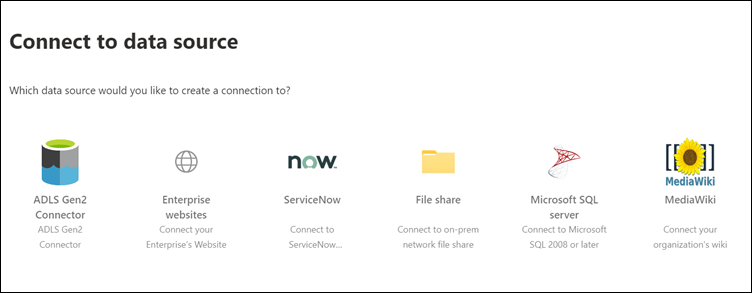
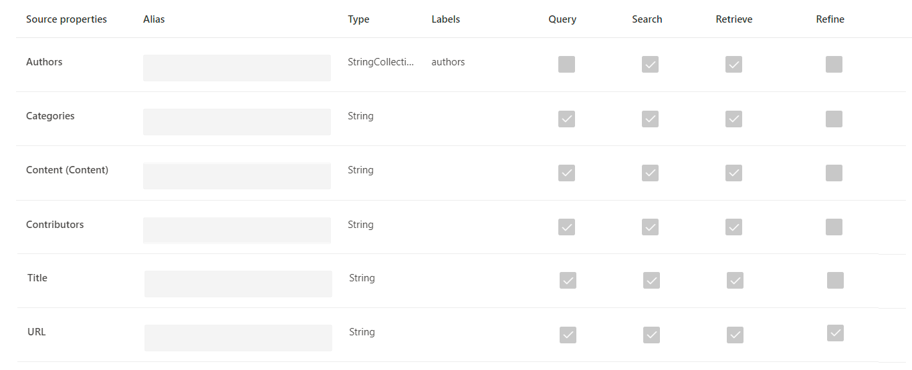
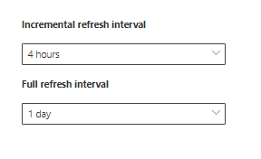

<!-- markdownlint-disable no-trailing-punctuation -->

# Einrichten Ihres von Microsoft erstellten Connectors für Microsoft SearchSet up your Microsoft-built connector for Microsoft Search

Dieser Artikel führt Sie durch die Schritte zum Konfigurieren eines von Microsoft erstellten Connectors.This article guides you through the steps of configuring a Microsoft-built connector. In diesem Artikel wird der Fluss der Einrichtung einer Verbindung im Microsoft 365 [Admin Center](https://admin.microsoft.com)erläutert.It outlines the flow of setting up a connection in the Microsoft 365 [admin center](https://admin.microsoft.com). Weitere Informationen zum Einrichten spezieller von Microsoft erstellte Connectors finden Sie in den folgenden Artikeln:For more details on how to set up specific Microsoft-built connectors, see these articles:

* [Azure Data Lake Storage Gen2Azure Data Lake Storage Gen2](azure-data-lake-connector.md)
* [Azure-DevOpsAzure DevOps](azure-devops-connector.md)
* [Azure SQLAzure SQL](MSSQL-connector.md)
* [UnternehmenswebsitesEnterprise websites](enterprise-web-connector.md)
* [DateifreigabeFile share](file-share-connector.md)
* [MediaWikiMediaWiki](mediawiki-connector.md)
* [Microsoft SQL ServerMicrosoft SQL server](MSSQL-connector.md)
* [ServiceNowServiceNow](servicenow-connector.md)

## EinrichtenSet up

Führen Sie die folgenden Schritte aus, um einen der von Microsoft erstellten Connectors zu konfigurieren.Complete the following steps to configure any of the Microsoft-built connectors.

1. Wechseln Sie zur [Registerkarte Connectors](https://admin.microsoft.com/Adminportal/Home#/MicrosoftSearch/Connectors) im [Microsoft 365 Admin Center](https://admin.microsoft.com).Go to the [Connectors tab](https://admin.microsoft.com/Adminportal/Home#/MicrosoftSearch/Connectors) in the [Microsoft 365 admin center](https://admin.microsoft.com).
2. Melden Sie sich mit den Anmeldeinformationen für Ihren [Microsoft 365](https://www.microsoft.com/microsoft-365) -Mandanten bei Ihrem Konto an.Sign in to your account with the credentials for your [Microsoft 365](https://www.microsoft.com/microsoft-365) tenant.
3. Wählen Sie **Add a Connector**aus.Select **Add a connector**.
4. Wählen Sie in der Liste der verfügbaren Connectors den Connector Ihrer Wahl aus.From the list of available connectors, select the connector of your choice.

### Nennen Sie den ConnectorName the connector

Um eine Verbindung zu erstellen, geben Sie zunächst die folgenden Attribute an:To create a connection, first specify these attributes:

1. Name der VerbindungName of the connection
2. Verbindungs-IDConnection ID
3. Description (optional)Description (optional)

Die Verbindungs-ID erstellt implizite Eigenschaften für den Connector.The connection ID creates implicit properties for your connector. Er darf nur alphanumerische Zeichen enthalten und darf maximal 32 Zeichen lang sein.It must contain only alphanumeric characters and be a maximum of 32 characters.

### Herstellen einer Verbindung mit einer DatenquelleConnect to a data source

Der Daten Verbindungsprozess variiert je nach Typ des Connectors.The data connection process varies based on the type of connector. Weitere Informationen zum Herstellen einer Verbindung mit Ihrer lokalen Datenquelle finden Sie unter [Install an on-premises Data Gateway](https://aka.ms/configuregateway).To learn more about connecting to your on-premises data source, see [Install an on-premises data gateway](https://aka.ms/configuregateway).

### Quelleigenschaften auswählenSelect source properties

Die Datenfelder, die von der Drittanbieter-Datenquelle als Quelleigenschaften festgelegt wurden, werden in Microsoft Search indiziert.The data fields set by your third-party data source as source properties are indexed into Microsoft Search. Um diese Eigenschaften zu ändern, wählen Sie in der Seitenleiste rechts auf der Seite **Verbinder** die Option **Eigenschaften bearbeiten** aus.To modify these properties, select **Edit properties** in the side bar on the right of the **Connectors** page. Sie können **bis zu 64 Quelleigenschaften**auswählen.You can select **up to 64 source properties**.

### Verwalten des SuchschemasManage the search schema

Administratoren können die Suchschema Attribute so festlegen, dass die Suchfunktionen der einzelnen Quelleigenschaften gesteuert werden.Admins can set the search schema attributes to control search functionality of each source property. Mithilfe eines Suchschemas können Sie bestimmen, welche Ergebnisse auf der Suchergebnisseite angezeigt werden und welche Informationen Endbenutzer anzeigen und darauf zugreifen können.A search schema helps determine what results display on the search results page and what information end users can view and access.

Suchschema Attribute umfassen **durchsuchbar**, **abgefragt**und **abrufbar**.Search schema attributes include **searchable**, **queryable**, and **retrievable**. In der folgenden Tabelle sind die Attribute aufgeführt, die von Microsoft Graph-Connectors unterstützt werden, und deren Funktionen erläutert.The following table lists each of the attributes that Microsoft Graph connectors support and explains their functions.

Suchschema AttributSearch schema attribute | FunktionFunction | BeispielExample
--- | --- | ---
DurchsuchbareSEARCHABLE | Legt den Textinhalt einer Eigenschaft durchsuchbar.Makes the text content of a property searchable. Eigenschaften Inhalte sind im Volltextindex enthalten.Property contents are included in the full-text index. | Wenn die Eigenschaft **Title**lautet, gibt eine Abfrage für **Enterprise** Antworten zurück, die das Wort **Enterprise** in einem beliebigen Text oder Titel enthalten.If the property is **title**, a query for **Enterprise** returns answers that contain the word **Enterprise** in any text or title.
QUERYABLEQUERYABLE | Sucht nach einer Suchabfrage nach einer Übereinstimmung für eine bestimmte Eigenschaft.Searches by query for a match for a particular property. Der Eigenschaften Name kann dann entweder programmgesteuert oder wörtlich in der Abfrage angegeben werden.The property name can then be specified in the query either programmatically or verbatim. |  Wenn die **Title** -Eigenschaft abgefragt wird, wird der Abfrage **Titel: Enterprise** unterstützt.If the **Title** property is queryable, then the query **Title: Enterprise** is supported.
AbrufbarRETRIEVABLE | Nur Abruf bare Eigenschaften können im Ergebnistyp verwendet werden und im Suchergebnis angezeigt werden.Only retrievable properties can be used in the result type and display in the search result. |

Für alle Connectors mit Ausnahme des Dateifreigabe-Konnektors müssen benutzerdefinierte Typen manuell festgelegt werden.For all connectors except the file share connector, custom types must be set manually. Zum Aktivieren der Suchfunktionen für jedes Feld benötigen Sie ein Suchschema, das einer Liste von Eigenschaften zugeordnet ist.To activate search capabilities for each field, you need a search schema mapped to a list of properties. Der Verbindungs-Assistent wählt automatisch ein Suchschema basierend auf den von Ihnen ausgewählten Quelleigenschaften aus.The connection wizard automatically selects a search schema based on the set of source properties you choose. Sie können dieses Schema ändern, indem Sie die Kontrollkästchen für jede Eigenschaft und jedes Attribut auf der Seite Suchschema aktivieren.You can modify this schema by selecting the check boxes for each property and attribute in the search schema page.

Diese Einschränkungen und Empfehlungen gelten für Suchschema Einstellungen:These restrictions and recommendations apply to search schema settings:

* Für Konnektoren, die benutzerdefinierte Typen indizieren, wird empfohlen, dass Sie das Feld, das den Hauptinhalt des Inhalts **Abrufs**enthält, **nicht** markieren.For connectors that index custom types, we recommend that you **do not** mark the field that contains the main content **retrievable**. Es treten erhebliche Leistungsprobleme auf, wenn Suchergebnisse mit diesem Suchattribut gerendert werden.Significant performance issues occur when search results render with that search attribute. Ein Beispiel ist das **Text** Inhaltsfeld für einen [ServiceNow](https://www.servicenow.com) Knowledge Base-Artikel.An example is the **Text** content field for a [ServiceNow](https://www.servicenow.com) knowledge-base article.
* Nur Eigenschaften, die als abrufbares Rendering in den Suchergebnissen markiert sind, können zum Erstellen moderner Ergebnistypen (MRT) verwendet werden.Only properties marked as retrievable render in the search results and can be used to create modern result types (MRTs).
* Nur Zeichenfolgeneigenschaften können durchsuchbar gekennzeichnet werden.Only string properties can be marked searchable.

> [!Note]
> Nachdem Sie eine Verbindung erstellt haben, **können** Sie das Schema nicht ändern.After you create a connection, you **can't** modify the schema. Hierzu müssen Sie die Verbindung löschen und eine neue erstellen.To do that, you need to delete your connection and create a new one.

### Verwalten von SuchberechtigungenManage search permissions

Zugriffssteuerungslisten (Access Control Lists, ACLs) bestimmen, welche Benutzer in Ihrer Organisation auf die einzelnen Datenelemente zugreifen können.Access Control Lists (ACLs) determine which users in your organization can access each item of data. Der Dateifreigabe-Connector unterstützt nur ACLs, die [Azure Active Directory (Azure AD)](https://docs.microsoft.com/azure/active-directory/)zugeordnet werden können.The file share connector supports only ACLs that can be mapped to [Azure Active Directory (Azure AD)](https://docs.microsoft.com/azure/active-directory/). Alle anderen Connectors unterstützen Suchberechtigungen, die für alle Benutzer sichtbar sind.All the other connectors support search permissions that are visible to all users.

### Festlegen des AktualisierungszeitplansSet the refresh schedule

Der Aktualisierungszeitplan legt fest, wie oft Ihre Daten mit dem Index in Microsoft Graph und Microsoft Search synchronisiert werden.The refresh schedule determines how often your data is synced with the index in Microsoft Graph and Microsoft Search. Sie können die Aktualisierung auf zwei Arten planen: vollständige Durchforstung oder inkrementelle Durchforstung.You can schedule the refresh in two ways: full crawl or incremental crawl.

Bei einer **vollständigen Durchforstung**verarbeitet und indiziert die Suchmaschine jedes Element in der Inhaltsquelle, unabhängig von vorherigen Crawls.With a **full crawl**, the search engine processes and indexes every item in the content source, regardless of previous crawls. Die vollständige Durchforstung funktioniert am besten in diesen Situationen:Full crawl works best in these situations:

* Sie müssen Löschungen von Daten erkennen.You need to detect deletions of data.
* Fehler beim Crawlen von Inhalten durch den inkrementellen Crawl.The incremental crawl failed to crawl content for errors.
* Ein Software Update für Microsoft Search ist erforderlich.A software update for Microsoft Search is required. Updates ändern das Suchschema.Updates modify the search schema.
* ACLs wurden geändert.ACLs were modified.
* Durchforstungsregeln wurden geändert.Crawl rules were modified.

Bei einer **inkrementellen Durchforstung**kann die Suchmaschine nur die Elemente verarbeiten und indizieren, die seit der letzten erfolgreichen Durchforstung erstellt oder geändert wurden.With an **incremental crawl**, the search engine can process and index only the items that were created or modified since the last successful crawl. Daher werden nicht alle Daten in der Inhaltsquelle erneut indiziert.Therefore, not all the data in the content source is re-indexed. Inkrementelle Crawls funktionieren am besten, um Inhalte, Metadaten, Berechtigungen und andere Updates zu erkennen.Incremental crawls works best to detect content, metadata, permission, and other updates.

Inkrementelle Crawls sind wesentlich schneller als vollständige Durchforstungen, da unveränderte Elemente nicht verarbeitet werden.Incremental crawls are much faster than full crawls because unchanged items aren’t processed. Um eine exakte Datensynchronisierung zwischen der Inhaltsquelle und dem Suchindex zu gewährleisten, müssen Sie beide Crawls regelmäßig durchführen.To maintain an accurate data sync between the content source and the search index, you need to run both crawls periodically.

Jeder Connector verfügt über einen anderen optimalen Satz von Aktualisierungs Zeitplänen, basierend auf der Häufigkeit, mit der Daten geändert werden, und den Typ der Änderungen.Each connector will have a different optimal set of refresh schedules based on how often data is modified and the type of modifications.

### Überprüfen der VerbindungseinstellungenReview connector settings

Nachdem Sie den Connector konfiguriert haben, führt Sie das [Admin Center](https://admin.microsoft.com) zu einer Seite, auf der Sie die Einstellungen überprüfen können.After you configure your connector, the [admin center](https://admin.microsoft.com) takes you to a page where you can review your settings. Sie können den Konfigurationsprozess wiederholen, um eine beliebige Einstellung zu bearbeiten, bevor Sie die Verbindung bestätigen.You can go back through the configuration process to edit any setting before you confirm the connection. Weitere Informationen finden Sie unter [Manage Your Connector](manage-connector.md).To learn more, see [Manage your connector](manage-connector.md).

## Nächste Schritte: Anpassen der SuchergebnisseiteNext steps: Customize the search results page

Mit der Microsoft Search-Benutzeroberfläche können Ihre Endbenutzer Inhalte aus Ihren [Microsoft 365](https://www.microsoft.com/microsoft-365) -Produktivitäts-apps und dem breiteren Microsoft-Ökosystem durchsuchen.With the Microsoft Search user interface (UI), your end users can search content from your [Microsoft 365](https://www.microsoft.com/microsoft-365) productivity apps and the broader Microsoft ecosystem. Die vertikale Suche bezieht sich auf die Registerkarten, die angezeigt werden, wenn ein Benutzer in [Bing](https://Bing.com)die Suchergebnisse in [SharePoint](https://sharepoint.com/), [Microsoft Office](https://Office.com)und Microsoft-Suche anzeigt.A search vertical refers to the tabs that are shown when a user views their search results in [SharePoint](https://sharepoint.com/), [Microsoft Office](https://Office.com), and Microsoft Search in [Bing](https://Bing.com). Sie können die Such vertikalen so anpassen, dass die Ergebnisse eingegrenzt werden, sodass nur ein bestimmter Typ von Suchergebnissen angezeigt wird.You can customize search verticals to narrow down results, so that only a certain type of search results is displayed. Diese vertikalen Werte werden als Registerkarte oben auf der Suchergebnisseite angezeigt.These verticals appear as a tab on the top of the search results page. Ein moderner Ergebnistyp (MRT) ist die Benutzeroberfläche, die festlegt, wie Ergebnisse dargestellt werden.A modern result type (MRT) is the UI that designates how results are presented.

Sie müssen ihre eigenen vertikalen und Ergebnistypen erstellen, damit Endbenutzer Suchergebnisse aus neuen Verbindungen anzeigen können.You must create your own verticals and result types, so end users can view search results from new connections. Ohne diesen Schritt werden Daten aus ihrer Verbindung nicht auf der Suchergebnisseite angezeigt.Without this step, data from your connection won’t show up on the search results page.

Weitere Informationen zum Erstellen von vertikalen und MRT finden Sie unter [Anpassen der Suchergebnisseite](customize-search-page.md).To learn more about how to create your verticals and MRTs, see [Search results page customization](customize-search-page.md).

## Woher weiß ich, dass der Vorgang erfolgreich war?How do I know this worked?

Wechseln Sie zur Liste der veröffentlichten Verbindungen auf der Registerkarte **Connectors** im [Admin Center](https://admin.microsoft.com).Go to the list of your published connections under the **Connectors** tab in the [admin center](https://admin.microsoft.com). Informationen zum Erstellen von Updates und Löschungen finden Sie unter [Manage Your Connector](manage-connector.md).To learn how to make updates and deletions, see [Manage your connector](manage-connector.md).
