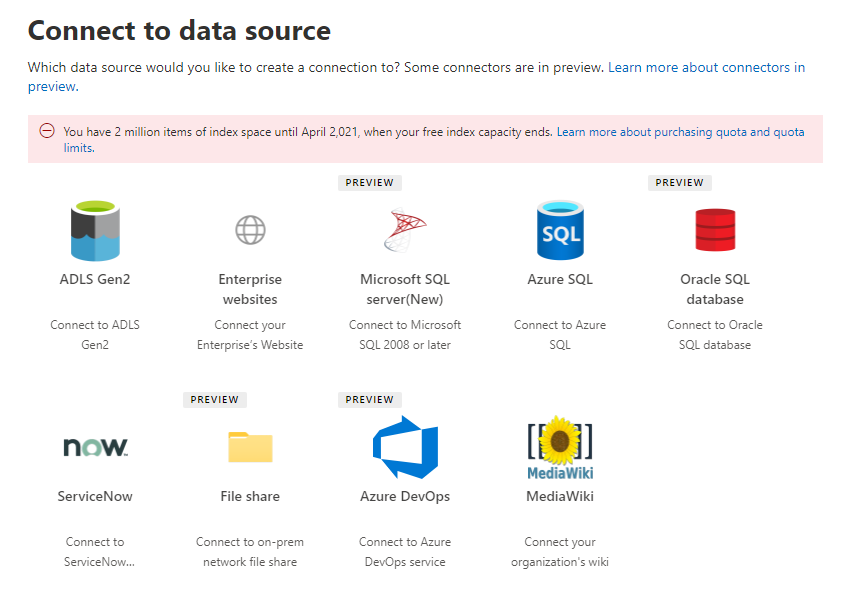

<!-- Previous ms.author: monaray -->

<!-- markdownlint-disable no-trailing-punctuation -->

# Setupübersicht für Graph-Connectors von Microsoft

In diesem Artikel wird der grundlegende Prozess beschrieben, der erforderlich ist, um die Graph Connectors **von Microsoft** im [Microsoft 365 Admin Center](https://admin.microsoft.com)einzurichten. Der einfache Prozess umfasst die folgenden Schritte:  
<!---Add links to each section in the doc--->

1. [Hinzufügen eines Graph-Inhaltsconnectors im Microsoft 365 Admin Center](#step-1-add-a-graph-connector-in-the-microsoft-365-admin-center)
2. [Benennen der Verbindung](#step-2-name-the-connection)
3. [Konfigurieren der Verbindungseinstellungen](#step-3-configure-the-connection-settings)
4. [Auswählen von Eigenschaften](#step-4-select-properties)
5. [Verwalten von Suchberechtigungen](#step-5-manage-search-permissions)
6. [Zuweisen von Eigenschaftenbeschriftungen](#step-6-assign-property-labels)
7. [Schema verwalten](#step-7-manage-schema)
8. [Aktualisierungseinstellungen](#step-8-refresh-settings)
9. [Überprüfen der Verbindung](#step-9-review-connection)

Dieser Artikel enthält auch Informationen zur Problembehandlung, zu Einschränkungen und zu den nächsten Schritten:

* [Problembehandlung](#troubleshooting)
* [Einschränkungen](#limitations)
* [Nächste Schritte](#next-steps)

> [!NOTE]
> Der Einrichtungsprozess ist für alle Graph Connectors von Microsoft ähnlich, ist jedoch nicht identisch. **Lesen Sie zusätzlich zu diesem Artikel unbedingt die connectorspezifischen Informationen für Ihre Datenquelle.**  

<!---## Before you get started-->

<!---Insert "Before you get started" recommendations for this data source-->

## Schritt 1: Hinzufügen eines Graph Connectors im Microsoft 365 Admin Center

Führen Sie die folgenden Schritte aus, um einen der von Microsoft erstellten Graph Connectors zu konfigurieren:

1. Melden Sie sich bei Ihrem Administratorkonto im [Microsoft 365 Admin Center](https://admin.microsoft.com)an.

2. Wählen Sie im Navigationsbereich **Einstellungen** aus, und wählen Sie dann **Suche & Intelligence** aus. Wählen Sie die [Registerkarte "Datenquellen" aus.](https://admin.microsoft.com/Adminportal/Home#/MicrosoftSearch/Connectors)

3. Wählen Sie **+Hinzufügen** aus, und wählen Sie dann im Menü der verfügbaren Optionen die gewünschte Datenquelle aus.

   > [!div class="mx-imgBorder"]
   > 

> [!NOTE]
> Sie können jedem Mandanten maximal zehn Graph Verbindungen hinzufügen.

## Schritt 2: Benennen der Verbindung

Geben Sie diese Attribute an:

* Name (erforderlich)
* Verbindungs-ID (erforderlich)
* Beschreibung (optional)
* Kontrollkästchen aktivieren (erforderlich)

Die Verbindungs-ID erstellt implizite Eigenschaften für den Connector. Sie darf nur alphanumerische Zeichen und maximal 32 Zeichen enthalten.

## Schritt 3: Konfigurieren der Verbindungseinstellungen

Der Prozess zum Konfigurieren der Verbindungseinstellungen variiert je nach Typ der Datenquelle. Informationen zum Typ der Datenquelle, die Sie Ihrem Mandanten hinzufügen möchten, finden Sie in den [connectorspezifischen Informationen,](/microsoftsearch/servicenow-connector#step-31-basic-authentication) um diesen Schritt im Setupprozess abzuschließen.  

Weitere Informationen zum Herstellen einer Verbindung mit einer lokalen Datenquelle finden Sie unter [Installieren eines lokalen Datengateways.](/data-integration/gateway/service-gateway-install)

## Schritt 4: Auswählen von Eigenschaften

Sie können die Eigenschaften auswählen, die von Microsoft Search indiziert werden.

Die ServiceNow-Abfrage kann verwendet werden, um Ihre Daten zu filtern, bevor sie von Microsoft Search indiziert werden. Dadurch erhalten Sie mehr Kontrolle über die Daten, die durchsucht werden können. Weitere Informationen zu ServiceNow-Abfragen finden Sie unter [Informationen zu ServiceNow-Abfragen.](https://go.microsoft.com/fwlink/?linkid=2151447)

## Schritt 5: Verwalten von Suchberechtigungen

Zugriffssteuerungslisten (Access Control Lists, ACLs) bestimmen, welche Benutzer in Ihrer Organisation auf jedes Element zugreifen können.  

Einige Connectors wie [Microsoft SQL](MSSQL-connector.md) und Azure Data Lake [Storage Gen2](azure-data-lake-connector.md) unterstützen [Azure Active Directory ACLs (Azure AD).](/azure/active-directory/)

Andere Connectors wie [ServiceNow Knowledge,](servicenow-knowledge-connector.md) [ServiceNow-Katalog,](servicenow-catalog-connector.md) [Azure DevOps](azure-devops-connector.md)und [Salesforce](salesforce-connector.md) unterstützen die Synchronisierung von Nicht-Azure AD-Benutzern und -Gruppen.  

Wenn Sie "Jeder" auswählen, können alle Personen in Ihrer Organisation Suchergebnisse aus dieser Datenquelle anzeigen.

## Schritt 6: Zuweisen von Eigenschaftenbeschriftungen

Sie können Ihren Quelleigenschaften auf der Seite "Eigenschaftenbezeichnungen zuweisen" semantische Bezeichnungen zuweisen. Bezeichnungen sind bekannte Tags, die von Microsoft bereitgestellt werden und eine semantische Bedeutung bieten. Sie ermöglichen Es Microsoft, Ihre Connectordaten in Microsoft 365 Funktionen wie erweiterte Suche, Personenkarten, intelligente Ermittlung und vieles mehr zu integrieren.  

In der folgenden Tabelle sind die derzeit unterstützten Bezeichnungen und deren Beschreibungen aufgeführt.  

Beschriftung | Beschreibung
--- | ---  
**title** | Der Titel für das Element, das in der Suche und anderen Oberflächen angezeigt werden soll
**url** | Die Ziel-URL des Elements im Quellsystem
**Erstellt von** | Name der Person, die das Element erstellt hat
**Zuletzt geändert von** | Name der Person, die das Element zuletzt bearbeitet hat
**Authors** | Name der Personen, die am Element teilgenommen/zusammengearbeitet haben
**Erstellungsdatum** | Wann wurde das Element erstellt?
**Datum und Uhrzeit der letzten Änderung** | Wann wurde das Element zuletzt bearbeitet?
**Dateiname** | Name des Dateielements
**Kategorie** | Typ des Dateielements, z. B. .pdf oder WORD

Die Eigenschaften auf dieser Seite sind basierend auf Ihrer Datenquelle vorab ausgewählt. Sie können diese Auswahl jedoch ändern, wenn eine andere Eigenschaft vorhanden ist, die besser für eine bestimmte Bezeichnung geeignet ist.  

Der **Bezeichnungstitel** ist die wichtigste Bezeichnung. Es wird **dringend empfohlen,** dieser Bezeichnung eine Eigenschaft zugewiesen zu haben, damit Ihre Verbindung an der [Ergebnisclustererfahrung](result-cluster.md)teilnimmt.

Die falsche Zuordnung von Bezeichnungen führt zu einer beeinträchtigten Sucherfahrung. Es ist in Ordnung, dass einigen Bezeichnungen keine Eigenschaft zugewiesen ist.  

## Schritt 7: Verwalten des Schemas

### Content-Eigenschaft

Es wird empfohlen, eine **Inhaltseigenschaft** aus dem Dropdownmenü der Optionen auszuwählen oder die Standardeinstellung beizubehalten, wenn eine vorhanden ist. Diese Eigenschaft wird für die Volltextindizierung von Inhalten, die Generierung von Codeausschnitten von Suchergebnissen, die Teilnahme am [Ergebniscluster,](result-cluster.md) die Spracherkennung, die HTML-/Textunterstützung, die Rangfolge und Relevanz sowie die Abfrageformulierung verwendet.

Wenn Sie eine Inhaltseigenschaft auswählen, können Sie beim Erstellen des [Ergebnistyps](customize-results-layout.md)die vom System generierte Eigenschaft **ResultSnippet** verwenden. Diese Eigenschaft dient als Platzhalter für die dynamischen Codeausschnitte, die zur Abfragezeit aus der Inhaltseigenschaft generiert werden. Wenn Sie diese Eigenschaft in Ihrem Ergebnistyp verwenden, werden Codeausschnitte in Ihren Suchergebnissen generiert.

### Erstellen von Aliasen für Quelleigenschaften

Sie können Ihren Eigenschaften unter der Spalte "Alias" auf der Seite "Schema verwalten" Aliase hinzufügen. Aliase sind Anzeigenamen für Ihre Eigenschaften und werden auch in Abfragen und beim Erstellen von Filtern verwendet. Sie werden auch verwendet, um Quelleigenschaften von mehreren Verbindungen so zu normalisieren, dass sie denselben Namen haben. Auf diese Weise können Sie einen einzelnen Filter für eine Vertikale mit mehreren Verbindungen erstellen. Weitere Informationen finden Sie unter [Anpassen der Suchergebnisseite.](customize-search-page.md)  

### Suchschemaattribute

Sie können die Suchschemaattribute festlegen, um die Suchfunktionalität jeder Quelleigenschaft zu steuern. Ein Suchschema hilft zu bestimmen, welche Ergebnisse auf der Suchergebnisseite angezeigt werden und welche Informationen Endbenutzer anzeigen und darauf zugreifen können.

Zu den Suchschemaattributen gehören Optionen zum **Abfragen,** **Suchen,** **Abrufen** und **Verfeinern.** In der folgenden Tabelle sind die attribute aufgeführt, die Von Microsoft Graph Connectors unterstützt werden, und ihre Funktionen werden erläutert.

Suchschemaattribut | Funktion | Beispiel
--- | --- | ---
SUCHE | Macht den Textinhalt einer Eigenschaft durchsuchbar. Eigenschafteninhalte sind im Volltextindex enthalten. | Wenn es sich bei der Eigenschaft um **einen Titel** handelt, gibt eine Abfrage nach **Enterprise** Antworten zurück, die das Wort **Enterprise** in einem beliebigen Text oder Titel enthalten.
ABFRAGE | Sucht nach einer Abfrage nach einer Übereinstimmung für eine bestimmte Eigenschaft. Der Eigenschaftenname kann dann in der Abfrage entweder programmgesteuert oder ausführlich angegeben werden. |  Wenn die **Title-Eigenschaft** abgefragt werden kann, wird die Abfrage **Title: Enterprise** unterstützt.
ABRUFEN | Nur abgerufene Eigenschaften können im Ergebnistyp verwendet und im Suchergebnis angezeigt werden. |
VERFEINERN | Die Verfeinerungsoption kann wie auf der Microsoft Search Ergebnisseite verwendet werden. | Benutzer in Ihrer Organisation können auf der Suchergebnisseite nach **URL** [filtern,](custom-filters.md) ob die Verfeinerungseigenschaft während der Verbindungseinrichtung markiert ist.

Für alle Connectors mit Ausnahme des Dateifreigabeconnectors müssen benutzerdefinierte Typen manuell festgelegt werden. Um die Suchfunktionen für jedes Feld zu aktivieren, benötigen Sie ein Suchschema, das einer Liste von Eigenschaften zugeordnet ist. Der Verbindungs-Assistent wählt automatisch ein Suchschema basierend auf dem von Ihnen ausgewählten Satz von Quelleigenschaften aus. Sie können dieses Schema ändern, indem Sie die Kontrollkästchen für jede Eigenschaft und jedes Attribut auf der Suchschemaseite aktivieren.

:::image type="content" alt-text="Das Schema für einen Connector kann durch Hinzufügen oder Entfernen von Abfrage-, Such- und Retrieve-Funktionen angepasst werden." source="media/manageschema.png" lightbox="media/manageschema.png":::

### Einschränkungen und Empfehlungen für Suchschemaeinstellungen

* Die **Inhaltseigenschaft** kann nur durchsucht werden. Nachdem sie in der Dropdownliste ausgewählt wurde, kann diese Eigenschaft nicht mit den **abgerufenen** Optionen oder **Abfragen** verwendet werden.

* Erhebliche Leistungsprobleme treten auf, wenn Suchergebnisse mit der **Inhaltseigenschaft** gerendert werden. Ein Beispiel  ist das Text-Inhaltsfeld für einen ServiceNow-Knowledge-Base-Artikel. 

* Nur Eigenschaften, die als abrufbares Rendern in den Suchergebnissen markiert sind und zum Erstellen moderner Ergebnistypen (MRTs) verwendet werden können.

* Nur Zeichenfolgeneigenschaften können als durchsuchbar markiert werden.

> [!NOTE]
> Nachdem Sie eine Verbindung erstellt haben, können Sie das Schema **nicht** mehr ändern. Dazu müssen Sie Ihre Verbindung löschen und eine neue erstellen.

## Schritt 8: Aktualisieren von Einstellungen

Das Aktualisierungsintervall bestimmt, wie oft Ihre Daten zwischen der Datenquelle und Microsoft Search synchronisiert werden. Jeder Datenquellentyp verfügt über einen anderen Satz optimaler Aktualisierungszeitpläne, basierend darauf, wie oft Daten geändert werden, und dem Typ der Änderungen.

Es gibt zwei Arten von Aktualisierungsintervallen, bei denen es sich um **die vollständige aktualisierung** und die inkrementelle **Aktualisierung** handelt, aber inkrementelle Aktualisierungen sind für einige Datenquellen nicht verfügbar.

Bei einer vollständigen Aktualisierung verarbeitet und indiziert das Suchmodul die Elemente, die sich in der Inhaltsquelle geändert haben, unabhängig von vorherigen Durchforstungen. Eine vollständige Aktualisierung eignet sich am besten für folgende Situationen:

* Erkennen von Löschungen von Daten.
* Bei der inkrementellen Aktualisierung wurden Fehler gefunden, und es ist ein Fehler aufgetreten.
* ACLs wurden geändert.
* Durchforstungsregeln wurden geändert.
* Das Schema für die Verbindung wurde aktualisiert (Schemaupdates werden noch nicht unterstützt).

Bei einer **inkrementellen Aktualisierung** kann das Suchmodul nur die Elemente verarbeiten und indizieren, die seit der letzten erfolgreichen Durchforstung erstellt oder geändert wurden. Daher werden nicht alle Daten in der Inhaltsquelle neu indiziert. Inkrementelle Aktualisierungen funktionieren am besten, um Inhalte, Metadaten, Berechtigungen und andere Updates zu erkennen.

Inkrementelle Aktualisierungen sind wesentlich schneller als vollständige Aktualisierungen, da unveränderte Elemente nicht verarbeitet werden. Wenn Sie sich jedoch dafür entscheiden, inkrementelle Aktualisierungen auszuführen, müssen Sie dennoch in regelmäßigen Abständen vollständige Aktualisierungen ausführen, um die richtige Datensynchronisierung zwischen der Inhaltsquelle und dem Suchindex aufrechtzuerhalten.

> [!div class="mx-imgBorder"]
> 

<!---Change screenshot for one that shows both options in new UI (try ServiceNow)--->

## Schritt 9: Überprüfen der Verbindung

Sie können ihre gesamte Konfiguration überprüfen und die Einstellungen nach Bedarf bearbeiten, bevor Sie die Verbindung abschließen. **Lesen Sie unbedingt die connectorspezifischen Informationen für Ihre Datenquelle, wenn Sie dies noch nicht getan haben.** Wählen Sie **"Aktualisierung beenden"** aus, wenn Sie bereit sind, die Verbindung abzuschließen.

### Überprüfen, ob das Verbindungssetup funktioniert hat

Wechseln Sie zur Liste der veröffentlichten Verbindungen auf der Registerkarte **Connectors** im [Admin Center.](https://admin.microsoft.com) Informationen zum Vornehmen von Aktualisierungen und Löschungen finden Sie unter [Verwalten des Connectors.](manage-connector.md)

## Problembehandlung
<!---Insert troubleshooting recommendations for this data source-->
Lesen Sie die connectorspezifischen Informationen für Ihre Datenquelle.

> [!NOTE]
> Nicht alle connectorspezifischen Artikel enthalten derzeit Empfehlungen zur Problembehandlung.

## Einschränkungen
<!---Insert limitations for this data source-->
Informationen zu Einschränkungen, die für alle Datenquellen gelten, finden Sie im Artikel ["Übersicht über Microsoft Graph Connectors".](connectors-overview.md)

Lesen Sie die connectorspezifischen Informationen für Ihre Datenquelle, um herauszufinden, ob andere Einschränkungen für diesen bestimmten Graph Connector gelten.

## Nächste Schritte

Nach der Veröffentlichung der Verbindung müssen Sie die Suchergebnisseite mit Vertikalen und Ergebnistypen anpassen. Informationen zum Anpassen von Suchergebnissen finden Sie unter ["Verwalten von Vertikalen](manage-verticals.md) und [Ergebnistypen".](manage-result-types.md)
