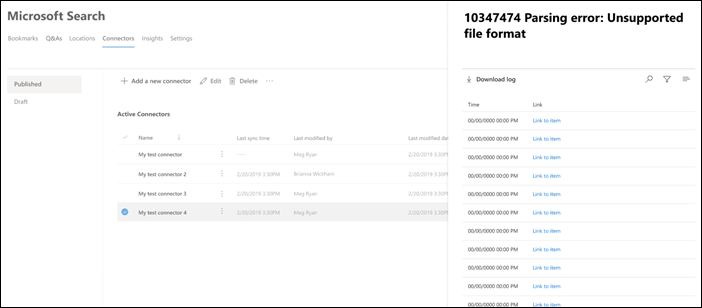

<!-- markdownlint-disable no-inline-html -->

# Verbindungsdetails und -Fehler anzeigen

Um auf Ihre Connectors zugreifen und diese verwalten zu können, müssen Sie als Suchadministrator für Ihren Mandanten festgelegt werden. Wenden Sie sich an Ihren Mandantenadministrator, um Sie für die Rolle des Suchadministrators bereitzustellen.

Navigieren Sie im [Microsoft 365 Admin Center](https://admin.microsoft.com)zur [Registerkarte "Connectors".](https://admin.microsoft.com/Adminportal/Home#/MicrosoftSearch/Connectors)

Sie können Verbindungsdetails und -fehler anzeigen, wenn Sie auf der [Registerkarte Connectors](https://admin.microsoft.com/Adminportal/Home#/MicrosoftSearch/Connectors)auf die Verbindung klicken.  

## Anzeigen der letzten Durchforstungsinformationen

Nachdem die erste inkrementelle oder vollständige Durchforstung erfolgreich abgeschlossen wurde, werden die letzten Durchforstungsdatenwerte unter dem letzten Durchforstungsheader im Detailbereich angezeigt. Wenn keine letzte Durchforstung ausgeführt wurde, werden unter dem letzten Durchforstungsheader keine Informationen angezeigt. Anhand dieser Informationen zur letzten Durchforstung erhalten Sie Einblicke in die Durchführung der Durchforstung und die erforderlichen Schritte, wo immer erforderlich.

Für jede Verbindung sind die folgenden letzten Durchforstungswerte verfügbar:

Wert | Beschreibung
--- | ---
**Abgeschlossen am** | Datum und Uhrzeit des Abschlusses der letzten Durchforstung
**Typ** | Inkrementelle oder vollständige Durchforstung
**Duration** | Wie viel Zeit hat die letzte Durchforstung gedauert?
**Erfolge** | Anzahl der Elemente, die bei der letzten Durchforstung erfolgreich aufgenommen wurden
**Fehler** | Anzahl der Elemente, bei denen bei der letzten Durchforstung ein Fehler aufgetreten ist

## Überwachen von Fehlern

Für jeden **aktiven Connector** auf der Registerkarte **Connectors** werden alle vorhandenen Durchforstungsfehler unter der Registerkarte **"Fehler"** angezeigt. Auf der Registerkarte sind Fehlercodes, die Anzahl der einzelnen Fehler sowie Fehlerprotokolldownloadoptionen aufgeführt. Sehen Sie sich das Beispiel in der folgenden Abbildung an. Wählen Sie einen **Fehlercode** aus, um die Fehlerdetails anzuzeigen.

Um die spezifischen Details eines Fehlers anzuzeigen, wählen Sie dessen Fehlercode aus. Ein Bildschirm mit Fehlerdetails und einem Link wird angezeigt. Die neuesten Fehler werden oben angezeigt. Sehen Sie sich das Beispiel in der folgenden Tabelle an.

Nachfolgend finden Sie eine Liste der verschiedenen Fehler, die für jede Verbindung angezeigt werden können.

Fehlercode | Fehlermeldung | Lösung
--- | --- | ---
1000 | Die Datenquelle ist nicht verfügbar. Überprüfen Sie Ihre Internetverbindung, oder stellen Sie sicher, dass der Connector weiterhin auf die Datenquelle zugreifen kann. | Dieser Fehler tritt auf, wenn die Datenquelle aufgrund eines Netzwerkproblems nicht erreichbar ist oder wenn die Datenquelle selbst gelöscht, verschoben oder umbenannt wird. Überprüfen Sie, ob die angegebenen Datenquellendetails weiterhin gültig sind.
1001 | Die Daten können nicht aktualisiert werden, da die Datenquelle den Connector drosselt. | Um die Datenquelle aufzuheben, überprüfen Sie, ob die Skalierungsgrenzwerte erhöht werden können, oder warten Sie bis zu einer weniger datenverkehrslastigen Zeit des Tages.
1002 | Die Authentifizierung mit der Datenquelle ist nicht möglich. Stellen Sie sicher, dass die dieser Datenquelle zugeordneten Anmeldeinformationen korrekt sind. | Klicken Sie auf **Bearbeiten,** um die Authentifizierungsanmeldeinformationen zu aktualisieren.
1003 | Das dem Connector zugeordnete Konto verfügt nicht über die Berechtigung, auf das Element zuzugreifen. |  Stellen Sie sicher, dass das richtige Konto Zugriff auf das Element hat, das indiziert werden soll.
1004 | Das lokale Datengateway kann nicht erreicht werden. Stellen Sie sicher, dass der Gatewaydienst ausgeführt wird und die Gatewaydetails in der Verbindungskonfiguration aktualisiert werden. | Überprüfen Sie den Computer mit dem Gateway, öffnen Sie die Power BI Gateway-Anwendung, und stellen Sie sicher, dass das Gateway ausgeführt wird. Stellen Sie sicher, dass das Gateway das gleiche Administratorkonto wie Microsoft Search verwendet, und stellen Sie dann sicher, dass alle Gatewaydetails in der Verbindungskonfiguration aktualisiert wurden.
1005 | Anmeldeinformationen, die dieser Datenquelle zugeordnet sind, sind abgelaufen. Erneuern Sie die Anmeldeinformationen, und aktualisieren Sie die Verbindung. | Klicken Sie auf **Bearbeiten,** um die Authentifizierungsanmeldeinformationen zu aktualisieren.
1006 | Ihre Gatewayversion ist veraltet und unterstützt diesen Connector nicht mehr. Sie müssen das Gateway aktualisieren. | Besuchen Sie ["Installieren eines lokalen Datengateways",](/data-integration/gateway/service-gateway-install) um die neueste Version des Power BI-Gateways auf dem Computer herunterzuladen und zu installieren, der das Gateway enthält.
1007 | Es wurde keine gültige Power BI-Lizenz erkannt. Sie benötigen eine gültige Power BI Lizenz, um diese Durchforstung durchzuführen. | Sie benötigen eine gültige Power BI Lizenz, um diese Durchforstung durchzuführen. Überprüfen Sie, ob Ihre Organisation über eine gültige Lizenz verfügt. Wenn dies der Fall ist, versuchen Sie es erneut. Wenn dies nicht der Fall ist, rufen Sie eine Lizenz ab, und versuchen Sie es dann erneut.
1008 | Die Gesamtkontingentauslastung Ihres Mandanten hat seinen Grenzwert erreicht. | Versuchen Sie, eine Verbindung zu löschen, um einen Teil Ihres Kontingents freizugeben, oder passen Sie Ihre Aufnahmefilter an, um weniger Daten einzugeben. Wenn diese das Problem nicht lösen, wenden Sie sich an den Microsoft-Support.
1009 | Die Gesamtkontingentauslastung für Ihre Verbindung hat ihren Grenzwert erreicht. | Versuchen Sie, Ihre Aufnahmefilter anzupassen, um weniger Daten einzuholen. Wenn das Problem dadurch nicht behoben wird, wenden Sie sich an den Microsoft-Support.
1010 | Die Gesamtkontingentauslastung für die Indizierung von Nicht-Azure AD-Gruppen hat den Grenzwert von 100 KB erreicht. | Versuchen Sie, eine Verbindung zu löschen, um einen Teil Ihres Kontingents freizugeben, oder passen Sie Ihre Aufnahmefilter an, um weniger Daten einzugeben. Wenn diese das Problem nicht lösen, wenden Sie sich an den Microsoft-Support.
1011 | Der Graph [Connector-Agent](graph-connector-agent.md) ist nicht erreichbar oder offline. | 
1012 | Die Authentifizierung bei Ihrer Verbindung ist aufgrund eines nicht unterstützten Authentifizierungsmodus fehlgeschlagen. | Bearbeiten Sie die Verbindung, um die Authentifizierungseinstellungen für Ihre Verbindung zu aktualisieren.
2001 | Die Indizierung wird aufgrund einer großen Anzahl von Updates in der Warteschlange eingeschränkt. Je nach Warteschlange kann es einige Zeit dauern, bis die Updates abgeschlossen sind. | Warten Sie, bis die Warteschleife gelöscht wird.
2002 | Fehler bei der Indizierung aufgrund nicht unterstützter Elementformatierung. | Weitere Informationen finden Sie in der connectorspezifischen Dokumentation.
2003 | Fehler bei der Indizierung aufgrund nicht unterstützter Elementinhalte. | Weitere Informationen finden Sie in der connectorspezifischen Dokumentation.
2004 | Fehler bei der Indizierung aufgrund einer nicht unterstützten Element- oder Dateigröße. | Weitere Informationen finden Sie in der connectorspezifischen Dokumentation.
2005 | Fehler bei der Indizierung, da der URI zu lang ist. | Weitere Informationen finden Sie in der connectorspezifischen Dokumentation.
2006 | Fehler bei der Benutzerzuordnung aufgrund einer ungültigen Zuordnungsformel oder eines Azure AD-Benutzers mit dieser Eigenschaft. | Versuchen Sie, die Verbindung mit einer anderen Zuordnungsformel zu löschen und neu zu erstellen. 
2007 | Dieses Element wird nicht in Microsoft Search angezeigt, da einige Benutzer oder Gruppen ohne Berechtigung zum Anzeigen dieses Elements nicht indiziert werden konnten. | 
2008 | Verbindungen dürfen keine Nicht-Azure AD-Gruppen mit mehr als 50.000 Mitgliedern haben. | Versuchen Sie, Benutzer aus einer Gruppe zu entfernen, oder versuchen Sie, Elemente, die mit dieser Gruppe acled sind, aus der Aufnahme zu entfernen, und erstellen Sie die Verbindung neu.
2009 | Die Indizierung von Nicht-Azure AD-Gruppen wird aufgrund einer großen Anzahl von Anforderungen vorübergehend angehalten. Die Indizierung wird fortgesetzt, wenn das System die Verarbeitung dieser Anforderungen abgeschlossen hat. Bitte schauen Sie später zurück. | 
2010 | Diese Verbindung ist aufgrund eines updates von Microsoft nicht mehr gültig. Löschen Sie die Verbindung, und erstellen Sie eine neue. | Löschen Sie die Verbindung, und erstellen Sie eine neue.
5000 | Es ist ein Fehler aufgetreten. Wenden Sie sich an den Support, wenn dies fortgesetzt wird. |