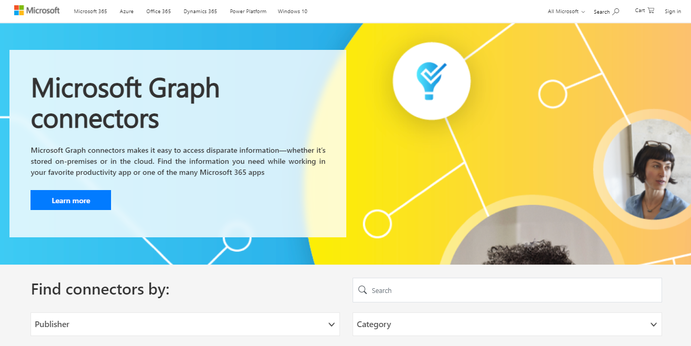

# Connectorkatalog für Microsoft Graph

Der [Connectorkatalog](http://www.microsoft.com/microsoft-search/connectors) für Microsoft Graph enthält eine kurze Beschreibung der einzelnen connectors, die von Microsoft und unseren Partnern erstellt wurden, sowie einen Link zur Website jedes Partners.

Mit mehr als 100 derzeit verfügbaren Connectors können Sie eine Verbindung mit beliebten Microsoft- und nicht-Microsoft-Dienste wie Azure-Diensten, Box, MediaWiki, ServiceNow, SalesForce, Google-Diensten, MediaWiki und vielem mehr herstellen.

Besuchen Sie jetzt den [Microsoft Graph Connectors-Katalog,](http://www.microsoft.com/microsoft-search/connectors) und suchen Sie alle benötigten Informationen.

 

