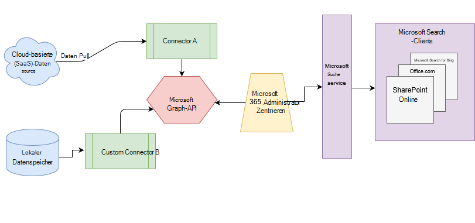

# Übersicht über Microsoft Graph-ConnectorsOverview of Microsoft Graph connectors

Microsoft Search indiziert alle Ihre [Microsoft 365](https://www.microsoft.com/microsoft-365) -Daten, damit Sie für Benutzer durchsucht werden können.Microsoft Search indexes all your [Microsoft 365](https://www.microsoft.com/microsoft-365) data to make it searchable for users. Mit Microsoft Graph Connectors kann Ihre Organisation Daten von Drittanbietern indizieren, die in den Ergebnissen von Microsoft Search angezeigt werden sollen.With Microsoft Graph connectors, your organization can index third-party data to appear in Microsoft Search results. Die drittanbieterdaten können lokal oder in öffentlichen oder privaten Clouds gehostet werden.The third-party data can be hosted on-premises or in the public or private clouds. Connectors erweitern Sie die Typen von Inhaltsquellen, die in Ihren Microsoft 365-Produktivitäts-apps und dem breiteren Microsoft-Ökosystem durchsucht werden können.Connectors expand the types of content sources that are searchable in your Microsoft 365 productivity apps and the broader Microsoft ecosystem.

> [!IMPORTANT]
> **Haftungsausschluss** : Microsoft Graph-Connectors und Microsoft Search-APIs (Abfrage und Index) sind derzeit im Vorschaustatus für Mandanten in der gezielten Version verfügbar.**DISCLAIMER** : Microsoft Graph connectors and Microsoft Search APIs (query and index) are currently in preview status available for tenants in Targeted release. Um Connectors mit Microsoft Search zu verwenden oder um Connectors zu erstellen, wählen Sie [Targeted Release](https://docs.microsoft.com/office365/admin/manage/release-options-in-office-365?view=o365-worldwide)aus.To use connectors with Microsoft Search or to build connectors, opt into [Targeted release](https://docs.microsoft.com/office365/admin/manage/release-options-in-office-365?view=o365-worldwide). Weitere Informationen zur Vorschau finden Sie unter [Connectors Preview Program](connectors-preview.md).To learn more about the preview, see [connectors preview program](connectors-preview.md).

## ArchitekturArchitecture

Das folgende Architekturdiagramm der Microsoft Graph-Plattform zeigt, wie der Connector-Inhalt durch die Inhaltsindizierung zu Benutzer Ergebnissen in [Microsoft Search](https://docs.microsoft.com/microsoftsearch/overview-microsoft-search) -Clients fließt.The following architectural diagram of the Microsoft Graph platform shows how connector content flows through content indexing to user results in [Microsoft Search](https://docs.microsoft.com/microsoftsearch/overview-microsoft-search) clients. In diesem Artikel werden die wichtigsten Bausteine im Datenfluss Prozess von Microsoft Graph Connectors erläutert.This article explains each of the key building blocks in the Microsoft Graph connectors data flow process.

Die API instanziiert eine Verbindung pro Datenquelle.The API instantiates one connection per data source. Anschließend werden die Daten von der API indiziert und gespeichert.Then the API indexes and stores the data. Hergestellte Verbindungen interagieren mit der Microsoft-Suche, sodass Benutzer Suchergebnisse abrufen können.Established connections interact with Microsoft Search, so users can get search results.

Sie können alle von Microsoft erstellten Connectors im Microsoft 365 [Admin Center](https://admin.microsoft.com)konfigurieren.You can configure all the Microsoft-built connectors in the Microsoft 365 [admin center](https://admin.microsoft.com). Das Admin Center vereinfacht die Konfiguration Ihres Connectors mit einer einfachen Benutzeroberfläche.The admin center simplifies configuring your connector with a simple user interface.

Um eine **Verbindung** mit einer Datenquelle herzustellen, benötigen Administratoren authentifizierten Zugriff auf die Daten und das gesamte Inhalts-Repository.To create a **connection** to a data source, admins need authenticated access to the data and the entire content repository. Die Daten werden für die Indizierung an den Graph Connector-Dienst zugeführt.The data is fed to the graph connector service for indexing.

## Verfügbare ConnectorsAvailable connectors

Es gibt derzeit 6 von Microsoft erstellte Connectors, und über 100-Connectors stehen in unseren Ecosystem-Partnern zur Verfügung.There are currently 6 Microsoft-built connectors, and over 100 connectors are available from our ecosystem partners.

Um eine Vorschau der Connectors von einem unserer Ecosystem-Partner anzuzeigen, wenden Sie sich direkt an Sie.To preview connectors from one of our ecosystem partners, contact them directly. Weitere Informationen finden Sie im [Microsoft Graph Connectors-Katalog](connectors-gallery.md).For more information, see the [Microsoft Graph connectors gallery](connectors-gallery.md).

Sie können auch [einen eigenen Connector erstellen](https://docs.microsoft.com/graph/search-concept-overview).You can also [build your own connector](https://docs.microsoft.com/graph/search-concept-overview).

### Connectors von MicrosoftConnectors by Microsoft

Die Microsoft Graph Connectors Preview-Version enthält 6 von Microsoft erstellte Connectors.The Microsoft Graph connectors preview release includes 6 Microsoft-built connectors. Sie können Sie im [Admin Center](https://admin.microsoft.com) einrichten und erfahren, wie Sie [ihren von Microsoft erstellten Connector](configure-connector.md)einrichten.You can set them up in the [admin center](https://admin.microsoft.com) and learn how to [Set up your Microsoft-built connector](configure-connector.md).

Die folgenden Abschnitte enthalten kurze Beschreibungen für diese von Microsoft erstellten Connectors.The following sections provide brief descriptions for these Microsoft-built connectors. Sie können weitere Informationen in den verknüpften Artikeln für jeden Connector erhalten.You can get more information in the linked articles for each connector.

- **[Azure Data Lake-Speicher Gen2](https://docs.microsoft.com/azure/storage/blobs/data-lake-storage-introduction)**.**[Azure Data Lake Storage Gen2](https://docs.microsoft.com/azure/storage/blobs/data-lake-storage-introduction)**. Mit diesem Microsoft Graph-Connector können Benutzer in Ihrer Organisation nach Dateien und Inhalten suchen, die in Azure-BLOB-Containern gespeichert sind.With this Microsoft Graph connector, users in your organization can search for files and content stored in Azure Blob containers. Der Azure Data Lake Storage Gen2-Connector indiziert auch Hierarchie fähige Ordner in Azure Data Lake-Speicher Gen2-Konten, die Sie angeben.The Azure Data Lake Storage Gen2 connector also indexes hierarchy-enabled folders in Azure Data Lake Storage Gen2 accounts that you specify.
Erfahren Sie mehr über den [Azure Data Lake-Speicher Gen2-Connector](azure-data-lake-connector.md).Learn more about the [Azure Data Lake Storage Gen2 connector](azure-data-lake-connector.md).

- **[Azure DevOps](https://azure.microsoft.com/services/devops)**.**[Azure DevOps](https://azure.microsoft.com/services/devops)**. Mit diesem Microsoft Graph-Connector können Benutzer in Ihrer Organisation in ihrer Azure DevOps-Instanz nach Arbeitsaufgaben suchen.With this Microsoft Graph connector, users in your organization can search for work items from your Azure DevOps instance.
Erfahren Sie mehr über den [Azure DevOps-Connector](azure-devops-connector.md).Learn more about the [Azure DevOps connector](azure-devops-connector.md).

- **[Azure SQL](https://azure.microsoft.com/services/sql-database)**.**[Azure SQL](https://azure.microsoft.com/services/sql-database)**. Mit diesem Microsoft Graph-Connector können Benutzer in Ihrer Organisation nach Daten aus ihrer Azure SQL-Datenbank suchen.With this Microsoft Graph connector, users in your organization can search for data from your Azure SQL database.
Erfahren Sie mehr über den [Azure SQL Connector](MSSQL-connector.md).Learn more about the [Azure SQL connector](MSSQL-connector.md).

- **Enterprise-Websites**.**Enterprise websites**. Mit diesem Microsoft Graph-Connector können Benutzer in Ihrer Organisation Seiten in einer nicht-SharePoint-Unternehmenswebsite durchsuchen.With this Microsoft Graph connector, users in your organization can search over pages in any non-SharePoint enterprise website.
Erfahren Sie mehr über den [Enterprise-Websites-Connector](enterprise-web-connector.md).Learn more about the [Enterprise websites connector](enterprise-web-connector.md).

- **[MediaWiki](https://www.mediawiki.org/wiki/MediaWiki)**.**[MediaWiki](https://www.mediawiki.org/wiki/MediaWiki)**. Mit diesem Microsoft Graph-Connector können Benutzer nach Knowledge-Base-Artikeln auf Wiki-Websites suchen, die Ihre Organisation mit MediaWiki erstellt.With this Microsoft Graph connector, users can search for knowledge-base articles on wiki sites your organization creates with MediaWiki.
Erfahren Sie mehr über den [MediaWiki-Connector](mediawiki-connector.md).Learn more about the [MediaWiki connector](mediawiki-connector.md).

- **[Microsoft SQL Server](https://www.microsoft.com/sql-server/sql-server-2017)**.**[Microsoft SQL server](https://www.microsoft.com/sql-server/sql-server-2017)**. Mit diesem Microsoft Graph-Connector können Benutzer in Ihrer Organisation nach Daten in lokalen SQL Server-Datenbanken suchen.With this Microsoft Graph connector, users in your organization can search for data in on-premises SQL server databases.
Erfahren Sie mehr über den [Microsoft SQL Server-Connector](MSSQL-connector.md).Learn more about the [Microsoft SQL server connector](MSSQL-connector.md).

- **[ServiceNow](https://www.servicenow.com)**.**[ServiceNow](https://www.servicenow.com)**. Mit diesem Microsoft Graph-Connector können Benutzer in Ihrer Organisation nach Knowledge Base-Artikeln aus ihrer ServiceNow-Instanz suchen.With this Microsoft Graph connector, users in your organization can search for knowledge-base articles from your ServiceNow instance.
Erfahren Sie mehr über den [ServiceNow-Connector](servicenow-connector.md).Learn more about the [ServiceNow connector](servicenow-connector.md).

### Connectors von unseren PartnernConnectors from our partners

Es stehen über 100 Connectors für die Vorschau von unseren Ecosystem-Partnern zur Verfügung.There are over 100 connectors available for preview from our ecosystem partners. Um eine Vorschau der Connectors von einem unserer Ecosystem-Partner anzuzeigen, wenden Sie sich direkt an Sie.To preview connectors from one of our ecosystem partners, contact them directly.
Erfahren Sie mehr über Connectors von unseren Partnern im [Microsoft Graph Connectors-Katalog](connectors-gallery.md).Learn more about connectors from our partners in the [Microsoft Graph connectors gallery](connectors-gallery.md).

### Erstellen eines eigenen ConnectorsBuild your own connector

Um benutzerdefinierte Datentypen oder Dateien zu indizieren, können Entwickler Connectors in [Microsoft Graph](https://developer.microsoft.com/graph/)erstellen.To index custom data types or files, developers can create connectors in [Microsoft Graph](https://developer.microsoft.com/graph/). Bei einem Connector handelt es sich um eine Anwendung, mit der [eine Verbindung erstellt](https://docs.microsoft.com/graph/search-index-manage-connections) und Elemente in den Microsoft Search-Index verschoben werden.A connector is an application that [creates a connection](https://docs.microsoft.com/graph/search-index-manage-connections) and pushes items into the Microsoft Search index. Weitere Informationen finden Sie in der [Übersicht zum Erweitern der Microsoft-Suchumgebung für apps in Microsoft Graph](https://docs.microsoft.com/graph/search-concept-overview).For more information, see the [Overview for extending the Microsoft Search experience for apps on Microsoft Graph](https://docs.microsoft.com/graph/search-concept-overview).

### Suchergebnisse mit Ihrem benutzerdefinierten ConnectorSearch results with your custom-built connector

Nachdem benutzerdefinierte Daten indiziert wurden, können Entwickler [diese Daten Abfragen](https://docs.microsoft.com/graph/search-concept-custom-types).After custom data is indexed, developers can [query this data](https://docs.microsoft.com/graph/search-concept-custom-types). Sie können Ihre Daten in einer beliebigen Anwendung anzeigen.You can view your data in any application. Weitere Informationen finden Sie in der [Übersicht zum Erweitern der Microsoft-Suchumgebung für apps in Microsoft Graph](https://docs.microsoft.com/graph/search-concept-overview).For more information, see the [Overview for extending the Microsoft Search experience for apps on Microsoft Graph](https://docs.microsoft.com/graph/search-concept-overview).

## LizenzanforderungenLicense requirements

Für Benutzer in Ihrer Organisation benötigen Sie eine gültige Microsoft 365-oder Office 365-Lizenz sowie ausreichende Graph-Konnektoren, um Daten aus Konnektoren in ihren Suchergebnissen anzuzeigen.You need a valid Microsoft 365 or Office 365 license and sufficient Graph Connectors quota for users in your organization to view data from connectors in their search results.

Weitere Informationen finden Sie unter [License Requirements and Pricing](licensing.md).To learn more, see [License requirements and pricing](licensing.md).