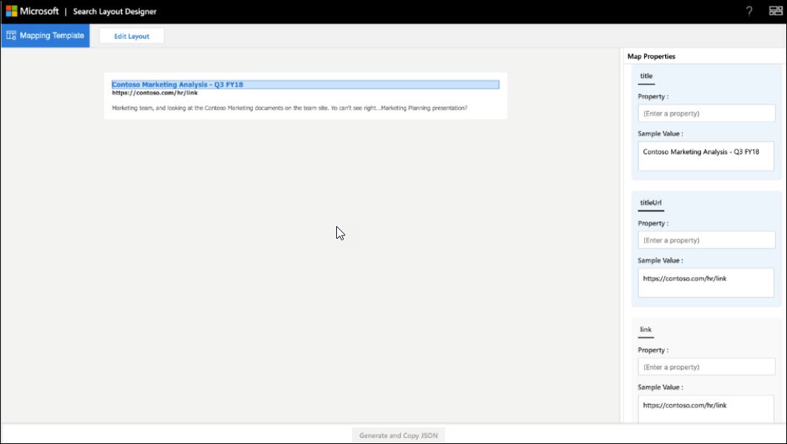

# <a name="create-a-layout-to-customize-search-results"></a><span data-ttu-id="396e4-103">Erstellen eines Layouts zum Anpassen von Suchergebnissen</span><span class="sxs-lookup"><span data-stu-id="396e4-103">Create a layout to customize search results</span></span>

<span data-ttu-id="396e4-104">Sie können das Ergebnis Layout für eine benutzerdefinierte vertikale mithilfe des Such Layout-Designers entwerfen.</span><span class="sxs-lookup"><span data-stu-id="396e4-104">You can design the result layout for a custom vertical using the search layout designer.</span></span> <span data-ttu-id="396e4-105">Sie können mit dem Entwurf des Layouts beginnen, indem Sie Vorlagen auswählen, die im Layout-Designer angeboten werden, und diese verwenden, wenn Sie Ihren Anforderungen entsprechen.</span><span class="sxs-lookup"><span data-stu-id="396e4-105">You can start designing the layout by choosing templates offered in the layout designer and using them if they fit your requirements.</span></span> <span data-ttu-id="396e4-106">Sie können diese Vorlagen auch auf verschiedene Arten bearbeiten, um Ihren Anforderungen zu entsprechen.</span><span class="sxs-lookup"><span data-stu-id="396e4-106">Or you can choose to edit these templates in various ways to fit your requirements.</span></span> <span data-ttu-id="396e4-107">Beispiel: Hinzufügen/Entfernen von Bildern, Hinzufügen/Entfernen von Text, Ändern von Text.</span><span class="sxs-lookup"><span data-stu-id="396e4-107">For example, add/remove images, add/remove text, modify text.</span></span> <span data-ttu-id="396e4-108">Wenn keine der Vorlagen Ihre Anforderung erfüllt, können Sie mit dem Entwerfen Ihres Layouts mit einer leeren Vorlage beginnen.</span><span class="sxs-lookup"><span data-stu-id="396e4-108">If none of the templates meet your requirement, you can choose to start designing your layout using a blank template.</span></span>  

 

<span data-ttu-id="396e4-109">Sobald das Layout abgeschlossen ist, verwenden Sie die [Vorlage Sprache für Adaptive Karten](https://docs.microsoft.com/adaptive-cards/templating/language) , um das Thea-Ergebnis Layout JSON zu erstellen, das zum Definieren eines Ergebnistyps verwendet wird.</span><span class="sxs-lookup"><span data-stu-id="396e4-109">Once the layout is ready, you use the [Adaptive Cards Template language](https://docs.microsoft.com/adaptive-cards/templating/language)  to create thea result layout JSON which is used to define a result type.</span></span> <span data-ttu-id="396e4-110">Sie ordnen die Ergebniseigenschaften dem Layout mithilfe des Zuordnungs Schritts im Layout-Designer zu.</span><span class="sxs-lookup"><span data-stu-id="396e4-110">You map the result properties to the layout using the Mapping step in the layout designer.</span></span>  

## <a name="create-a-layout-on-your-own"></a><span data-ttu-id="396e4-111">Erstellen eines Layouts auf eigene Faust</span><span class="sxs-lookup"><span data-stu-id="396e4-111">Create a layout on your own</span></span>
<span data-ttu-id="396e4-112">Das Erstellen eines Layouts auf eigene Faust erfordert Kenntnisse über [Adaptive Karten](https://docs.microsoft.com/adaptive-cards/authoring-cards/getting-started) und deren [Schema](https://adaptivecards.io/explorer/).</span><span class="sxs-lookup"><span data-stu-id="396e4-112">Creating a layout on your own requires knowledge of [adaptive cards](https://docs.microsoft.com/adaptive-cards/authoring-cards/getting-started) and their [schema](https://adaptivecards.io/explorer/).</span></span> <span data-ttu-id="396e4-113">Das Suchergebnislayout verwendet eine Teilmenge der Elemente, die von adaptiven Karten angeboten werden, und Sie können den Layout-Designer verwenden, um mehr über den unterstützten Satz von Elementen zu erfahren.</span><span class="sxs-lookup"><span data-stu-id="396e4-113">Search result layout uses a subset of the elements offered by adaptive cards and you can use the layout designer to learn about the supported set of elements.</span></span>  

<span data-ttu-id="396e4-114">Erstellen Sie beim Erstellen Ihres eigenen Layouts das Layout für die Adaptive Karte mithilfe von Daten aus dem, und schließen Sie dann das Layout ab.</span><span class="sxs-lookup"><span data-stu-id="396e4-114">While creating your own layout, create the adaptive card layout using data from your , and then finalize the layout.</span></span>
<span data-ttu-id="396e4-115">Es gibt zwei Hauptschritte beim Erstellen Ihres eigenen Layouts.</span><span class="sxs-lookup"><span data-stu-id="396e4-115">There are two main steps in creating your own layout</span></span>
- <span data-ttu-id="396e4-116">Entwerfen des Layouts</span><span class="sxs-lookup"><span data-stu-id="396e4-116">Designing the layout</span></span>
- <span data-ttu-id="396e4-117">Trennen der Daten von der Vorlage</span><span class="sxs-lookup"><span data-stu-id="396e4-117">Separating the data from the template</span></span>

#### <a name="designing-the-layout"></a><span data-ttu-id="396e4-118">Entwerfen des Layouts</span><span class="sxs-lookup"><span data-stu-id="396e4-118">Designing the layout</span></span>

<span data-ttu-id="396e4-119">In diesem Beispiel wird ein Layout mit einer Kopfzeile, einem Link und einem beschreibenden Text angezeigt.</span><span class="sxs-lookup"><span data-stu-id="396e4-119">In this example, we're showing a layout with a header, link, and descriptive text.</span></span>


<span data-ttu-id="396e4-121">Und hier ist die zugehörige JSON-Datei des Layouts:</span><span class="sxs-lookup"><span data-stu-id="396e4-121">And here's the layout's associated JSON file:</span></span>


```json
{ 
    "type": "AdaptiveCard", 
    "version": "1.0", 
     "body": [ 
{ 

            "type": "ColumnSet", 
             "columns": [ 
                 { 
                     "type": "Column", 
                     "width": 8, 
                     "items": [ 
                         { 
                             "type": "TextBlock", 
                             "text": "Contoso Marketing Analysis - Q3 FY18", 
                             "color": "Accent", 
                             "size": "Medium", 
                             "spacing": "None", 
                             "$when": "{title != \"\"}", 
                             "weight": "Bolder" 
                        }, 
                        { 
                        "type": "TextBlock",  
                        "text": "https://contoso.com/hr/link", 
                        "spacing": "None",  
                        "color": "Dark", 
                        "weight": "Bolder" 

                        }, 

                        {  
                        "type": "TextBlock", 
                        "text": "Marketing team at Contoso.., and looking at the Contoso Marketing documents on the team site. This contains the data from FY20 and will taken over to FY21...Marketing Planning is ongoing for FY20..",  
                        "wrap": true, 
                        "maxLines": 2, 
                        "spacing": "Medium" 
                        } 
                        ], 

                    "horizontalAlignment": "Center", 
                    "spacing": "None" 

                } 

            ] 

        } 
        ], 

    "$schema": "http://adaptivecards.io/schemas/adaptive-card.json" 
}
```

#### <a name="separating-the-data-from-the-layout"></a><span data-ttu-id="396e4-122">Trennen der Daten vom Layout</span><span class="sxs-lookup"><span data-stu-id="396e4-122">Separating the data from the layout</span></span>

<span data-ttu-id="396e4-123">Sie können die Daten vom Layout trennen und die Daten binden.</span><span class="sxs-lookup"><span data-stu-id="396e4-123">You can separate the data from the layout and bind the data.</span></span> 

<span data-ttu-id="396e4-124">Hier ist das Layout JSON nach dem Binden der Daten:</span><span class="sxs-lookup"><span data-stu-id="396e4-124">Here's Layout JSON after binding the data:</span></span>


```json
{ 

    "type": "AdaptiveCard", 
    "version": "1.0", 
    "body": [ 
    { 
    "type": "ColumnSet", 
"columns": [ 

                { 
                "type": "Column", 
                "width": 8, 
                "items": [ 
                { 
                "type": "TextBlock", 
                "text": "[{title}]({titleUrl})", 
                "color": "Accent", 
                "size": "Medium",
                "spacing": "None", 
                "weight": "Bolder" 

                 }, 
                 { 
                 "type": "TextBlock", 
                 "text": "{link}",
                 "spacing": "None", 
                 "color": "Dark",
                 "weight": "Bolder" 
                 }, 
                 { 
                 "type": "TextBlock",
                 "text": "{description}",
                 "wrap": true,
                 "maxLines": 2, 
                 "spacing": "Medium" 
                 } 
                 ], 
                 "horizontalAlignment": "Center", 
                 "spacing": "None" 
                 } 
                 ] 

        } 

    ], 

    "$schema": "http://adaptivecards.io/schemas/adaptive-card.json" 
}
```

<span data-ttu-id="396e4-125">Beispieldaten: Geben Sie Beispieldaten im **Beispieldaten Editor** an, um die datengebundene Karte im Vorschaumodus anzuzeigen.</span><span class="sxs-lookup"><span data-stu-id="396e4-125">Sample data: Specify sample data in the **Sample Data Editor** to view the data-bound card when in "Preview Mode".</span></span>

```json
{ 

    "title": "Contoso Marketing Analysis - Q3 FY18", 
    "titleUrl": "https://contoso.com/hr/link", 
    "link": "https://contoso.com/hr/link", 
    "description": "Marketing team, and looking at the Contoso Marketing documents on the team site. Yo can't see right...Marketing Planning presentation?" 

} 
```

## <a name="map-the-layout-to-the-result-properties"></a><span data-ttu-id="396e4-126">Zuordnen des Layouts zu den Ergebniseigenschaften</span><span class="sxs-lookup"><span data-stu-id="396e4-126">Map the layout to the result properties</span></span>

<span data-ttu-id="396e4-127">Sie müssen jedes Feld des Layouts einer Result-Eigenschaft oder einer Connector-Eigenschaft zuordnen, um das Ergebnis Layout JSON zu generieren.</span><span class="sxs-lookup"><span data-stu-id="396e4-127">You must map each field of the layout to a result property or a connector property to generate the result layout JSON.</span></span>



<span data-ttu-id="396e4-129">Wählen Sie ein Feld im Layout aus, um die Variablen hervorzuheben, die zugeordnet werden müssen.</span><span class="sxs-lookup"><span data-stu-id="396e4-129">Select a field in the layout to highlight the variables that need to be mapped.</span></span> <span data-ttu-id="396e4-130">Sie können mehrere Variablen für ein einzelnes Feld verwenden, und alle Felder müssen den Ergebniseigenschaften zugeordnet werden.</span><span class="sxs-lookup"><span data-stu-id="396e4-130">You can use multiple variables for a single field and all fields must be mapped to the result properties.</span></span>

## <a name="things-to-consider"></a><span data-ttu-id="396e4-131">Dinge, die Sie beachten sollten...</span><span class="sxs-lookup"><span data-stu-id="396e4-131">Things to consider...</span></span>

<span data-ttu-id="396e4-132">Bevor Sie beginnen, sollten Sie einige Dinge tun, die Sie vermeiden sollten, um sicherzustellen, dass Ihre Layouts erfolgreich sein werden.</span><span class="sxs-lookup"><span data-stu-id="396e4-132">Before you get started, there are a few things that you should do and a few things you should avoid to ensure that your layouts will be successful.</span></span>

### <a name="do"></a><span data-ttu-id="396e4-133">Dos</span><span class="sxs-lookup"><span data-stu-id="396e4-133">Do</span></span>

- <span data-ttu-id="396e4-134">Bearbeiten Sie eine Vorlage, um den Link Logo im Layout bereitzustellen, wenn Sie statische Links für Logos und keine Ergebniseigenschaften verwenden.</span><span class="sxs-lookup"><span data-stu-id="396e4-134">Edit a template to provide the logo link in the layout if you are using static links for logos and not result properties.</span></span>   
- <span data-ttu-id="396e4-135">Überprüfen Sie das Ergebnis Layout für Szenarien, in denen keine Daten für eine Result-Eigenschaft zurückgegeben werden, die in der Ergebnis-JSON verwendet wird.</span><span class="sxs-lookup"><span data-stu-id="396e4-135">Validate the result layout for scenarios where no data is returned for a result property used in the result JSON.</span></span> <span data-ttu-id="396e4-136">Verwenden `$when` Sie Condition, um ein Element auszublenden, wenn die Eigenschaft keine Daten enthält.</span><span class="sxs-lookup"><span data-stu-id="396e4-136">Use `$when` condition to hide an element if the property doesn't contain data.</span></span>  
- <span data-ttu-id="396e4-137">Stellen Sie sicher, dass die `$when` Datentypen der Bedingung und der Result-Eigenschaft übereinstimmen.</span><span class="sxs-lookup"><span data-stu-id="396e4-137">Make sure that data types of the `$when` condition and the result property match.</span></span> <span data-ttu-id="396e4-138">Vergleichen `Number` Sie beispielsweise nicht mit `Text` in `$when` Condition.</span><span class="sxs-lookup"><span data-stu-id="396e4-138">For example, don't compare `Number` with `Text` in `$when` condition.</span></span>  
- <span data-ttu-id="396e4-139">Denken Sie an Designanforderungen beim Entwerfen eines Ergebnis Layouts.</span><span class="sxs-lookup"><span data-stu-id="396e4-139">Think of theme requirements when designing a result layout.</span></span>  
- <span data-ttu-id="396e4-140">Stellen Sie sicher `Textblock`  , dass das Element dynamischen Inhalt verarbeiten kann.</span><span class="sxs-lookup"><span data-stu-id="396e4-140">Make sure that `Textblock` element can handle dynamic content.</span></span> <span data-ttu-id="396e4-141">Für diesen Zweck können `wrap` Sie `maxLines` die Eigenschaften und des-Elements verwenden.</span><span class="sxs-lookup"><span data-stu-id="396e4-141">You can use the `wrap` and `maxLines` element properties for this purpose.</span></span> 
- <span data-ttu-id="396e4-142">Formatieren Sie das Datum Ordnungs `{DATE()}` gemäß, wenn Sie in Abschlag verwenden.</span><span class="sxs-lookup"><span data-stu-id="396e4-142">Properly format the date when using `{DATE()}` in markdown.</span></span>  

### <a name="dont"></a><span data-ttu-id="396e4-143">Don’ts</span><span class="sxs-lookup"><span data-stu-id="396e4-143">Don't</span></span>

- <span data-ttu-id="396e4-144">Definieren Sie beim Binden von Werten keine ungültigen Datentypen.</span><span class="sxs-lookup"><span data-stu-id="396e4-144">Don't define invalid data types when binding values.</span></span> <span data-ttu-id="396e4-145">Weitere Informationen zu den Datentypen finden Sie unter [Verwalten des Suchschemas](https://docs.microsoft.com/sharepoint/search/manage-the-search-schema ).</span><span class="sxs-lookup"><span data-stu-id="396e4-145">For more information about the data types, see [Manage the Search schema](https://docs.microsoft.com/sharepoint/search/manage-the-search-schema ).</span></span>
- <span data-ttu-id="396e4-146">Vermeiden Sie das Zuschneiden des Ergebnisses auf der Ergebnisseite, indem Sie der maximalen Höhe des Ergebnis Layouts JSON folgen.</span><span class="sxs-lookup"><span data-stu-id="396e4-146">Avoid cropping the result on the result page by following the maximum height of the result layout JSON.</span></span> <span data-ttu-id="396e4-147">Wenn Sie die maximale Höhe des Ergebnis Layouts überschreiten, wird das Ergebnis auf der Ergebnisseite abgeschnitten.</span><span class="sxs-lookup"><span data-stu-id="396e4-147">If you exceed the maximum height of the result layout the result will be cropped on the result page.</span></span>
- <span data-ttu-id="396e4-148">Verwenden Sie `px` keine Werte in den Eigenschaften des Elements.</span><span class="sxs-lookup"><span data-stu-id="396e4-148">Don't use `px` values in properties of element.</span></span>


## <a name="resources"></a><span data-ttu-id="396e4-149">Ressourcen</span><span class="sxs-lookup"><span data-stu-id="396e4-149">Resources</span></span>
[<span data-ttu-id="396e4-150">Anpassen der Suchergebnisseite</span><span class="sxs-lookup"><span data-stu-id="396e4-150">Customize search result page</span></span>](customize-search-page.md)

[<span data-ttu-id="396e4-151">Adaptive Karten</span><span class="sxs-lookup"><span data-stu-id="396e4-151">Adaptive cards</span></span>](https://docs.microsoft.com/adaptive-cards/authoring-cards/getting-started)

[<span data-ttu-id="396e4-152">Vorlagensprache für Adaptive Karten</span><span class="sxs-lookup"><span data-stu-id="396e4-152">Adaptive Cards Template language</span></span>](https://docs.microsoft.com/adaptive-cards/templating/language)

[<span data-ttu-id="396e4-153">Adaptives Karten Schema</span><span class="sxs-lookup"><span data-stu-id="396e4-153">Adaptive card schema</span></span>](https://adaptivecards.io/explorer/)
