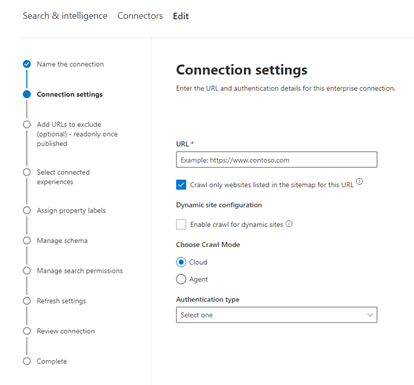

<!---Previous ms.author: monaray --->

<!-- markdownlint-disable no-inline-html -->

# Enterprise Websites Graph Connector

Der connector Enterprise Websites Graph ermöglicht Es Ihrer Organisation, Artikel und **Inhalte von den internen Websites** zu indizieren. Nachdem Sie den Connector konfiguriert und Inhalte von der Website synchronisiert haben, können Endbenutzer von einem beliebigen Microsoft Search Client nach diesen Inhalten suchen.

> [!NOTE]
> Lesen Sie den Artikel [**"Setup your Graph connector",**](configure-connector.md) um die allgemeinen Anweisungen zum Einrichten Graph Connectors zu verstehen.

Dieser Artikel richtet sich an alle Personen, die einen Enterprise Websites-Connector konfigurieren, ausführen und überwachen. Es ergänzt den allgemeinen Einrichtungsprozess und zeigt Anweisungen, die nur für den Connector für Enterprise Websites gelten. Dieser Artikel enthält auch Informationen zur [Problembehandlung](#troubleshooting) und [zu Einschränkungen.](#limitations)

<!---## Before you get started-->

<!---Insert "Before you get started" recommendations for this data source-->

## Schritt 1: Hinzufügen eines Graph Connectors im Microsoft 365 Admin Center

Folgen Sie den allgemeinen [Setupanweisungen.](./configure-connector.md)
<!---If the above phrase does not apply, delete it and insert specific details for your data source that are different from general setup instructions.-->

## Schritt 2: Benennen der Verbindung

Folgen Sie den allgemeinen [Setupanweisungen.](./configure-connector.md)
<!---If the above phrase does not apply, delete it and insert specific details for your data source that are different from general setup instructions.-->

## Schritt 3: Konfigurieren der Verbindungseinstellungen

Um eine Verbindung mit Ihrer Datenquelle herzustellen, geben Sie die Stamm-URL der Website ein, wählen Sie eine Durchforstungsquelle und den Authentifizierungstyp aus, den Sie verwenden möchten: Keine, Standardauthentifizierung oder OAuth 2.0 mit [Azure Active Directory (Azure AD).](/azure/active-directory/) Nachdem Sie diese Informationen abgeschlossen haben, wählen Sie "Verbindung testen" aus, um Ihre Einstellungen zu überprüfen.

### URL

Verwenden Sie das URL-Feld, um den Stamm der Website anzugeben, die Sie durchforsten möchten. Der Connector für Unternehmenswebsites verwendet diese URL als Ausgangspunkt und folgt allen Links aus dieser URL für die Durchforstung.

### In der Sitemap aufgelistete Durchforstungswebsites

Bei Auswahl des Connectors werden nur die in der Sitemap aufgeführten URLs durchforstet. Wenn keine Auswahl erfolgt oder keine Standortzuordnung gefunden wird, führt der Connector eine umfassende Durchforstung aller Links durch, die sich in der Stamm-URL der Website befinden.

> [!div class="mx-imgBorder"]
> 

### Durchforstungsmodus: Cloud oder lokal

Der Durchforstungsmodus bestimmt den Typ der Websites, die Sie indiziert möchten, entweder in der Cloud oder lokal. Wählen Sie für Ihre Cloudwebsites **"Cloud"** als Durchforstungsmodus aus.

Außerdem unterstützt der Connector jetzt das Durchforsten lokaler Websites. Um auf Ihre lokalen Daten zugreifen zu können, müssen Sie zuerst den Graph Connector-Agent installieren und konfigurieren. Weitere Informationen finden Sie unter [Graph Connector-Agent.](./on-prem-agent.md)

Wählen Sie für Ihre lokalen Websites den **Agent** als Durchforstungsmodus aus, und wählen Sie im Feld **"Lokaler Agent"** den Graph Connector-Agent aus, den Sie zuvor installiert und konfiguriert haben.  

### Authentifizierung

Die Standardauthentifizierung erfordert einen Benutzernamen und ein Kennwort. Erstellen Sie dieses Bot-Konto mithilfe der [Microsoft 365 Admin Center](https://admin.microsoft.com).

OAuth 2.0 mit [Azure AD](/azure/active-directory/) erfordert eine Ressourcen-ID, eine Client-ID und einen geheimen Clientschlüssel. OAuth 2.0 funktioniert nur im Cloudmodus.

Weitere Informationen finden Sie unter [Autorisieren des Zugriffs auf Azure Active Directory Webanwendungen mithilfe des OAuth 2.0-Codegenehmigungsflusses.](/azure/active-directory/develop/v1-protocols-oauth-code) Registrieren Sie sich mit den folgenden Werten:

**Name:** Microsoft Search  
**Redirect_URI:**`https://gcs.office.com/v1.0/admin/oauth/callback`

Um die Werte für die Ressource, client_id und client_secret abzurufen, wechseln Sie zu **Verwenden des Autorisierungscodes, um ein Zugriffstoken** auf der Umleitungs-URL-Webseite anzufordern.

Weitere Informationen finden Sie unter [Schnellstart: Registrieren einer Anwendung mit dem Microsoft Identity Platform.](/azure/active-directory/develop/quickstart-register-app)

## Schritt 3a: Hinzufügen von auszuschließenden URLs (optionale Durchforstungseinschränkungen)

Es gibt zwei Möglichkeiten, um zu verhindern, dass Seiten durchforstet werden: Verbieten Sie sie in Ihrer robots.txt-Datei, oder fügen Sie sie der Ausschlussliste hinzu.

### Unterstützung für robots.txt

Der Connector überprüft, ob eine robots.txt Datei für Ihre Stammwebsite vorhanden ist, und beachtet, falls vorhanden, die Anweisungen in dieser Datei. Wenn sie nicht möchten, dass der Connector bestimmte Seiten oder Verzeichnisse auf Ihrer Website durchforstet, können Sie diese Seiten oder Verzeichnisse in den "Disallow"-Deklarationen in Ihrer robots.txt-Datei aufrufen.

### Hinzufügen von AUSZUSCHLIEßENden URLs

Sie können optional eine **Ausschlussliste** erstellen, um einige URLs davon auszuschließen, durchforstet zu werden, wenn dieser Inhalt vertraulich oder nicht durchforstet werden sollte. Um eine Ausschlussliste zu erstellen, navigieren Sie durch die Stamm-URL. Sie können der Liste während des Konfigurationsprozesses die ausgeschlossenen URLs hinzufügen.

## Schritt 4: Zuweisen von Eigenschaftenbeschriftungen

Sie können jeder Bezeichnung eine Quelleigenschaft zuweisen, indem Sie aus einem Menü mit Optionen auswählen. Obwohl dieser Schritt nicht zwingend erforderlich ist, verbessert die Verwendung einiger Eigenschaftenbezeichnungen die Suchrelevanz und stellt genauere Suchergebnisse für Endbenutzer sicher.

## Schritt 5: Verwalten des Schemas

Auf dem Bildschirm **"Schema verwalten"** können Sie die Schemaattribute ändern (die Optionen sind **Abfrage,** **Suche,** **Abrufen** und **Verfeinern),** die den Eigenschaften zugeordnet sind, optionale Aliase hinzufügen und die **Inhaltseigenschaft** auswählen.

## Schritt 6: Verwalten von Suchberechtigungen

Der Connector Enterprise Websites unterstützt nur Suchberechtigungen, die **für "Jeder"** sichtbar sind. Indizierte Daten werden in den Suchergebnissen angezeigt und sind für alle Benutzer in der Organisation sichtbar.

## Schritt 7: Festlegen des Aktualisierungszeitplans

Der Connector Enterprise Websites unterstützt nur eine vollständige Aktualisierung. Dies bedeutet, dass der Connector während jeder Aktualisierung alle Inhalte der Website erneut durchforsten wird. Um sicherzustellen, dass der Connector genügend Zeit erhält, um den Inhalt zu durchforsten, wird empfohlen, ein großes Aktualisierungszeitplanintervall festzulegen. Wir empfehlen eine geplante Aktualisierung zwischen ein und zwei Wochen.

## Schritt 8: Überprüfen der Verbindung

Folgen Sie den allgemeinen [Setupanweisungen.](./configure-connector.md)
<!---If the above phrase does not apply, delete it and insert specific details for your data source that are different from general setup instructions.-->

## Problembehandlung

Beim Lesen des Inhalts der Website können bei der Durchforstung einige Quellfehler auftreten, die durch die folgenden detaillierten Fehlercodes dargestellt werden. Wenn Sie weitere Informationen zu den Fehlertypen erhalten möchten, wechseln Sie zur Seite mit den **Fehlerdetails,** nachdem Sie die Verbindung ausgewählt haben. Wählen Sie den **Fehlercode** aus, um ausführlichere Fehler anzuzeigen. Weitere Informationen finden Sie unter ["Connector verwalten".](./manage-connector.md)

 Detaillierter Fehlercode | Fehlermeldung
 --- | ---
 6001 | Die Website, die indiziert werden soll, ist nicht erreichbar.
 6005 | Die Quellseite, die indiziert werden soll, wurde gemäß robots.txt Konfiguration blockiert.
 6008 | DNS kann nicht aufgelöst werden
 6009 | Ausführliche Informationen zu allen clientseitigen Fehlern (außer HTTP 404, 408) finden Sie unter HTTP 4xx-Fehlercodes.
 6013 | Die Quellseite, die indiziert werden soll, konnte nicht gefunden werden. (HTTP 404-Fehler)
 6018 | Die Quellseite antwortet nicht, und für die Anforderung ist ein Timeout aufgetreten. (HTTP 408-Fehler)
 6021 | Die Quellseite, die indiziert werden soll, enthält keinen Textinhalt auf der Seite.
 6023 | Die Quellseite, die indiziert werden soll, wird nicht unterstützt (keine HTML-Seite)
 6024 | Die Quellseite, die indiziert werden soll, weist nicht unterstützte Inhalte auf.

* Fehler 6001-6013 treten auf, wenn die Datenquelle aufgrund eines Netzwerkproblems nicht erreichbar ist oder wenn die Datenquelle selbst gelöscht, verschoben oder umbenannt wird. Überprüfen Sie, ob die angegebenen Datenquellendetails weiterhin gültig sind.
* Fehler 6021-6024 treten auf, wenn die Datenquelle nicht textbezogene Inhalte auf der Seite enthält oder wenn die Seite kein HTML-Code ist. Überprüfen Sie die Datenquelle, und fügen Sie diese Seite in der Ausschlussliste hinzu, oder ignorieren Sie den Fehler.

## Einschränkungen

Der Connector Enterprise Websites unterstützt das Durchsuchen von Daten auf **dynamischen Webseiten** nicht. Beispiele für diese Webseiten befinden sich in Inhaltsverwaltungssystemen wie [Confluence](https://www.atlassian.com/software/confluence) und [Unily](https://www.unily.com/) oder Datenbanken, die Websiteinhalte speichern.