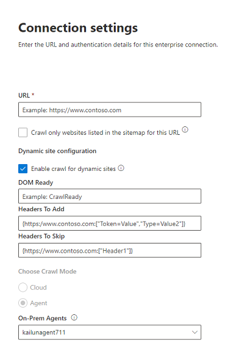

<!---Previous ms.author: monaray --->

<!-- markdownlint-disable no-inline-html -->

# Enterprise Websites Graph ConnectorEnterprise websites Graph connector

Der Connector Enterprise Websites Graph ermöglicht Es Ihrer Organisation, Artikel und **Inhalte von den internen Websites** zu indizieren.The Enterprise websites Graph connector allows your organization to index articles and **content from its internal-facing websites**. Nachdem Sie den Connector konfiguriert und Inhalte von der Website synchronisiert haben, können Endbenutzer von jedem Microsoft Search Client nach diesen Inhalten suchen.After you configure the connector and sync content from the website, end users can search for that content from any Microsoft Search client.

> [!NOTE]
> Lesen Sie den Artikel [**"Setup your Graph connector",**](configure-connector.md) um die allgemeinen Anweisungen zum Einrichten von Connectors Graph zu verstehen.Read the [**Setup your Graph connector**](configure-connector.md) article to understand the general Graph connectors setup instructions.

Dieser Artikel richtet sich an alle Personen, die einen Enterprise Websites-Connector konfigurieren, ausführen und überwachen.This article is for anyone who configures, runs, and monitors an Enterprise websites connector. Es ergänzt den allgemeinen Einrichtungsprozess und zeigt Anweisungen, die nur für den Connector für Enterprise Websites gelten.It supplements the general setup process, and shows instructions that apply only for the Enterprise websites connector. Dieser Artikel enthält auch Informationen zur [Problembehandlung.](#troubleshooting)This article also includes information about [Troubleshooting](#troubleshooting).

<!---## Before you get started-->

<!---Insert "Before you get started" recommendations for this data source-->

## Schritt 1: Hinzufügen eines Graph Connectors im Microsoft 365 Admin CenterStep 1: Add a Graph connector in the Microsoft 365 admin center

Folgen Sie den allgemeinen [Setupanweisungen.](./configure-connector.md)Follow the general [setup instructions](./configure-connector.md).
<!---If the above phrase does not apply, delete it and insert specific details for your data source that are different from general setup instructions.-->

## Schritt 2: Benennen der VerbindungStep 2: Name the connection

Folgen Sie den allgemeinen [Setupanweisungen.](./configure-connector.md)Follow the general [setup instructions](./configure-connector.md).
<!---If the above phrase does not apply, delete it and insert specific details for your data source that are different from general setup instructions.-->

## Schritt 3: Konfigurieren der VerbindungseinstellungenStep 3: Configure the connection settings

Um eine Verbindung mit Ihrer Datenquelle herzustellen, geben Sie die Stamm-URL der Website ein, wählen Sie eine Durchforstungsquelle und den Authentifizierungstyp aus, den Sie verwenden möchten: Keine, Standardauthentifizierung oder OAuth 2.0 mit [Azure Active Directory (Azure AD).](/azure/active-directory/)To connect to your data source, fill in the root URL of the website, select a crawl source, and the type of authentication you'd like to use: None, Basic Authentication, or OAuth 2.0 with [Azure Active Directory (Azure AD)](/azure/active-directory/). Nachdem Sie diese Informationen abgeschlossen haben, wählen Sie "Verbindung testen" aus, um Ihre Einstellungen zu überprüfen.After you complete this information, select Test Connection to verify your settings.

### URLURL

Verwenden Sie das URL-Feld, um den Stamm der Website anzugeben, die Sie durchforsten möchten.Use the URL field to specify the root of the website that you'd like to crawl. Der Connector für Unternehmenswebsites verwendet diese URL als Ausgangspunkt und folgt allen Links aus dieser URL für die Durchforstung.The enterprise websites connector will use this URL as the starting point and follow all the links from this URL for its crawl.

### In der Sitemap aufgelistete DurchforstungswebsitesCrawl websites listed in the sitemap

Bei Auswahl des Connectors werden nur die in der Sitemap aufgeführten URLs durchforstet.When selected the connector will only crawl the URLs listed in the sitemap. Wenn keine Auswahl erfolgt oder keine Standortzuordnung gefunden wird, führt der Connector eine umfassende Durchforstung aller Links durch, die sich in der Stamm-URL der Website befinden.If not selected or no site map is found, the connector will do a deep crawl of all the links found on the root URL of the site.

### Dynamische StandortkonfigurationDynamic site configuration

Wenn Ihre Website dynamische Inhalte enthält, z. B. Webseiten, die sich in Inhaltsverwaltungssystemen wie Confluence oder Unily befinden, können Sie einen dynamischen Crawler aktivieren.If your website contains dynamic content, for example, webpages that live in content management systems like Confluence or Unily, you can enable a dynamic crawler. Wählen Sie zum Aktivieren die Option **"Durchforstung für dynamische Websites aktivieren"** aus.To turn it on, select **Enable crawl for dynamic sites**. Der Crawler wartet auf das Rendern dynamischer Inhalte, bevor er mit der Durchforstung beginnt.The crawler will wait for dynamic content to render before it begins crawling.

> [!div class="mx-imgBorder"]
> 

Zusätzlich zum Kontrollkästchen sind drei optionale Felder verfügbar:In addition to the check box, there are three optional fields available:

1. **DOM Ready:** Geben Sie das DOM-Element ein, das der Crawler als Signal verwenden soll, dass der Inhalt vollständig gerendert wird und die Durchforstung beginnen soll.**DOM Ready**: Enter the DOM element the crawler should use as the signal that the content is fully rendered and the crawl should begin.
1. **Hinzuzufügende Header:** Geben Sie an, welche HTTP-Header der Crawler beim Senden dieser bestimmten Web-URL enthalten soll.**Headers to Add**: Specify which HTTP headers the crawler should include when sending that specific web URL. Sie können mehrere Kopfzeilen für unterschiedliche Websites festlegen.You can set multiple headers for different websites. Es wird empfohlen, Authentifizierungstokenwerte hinzuzufügen.We suggest including auth token values.
1. **Zu überspringende Header:** Geben Sie alle unnötigen Header an, die von dynamischen Durchforstungsanforderungen ausgeschlossen werden sollen.**Headers to Skip**: Specify any unnecessary headers that should be excluded from dynamic crawling requests.

> [!NOTE]
> Dynamische Durchforstung wird nur für den Agent-Durchforstungsmodus unterstützt.Dynamic crawling is only supported for Agent crawl mode.

### Durchforstungsmodus: Cloud oder lokalCrawl mode: Cloud or On-premises

Der Durchforstungsmodus bestimmt den Typ der Websites, die Sie indiziert möchten, entweder in der Cloud oder lokal.The crawl mode determines the type of websites you want to index, either cloud or on-premises. Wählen Sie für Ihre Cloudwebsites **"Cloud"** als Durchforstungsmodus aus.For your cloud websites, select **Cloud** as the crawl mode.

Außerdem unterstützt der Connector jetzt das Durchforsten lokaler Websites.Also, the connector now supports crawling of on-premises websites. Um auf Ihre lokalen Daten zugreifen zu können, müssen Sie zuerst den Graph Connector-Agent installieren und konfigurieren.To access your on-premises data, you must first install and configure the Graph connector agent. Weitere Informationen finden Sie unter [Graph Connector-Agent.](./on-prem-agent.md)To learn more, see [Graph connector agent](./on-prem-agent.md).

Wählen Sie für Ihre lokalen Websites **den Agent** als Durchforstungsmodus aus, und wählen Sie im Feld **"Lokaler Agent"** den Graph Connector-Agent aus, den Sie zuvor installiert und konfiguriert haben.For your on-premises websites, select **Agent** as the crawl mode and in the **On-prem Agent** field, choose the Graph connector agent that you installed and configured earlier.  

### AuthentifizierungAuthentication

Die Standardauthentifizierung erfordert einen Benutzernamen und ein Kennwort.Basic Authentication requires a username and password. Erstellen Sie dieses Bot-Konto mithilfe der [Microsoft 365 Admin Center](https://admin.microsoft.com).Create this bot account by using the [Microsoft 365 admin center](https://admin.microsoft.com).

OAuth 2.0 mit [Azure AD](/azure/active-directory/) erfordert eine Ressourcen-ID, eine Client-ID und einen geheimen Clientschlüssel.OAuth 2.0 with [Azure AD](/azure/active-directory/) requires a resource ID, Client ID, and Client Secret. OAuth 2.0 funktioniert nur im Cloudmodus.OAuth 2.0 only works with Cloud mode.

Weitere Informationen finden Sie unter [Autorisieren des Zugriffs auf Azure Active Directory Webanwendungen mithilfe des OAuth 2.0-Codegenehmigungsflusses.](/azure/active-directory/develop/v1-protocols-oauth-code)For more information, see [Authorize access to Azure Active Directory web applications using OAuth 2.0 code grant flow](/azure/active-directory/develop/v1-protocols-oauth-code). Registrieren Sie sich mit den folgenden Werten:Register with the following values:

**Name:** Microsoft Search**Name:** Microsoft Search  
**Redirect_URI:**`https://gcs.office.com/v1.0/admin/oauth/callback`**Redirect_URI:** `https://gcs.office.com/v1.0/admin/oauth/callback`

Um die Werte für die Ressource, client_id und client_secret abzurufen, wechseln Sie zu **Verwenden des Autorisierungscodes, um ein Zugriffstoken** auf der Umleitungs-URL-Webseite anzufordern.To get the values for the resource, client_id, and client_secret, go to **Use the authorization code to request an access token** on the redirect URL webpage.

Weitere Informationen finden Sie unter [Schnellstart: Registrieren einer Anwendung mit dem Microsoft Identity Platform.](/azure/active-directory/develop/quickstart-register-app)For even more information, see [Quickstart: Register an application with the Microsoft identity platform](/azure/active-directory/develop/quickstart-register-app).

## Schritt 3a: Hinzufügen von auszuschließenden URLs (optionale Durchforstungseinschränkungen)Step 3a: Add URLs to exclude (Optional crawl restrictions)

Es gibt zwei Möglichkeiten, um zu verhindern, dass Seiten durchforstet werden: Verbieten Sie sie in Ihrer robots.txt-Datei, oder fügen Sie sie der Ausschlussliste hinzu.There are two ways to prevent pages from being crawled: disallow them in your robots.txt file or add them to the Exclusion list.

### Unterstützung für robots.txtSupport for robots.txt

Der Connector überprüft, ob eine robots.txt Datei für Ihre Stammwebsite vorhanden ist, und beachtet, falls vorhanden, die Anweisungen in dieser Datei.The connector checks to see if there is a robots.txt file for your root site and, if one exists, it will follow and respect the directions found within that file. Wenn Sie nicht möchten, dass der Connector bestimmte Seiten oder Verzeichnisse auf Ihrer Website durchforstet, können Sie diese Seiten oder Verzeichnisse in den "Disallow"-Deklarationen in Ihrer robots.txt-Datei aufrufen.If you do not want the connector to crawl certain pages or directories on your site, you can call out those pages or directories in the "Disallow" declarations in your robots.txt file.

### Hinzufügen von AUSZUSCHLIEßENden URLsAdd URLs to exclude

Sie können optional eine **Ausschlussliste** erstellen, um einige URLs davon auszuschließen, durchforstet zu werden, wenn dieser Inhalt vertraulich oder nicht durchforstet werden sollte.You can optionally create an **Exclusion list** to exclude some URLs from getting crawled if that content is sensitive or not worth crawling. Um eine Ausschlussliste zu erstellen, navigieren Sie durch die Stamm-URL.To create an exclusion list, browse through the root URL. Sie können der Liste während des Konfigurationsprozesses die ausgeschlossenen URLs hinzufügen.You can add the excluded URLs to the list during the configuration process.

## Schritt 4: Zuweisen von EigenschaftenbeschriftungenStep 4: Assign property labels

Sie können jeder Bezeichnung eine Quelleigenschaft zuweisen, indem Sie aus einem Menü mit Optionen auswählen.You can assign a source property to each label by choosing from a menu of options. Obwohl dieser Schritt nicht obligatorisch ist, verbessert die Verwendung einiger Eigenschaftenbezeichnungen die Suchrelevanz und stellt genauere Suchergebnisse für Endbenutzer sicher.While this step isn't mandatory, having some property labels will improve the search relevance and ensure more accurate search results for end users.

## Schritt 5: Verwalten des SchemasStep 5: Manage schema

Auf dem Bildschirm **"Schema verwalten"** können Sie die Schemaattribute ändern (die Optionen sind **Abfrage,** **Suche,** **Abrufen** und **Verfeinern),** die den Eigenschaften zugeordnet sind, optionale Aliase hinzufügen und die **Inhaltseigenschaft** auswählen.On the **Manage Schema** screen, you can change the schema attributes (the options are **Query**, **Search**, **Retrieve**, and **Refine**) associated with the properties, add optional aliases, and choose the **Content** property.

## Schritt 6: Verwalten von SuchberechtigungenStep 6: Manage search permissions

Der Connector Enterprise Websites unterstützt nur Suchberechtigungen, die **für "Jeder"** sichtbar sind.The Enterprise websites connector only supports search permissions visible to **Everyone**. Indizierte Daten werden in den Suchergebnissen angezeigt und sind für alle Benutzer in der Organisation sichtbar.Indexed data appears in the search results and is visible to all users in the organization.

## Schritt 7: Festlegen des AktualisierungszeitplansStep 7: Set the refresh schedule

Der Connector Enterprise Websites unterstützt nur eine vollständige Aktualisierung.The Enterprise websites connector only supports a full refresh. Dies bedeutet, dass der Connector während jeder Aktualisierung alle Inhalte der Website erneut durchforsten wird.This means that the connector will recrawl all the website's content during every refresh. Um sicherzustellen, dass der Connector genügend Zeit erhält, um den Inhalt zu durchforsten, wird empfohlen, ein großes Aktualisierungszeitplanintervall festzulegen.To make sure the connector gets enough time to crawl the content, we recommend that you set a large refresh schedule interval. Wir empfehlen eine geplante Aktualisierung zwischen ein und zwei Wochen.We recommend a scheduled refresh between one and two weeks.

## Schritt 8: Überprüfen der VerbindungStep 8: Review connection

Folgen Sie den allgemeinen [Setupanweisungen.](./configure-connector.md)Follow the general [setup instructions](./configure-connector.md).
<!---If the above phrase does not apply, delete it and insert specific details for your data source that are different from general setup instructions.-->

## ProblembehandlungTroubleshooting

Beim Lesen des Inhalts der Website können bei der Durchforstung einige Quellfehler auftreten, die durch die folgenden detaillierten Fehlercodes dargestellt werden.When reading the website's content, the crawl may encounter some source errors, which are represented by the detailed error codes below. Wenn Sie weitere Informationen zu den Fehlertypen erhalten möchten, wechseln Sie zur Seite mit den **Fehlerdetails,** nachdem Sie die Verbindung ausgewählt haben.To get more information on the types of errors, go to the **error details** page after selecting the connection. Wählen Sie den **Fehlercode** aus, um ausführlichere Fehler anzuzeigen.Select the **error code** to see more detailed errors. Weitere Informationen finden Sie unter ["Connector verwalten".](./manage-connector.md)Also refer to [Manage your connector](./manage-connector.md) to learn more.

 Detaillierter FehlercodeDetailed Error code | FehlermeldungError message
 --- | ---
 60016001 | Die Website, die indiziert werden soll, ist nicht erreichbar.The site that is being tried to index is not reachable
 60056005 | Die Quellseite, die indiziert werden soll, wurde gemäß robots.txt Konfiguration blockiert.The source page that is being tried to index has been blocked by as per robots.txt configuration.
 60086008 | DNS kann nicht aufgelöst werdenUnable to resolve the DNS
 60096009 | Ausführliche Informationen zu allen clientseitigen Fehlern (außer HTTP 404, 408) finden Sie unter HTTP 4xx-Fehlercodes.For all client-side errors (Except HTTP 404, 408), refer to HTTP 4xx error codes for details.
 60136013 | Die Quellseite, die indiziert werden soll, konnte nicht gefunden werden.The source page that is being tried to index could not be found. (HTTP 404-Fehler)(HTTP 404 error)
 60186018 | Die Quellseite antwortet nicht, und für die Anforderung ist ein Timeout aufgetreten. (HTTP 408-Fehler)The source page is not responding, and the request has timed out. (HTTP 408 error)
 60216021 | Die Quellseite, die indiziert werden soll, weist keinen Textinhalt auf der Seite auf.The source page that is being tried to index has no textual content on the page.
 60236023 | Die Quellseite, die indiziert werden soll, wird nicht unterstützt (keine HTML-Seite)The source page that is being tried to index is unsupported (not an HTML page)
 60246024 | Die Quellseite, die indiziert werden soll, weist nicht unterstützte Inhalte auf.The source page that is being tried to index has unsupported content.

* Fehler 6001-6013 treten auf, wenn die Datenquelle aufgrund eines Netzwerkproblems nicht erreichbar ist oder wenn die Datenquelle selbst gelöscht, verschoben oder umbenannt wird.Errors 6001-6013 occur when the data source is not reachable due to a network issue or when the data source itself is deleted, moved, or renamed. Überprüfen Sie, ob die angegebenen Datenquellendetails weiterhin gültig sind.Check if the data source details provided are still valid.
* Fehler 6021-6024 treten auf, wenn die Datenquelle nicht textbezogene Inhalte auf der Seite enthält oder wenn die Seite kein HTML-Code ist.Errors 6021-6024 occur when the data source contains non-textual content on the page or when the page is not an HTML. Überprüfen Sie die Datenquelle, und fügen Sie diese Seite in der Ausschlussliste hinzu, oder ignorieren Sie den Fehler.Check the data source and add this page in exclusion list or ignore the error.
