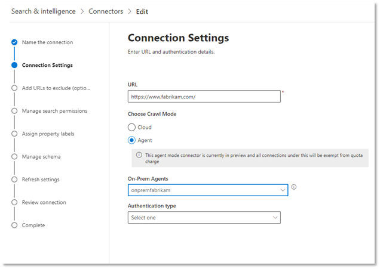

<!---Previous ms.author: monaray --->

<!-- markdownlint-disable no-inline-html -->

# Graph-Connector für UnternehmenswebsitesEnterprise websites Graph connector

Der Graph-Connector für Unternehmenswebsites ermöglicht Ihrer Organisation das Indizieren von Artikeln und Inhalten von internen **Websites.**The Enterprise websites Graph connector allows your organization to index articles and **content from its internal-facing websites**. Nachdem Sie den Connector konfiguriert und Inhalte von der Website synchronisiert haben, können Endbenutzer über einen beliebigen Microsoft Search-Client nach diesem Inhalt suchen.After you configure the connector and sync content from the website, end users can search for that content from any Microsoft Search client.

> [!NOTE]
> Lesen Sie [**den Artikel Setup your Graph connector,**](configure-connector.md) um die allgemeinen Anweisungen zum Einrichten von Graph Connectors zu verstehen.Read the [**Setup your Graph connector**](configure-connector.md) article to understand the general Graph connectors setup instructions.

Dieser Artikel ist für jeden benutzer, der einen Connector für Unternehmenswebsites konfiguriert, ausgeführt und überwacht.This article is for anyone who configures, runs, and monitors an Enterprise websites connector. Es ergänzt den allgemeinen Einrichtungsprozess und zeigt Anweisungen, die nur für den Enterprise-Websiteconnector gelten.It supplements the general setup process, and shows instructions that apply only for the Enterprise websites connector. Dieser Artikel enthält auch Informationen zur [Problembehandlung und](#troubleshooting) [Einschränkungen](#limitations).This article also includes information about [Troubleshooting](#troubleshooting) and [Limitations](#limitations).

<!---## Before you get started-->

<!---Insert "Before you get started" recommendations for this data source-->

## Schritt 1: Hinzufügen eines Graph-Connectors im Microsoft 365 Admin CenterStep 1: Add a Graph connector in the Microsoft 365 admin center

Befolgen Sie die [allgemeinen Setupanweisungen](https://docs.microsoft.com/microsoftsearch/configure-connector).Follow the general [setup instructions](https://docs.microsoft.com/microsoftsearch/configure-connector).
<!---If the above phrase does not apply, delete it and insert specific details for your data source that are different from general setup instructions.-->

## Schritt 2: Benennen der VerbindungStep 2: Name the connection

Befolgen Sie die [allgemeinen Setupanweisungen](https://docs.microsoft.com/microsoftsearch/configure-connector).Follow the general [setup instructions](https://docs.microsoft.com/microsoftsearch/configure-connector).
<!---If the above phrase does not apply, delete it and insert specific details for your data source that are different from general setup instructions.-->

## Schritt 3: Konfigurieren der VerbindungseinstellungenStep 3: Configure the connection settings

Um eine Verbindung mit Ihrer Datenquelle herzustellen, müssen Sie die Stamm-URL der Website eingeben, eine Durchforstungsquelle und den Authentifizierungstyp auswählen, den Sie verwenden möchten: Keine, Standardauthentifizierung oder OAuth 2.0 mit [Azure Active Directory (Azure AD).](https://docs.microsoft.com/azure/active-directory/)To connect to your data source, you need to fill in the root URL of the website, select a crawl source, and the type of authentication you'd like to use: None, Basic Authentication, or OAuth 2.0 with [Azure Active Directory (Azure AD)](https://docs.microsoft.com/azure/active-directory/). Nachdem Sie diese Informationen abgeschlossen haben, wählen Sie Verbindung testen aus, um Ihre Einstellungen zu überprüfen.After you complete this information, select Test Connection to verify your settings.

### URLURL

Verwenden Sie das Feld URL, um den Stamm der Website anzugeben, die Sie durchforsten möchten.Use the URL field to specify the root of the website that you'd like to crawl. Der Connector für Unternehmenswebsites verwendet diese URL als Ausgangspunkt und folgt allen Links aus dieser URL für die Durchforstung.The enterprise websites connector will use this URL as the starting point and follow all the links from this URL for its crawl.

> [!NOTE]
> Wenn für die Website, die Sie durchforsten möchten, eine Sitemap definiert ist, durchforstet der Connector nur die URLs, die in der Sitemap aufgeführt sind.If the site you want to crawl has a sitemap defined, the connector will only crawl the URLs listed in the sitemap. Wenn keine Sitemap definiert ist, durchforstet der Connector alle Links, die auf der Stamm-URL der Website gefunden wurden, tief.If no sitemap is defined, the connector will do a deep crawl of all the links found on the root URL of the site.

### Durchforstungsmodus: Cloud oder Lokal (Vorschau)Crawl mode: Cloud or On-premises (Preview)

Der Durchforstungsmodus bestimmt den Typ der Websites, die Sie indizieren möchten, entweder in der Cloud oder lokal.The crawl mode determines the type of websites you want to index, either cloud or on-premises. Wählen Sie für Ihre Cloudwebsites **Cloud** als Durchforstungsmodus aus.For your cloud websites, select **Cloud** as the crawl mode.

Darüber hinaus unterstützt der Connector jetzt das Crawlen von lokalen Websites.Also, the connector now supports crawling of on-premises websites. Dieser Modus befindet sich in der Vorschau.This mode is in preview. Um auf Ihre lokalen Daten zu zugreifen, müssen Sie zuerst den Graph-Connector-Agent installieren und konfigurieren.To access your on-premises data, you must first install and configure the Graph connector agent. Weitere Informationen finden Sie unter [Graph Connector Agent](https://docs.microsoft.com/microsoftsearch/on-prem-agent).To learn more, see [Graph connector agent](https://docs.microsoft.com/microsoftsearch/on-prem-agent).

Wählen Sie für Ihre lokalen Websites **Agent** als Durchforstungsmodus aus, und wählen Sie im Feld **On-Prem Agent** den Graph-Connector-Agent aus, den Sie zuvor installiert und konfiguriert haben.For your on-premises websites, select **Agent** as the crawl mode and in the **On-Prem Agent** field, choose the Graph connector agent that you installed and configured earlier.  

> [!div class="mx-imgBorder"]
> 

### AuthentifizierungAuthentication

Die Standardauthentifizierung erfordert einen Benutzernamen und ein Kennwort.Basic Authentication requires a username and password. Erstellen Sie dieses Botkonto mithilfe des [Microsoft 365 Admin Centers](https://admin.microsoft.com).Create this bot account by using the [Microsoft 365 admin center](https://admin.microsoft.com).

OAuth 2.0 mit [Azure AD](https://docs.microsoft.com/azure/active-directory/) erfordert eine Ressourcen-ID, Eine Client-ID und einen geheimen Clientgeheimnis.OAuth 2.0 with [Azure AD](https://docs.microsoft.com/azure/active-directory/) requires a resource ID, Client ID, and Client Secret. OAuth 2.0 funktioniert nur im Cloudmodus.OAuth 2.0 only works with Cloud mode.

Weitere Informationen finden Sie unter [Authorize access to Azure Active Directory web applications using OAuth 2.0 code grant flow](https://docs.microsoft.com/azure/active-directory/develop/v1-protocols-oauth-code).For more information, see [Authorize access to Azure Active Directory web applications using OAuth 2.0 code grant flow](https://docs.microsoft.com/azure/active-directory/develop/v1-protocols-oauth-code). Registrieren Sie sich mit den folgenden Werten:Register with the following values:

**Name:** Microsoft Search**Name:** Microsoft Search  
**Redirect_URI:**`https://gcs.office.com/v1.0/admin/oauth/callback`**Redirect_URI:** `https://gcs.office.com/v1.0/admin/oauth/callback`

Um die Werte für die Ressource, client_id und client_secret abzurufen, wechseln Sie zu Verwenden des Autorisierungscodes zum Anfordern eines Zugriffstokens auf der Umleitungs-URL-Webseite. To get the values for the resource, client_id, and client_secret, go to **Use the authorization code to request an access token** on the redirect URL webpage.

Weitere Informationen finden Sie unter [Schnellstart: Registrieren einer](https://docs.microsoft.com/azure/active-directory/develop/quickstart-register-app)Anwendung bei der Microsoft Identity Platform .For even more information, see [Quickstart: Register an application with the Microsoft identity platform](https://docs.microsoft.com/azure/active-directory/develop/quickstart-register-app).

## Schritt 3a: Hinzufügen von auszuschließender URLs (Optionale Durchforstungseinschränkungen)Step 3a: Add URLs to exclude (Optional crawl restrictions)

Es gibt zwei Möglichkeiten, das Crawlen von Seiten zu verhindern: Sie können sie nicht in Ihrer robots.txt oder der Ausschlussliste hinzufügen.There are two ways to prevent pages from being crawled: disallow them in your robots.txt file or add them to the Exclusion list.

### Unterstützung für robots.txtSupport for robots.txt

Der Connector überprüft, ob eine robots.txt für Ihre Stammwebsite vorhanden ist, und, falls vorhanden, folgt und respektiert die Anweisungen, die in dieser Datei gefunden wurden.The connector checks to see if there is a robots.txt file for your root site and, if one exists, it will follow and respect the directions found within that file. Wenn sie nicht möchten, dass der Connector bestimmte Seiten oder Verzeichnisse auf Ihrer Website durchforstet, können Sie diese Seiten oder Verzeichnisse in den Deklarationen "Nicht robots.txt aufrufen.If you do not want the connector to crawl certain pages or directories on your site, you can call out those pages or directories in the "Disallow" declarations in your robots.txt file.

### Hinzufügen von auszuschließende URLsAdd URLs to exclude

Sie können optional  eine Ausschlussliste erstellen, um zu verhindern, dass einige URLs durchforstet werden, wenn dieser Inhalt vertraulich ist oder keine Durchforstung wert ist.You can optionally create an **Exclusion list** to exclude some URLs from getting crawled if that content is sensitive or not worth crawling. Um eine Ausschlussliste zu erstellen, navigieren Sie durch die Stamm-URL.To create an exclusion list, browse through the root URL. Sie können die ausgeschlossenen URLs während des Konfigurationsprozesses zur Liste hinzufügen.You can add the excluded URLs to the list during the configuration process.

## Schritt 4: Zuweisen von EigenschaftsbezeichnungenStep 4: Assign property labels

Sie können jeder Bezeichnung eine Quelleigenschaft zuweisen, indem Sie aus einem Menü mit Optionen auswählen.You can assign a source property to each label by choosing from a menu of options. Dieser Schritt ist zwar nicht zwingend erforderlich, aber einige Eigenschaftsbezeichnungen verbessern die Suchrelevanz und stellen genauere Suchergebnisse für Endbenutzer sicher.While this step is not mandatory, having some property labels will improve the search relevance and ensure more accurate search results for end users.

## Schritt 5: Verwalten des SchemasStep 5: Manage schema

Auf dem **Bildschirm Schema verwalten** können Sie die Schemaattribute (die Optionen sind **Query,** **Search,** **Retrieve** und **Refine**) ändern, die den Eigenschaften zugeordnet sind, optionale Aliase hinzufügen und die **Content-Eigenschaft** auswählen.On the **Manage Schema** screen, you can change the schema attributes (the options are **Query**, **Search**, **Retrieve**, and **Refine**) associated with the properties, add optional aliases, and choose the **Content** property.

## Schritt 6: Verwalten von SuchberechtigungenStep 6: Manage search permissions

Der Connector für Unternehmenswebsites unterstützt nur Suchberechtigungen, die für **Jeder sichtbar sind.**The Enterprise websites connector only supports search permissions visible to **Everyone**. Indizierte Daten werden in den Suchergebnissen angezeigt und sind für alle Benutzer in der Organisation sichtbar.Indexed data appears in the search results and is visible to all users in the organization.

## Schritt 7: Festlegen des AktualisierungszeitplansStep 7: Set the refresh schedule

Der Connector für Unternehmenswebsites unterstützt nur eine vollständige Aktualisierung.The Enterprise websites connector only supports a full refresh. Dies bedeutet, dass der Connector bei jeder Aktualisierung alle Inhalte der Website neu durchrawlt.This means that the connector will recrawl all the website's content during every refresh. Um sicherzustellen, dass der Connector genügend Zeit zum Durchforsten des Inhalts erhält, wird empfohlen, ein großes Aktualisierungszeitintervall zu legen.To make sure the connector gets enough time to crawl the content, we recommend that you set a large refresh schedule interval. Es wird eine geplante Aktualisierung zwischen ein und zwei Wochen empfohlen.We recommend a scheduled refresh between one and two weeks.

## Schritt 8: Überprüfen der VerbindungStep 8: Review connection

Befolgen Sie die [allgemeinen Setupanweisungen](https://docs.microsoft.com/microsoftsearch/configure-connector).Follow the general [setup instructions](https://docs.microsoft.com/microsoftsearch/configure-connector).
<!---If the above phrase does not apply, delete it and insert specific details for your data source that are different from general setup instructions.-->

## ProblembehandlungTroubleshooting

Beim Lesen des Inhalts der Website kann bei der Durchforstung einige Quellfehler auftreten, die durch die unten aufgeführten detaillierten Fehlercodes dargestellt werden.When reading the website's content, the crawl may encounter some source errors, which are represented by the detailed error codes below. Um weitere Informationen zu den Fehlertypen  zu erhalten, wechseln Sie zur Seite Fehlerdetails, nachdem Sie die Verbindung ausgewählt haben.To get more information on the types of errors, go to the **error details** page after selecting the connection. Wählen Sie den **Fehlercode aus,** um ausführlichere Fehler zu sehen.Select the **error code** to see more detailed errors. Weitere Informationen [finden Sie unter Manage your connector.](https://docs.microsoft.com/microsoftsearch/manage-connector)Also refer to [Manage your connector](https://docs.microsoft.com/microsoftsearch/manage-connector) to learn more.

 Detaillierter FehlercodeDetailed Error code | FehlermeldungError message
 --- | ---
 60016001 | Die Website, die indiziert werden soll, ist nicht erreichbar.The site that is being tried to index is not reachable
 60056005 | Die Quellseite, die indiziert werden soll, wurde nach der Konfiguration robots.txt gesperrt.The source page that is being tried to index has been blocked by as per robots.txt configuration.
 60086008 | DNS kann nicht aufgelöst werdenUnable to resolve the DNS
 60096009 | Weitere Informationen zu allen clientseitigen Fehlern (mit Ausnahme von HTTP 404, 408) finden Sie unter HTTP 4xx-Fehlercodes.For all client-side errors (Except HTTP 404, 408), refer to HTTP 4xx error codes for details.
 60136013 | Die Quellseite, die indiziert werden soll, konnte nicht gefunden werden.The source page that is being tried to index could not be found. (HTTP 404-Fehler)(HTTP 404 error)
 60186018 | Die Quellseite antwortet nicht, und die Anforderung hat ein Zeit-Out. (HTTP 408-Fehler)The source page is not responding, and the request has timed out. (HTTP 408 error)
 60216021 | Die Quellseite, die indiziert werden soll, enthält keinen Textinhalt auf der Seite.The source page that is being tried to index has no textual content on the page.
 60236023 | Die Quellseite, die indiziert werden soll, wird nicht unterstützt (keine HTML-Seite)The source page that is being tried to index is unsupported (not an HTML page)
 60246024 | Die Quellseite, die indiziert werden soll, enthält nicht unterstützte Inhalte.The source page that is being tried to index has unsupported content.

* Fehler 6001-6013 treten auf, wenn die Datenquelle aufgrund eines Netzwerkproblems nicht erreichbar ist oder wenn die Datenquelle selbst gelöscht, verschoben oder umbenannt wird.Errors 6001-6013 occur when the data source is not reachable due to a network issue or when the data source itself is deleted, moved, or renamed. Überprüfen Sie, ob die bereitgestellten Datenquellendetails noch gültig sind.Check if the data source details provided are still valid.
* Fehler 6021-6024 treten auf, wenn die Datenquelle nicht textbezogene Inhalte auf der Seite enthält oder wenn es sich bei der Seite nicht um einen HTML-Code handelt.Errors 6021-6024 occur when the data source contains non-textual content on the page or when the page is not an HTML. Überprüfen Sie die Datenquelle, und fügen Sie diese Seite in der Ausschlussliste hinzu, oder ignorieren Sie den Fehler.Check the data source and add this page in exclusion list or ignore the error.

## EinschränkungenLimitations

Der Connector für Unternehmenswebsites unterstützt das Durchsuchen von Daten auf **dynamischen Webseiten nicht.**The Enterprise websites connector doesn't support searching data on **dynamic webpages**. Beispiele für diese Webseiten finden Sie in Inhaltsverwaltungssystemen wie [Confluence](https://www.atlassian.com/software/confluence) und [Unily](https://www.unily.com/) oder Datenbanken, in denen Websiteinhalte gespeichert werden.Examples of those webpages live in content management systems like [Confluence](https://www.atlassian.com/software/confluence) and [Unily](https://www.unily.com/) or databases that store website content.