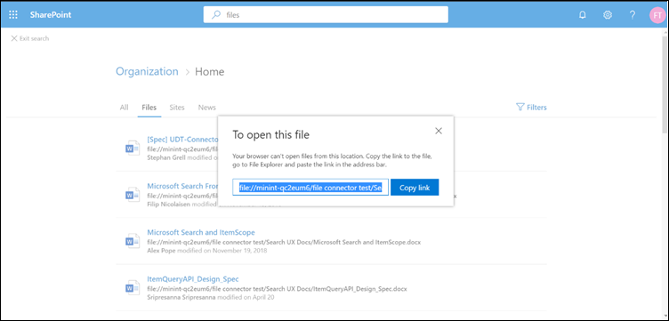

# <a name="file-share-connector"></a><span data-ttu-id="4dcd6-103">Dateifreigabe-Konnektor</span><span class="sxs-lookup"><span data-stu-id="4dcd6-103">File share connector</span></span>

<span data-ttu-id="4dcd6-104">Mit dem Dateifreigabe-Konnektor können Benutzer in Ihrer Organisation lokale Dateifreigaben durchsuchen.</span><span class="sxs-lookup"><span data-stu-id="4dcd6-104">With the File share connector, users in your organization can search on-premises file shares.</span></span> <span data-ttu-id="4dcd6-105">Die Suchergebnisse aus diesen Freigaben werden mit den Ergebnissen aus SharePoint und Microsoft OneDrive für Unternehmen zusammengeführt.</span><span class="sxs-lookup"><span data-stu-id="4dcd6-105">The search results from these shares merge with the results from SharePoint and Microsoft OneDrive for Business.</span></span>

<span data-ttu-id="4dcd6-106">Dieser Artikel richtet sich an Microsoft 365-Administratoren oder Personen, die einen Dateifreigabe-Konnektor konfigurieren, ausführen und überwachen.</span><span class="sxs-lookup"><span data-stu-id="4dcd6-106">This article is for Microsoft 365 administrators or anyone who configures, runs, and monitors a File share connector.</span></span> <span data-ttu-id="4dcd6-107">Es wird erläutert, wie Sie die Connector-und connectorfunktionen, Einschränkungen und Techniken zur Problembehandlung konfigurieren.</span><span class="sxs-lookup"><span data-stu-id="4dcd6-107">It explains how to configure your connector and connector capabilities, limitations, and troubleshooting techniques.</span></span>

## <a name="install-a-data-gateway"></a><span data-ttu-id="4dcd6-108">Installieren eines Datengateways</span><span class="sxs-lookup"><span data-stu-id="4dcd6-108">Install a data gateway</span></span>
<span data-ttu-id="4dcd6-109">Um auf Ihre drittanbieterdaten zugreifen zu können, müssen Sie ein Microsoft Power BI-Gateway installieren und konfigurieren.</span><span class="sxs-lookup"><span data-stu-id="4dcd6-109">In order to access your third-party data, you must install and configure a Microsoft Power BI gateway.</span></span> <span data-ttu-id="4dcd6-110">Weitere Informationen finden Sie unter [Install an on-premises Gateway](https://docs.microsoft.com/data-integration/gateway/service-gateway-install) .</span><span class="sxs-lookup"><span data-stu-id="4dcd6-110">See [Install an on-premises gateway](https://docs.microsoft.com/data-integration/gateway/service-gateway-install) to learn more.</span></span>  

## <a name="content-requirements"></a><span data-ttu-id="4dcd6-111">Inhaltsanforderungen</span><span class="sxs-lookup"><span data-stu-id="4dcd6-111">Content requirements</span></span>
<span data-ttu-id="4dcd6-112">**Dateitypen**.</span><span class="sxs-lookup"><span data-stu-id="4dcd6-112">**File types**.</span></span> <span data-ttu-id="4dcd6-113">Nur Dateien in diesen Formaten können indiziert und durchsucht werden: doc, DOCM, docx, dot, DOTX, eml, GIF, HTML, JPEG, MHT, MHTML, msg, nws, OBD, OBT, Odp, ODS, ODT, One, PDF, Pot, PPS, PPT, PPTM, PPTX, txt, XLB, XLC, xlsb, xls, xlsx, XLT, XLXM, XML, XPS und zip.</span><span class="sxs-lookup"><span data-stu-id="4dcd6-113">Only files in these formats can be indexed and searched: DOC, DOCM, DOCX, DOT, DOTX, EML, GIF, HTML, JPEG, MHT, MHTML, MSG, NWS, OBD, OBT, ODP, ODS, ODT, ONE, PDF, POT, PPS, PPT, PPTM, PPTX, TXT, XLB, XLC, XLSB, XLS, XLSX, XLT, XLXM, XML, XPS, and ZIP.</span></span> <span data-ttu-id="4dcd6-114">Nur der Textinhalt dieser Formate wird indiziert.</span><span class="sxs-lookup"><span data-stu-id="4dcd6-114">Only the textual content of these formats is indexed.</span></span> <span data-ttu-id="4dcd6-115">Alle Multimedia-Inhalte werden ignoriert.</span><span class="sxs-lookup"><span data-stu-id="4dcd6-115">All multimedia content is ignored.</span></span>
 
<span data-ttu-id="4dcd6-116">**Dateigrößenbeschränkungen**.</span><span class="sxs-lookup"><span data-stu-id="4dcd6-116">**File size limits**.</span></span> <span data-ttu-id="4dcd6-117">Die maximal unterstützte Dateigröße beträgt 100 MB.</span><span class="sxs-lookup"><span data-stu-id="4dcd6-117">The maximum supported file size is 100 MB.</span></span> <span data-ttu-id="4dcd6-118">Dateien, die größer als 100 MB sind, werden von der Indizierung übersprungen.</span><span class="sxs-lookup"><span data-stu-id="4dcd6-118">Files that exceed 100 MB are skipped from indexing.</span></span> <span data-ttu-id="4dcd6-119">Der maximale Grenzwert für die Post verarbeitete Größe beträgt 4 MB.</span><span class="sxs-lookup"><span data-stu-id="4dcd6-119">The maximum post-processed size limit is 4 MB.</span></span> <span data-ttu-id="4dcd6-120">Die Verarbeitung wird angehalten, wenn die Größe einer Datei 4 MB erreicht.</span><span class="sxs-lookup"><span data-stu-id="4dcd6-120">Processing stops when a file's size reaches 4 MB.</span></span> <span data-ttu-id="4dcd6-121">Einige in der Datei vorhandene Ausdrücke funktionieren daher möglicherweise nicht für die Suche.</span><span class="sxs-lookup"><span data-stu-id="4dcd6-121">As a result, some phrases present in the file might not work for search.</span></span>

## <a name="connect-to-a-data-source"></a><span data-ttu-id="4dcd6-122">Herstellen einer Verbindung mit einer Datenquelle</span><span class="sxs-lookup"><span data-stu-id="4dcd6-122">Connect to a data source</span></span>
<span data-ttu-id="4dcd6-123">Wählen Sie auf der Seite mit **Datenquelle verbinden** die Option **Dateifreigabe** aus, und geben Sie den Namen, die Verbindungs-ID und die Beschreibung an.</span><span class="sxs-lookup"><span data-stu-id="4dcd6-123">On the **Connect to data source** page, select **File share** and provide the name, connection ID, and description.</span></span> <span data-ttu-id="4dcd6-124">Geben Sie auf der nächsten Seite den Pfad zur Dateifreigabe an, und wählen Sie das zuvor installierte Gateway aus.</span><span class="sxs-lookup"><span data-stu-id="4dcd6-124">In the next page, provide the path to the file share and select your previously installed gateway.</span></span> <span data-ttu-id="4dcd6-125">Geben Sie die Anmeldeinformationen für ein Windows-Benutzerkonto mit Lesezugriff auf alle Dateien in der Freigabe ein.</span><span class="sxs-lookup"><span data-stu-id="4dcd6-125">Enter the credentials for a Windows user account with read access to all the files in the share.</span></span> <span data-ttu-id="4dcd6-126">Durchlaufen Sie die restlichen Einstellungen, und veröffentlichen Sie die Verbindung.</span><span class="sxs-lookup"><span data-stu-id="4dcd6-126">Go through the rest of the settings and publish the connection.</span></span>

## <a name="set-the-refresh-schedule"></a><span data-ttu-id="4dcd6-127">Festlegen des Aktualisierungszeitplans</span><span class="sxs-lookup"><span data-stu-id="4dcd6-127">Set the refresh schedule</span></span>
<span data-ttu-id="4dcd6-128">Das empfohlene Standardintervall für die Aktualisierungsplanung beträgt 15 Minuten, Sie können es jedoch in ein anderes Intervall ändern, das Sie bevorzugen.</span><span class="sxs-lookup"><span data-stu-id="4dcd6-128">The recommended default refresh schedule interval is 15 minutes, but you can change it to another interval that you prefer.</span></span>

## <a name="set-up-your-search-results-page"></a><span data-ttu-id="4dcd6-129">Einrichten der Suchergebnisseite</span><span class="sxs-lookup"><span data-stu-id="4dcd6-129">Set up your search results page</span></span>
<span data-ttu-id="4dcd6-130">Um unterschiedliche Datei Verbindungsergebnisse auf den Registerkarten **alle** und **Dateien** anzuzeigen, müssen Sie eine SharePoint-Such Modul Ergebnisseite einrichten:</span><span class="sxs-lookup"><span data-stu-id="4dcd6-130">To display different file connection results in the **All** and **Files** tabs, you need to set up a SharePoint search engine results page:</span></span>
- <span data-ttu-id="4dcd6-131">Die Tabelle " **all** " zeigt kombinierte Ergebnisse aus ihren Datei Verbindungen, SharePoint-Dateien, OneDrive-Dateien und SharePoint-Websites.</span><span class="sxs-lookup"><span data-stu-id="4dcd6-131">The **All** table shows combined results from your file connections, SharePoint files, OneDrive files, and SharePoint sites.</span></span> 
- <span data-ttu-id="4dcd6-132">Die **Dateien** Vertical zeigt alle Datei Ergebnisse aus ihren Verbindungen, SharePoint und OneDrive.</span><span class="sxs-lookup"><span data-stu-id="4dcd6-132">The **Files** vertical shows all file results from your connections, SharePoint, and OneDrive.</span></span>
<span data-ttu-id="4dcd6-133">Ergebnisse aus Datei Verbindungen werden bereits vorhandenen Ergebnissen in den vertikalen " **all** " und " **Files** " hinzugefügt.</span><span class="sxs-lookup"><span data-stu-id="4dcd6-133">Results from file connections are added to already existing results in both the **All** and **Files** verticals.</span></span>

<span data-ttu-id="4dcd6-134">Führen Sie die folgenden Schritte aus, um die Suchergebnisseite einzurichten:</span><span class="sxs-lookup"><span data-stu-id="4dcd6-134">To set up your search results page, take these steps:</span></span>
1. <span data-ttu-id="4dcd6-135">Erstellen Sie eine SharePoint-Websitesammlung mit einer modernen Such Seite.</span><span class="sxs-lookup"><span data-stu-id="4dcd6-135">Create a SharePoint site collection with a modern search page.</span></span>

2. <span data-ttu-id="4dcd6-136">Installieren Sie eine [SharePoint Online Management-Shell](https://www.microsoft.com/download/details.aspx?id=35588).</span><span class="sxs-lookup"><span data-stu-id="4dcd6-136">Install a [SharePoint Online Management Shell](https://www.microsoft.com/download/details.aspx?id=35588).</span></span>

3. <span data-ttu-id="4dcd6-137">Öffnen Sie SharePoint Online Verwaltungsshell als Administrator, und importieren Sie das **Microsoft. SharePoint. Client. dll** - `C:\Windows\Microsoft.NET\assembly\GAC_MSIL\Microsoft.SharePoint.Client\v4.0_16.0.0.0__71e9bce111e9429c\Microsoft.SharePoint.Client.dll`Modul, das unter vorhanden ist.</span><span class="sxs-lookup"><span data-stu-id="4dcd6-137">Open SharePoint Online Management Shell as an administrator and import the **Microsoft.SharePoint.Client.dll** module present at `C:\Windows\Microsoft.NET\assembly\GAC_MSIL\Microsoft.SharePoint.Client\v4.0_16.0.0.0__71e9bce111e9429c\Microsoft.SharePoint.Client.dll`.</span></span>

> [!NOTE]
> <span data-ttu-id="4dcd6-138">Dieser Pfad ist möglicherweise nicht für alle Benutzer gleich.</span><span class="sxs-lookup"><span data-stu-id="4dcd6-138">This path might not be the same for all users.</span></span>

<span data-ttu-id="4dcd6-139">Um das Modul zu importieren, führen Sie diesen Befehl in SharePoint Online Management Shell aus:</span><span class="sxs-lookup"><span data-stu-id="4dcd6-139">To import the module, run this command in SharePoint Online Management Shell:</span></span>
```bash
Import-Module "C:\Windows\Microsoft.NET\assembly\GAC_MSIL\Microsoft.SharePoint.Client\v4.0_16.0.0.0__71e9bce111e9429c\Microsoft.SharePoint.Client.dll" 
```

4. <span data-ttu-id="4dcd6-140">Führen Sie nun dieses Skript aus:</span><span class="sxs-lookup"><span data-stu-id="4dcd6-140">Now run this script:</span></span>
```bash
$orgName = Read-Host -prompt 'Please enter your org name'
$userName = Read-Host -prompt 'Enter user name'
$userCreds = Get-Credential -UserName $userName -Message "Type the password"
Connect-SPOService -Url https://$orgName-admin.sharepoint.com -Credential $userCreds

$url = Read-Host -Prompt 'Please enter the site url'
$site = Get-SPOSite -Identity $url
Set-SPOSite $url -DenyAddAndCustomizePages 0

$pwd = Read-Host -AsSecureString 'type the password'
$context = New-Object Microsoft.SharePoint.Client.ClientContext($url)
$credential = New-Object Microsoft.SharePoint.Client.SharePointOnlineCredentials($userName, $pwd)
$context.Credentials = $credential
$web = $context.Web
$context.Load($web)
$web.AllProperties["AllVerticalContent"] = "Combined"
$web.Update()
$context.ExecuteQuery()
$web.AllProperties["FilesVerticalContent"] = "ConnectorsOnly"
$web.Update()
$context.ExecuteQuery()
Set-SPOSite $url -DenyAddAndCustomizePages 1

Write-Host "Success" -ForegroundColor Cyan
Read-Host -Prompt 'Press enter to exit'
```

5. <span data-ttu-id="4dcd6-141">Geben Sie die erforderlichen Werte in PowerShell ein, beispielsweise Organisationsname, Benutzername, Kennwort und Website-URL.</span><span class="sxs-lookup"><span data-stu-id="4dcd6-141">Enter the required values in PowerShell, such as organization name, username, password, and site URL.</span></span> <span data-ttu-id="4dcd6-142">Wenn Ihre Administratoranmeldeinformationen **beispielsweise**sind `admin@a830edad9050849823J19081300.onmicrosoft.com`, lautet der Name Ihrer Organisation **a830edad9050849823J19081300**, und Ihre Website-URL lautet `https:// a830edad9050849823J19081300.sharepoint.com`.</span><span class="sxs-lookup"><span data-stu-id="4dcd6-142">As an **example**, if your admin credentials are `admin@a830edad9050849823J19081300.onmicrosoft.com`, then your organization name is **a830edad9050849823J19081300**, and your site URL is `https:// a830edad9050849823J19081300.sharepoint.com`.</span></span>

> [!NOTE]
> <span data-ttu-id="4dcd6-143">Die Einstellung **allproperties** kann nur auf einer Websitesammlungsebene (Teams/Comms-Website) ausgeführt werden.</span><span class="sxs-lookup"><span data-stu-id="4dcd6-143">The **AllProperties** setting can only be done at a site collection level (Teams/Comms site).</span></span>

6. <span data-ttu-id="4dcd6-144">Nun können Sie nach indizierten Dateien suchen und Ergebnisse auf den Registerkarten **alle** und **Dateien** anzeigen.</span><span class="sxs-lookup"><span data-stu-id="4dcd6-144">Now you can search for indexed files and see results in both the **All** and **Files** tabs.</span></span>

## <a name="search-for-file-share-content-in-the-search-results-page"></a><span data-ttu-id="4dcd6-145">Suchen nach Dateifreigabe Inhalten auf der Suchergebnisseite</span><span class="sxs-lookup"><span data-stu-id="4dcd6-145">Search for file share content in the search results page</span></span>
<span data-ttu-id="4dcd6-146">Um nach indizierten Inhalten zu suchen, wechseln Sie zur SharePoint-Startseite Ihres Testmandanten.</span><span class="sxs-lookup"><span data-stu-id="4dcd6-146">To search for indexed content, go to the SharePoint home page of your test tenant.</span></span> <span data-ttu-id="4dcd6-147">Die Ergebnisse werden auf den Registerkarten **alle** und **Dateien** angezeigt.</span><span class="sxs-lookup"><span data-stu-id="4dcd6-147">Results will be displayed in the **All** and **Files** tabs.</span></span>

<span data-ttu-id="4dcd6-148">Aufgrund von Browser Einschränkungen können Sie kein Datei Ergebnis auswählen, um Dateien aus den Suchvorgängen für lokale Dateifreigaben anzuzeigen oder zu öffnen.</span><span class="sxs-lookup"><span data-stu-id="4dcd6-148">Because of browser restrictions, you can't select a file result to view or open files from local file share searches.</span></span> <span data-ttu-id="4dcd6-149">Zum Öffnen dieser Dateien kopieren Sie den Link des Datei Ergebnisses, und fügen Sie ihn in die Adressleiste des systembrowsers ein.</span><span class="sxs-lookup"><span data-stu-id="4dcd6-149">To open these files, copy the file result's link and paste it into the address bar of your system's browser.</span></span> <span data-ttu-id="4dcd6-150">Verwenden Sie unter Windows den Windows-Explorer.</span><span class="sxs-lookup"><span data-stu-id="4dcd6-150">For Windows, use Windows Explorer.</span></span> <span data-ttu-id="4dcd6-151">Anschließend können Sie die Datei auf Ihrem System öffnen.</span><span class="sxs-lookup"><span data-stu-id="4dcd6-151">Then you can open the file on your system.</span></span>



## <a name="troubleshooting"></a><span data-ttu-id="4dcd6-153">Problembehandlung</span><span class="sxs-lookup"><span data-stu-id="4dcd6-153">Troubleshooting</span></span>
<span data-ttu-id="4dcd6-154">Wenn etwas mit einer Verbindung kritisch falsch ist, wird der Status als **Fehler**angezeigt.</span><span class="sxs-lookup"><span data-stu-id="4dcd6-154">If something is critically wrong with a connection, its status shows as **failed**.</span></span> <span data-ttu-id="4dcd6-155">Wenn Sie weitere Informationen zu den drei Fehlertypen erhalten möchten, wechseln Sie zur Seite Fehlerdetails, und wählen Sie die Fehler **hafte** Verbindung aus.</span><span class="sxs-lookup"><span data-stu-id="4dcd6-155">To get more information on the three types of errors, go to the **error details** page and select the failing connection.</span></span> <span data-ttu-id="4dcd6-156">Weitere Informationen finden Sie unter [Manage Your Connector](manage-connector.md) .</span><span class="sxs-lookup"><span data-stu-id="4dcd6-156">See [Manage your connector](manage-connector.md) to learn more.</span></span>
1. <span data-ttu-id="4dcd6-157">**Gateway nicht erreichbar (Fehlercode: 11)**.</span><span class="sxs-lookup"><span data-stu-id="4dcd6-157">**Gateway not reachable (error code: 11)**.</span></span> <span data-ttu-id="4dcd6-158">Der Gatewaycomputer für die Verbindung ist nicht aktiv.</span><span class="sxs-lookup"><span data-stu-id="4dcd6-158">The gateway machine for the connection is down.</span></span> <span data-ttu-id="4dcd6-159">Überprüfen Sie, ob der Microsoft Power BI-Prozess auf dem Gatewaycomputer ausgeführt wird.</span><span class="sxs-lookup"><span data-stu-id="4dcd6-159">Verify if the Microsoft Power BI process runs on the gateway machine.</span></span>
2. <span data-ttu-id="4dcd6-160">**Authentifizierungsfehler (Fehlercode: 12)**.</span><span class="sxs-lookup"><span data-stu-id="4dcd6-160">**Authentication error (error code: 12)**.</span></span> <span data-ttu-id="4dcd6-161">Die Anmeldeinformationen, die zum Erstellen der Verbindung verwendet wurden, sind abgelaufen oder sind nicht mehr gültig.</span><span class="sxs-lookup"><span data-stu-id="4dcd6-161">The credentials that were used for creating the connection expired or are no longer valid.</span></span> <span data-ttu-id="4dcd6-162">Geben Sie zum Beheben dieses Fehlers gültige Anmeldeinformationen ein.</span><span class="sxs-lookup"><span data-stu-id="4dcd6-162">To resolve this error, enter valid credentials.</span></span>
3. <span data-ttu-id="4dcd6-163">**Interner Fehler (Fehlercode: nichts anderes als 11 oder 12)**.</span><span class="sxs-lookup"><span data-stu-id="4dcd6-163">**Internal error (error code: anything other than 11 or 12)**.</span></span> <span data-ttu-id="4dcd6-164">In der Connector-Infrastruktur ist ein Fehler aufgetreten.</span><span class="sxs-lookup"><span data-stu-id="4dcd6-164">There's an error in the connector infrastructure.</span></span> <span data-ttu-id="4dcd6-165">Im [Feedback](connectors-feedback.md) -Artikel erfahren Sie, wie Sie diese Fehler melden.</span><span class="sxs-lookup"><span data-stu-id="4dcd6-165">See the [Feedback](connectors-feedback.md) article to find out how to report these errors.</span></span>

## <a name="limitations"></a><span data-ttu-id="4dcd6-166">Einschränkungen</span><span class="sxs-lookup"><span data-stu-id="4dcd6-166">Limitations</span></span>
<span data-ttu-id="4dcd6-167">Der Dateifreigabe-Konnektor hat diese Einschränkungen in der Vorschauversion:</span><span class="sxs-lookup"><span data-stu-id="4dcd6-167">The File share connector has these limitations in the preview release:</span></span>
* <span data-ttu-id="4dcd6-168">Sie können nur Dateien mit festen Eigenschaften indizieren, keine Dateien mit benutzerdefinierten Eigenschaften.</span><span class="sxs-lookup"><span data-stu-id="4dcd6-168">You can only index files with fixed properties, not files with custom properties.</span></span>
* <span data-ttu-id="4dcd6-169">Dateifreigabe-Zugriffssteuerungslisten (Access Control Lists, ACLs) werden derzeit nicht unterstützt.</span><span class="sxs-lookup"><span data-stu-id="4dcd6-169">File share Access Control Lists (ACLs) aren't currently supported.</span></span> <span data-ttu-id="4dcd6-170">Nur NTFS-ACL-Dateien werden unterstützt.</span><span class="sxs-lookup"><span data-stu-id="4dcd6-170">Only file NTFS ACLs are supported.</span></span>
* <span data-ttu-id="4dcd6-171">Externe Identitäten werden nicht unterstützt.</span><span class="sxs-lookup"><span data-stu-id="4dcd6-171">External identities aren't supported.</span></span> <span data-ttu-id="4dcd6-172">Sie müssen Azure Active Directory Identitäten zugeordnet werden.</span><span class="sxs-lookup"><span data-stu-id="4dcd6-172">They must be mapped to Azure Active Directory identities.</span></span>
