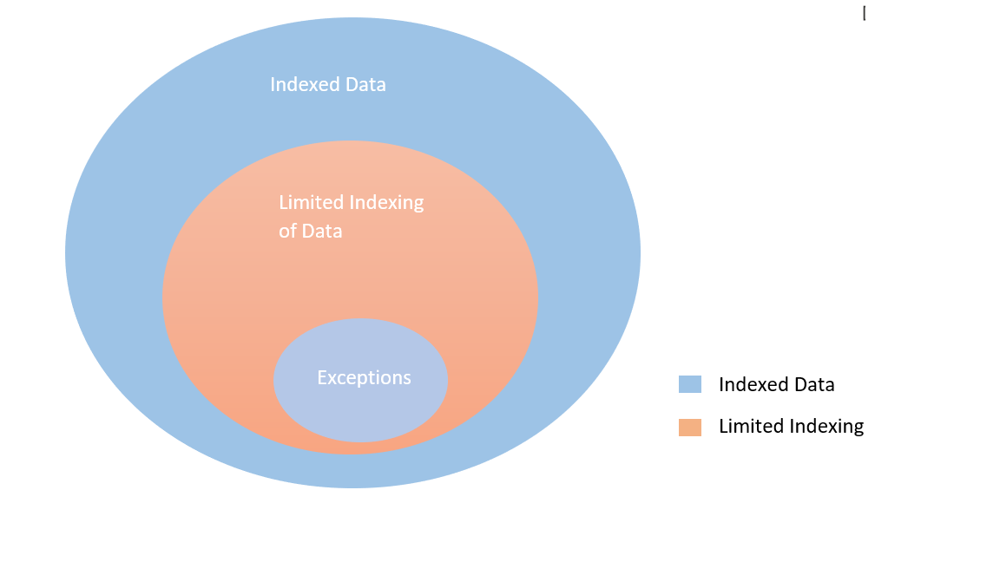
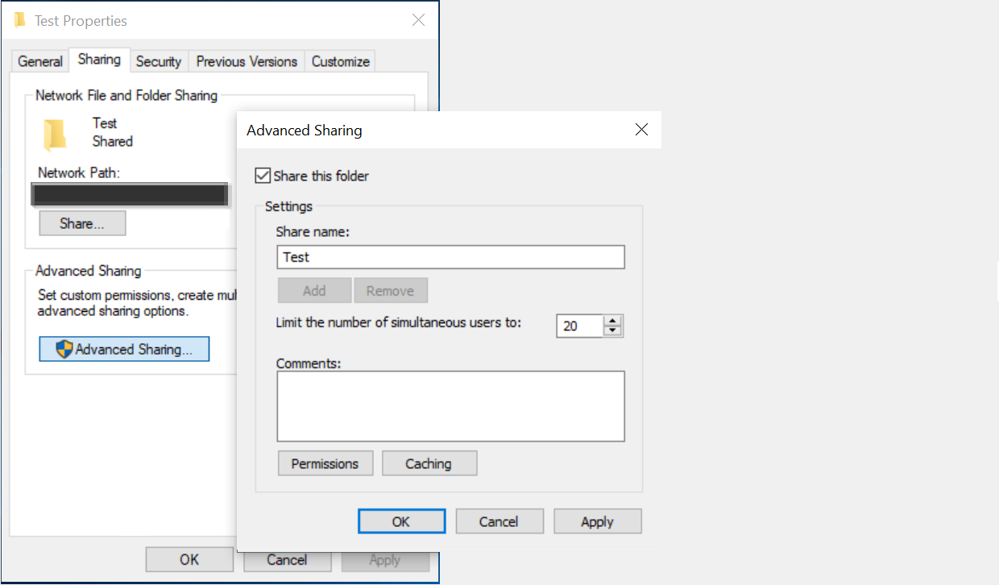

<!---Previous ms.author: rusamai --->

# Dateifreigabe Graph Connector

Mit dem Connector für die Dateifreigabe Graph können Benutzer in Ihrer Organisation lokale Windows Dateifreigaben durchsuchen.

> [!NOTE]
> Lesen Sie den Artikel [**"Setup for your Graph connector",**](configure-connector.md) um den allgemeinen Einrichtungsprozess für Graph Connectors zu verstehen.

## Bevor Sie beginnen

### Installieren des Graph Connector-Agents

Um Ihre Windows Dateifreigaben zu indizieren, müssen Sie den Graph Connector-Agent installieren und registrieren. Weitere Informationen finden Sie unter [Installieren des Graph Connector-Agents.](graph-connector-agent.md)  

### Inhaltsanforderungen

### Dateitypen

Inhalte der folgenden Formate können indiziert und durchsucht werden: DOC, DOCM, DOCX, DOT, DOTX, EML, GIF, HTML, JPEG, MHT, MHTML, MSG, NWS, OBD, OBT, ODP, ODS, ODT, ONE, PDF, POT, PPS, PPT, PPTM, PPTX, TXT, XLB, XLC, XLSB, XLS, XLSX, XLT, XLXM, XML, XPS und ZIP. Nur der Textinhalt dieser Formate wird indiziert. Alle Multimediainhalte werden ignoriert. Für jede Datei, die nicht zu diesem Format gehört, werden die Metadaten allein indiziert.

### Dateigrößenbegrenzungen

Die maximal unterstützte Dateigröße beträgt 100 MB. Dateien, die 100 MB überschreiten, werden nicht indiziert. Die maximale Größe nach der Verarbeitung beträgt 4 MB. Die Verarbeitung wird beendet, wenn die Größe einer Datei 4 MB erreicht. Daher funktionieren einige Ausdrücke, die in der Datei vorhanden sind, möglicherweise nicht für die Suche.

## Schritt 1: Hinzufügen eines Graph Connectors im Microsoft 365 Admin Center

Folgen Sie den allgemeinen [Setupanweisungen.](./configure-connector.md)
<!---If the above phrase does not apply, delete it and insert specific details for your data source that are different from general setup instructions.-->

## Schritt 2: Benennen der Verbindung

Folgen Sie den allgemeinen [Setupanweisungen.](./configure-connector.md)
<!---If the above phrase does not apply, delete it and insert specific details for your data source that are different from general setup instructions.-->

## Schritt 3: Konfigurieren der Verbindungseinstellungen

Wählen Sie auf der Seite **Verbinden zur Datenquelle** **dateifreigabe aus,** und geben Sie den Namen, die Verbindungs-ID und die Beschreibung an. Geben Sie auf der nächsten Seite den Pfad zur Dateifreigabe an, und wählen Sie Ihren zuvor installierten Graph Connector-Agent aus. Geben Sie die Anmeldeinformationen für ein [Microsoft Windows](https://microsoft.com/windows) Benutzerkonto mit Lesezugriff auf alle Dateien in der Dateifreigabe ein.

### Beibehalten der letzten Zugriffszeit

Wenn der Connector versucht, eine Datei zu durchforsten, wird das Feld "Zeitpunkt des letzten Zugriffs" in den Metadaten aktualisiert. Wenn Sie für Archivierungs- und Sicherungslösungen von diesem Feld abhängig sind und es nicht aktualisieren möchten, wenn der Connector darauf zugreift, können Sie diese Option auf der Seite **"Erweiterte Einstellungen"** konfigurieren.

## Schritt 4: Grenzwerte für die Dateiindizierung

Beim Konfigurieren einer Dateifreigabeverbindung könnte der Administrator die Indizierung von Dateien und Ordnern einschränken. Es gibt mehrere Möglichkeiten, dies zu tun:

#### Basierend auf Dateitypen

Nur der Textinhalt dieser Formate wird indiziert: DOC, DOCM, DOCX, DOT, DOTX, EML, HTML, MHT, MHTML, MSG, NWS, OBD, OBT, ODP, ODS, ODT, ONE, PDF, POT, PPS, PPT, PPTM, PPTX, TXT, XLB, XLC, XLSB, XLS, XLSX, XLT, XLXM, XML, XPS. Für Multimediadateien und Dateien, die nicht zu diesem Format gehören, werden die einzigen Metadaten indiziert.

#### Basierend auf dem Datum der letzten Änderung oder der Anzahl der Tage seit der letzten Änderung

#### Vollständiger Netzwerkpfad der Datei/des Ordners oder des regulären Ausdrucks, um die Indizierung einzuschränken 

Verwenden Sie im Netzwerkpfad Escapezeichen ( \\ ) vor Sonderzeichen wie \\ . Beispiel: Für den Pfad \\ \\ "CONTOSO \\ FILE \\ SHAREDFOLDER" lautet die richtige Eingabemethode \\ \\ \\ \\ "CONTOSO \\ \\ FILE \\ \\ SHAREDFOLDER".

Regeln zum Schreiben regulärer Ausdrücke finden Sie [hier](https://docs.microsoft.com/dotnet/standard/base-types/regular-expression-language-quick-reference)

Der Administrator könnte auch eine Ausnahme von der Limit-Regel erteilen. Die Priorität der Ausnahmeregel ersetzt limit-Regeln. In ähnlicher Weise könnte die Ausnahme definiert werden, indem ordner-/dateipfade für die Elemente, die in die Indizierung eingeschlossen werden sollen, festgelegt werden.

## Schritt 5: Verwalten von Suchberechtigungen

Sie können die Berechtigung zum Suchen nach einer beliebigen Datei basierend auf Listen für die Zugriffssteuerung für freigabebasierte Zugriffssteuerungen oder NTFS-Zugriffssteuerungslisten (New Technology File System, NTFS) einschränken, indem Sie auf der Seite **"Suchberechtigungen verwalten"** die gewünschte Option auswählen. Die in diesen Zugriffssteuerungslisten bereitgestellten Benutzerkonten und Gruppen müssen von Active Directory (AD) verwaltet werden. Wenn Sie ein anderes System für die Benutzerkontenverwaltung verwenden, können Sie die Option "Jeder" auswählen, mit der Benutzer ohne Zugriffseinschränkungen nach allen Dateien suchen können. Wenn Benutzer jedoch versuchen, die Datei zu öffnen, gelten die an der Quelle festgelegten Zugriffssteuerelemente.

Beachten Sie, dass Windows standardmäßig die Berechtigung "Lesen" für "Jeder" in AcLs freigeben bereitstellt, wenn ein Ordner im Netzwerk freigegeben wird. Wenn Sie in **"Suchberechtigungen verwalten"** ACLs freigeben auswählen, können Benutzer durch erweiterungsweise nach allen Dateien suchen. Wenn Sie den Zugriff einschränken möchten, entfernen Sie "Lesezugriff" für "Jeder" in Dateifreigaben, und gewähren Sie nur den gewünschten Benutzern und Gruppen Zugriff. Der Connector liest dann diese Zugriffseinschränkungen und wendet sie auf die Suche an.

Sie können Share ACLs nur auswählen, wenn der angegebene Freigabepfad dem UNC-Pfadformat folgt. Sie können einen Pfad im UNC-Format erstellen, indem Sie unter "Freigabe" zu "Erweiterte Freigabe" wechseln.

## Schritt 6: Zuweisen von Eigenschaftenbeschriftungen

Folgen Sie den allgemeinen [Setupanweisungen.](./configure-connector.md)
<!---If the above phrase does not apply, delete it and insert specific details for your data source that are different from general setup instructions.-->

## Schritt 7: Verwalten des Schemas

Folgen Sie den allgemeinen [Setupanweisungen.](./configure-connector.md)
<!---If the above phrase does not apply, delete it and insert specific details for your data source that are different from general setup instructions.-->

## Schritt 8: Auswählen von Aktualisierungseinstellungen

Folgen Sie den allgemeinen [Setupanweisungen.](./configure-connector.md)
<!---If the above phrase does not apply, delete it and insert specific details for your data source that are different from general setup instructions.-->

## Schritt 9: Überprüfen der Verbindung

Folgen Sie den allgemeinen [Setupanweisungen.](./configure-connector.md)
<!---If the above phrase does not apply, delete it and insert specific details for your data source that are different from general setup 
instructions.-->

<!---## Troubleshooting-->
<!---Insert troubleshooting recommendations for this data source-->

<!---## Limitations-->
<!---Insert limitations for this data source-->
