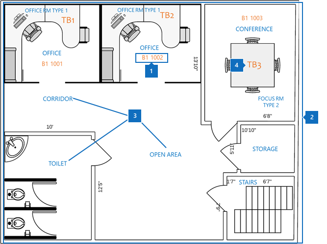
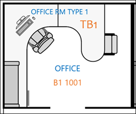
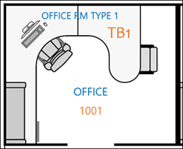
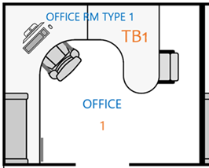

# Bewährte MethodenBest practices

Um die Microsoft Search-Grundrisse erfolgreich zu implementieren, müssen Sie drei Datenteile koordinieren:To successfully implement Microsoft Search floor plans, you need to coordinate three pieces of data:

- **Erstellen von Standortdaten**: welches Format und wie kann hinzugefügt werden?**Building location data**: What format and how to add?
- **Grundriss Karte im DWG-Format**: Wie kann ich anzeigen und welche Daten für einen maximalen Erfolg enthalten?**Floor plan map in DWG format**: How to view and what data should it contain for maximum success?
- **Mitarbeiter Bürostandort in [Azure Active Directory (Azure AD)](https://azure.microsoft.com/services/active-directory/)**: welches Format soll verwendet werden und wie hinzugefügt werden?**Employee office location in [Azure Active Directory (Azure AD)](https://azure.microsoft.com/services/active-directory/)**: What format to use and how to add?  

Die bewährten Methoden zum Bereitstellen von Microsoft Search-Grundrissen werden in den folgenden Abschnitten ebenfalls beschrieben.The best practices for deploying Microsoft Search floor plans are also described in the following sections.

## Erstellen von StandortdatenBuilding location data
Bevor Sie Grundrisse hinzufügen, müssen Sie Ihre Gebäude zu Microsoft-Such Standorten hinzufügen.Before you add floor plans, you need to add your buildings to Microsoft Search locations. Geben Sie die folgenden erforderlichen Gebäudedaten an:Provide the following required building data:

|Erforderliche GebäudedatenRequired building data  |BeispielExample  |
|---------|---------|
|NameName     |    Gebäude 1, New York CityBuilding 1, New York City     |
|AdresseStreet address     |     123 any Avenue, New York, NY 10118123 Any Avenue, New York, NY 10118  |
|Längengrad (optional)Latitude-longitude  (optional)   |    40,760539,-73,97534140.760539, -73.975341      |
|SchlüsselwörterKeywords     |    Büro in New York, Gebäude 1, Hauptniederlassung, HauptsitzNew York Office, Building 1, main office, headquarters     |

Sie können mehrere Gebäude gleichzeitig hinzufügen, indem Sie das **Import** -Feature auf der Registerkarte **Speicherorte** verwenden, anstatt jeweils einen Ort hinzuzufügen.You can add many buildings at a time by using the **Import** feature in the **Locations** tab instead of adding locations one at a time. Mit dem **Import** -Feature können Sie den Breitengrad angeben.With the **Import** feature, you can specify the latitude-longitude. Weitere Informationen finden Sie unter [Verwalten von Speicherorten](manage-locations.md).For more information, see [Manage locations](manage-locations.md).

## Grundriss Karte im DWG-FormatFloor plan map in DWG format
Um Maps in Microsoft Search zu erstellen, müssen Sie Grundrisse im DWG-Format mit spezifischen Informationen hochladen.To build maps in Microsoft Search, you need to upload floor plans in DWG format with specific information. Informationen zum Erstellen und Anzeigen von DWG-formatierten Dateien finden Sie unter [DWG Viewer](https://www.autodesk.in/products/dwg).To learn how to create and view DWG-formatted files, see [DWG Viewers](https://www.autodesk.in/products/dwg). 

Grundriss Karten zeigen vier Elemente an:Floor plan maps display four elements:

1. **Raumnummern**: im folgenden Beispiel werden Raumnummern als **B1 1001** und **B1 1002**definiert.**Room numbers**: In the following example, room numbers are defined as **B1 1001** and **B1 1002**. **B1** ist der GEBÄUDECODE, und 1001 enthält die stockwerksnummer **1** und die Office-Nummer **001**.**B1** is the building code, and 1001 contains the floor number **1** and the office number **001**.
1. **Raumlayouts.**: zur Klärung von Details, wenn mehrere Benutzer ein Büro teilen, können Sie Layouts wie Stühle und Schreibtisch definieren.**Room layouts.**: To help clarify details when multiple users share an office, you can define layouts like chairs and desk.
1. **Raumtypen**: einige Beispiele sind Büro, Korridor, offener Bereich und Toilette.**Room types**: Some examples include office, corridor, open area, and toilet.
1. **Objektinformationen**: Wenn sich Benutzer in einem offenen Bereich befinden, können Sie angeben, an welchem Schreibtisch Sie sitzen.**Asset info**: If users are in an open space, you can denote which desk they sit at. In diesem Beispiel werden die Schreibtische von **TB1** und **TB2**bezeichnet.In this example, the desks are denoted by **TB1** and **TB2**.

In diesem Diagramm sind die Raumnummern das wichtigste Element.In this diagram, room numbers are the most important item. Sie werden dem Bürostandort einer Person in Ihrem Benutzerkonto zugeordnet, wie in der folgenden Abbildung dargestellt.They're mapped to a person’s office location on their user account as shown in the following image.

Diese Informationen werden in Azure AD in der **PhysicalDeliveryOfficeName** -Eigenschaft gespeichert.This information is stored in Azure AD in the **PhysicalDeliveryOfficeName** property. Im Microsoft 365 [Admin Center](https://admin.microsoft.com)wird es als **Office** -Eigenschaft bezeichnet und kann in **aktive Benutzer**hinzugefügt werden.In the Microsoft 365 [admin center](https://admin.microsoft.com), it’s called the **Office** property and can be added in **Active users**.

### DWG-DateienDWG files
Microsoft Search erfordert Grundriss Dateien in DWG, bei dem es sich um ein AutoCAD-Zeichnungsformat handelt.Microsoft Search requires floor plan files in DWG, which is format an AutoCAD drawing format. Die Dateien müssen **Layout** -und **Bezeichnungs** Daten enthalten.The files must contain **layout** and **label** data. **Raumnummern** sind die wichtigsten Beschriftungen für Grundrisse.**Room numbers** are the most important labels for floor plans.

Es wird empfohlen, dass Sie Ihr Büronummern System mit der genauen Übereinstimmungs Methode in der folgenden Tabelle erstellen.We recommend that you create your office numbering system with the exact match method shown in the following table. Sie sind jedoch nicht auf diese Bezeichnung limitiert.But you aren't limited to that labeling. Wenn beispielsweise der Bürostandort des Benutzers in Azure AD **B1 1001**ist, können Sie die Raumnummer in der DWG-Datei mit einer der folgenden Optionen bezeichnen.For example, if the user's office location in Azure AD is **B1 1001**, you can label the room number in the DWG file with any of the options that follow.

|VergleichMatch  |LayoutLayout  |
|---------|---------|
|Exakte Übereinstimmung mit dem Office-Standort (empfohlen)Exact match to office location (Recommended)   **B1 1001****B1 1001**   GEBÄUDECODE: B1Building code: B1 Floor: 1Floor: 1  Zimmer Nummer: 001Room number: 001    |         |
|Übereinstimmung Zwischengeschoss Decke und RaumnummerMatch floor and room number   **1001****1001** Floor: 1Floor: 1  Zimmer Nummer: 001Room number: 001    |      |
|Nur Raumnummer abgleichenMatch room number only   **1****1** Zimmer Nummer: 1Room number: 1        |         |

## Benutzerkonto-Office-StandortUser account office location
Um den Standort eines Mitarbeiters zuzuordnen, werden die Raumnummern in DWG-Dateien den Office-Speicherorten im Konto des Benutzers in Azure AD zugeordnet.To map an employee’s location, the room numbers in DWG files are mapped to office locations in the user’s account in Azure AD. Die **Office-Standort** Eigenschaft muss mit den Office-Standortinformationen in der DWG-Datei übereinstimmen.The **Office location** property needs to match the office location information in the DWG file.

In der folgenden Tabelle werden die bewährten Methoden für die Zuordnung von Standortdaten erläutert:The following table explains best practices for mapping location data:

|Bewährte MethodeBest practice  |ErklärungExplanation |
|---------|---------|
|Fügen Sie GEBÄUDECODE, Geschossdecke und Raumnummer ein.Include building code, floor, and room number.     |   Mit diesen Daten erhalten Sie die beste Möglichkeit, exakte Übereinstimmungen zu erstellen.This data gives you the best chance to make exact matches.     |
|Fügen Sie nach dem Erstellen von Codes und geschossen ein Trennzeichen ein.Include a separator after building codes and floors.     |  Trennen Sie die Bausteine von Boden-und Raumnummern mit einem Trennzeichen oder einem Leerzeichen, wie in den folgenden Beispielen dargestellt:Separate building codes from floor and room numbers with a separator or a space, as in these examples:  B1 1001B1 1001  B1/1001B1/1001   B1-1001B1-1001   |
|Raumnummer folgt immer GEBÄUDECODE-, Flügel-und Bodeninformationen.Room number always follows building code, wing, and floor information.     |  Wenn die Raumnummer **1001**ist, legen Sie den Office-Standort auf **B1 1001**, **B1/1001**oder **B1-1001**fest.If room number is **1001**, then set the office location to **B1 1001**, **B1/1001**, or **B1-1001**.   Wenn die Raumnummer **F1-001**ist, legen Sie den Office-Standort auf **B1 F1-001** oder **B1/F1-001**fest.If the room number is **F1-001**, then set the office location to **B1 F1-001** or **B1/F1-001**.   Wenn die Raumnummer **1**ist, legen Sie die Azure Ad Position auf **B1 1001**, **B1/1001**oder **B1-F1-001**fest.If the room number is **1**, then set the Azure AD location to **B1 1001**, **B1/1001**, or **B1-F1-001**.       |
|

## Nächste SchritteNext steps
[Verwalten von SpeicherortenManage locations](manage-locations.md) 
[Verwalten von GrundrissenManage floor plans](manage-floorplans.md)