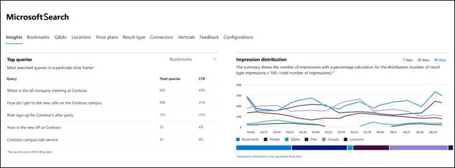
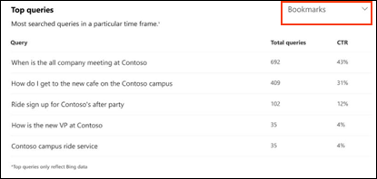
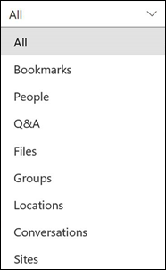
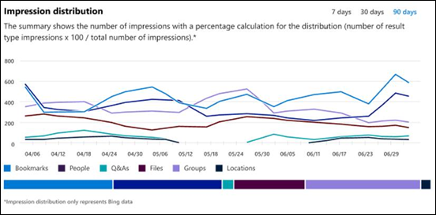

# Microsoft Search Insights Dashboard-Berichte

Sie können das Microsoft Search Insights-Dashboard verwenden, um [Bing](https://Bing.com) -Daten für Ihre veröffentlichten Antworten zu verwalten. Dies ist nur einer der Schritte, die erforderlich sind, um die [Suche nach Inhalten](make-content-easy-to-find.md) für Ihre Benutzer zu vereinfachen.

Wenn Sie zum ersten Mal im Microsoft 365 [Admin Center](https://admin.microsoft.com)zu Microsoft Search wechseln, geben Sie das Einblicke-Dashboard ein.

Die folgenden Berichte sind im Insights-Dashboard verfügbar.

> [!NOTE]
> Die Daten in den Berichten stellt nur [Bing](https://Bing.com) -Daten dar.

## Häufigste Suchvorgänge

Dieser Bericht enthält Details zu den häufigsten 2000 [Bing](https://Bing.com) -Suchabfragen, die von Benutzern ausgeführt werden. Damit eine Abfrage in Top- **Abfragen**angezeigt wird, muss die Abfrage mindestens drei Klicks erhalten.

Eine niedrige Klickrate (Click-through Rate) bedeutet, dass Benutzer nicht nach Ihren Wünschen suchen.

Sie können verschiedene Ansichten des Berichts auswählen, indem Sie nach dem Typ der Antwort filtern. Wenn Sie beispielsweise nur die häufigsten Abfragen für Textmarken anzeigen möchten, wählen Sie die Dropdownliste in der oberen rechten Ecke des Berichts aus, und wählen Sie dann **Lesezeichen**aus. Standardmäßig werden **alle** Antworttypen angezeigt.

## Impression-Verteilung

In diesem Bericht wird die Druckverteilung in [Bing](https://Bing.com) im Laufe der Zeit für verschiedene Antworten dargestellt. Beispiele sind Lesezeichen, Personen, Q&A, Dateien, Speicherorte, Datei Websites, Gruppen und Unterhaltungen. 

Die Impression-Verteilung kann Administratoren helfen zu verstehen, was Benutzer während eines bestimmten Zeitraums suchen.
