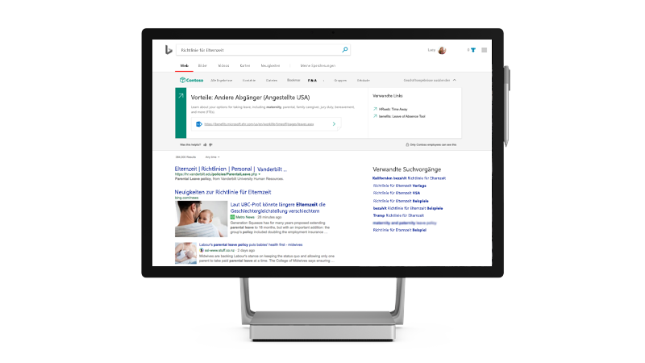

# Microsoft Search

<ul class="panelContent cardsW cols cols2">
    <li>
        

            

                

                    

                        

                            
                        

                    

                    

                    

                

            

        

    </li>
    <li>
        

            

                

                    

                        <h2>Warum Microsoft suchen</h2>
                        
Abrufen eines Enterprise-Suchfunktion, die Produktivität und Zeitersparnis durch die Bereitstellung von Relevantere Suchergebnisse für Ihre Organisation

                        
<a href="why-microsoft-search.md">Hier erfahren Sie, wie es geht</a>

                    

                

            

        

    </li>
</ul>

<h2>Vorgestellte Themen</h2>

<ul class="panelContent cardsW">
    <li>
        

            

                

                    

                        

                            
                        

                    

                    

                        <h3>Hauptmerkmale</h3>
                        
Sehen Sie, welche Features sind verfügbar für Administratoren und Benutzern, einschließlich was finden Sie bei der Suche

                        
<a href="features.md">Weitere Informationen</a>

                    

                

            

        

    </li>
    <li>
        

            

                

                    

                        

                            
                        

                    

                    

                        <h3>Admin quick einrichten</h3>
                        
Erfahren Sie, wie Sie Microsoft Search aktivieren und konfigurieren sie für Ihre Organisation in vier Schritten

                        
<a href="quick-set-up.md">Jetzt starten</a>

                    

                

            

        

    </li>
    <li>
        

            

                

                    

                        

                            
                        

                    

                    

                        <h3>FAQ</h3>
                        
Finden Sie Antworten auf einige häufig gestellte Fragen zum Microsoft Search

                        
<a href="faqs.md">Durchsuchen Sie die häufig gestellten Fragen</a>

                    

                

            

        

    </li>
</ul>

<ul class="panelContent cardsW cols cols2">
    <li>
        

            

                

                    

                        <h2>Verwenden Sie Microsoft Search</h2>
                        
Microsoft Search ist eine einfache, schnelle und sicherer Möglichkeit, Informationen zu finden, produktiver und Intelligenter arbeiten

                        
<a href="use/about-microsoft-search.md">Hier erfahren Sie, wie es geht</a>

                    

                

            

        

    </li>
    <li>
        

            

                

                    

                        

                            
                        

                    

                    

                    

                

            

        

    </li>
</ul>

<h2>Weitere Informationen</h2>
<ul class="panelContent cardsW">
    <li>
        

            

                

                    

                        
<a href="security.md">Sicherheit</a>

                        
<a href="requirements.md">Anforderungen</a>
  
                        
<a href="about-the-admin-portal.md">Informationen zum Verwaltungsportal</a>

                    

                

            

        

    </li>
    <li>
        

            

                

                    

                        
<a href="quick-set-up.md">Schnelles Einrichten</a>

                        
<a href="connected-services.md">Verbundene Dienste</a>

                        
<a href="set-up-microsoft-search.md">Einrichten von Microsoft Search</a>

                    

                

            

        

    </li>
    <li>
        

            

                

                    

                        
<a href="create-bookmarks.md">Erstellen von Lesezeichen</a>

                        
<a href="create-qas.md">Erstellen von Fragen und Antworten</a>

                        
<a href="add-users.md">Hinzufügen von Benutzern</a>

                    

                

            

        

    </li>
</ul>  