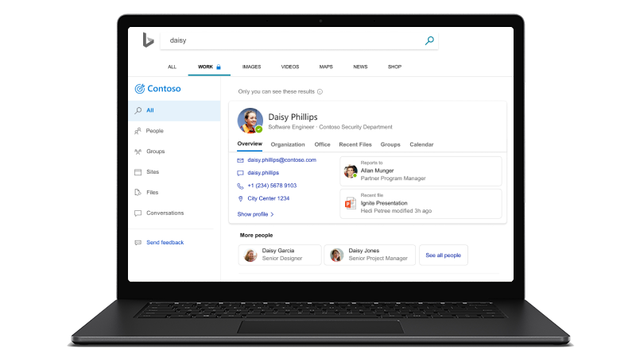

# Microsoft Search

<ul class="panelContent cardsW cols cols2">
    <li>
        

            

                

                    

                        

                            
                        

                    

                    

                    

                

            

        

    </li>
    <li>
        

            

                

                    

                        <h2>Vorteile von Microsoft Search</h2>
                        
Holen Sie sich eine Oberfläche für Unternehmenssuche, durch die die Produktivität gesteigert und Zeit gespart wird, indem relevantere Suchergebnisse für Ihre Organisation bereitgestellt werden.

                        
<a href="why-microsoft-search.md">Erfahren Sie, wie</a>

                    

                

            

        

    </li>
</ul>

<h2>Empfohlene Themen</h2>

<ul class="panelContent cardsW">
    <li>
        

            

                

                    

                        

                            
                        

                    

                    

                        <h3>Wichtige Leistungsmerkmale</h3>
                        
Erfahren Sie, welche Features für Administratoren und Benutzer verfügbar sind und welche Ergebnisse bei der Suche angezeigt werden.

                        
<a href="features.md">Weitere Informationen</a>

                    

                

            

        

    </li>
    <li>
        

            

                

                    

                        

                            
                        

                    

                    

                        <h3>Schnelles Einrichten für Administratoren</h3>
                        
Erfahren Sie, wie Microsoft Search aktiviert wird und wie Sie es in vier einfachen Schritten für Ihre Organisation konfigurieren.

                        
<a href="quick-set-up.md">Jetzt starten</a>

                    

                

            

        

    </li>
    <li>
        

            

                

                    

                        

                            
                        

                    

                    

                        <h3>FAQs</h3>
                        
Erhalten Sie Antworten auf einige häufig gestellte Fragen zu Microsoft Search

                        
<a href="faqs.md">Häufig gestellte Fragen durchsuchen</a>

                    

                

            

        

    </li>
</ul>

<ul class="panelContent cardsW cols cols2">
    <li>
        

            

                

                    

                        <h2>Verwendung von Microsoft Search</h2>
                        
Microsoft Search ist eine einfache, schnelle und sichere Möglichkeit, um Informationen zu suchen und produktiver und schlauer zu arbeiten.

                        
<a href="use/about-microsoft-search.md">Erfahren Sie, wie</a>

                    

                

            

        

    </li>
    <li>
        

            

                

                    

                        

                            
                        

                    

                    

                    

                

            

        

    </li>
</ul>

<h2>Weitere Informationen</h2>
<ul class="panelContent cardsW">
    <li>
        

            

                

                    

                        
<a href="security.md">Sicherheit</a>

                        
<a href="requirements.md">Anforderungen</a>
  
                        
<a href="about-the-admin-portal.md">Informationen zum Verwaltungsportal</a>

                    

                

            

        

    </li>
    <li>
        

            

                

                    

                        
<a href="quick-set-up.md">Schnelles Einrichten</a>

                        
<a href="connected-services.md">Verbundene Dienste</a>

                        
<a href="set-up-microsoft-search.md">Einrichten von Microsoft Search</a>

                    

                

            

        

    </li>
    <li>
        

            

                

                    

                        
<a href="create-bookmarks.md">Erstellen von Lesezeichen</a>

                        
<a href="create-qas.md">Erstellen von F&A</a>

                        
<a href="add-users.md">Verwalten von Benutzern</a>

                    

                

            

        

    </li>
</ul>  