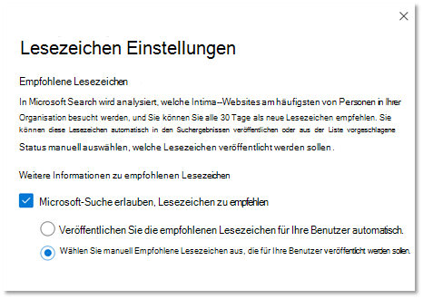

# Verwalten von LesezeichenManage bookmarks

Mithilfe von Lesezeichen können Benutzer schnell wichtige Websites und Tools mit nur einer Suche finden.Bookmarks help people quickly find important sites and tools with just a search. Jede Textmarke enthält einen Titel, eine URL, eine Reihe von benutzerfreundlichen Stichwörtern zum Auslösen der Textmarke sowie eine Kategorie.Each bookmark includes a title, URL, a set of user-friendly keywords to trigger the bookmark, and a category.

## Was ist ein großartiges Lesezeichen?What makes a great bookmark

Ein großes Lesezeichen besteht aus vier Hauptelementen:A great bookmark has four key elements:

1. Ein starker, informativer **Titel**.A strong, informative **title**. Ziel für maximal 8 Wörter oder maximal 60 Zeichen.Aim for no more than 8 words or about 60 characters maximum. Sie möchten, dass Ihre Benutzer auf den Titel klicken und den Inhalt anzeigen, vermeiden jedoch offensichtliche clickbait:You want your users to click on the title and view the content, but avoid obvious clickbait:
    - Gut: Probieren Sie die schmackhaften Favoriten dieser Woche im Menü "Cafeteria" aus.Good: Try this week’s tasty favorites from the cafeteria menu. Der Titel ist klar, prägnant und interessant, kann aber viel versprechend sein.Title is clear, concise, and interesting, but could be overpromising.
    - Besser: das Cafeteria-Menü dieser Woche.Better: This week’s cafeteria menu. Nicht über zuzusagen oder klingt wie eine Anzeige.Doesn't overpromise or sound like an ad.
    - Vermeiden Sie: Sie werden nicht glauben, was in dieser Woche zum Menü "Cafeteria" kommt.Avoid: You won’t believe what’s coming to the cafeteria menu this week. Verwendet clickbait-Klischees, die wie eine Anzeige klingen.Uses clickbait clichés that sound like an ad.
2. Eine prägnante **Beschreibung** von ungefähr 300 Zeichen, die den Zweck oder die Funktionalität der verknüpften Ressource zusammenfasst.A succinct **description**, about 300 characters, that summarizes the purpose or functionality of the linked resource.
3. Eine Sammlung von **Schlüsselwörtern** , die Benutzern beim Suchen der Textmarke helfen soll.A collection of **keywords** that will help people find the bookmark when they search. Mindestens fünf Stichwörter werden empfohlen.We suggest a minimum of at least five keywords. Schließen Sie auch Variationen ein, die Personen in Ihrer Organisation verwenden können, beispielsweise Speisekarte, Mittagsmenüs und Café-Menü.Also, include variations that people in your organization might use, for example, dining menu, lunch menus, and café menu could all be variations for cafeteria menu.
4. Eine hilfreiche Gruppe von **Kategorien** , die das Sortieren und Filtern von Lesezeichen im Admin Center erleichtern.A helpful set of **categories** that make it easier to sort and filter bookmarks in the admin center. Ihren Benutzern werden die zugewiesenen Kategorien nie angezeigt.Your users never see the assigned categories.

## Erstellen von Lesezeichen AntwortenCreate bookmark answers

Wechseln Sie im [Microsoft 365 Admin Center](https://admin.microsoft.com/)zu [Lesezeichen](https://admin.microsoft.com/Adminportal/Home#/MicrosoftSearch/bookmarks) , und wählen Sie aus, wie Sie neue Lesezeichen erstellen möchten:In the [Microsoft 365 admin center](https://admin.microsoft.com/), go to [Bookmarks](https://admin.microsoft.com/Adminportal/Home#/MicrosoftSearch/bookmarks) and choose how you want to create new bookmarks:

- Hinzufügen von LesezeichenAdd bookmarks
- Importieren von SharePoint-ErgebnissenImport SharePoint results
- Standard-Lesezeichen und vorgeschlagene Lesezeichen hinzufügenAdd default bookmarks and suggested bookmarks
- Importieren von LesezeichenImport bookmarks
- Veröffentlichen oder überprüfen empfohlener LesezeichenPublish or review recommended bookmarks

### Hinzufügen von LesezeichenAdd bookmarks

Suchadministratoren und-Redakteure können Lesezeichen im Microsoft 365 Admin Center hinzufügen.Search admins and editors can add bookmarks in the Microsoft 365 admin center. Lesezeichen können in Entwurf veröffentlicht oder gespeichert werden.Bookmarks can be published or saved to draft. Durch das Veröffentlichen einer Textmarke wird der Suchindex sofort aktualisiert, damit Benutzer sofort mit der Erkennung beginnen und diese verwenden können.Publishing a bookmark immediately refreshes the search index so users can begin discovering and using it right away. Sie können auch eine Textmarke planen, indem Sie das Datum und die Uhrzeit angeben, zu der Sie veröffentlicht werden.You can also schedule a bookmark by specifying the date and time it will be published.

- **Veröffentlicht**: Lesezeichen stehen den Benutzern der Organisation über die Microsoft-Suche zur Verfügung.**Published**: Bookmarks are available to the organization’s users through Microsoft Search.
- **Draft**: Lesezeichen, die als Entwürfe gespeichert sind, stehen ihren Benutzern nicht zur Verfügung.**Draft**: Bookmarks saved as drafts are not available to your users. Verwenden Sie diesen Status, wenn Sie oder andere Beteiligte Lesezeichen lesen oder aktualisieren möchten, bevor Sie Sie veröffentlichen.Use this status if you or other stakeholders want to review or update bookmarks before publishing them.
- **Geplant**: Lesezeichen, die zum angegebenen Datum und zur angegebenen Uhrzeit veröffentlicht werden.**Scheduled**: Bookmarks that will be published on the specified date and time.

Sie können die Microsoft Search Content Creator-Browser Erweiterung verwenden, um einfach Lesezeichen hinzuzufügen.You can use the Microsoft Search content creator browser extension to easily add bookmarks. Um die Browser Erweiterung zu installieren, wechseln Sie zu der Website, die Sie als Textmarke hinzufügen möchten, und klicken Sie auf in der Erweiterung hinzufügen.To install the browser extension, go to the site you want to add as a bookmark, and click Add in the extension.
Installieren Sie die Erweiterung für Edge und Chrome:Install the extension for Edge and Chrome:

- Für Chrom Edge oder Chrome: Wechseln Sie zum [Chrome-Webstore](https://chrome.google.com/webstore/detail/microsoft-search-content/nocnablpaoeecfmfnjoheefkogmleipm) , und fügen Sie die Erweiterung hinzu.For Chromium Edge or Chrome: go to the [Chrome web store](https://chrome.google.com/webstore/detail/microsoft-search-content/nocnablpaoeecfmfnjoheefkogmleipm) and add the extension.
- Für Legacy Edge: Wechseln Sie zum [Microsoft Store](https://www.microsoft.com/p/microsoft-search-content-creator/9nrqdbcbwq55?activetab=pivot:overviewtab) , und fügen Sie die Erweiterung hinzu.For legacy Edge: go to the [Microsoft Store](https://www.microsoft.com/p/microsoft-search-content-creator/9nrqdbcbwq55?activetab=pivot:overviewtab) and add the extension.

### Importieren von SharePoint-ErgebnissenImport SharePoint results

Wenn Ihre Organisation heraufgestufte Ergebnisse in SharePoint eingerichtet hat, können Sie die Titel, URLs und Beschreibungen aus den höher gestuften Ergebnissen für Ihren Mandanten in die Microsoft-Suche importieren und die importierten Inhalte ihren Benutzern zur Verfügung stellen.If your organization set up Promoted Results in SharePoint, you can import the titles, URLs, and descriptions from the Promoted Results for your tenant into Microsoft Search and make the imported content available to your users. In den meisten Fällen dauert das Importieren von SharePoint-Ergebnissen nur wenige Minuten.In most cases, importing SharePoint results takes just a few minutes. Wenn Sie eine große Anzahl von Ergebnissen importieren, kann es bis zu 48 Stunden dauern.If you're importing a large number of results, it may take up to 48 hours. Dies ist eine einfache Möglichkeit, Suchergebnisse schnell aufzufüllen und effektiver für Ihre Benutzer zu machen.This is an easy way to quickly populate search results and make it more effective for your users. Es wird empfohlen, höher gestufte Ergebnisse aus SharePoint als Referenz zu verwenden, um zu verstehen, wie relevante Suchergebnisse benannt und erstellt werden.We recommend using promoted results from SharePoint as a reference to understand how to name and create relevant search results.

### Hinzufügen von Standard-und empfohlenen LesezeichenAdd default and suggested bookmarks

Wir haben einige standardmäßige Lesezeichen vorgeschlagen, die Ihre Benutzer hilfreich finden können, einschließlich Lesezeichen für HR, Vorteile, IT-Support, Kennwortverwaltung und vieles mehr.We've included some default suggested bookmarks that your users may find helpful, including bookmarks for HR, benefits, IT support, password management and more. Überprüfen, aktualisieren und veröffentlichen Sie diese vorgeschlagenen Lesezeichen, damit Ihre Benutzer sofort qualitativ hochwertige Ergebnisse erhalten.Review, update, and publish these suggested bookmarks to provide high-quality results to your users right away.

Ihre Benutzer können auch Lesezeichen vorschlagen, die in Microsoft Search mithilfe von Feedback Links hinzugefügt werden sollen.Your users can also suggest bookmarks that would like to see added using feedback links in Microsoft Search. Ihre Empfehlungen werden als vorgeschlagene Lesezeichen angezeigt.Their recommendations will appear as suggested bookmarks.

### Importieren von LesezeichenImport bookmarks

Verwenden Sie das Feature zum Importieren, um das Hinzufügen oder Bearbeiten einer großen Anzahl von Textmarken schneller und einfacher zu machen.Use the Import feature to make adding or editing a large number of bookmarks faster and easier. Verwenden Sie es für Folgendes:Use it to:

- Massen Hinzufügen von Lesezeichen: Fügen Sie der Textmarke-Vorlagendatei Details hinzu, und importieren Sie Sie.Bulk add bookmarks: Add details in the bookmark template file, and then import it.
- Massen Bearbeitungs Lesezeichen: Exportieren Sie Lesezeichen in eine CSV-Datei, bearbeiten Sie die Lesezeichen Details in der exportierten Datei, und importieren Sie dann die bearbeitete Datei.Bulk edit bookmarks: Export bookmarks to a .csv file, edit the bookmark details in the exported file, and then import the edited file.

Einige wichtige Punkte zur Vorlagendatei:A few important points about the template file:

- Daten in diesen Feldern nie bearbeiten: *ID*, *zuletzt geändert* und *zuletzt geändert von*Never edit data in these fields: *ID*, *Last Modified*, and *Last Modified By*
- Wenn Sie die *ID* einer vorhandenen Textmarke einschließen, wird Sie durch die Informationen in der Importdatei ersetzt.If you include the *ID* of an existing bookmark, it will be replaced with the information in the import file.
- Bei vorhandenen Textmarken mit dem gleichen Titel oder der gleichen URL wird das Lesezeichen mit Informationen in der Importdatei aktualisiert.For existing bookmarks with the same title or URL, the bookmark will be updated with information in the import file.
- Nicht alle Felder in der Vorlagendatei sind erforderlich, und die erforderlichen Felder variieren je nach dem Lesezeichenstatus.Not all fields in the template file are required and required fields vary depending on the bookmark state.
- Basierend auf dem Feld " *Status* " werden Lesezeichen als Entwurf gespeichert, vorgeschlagen, geplant, ausgeschlossen oder werden automatisch veröffentlicht.Based on the *State* field, bookmarks will be saved as draft, suggested, scheduled, excluded, or they'll be published automatically.
- Für Partner, die mehrere Organisationen verwalten, können Sie Ihre Lesezeichen aus einer org exportieren und in eine andere importieren.For partners who manage multiple organizations, you can export your bookmarks from one org and import them into another. Sie müssen die Daten jedoch vor dem Importieren in der *ID-* Spalte entfernen.But you must remove the data in the *ID* column before you import.

### Vermeiden von ImportfehlernPrevent import errors

Sie erhalten eine Fehlermeldung, wenn erforderliche Daten fehlen oder ungültig sind, und eine Protokolldatei mit weiteren Informationen über die zu korrigierenden Zeilen und Spalten wird erstellt.You'll get an error if any required data is missing or invalid, and a log file is generated with more information about the rows and columns to be corrected. Nehmen Sie die notwendigen Änderungen vor, und versuchen Sie, die Datei erneut zu importieren.Make necessary edits and try importing the file again. Sie können keine Lesezeichen importieren oder speichern, bis alle Fehler behoben sind.You cannot import or save any bookmarks until all errors are resolved.

Um Fehler zu verhindern, stellen Sie sicher, dass die Importdatei ordnungsgemäß formatiert ist und:To prevent errors, make sure your import file is properly formatted and:

- die Kopfzeile und alle Spalten enthält, die in der Importvorlage vorhanden warenIncludes the header row and all the columns that were in the import template
- die Spaltenreihenfolge die gleiche ist wie in der ImportvorlageThe column order is the same as the import template
- Alle Spalten haben Werte, mit Ausnahme der drei, die leer sein können: *ID*, *zuletzt geändert* und *zuletzt geändert von*All columns have values, except the three that can be empty: *ID*, *Last Modified*, and *Last Modified By*
- Die *Status* Spalte ist nicht leer, es sind die erforderlichen Informationen.The *State* column is not empty, it's required information
- Beim Importieren veröffentlichter, vorgeschlagener, geplanter oder Draft-Lesezeichen sind die Spalten *Title*, *URL* und *Keywords* erforderlich.When importing Published, Suggested, Scheduled, or Draft bookmarks, the *Title*, *URL*, and *Keywords* columns are required
- Wenn ausgeschlossene Lesezeichen importiert werden, ist die *URL* -Spalte erforderlich.When importing Excluded bookmarks, the *URL* column is required

So verhindern Sie Fehler beim Duplizieren von Lesezeichen zu Lesezeichen:To prevent bookmark-to-bookmark duplication errors:

- Verwenden Sie keine doppelten URLs für unterschiedliche Lesezeichen.Don't use duplicate URLS for different bookmarks. Wenn eine URL einer anderen Textmarke zugewiesen ist und Sie versuchen, Sie erneut aus einer Importdatei hinzuzufügen, erhalten Sie eine Fehlermeldung.If a URL is assigned to another bookmark and you try to add it again from an import file, you'll get an error. Dies gilt auch für doppelte URLs für andere Arten von Antworten.This also applies to duplicate URLs for other types of answers.
- Verwenden Sie beim Aktualisieren vorhandener Lesezeichen die Spalte *Bookmark ID* .When updating existing bookmarks, use the *bookmark ID* column. Sie können jede andere Eigenschaft einer vorhandenen Textmarke wie Stichwort oder Beschreibung aktualisieren, aber Sie sollten sicherstellen, dass sich die *Lesezeichen-ID* in der entsprechenden Spalte der Importdatei befindet.You can update any other property of an existing bookmark, such as keyword or description, but you should make sure the *bookmark ID* is in the appropriate column of the import file. Wenn die *Lesezeichen-ID* vorhanden ist, wird Sie nicht als neue Addition behandelt und nicht als Fehler verarbeitet.If the *bookmark ID* is present, it won't be treated as new addition and won't be processed as an error.

### Veröffentlichen oder überprüfen empfohlener LesezeichenPublish or review recommended bookmarks

Um den manuellen Aufwand für das Hinzufügen von Lesezeichen zu reduzieren, kann Microsoft Search SharePoint-Links in Ihrer Organisation auswerten und Lesezeichen empfehlen, und Sie können Sie vor der Veröffentlichung überprüfen oder festlegen, dass Sie automatisch veröffentlicht werden.To reduce the manual effort required to add bookmarks, Microsoft Search can evaluate SharePoint links in your organization and recommend bookmarks, and you can review them before publishing or set them to automatically publish. Für empfohlene Lesezeichen ist kein Setup erforderlich, Sie sind jedoch standardmäßig für die automatische Veröffentlichung aktiviert und festgelegt.No setup is needed for recommended bookmarks, they're enabled and set to auto-publish by default. Wenn Sie diese Einstellungen jederzeit ändern möchten, wählen Sie **Lesezeichen verwalten** aus, um den Bereich Lesezeichen Einstellungen zu öffnen.To change these settings at any time, select **Manage bookmarks** to open the Bookmark settings panel.

Wenn Empfohlene Lesezeichen aktiviert sind, evaluiert das Empfehlungs Modul SharePoint-Websites in Ihrer Organisation, um Verbindungen mit hohem Datenverkehr zu identifizieren.If recommended bookmarks are enabled, the recommendation engine will evaluate SharePoint sites in your organization to identify high-traffic links. Nach einem anfänglichen Evaluierungszeitraum werden die empfohlenen Lesezeichen entweder automatisch veröffentlicht oder der Liste der vorgeschlagenen Lesezeichen hinzugefügt.After an initial evaluation period, the recommended bookmarks will either be auto-published or added to the list of suggested bookmarks. Der nächste Zyklus beginnt dann mit einem 30-tägigen Evaluierungszeitraum, dem die automatische Veröffentlichung oder das Hinzufügen vorgeschlagener Lesezeichen gefolgt ist.The next cycle—a 30-day evaluation period followed by auto-publishing or adding suggested bookmarks—will then begin.

Wir schlagen vor, dass Administratoren oder Redakteure regelmäßig über diese automatisch veröffentlichten oder vorgeschlagenen Lesezeichensuchen.We suggest Search admins or editors review these auto-published or suggested bookmarks on a regular basis. Außerdem werden empfohlene Lesezeichen niemals URLs enthalten, die in vorhandenen veröffentlichten, vorgeschlagenen, geplanten oder ausgeschlossenen Lesezeichen gefunden wurden.Also, recommended bookmarks will never include URLs found in existing Published, Suggested, Scheduled, or Excluded bookmarks.

Um sicherzustellen, dass nur Benutzer mit Access eine empfohlene Textmarke in ihren Arbeitsergebnissen sehen, ist für alle empfohlenen Lesezeichen eine Zugriffs Prüfungsfunktion enthalten.To ensure only users with access will see a recommended bookmark in their work results, an access check feature is included for all recommended bookmarks. Benutzer, die nicht über Berechtigungen für den Zugriff auf eine SharePoint-Website verfügen, werden nie die empfohlene Textmarke für diese Website sehen.Users that don't have permissions to access a SharePoint site will never see the recommended bookmark for that site. Diese Zugriffsüberprüfung wird von der Option **nur Personen mit Zugriff auf diesen Link** in der Gruppeneinstellung für jede empfohlene Textmarke gesteuert.This access check is controlled by the option **Only people with access to this link** in the Groups setting for each recommended bookmark.

Die Zugriffsüberprüfung wird angehalten, wenn die URL in der empfohlenen Textmarke oder in der Einstellung Gruppen geändert wird.The access check will stop if the URL in the recommended bookmark or the Groups setting is changed.

Um zu verhindern, dass das Empfehlungs Modul eine Textmarke für eine bestimmte Website veröffentlicht oder vorschlägt, können Sie die URL zu einer ausgeschlossenen Liste hinzufügen.To prevent the recommendation engine from publishing or suggesting a bookmark to a particular site, you can add the URL to an excluded list. Das Empfehlungs Modul veröffentlicht oder schlägt keine Textmarke für eine ausgeschlossene Website oder eine Seite innerhalb einer ausgeschlossenen Website vor.The recommendation engine will never publish or suggest a bookmark for an excluded site or a page within an excluded site.

## Informationen zu Schlüsselwörtern und reservierten SchlüsselwörternAbout keywords and reserved keywords

Eine Textmarke kann mehrere Schlüsselwörter enthalten, und Lesezeichen können dasselbe Schlüsselwort verwenden, aber reserviertes Schlüsselwort kann nicht freigegeben werden.A bookmark can have several keywords and bookmarks can share the same keyword, but reserved keyword can't be shared. Ein reserviertes Schlüsselwort ist ein eindeutiger Ausdruck oder Ausdruck, der eine bestimmte Textmarke auslöst.A reserved keyword is a unique term or phrase that triggers one specific bookmark. Ein reserviertes Schlüsselwort kann nur einer Antwort zugeordnet werden.A reserved keyword can be associated with one answer only. Verwenden Sie reservierte Schlüsselwörter sparsam.Use reserved keywords sparingly.

## Häufig gestellte FragenFrequently asked questions

**F.: wie lange dauert es, bis eine Textmarke in Microsoft Search angezeigt wird, nachdem Sie veröffentlicht wurde?****Q: How long does it take for a bookmark to be visible in Microsoft Search after it's published?**

**A:**  Eine Textmarke steht in der Microsoft-Suche unmittelbar nach der Veröffentlichung zur Verfügung.**A:**  A bookmark is available in Microsoft Search immediately after publishing.

**F.: wie lange dauert es, bis eine empfohlene Textmarke angezeigt wird?****Q: How long does it take for a recommended bookmark to appear?**

**A:**  Empfohlene Lesezeichen werden nur in Microsoft Search angezeigt, wenn sowohl empfohlene Lesezeichen als auch automatische Veröffentlichung aktiviert sind.**A:**  Recommended bookmarks will only appear in Microsoft Search if both Recommended bookmarks and auto-publishing are enabled. Während des anfänglichen Evaluierungszeitraums evaluiert das Empfehlungs Modul SharePoint-Datenverkehr, um geeignete Lesezeichen zu identifizieren und Sie dann automatisch zu veröffentlichen.During the initial evaluation period, the recommendation engine will evaluate SharePoint traffic to identify suitable bookmarks and then auto-publish them. Nach der Veröffentlichung werden Sie sofort in der Microsoft-Suche zur Verfügung gestellt.Once published they become available immediately in Microsoft Search.

**F.: werden von der Microsoft-Suche Lesezeichen von Websites in allen Sprachen empfohlen?****Q: Will Microsoft Search recommend bookmarks from sites in all languages?**

**A**.: Ja, Microsoft Search kann Lesezeichen von jeder internen SharePoint-Website unabhängig von der Sprache empfehlen.**A**: Yes, Microsoft Search can recommend bookmarks from any internal SharePoint site, regardless of the language.

**F.: kann ich das Anzeigen empfohlener Lesezeichen in Suchergebnissen beenden?****Q: Can I stop showing recommended bookmarks in search results?**

**A:** Um die Anzeige empfohlener Lesezeichen zu beenden, deaktivieren Sie die Einstellung für die automatische Veröffentlichung in Ihrem Admin Center.**A:** To stop showing recommended bookmarks, turn the auto-publish setting off in your admin center. Empfohlene Lesezeichen werden der Liste der vorgeschlagenen Lesezeichen hinzugefügt.Recommended bookmarks will be added to the list of suggested bookmarks.

**F.: Wie kann ich eine empfohlene Textmarke in Suchergebnissen oder im Admin Center identifizieren?****Q: How can I identify a recommended bookmark in search results or the admin center?**

**A:** In den Suchergebnissen enthalten die empfohlenen Lesezeichen den Ausdruck "vorgeschlagen für Sie" vor der URL.**A:** In search results, recommended bookmarks include the phrase "Suggested for you" before the URL. Im Admin Center haben die empfohlenen Lesezeichen den Besitzer Wert "System".In the admin center, recommended bookmarks will have an Owner value of "SYSTEM".

**F.: wie wird der Zugriff auf ein empfohlenes Lesezeichen verwaltet?****Q: How is access to a recommended bookmark managed?**

**A**: ein von Microsoft entwickeltes Zugriffsmodul ermittelt, ob die Lesezeichen-URL für einen bestimmten Benutzer zugänglich ist, und zeigt nur die empfohlene Textmarke für die richtige Zielgruppe an.**A**: A Microsoft-engineered access engine determines if the bookmark URL is accessible to a particular user and will only show the recommended bookmark to the correct audience. Wenn die URL jedoch bearbeitet oder die Gruppeneinstellung geändert wird, wird das Modul für den entwickelten Zugriff deaktiviert.However, if the URL is edited or the Groups setting is changed, the engineered access engine will be disabled.

**F.: Was geschieht, wenn für empfohlene Lesezeichen, die der vorgeschlagenen Liste hinzugefügt wurden, keine Aktion ausgeführt wird?****Q: What happens if no action is taken on recommended bookmarks added to the Suggested list?**

**A**: um eine große Anzahl von Lesezeichen in der vorgeschlagenen Liste zu vermeiden, wird eine empfohlene Textmarke (owner = System) nach 180 Tagen gelöscht.**A**: To avoid a high volume of bookmarks in the suggested list, a recommended bookmark (owner = SYSTEM) will be purged after 180 days.

**F: Wo finde ich die APP-ID für eine Power-App?****Q: Where do I find the App ID for a Power App?**

**A**: Wechseln Sie zur Power apps-Website, und zeigen Sie den Detailbereich für die APP an.**A**: Go to the Power Apps site and view the Details pane for the app. Erfahren Sie mehr über [das erhalten einer APP-ID](https://docs.microsoft.com/powerapps/maker/canvas-apps/get-sessionid#get-an-app-id).Learn more about [getting an app ID](https://docs.microsoft.com/powerapps/maker/canvas-apps/get-sessionid#get-an-app-id).
