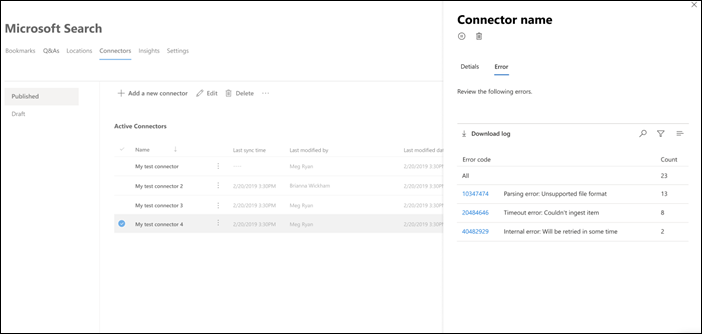

# Verwalten des Connectors für Microsoft SearchManage your connector for Microsoft Search

Für den Zugriff auf und die Verwaltung Ihrer Connectors müssen Sie als Suchadministrator für Ihren Mandanten festgelegt sein.To access and manage your connectors, you must be designated as a search administrator for your tenant. Wenden Sie sich an Ihren mandantenadministrator, um Sie für die Suchadministrator Rolle zu informieren.Contact your tenant administrator to provision you for the search administrator role.

## Erste SchritteGet started

Navigieren Sie zur [Registerkarte Connectors](https://admin.microsoft.com/Adminportal/Home#/MicrosoftSearch/Connectors) im [Microsoft 365 Admin Center](https://admin.microsoft.com).Navigate to the [Connectors tab](https://admin.microsoft.com/Adminportal/Home#/MicrosoftSearch/Connectors) in the [Microsoft 365 admin center](https://admin.microsoft.com).

Für jeden Connectortyp unterstützt das [Microsoft 365 Admin Center](https://admin.microsoft.com) die in der folgenden Tabelle aufgeführten Vorgänge:For each connector type, the [Microsoft 365 admin center](https://admin.microsoft.com) supports the operations shown in the following table:

VorgangOperation | Von Microsoft erstellter ConnectorMicrosoft-built connector | Partner oder benutzerdefinierter ConnectorPartner or custom-built connector
--- | --- | ---
Hinzufügen einer VerbindungAdd a connection | : heavy_check_mark: (siehe [Konfigurieren Ihres von Microsoft erstellten Connectors](configure-connector.md)):heavy_check_mark: (See [Configure your Microsoft-built connector](configure-connector.md)) | : x: (Bezug auf Ihren Partner oder den benutzerdefinierten Connector-Administrator UX):x: (Refer to your partner or custom-built connector admin UX)
Löschen einer VerbindungDelete a connection | : heavy_check_mark::heavy_check_mark: | : heavy_check_mark::heavy_check_mark:
Bearbeiten einer veröffentlichten VerbindungEdit a published connection | : heavy_check_mark: Name:heavy_check_mark: Name   : heavy_check_mark: Beschreibung:heavy_check_mark: Description   : heavy_check_mark: Authentifizierungsanmeldeinformationen für Ihre externe Datenquelle:heavy_check_mark: Authentication credentials for your external data source   : heavy_check_mark: Gateway-Anmeldeinformationen für Ihre lokale Datenquelle:heavy_check_mark: Gateway credentials for your on-premises data source   : heavy_check_mark: Aktualisierungszeitplan:heavy_check_mark: Refresh schedule   | : heavy_check_mark: Name:heavy_check_mark: Name   : heavy_check_mark: Beschreibung:heavy_check_mark: Description
Bearbeiten einer Entwurfs VerbindungEdit a draft connection | : heavy_check_mark::heavy_check_mark: | x:x:

## Überwachen des VerbindungsstatusMonitor your connection status

Nachdem Sie eine Verbindung erstellt haben, wird die Anzahl der verarbeiteten Elemente auf der Registerkarte **Connectors** auf der Seite **Microsoft-Suche** angezeigt.After you create a connection, the number of processed items shows on the **Connectors** tab on the **Microsoft Search** page. Nachdem die anfängliche vollständige Durchforstung erfolgreich abgeschlossen wurde, wird der Fortschritt für periodische inkrementelle Crawls angezeigt.After the initial full crawl completes successfully, the progress for periodic incremental crawls displays. Diese Seite enthält Informationen zu den täglichen Vorgängen des Connectors sowie eine Übersicht über die Protokolle und den Fehler Verlauf.This page provides information about the connector's day-to-day operations and an overview of the logs and error history.

Vier Zustände werden in der Spalte **Status** für jede Verbindung angezeigt:Four states show up in the **Status** column against each connection:

* **Synchronisierung**.**Syncing**. Der Connector durchforstet die Daten aus der Quelle, um die vorhandenen Elemente zu indizieren und Aktualisierungen vorzunehmen.The connector is crawling the data from the source to index the existing items and make any updates.

* **Aktiviert**: die Verbindung ist aktiviert, und es wird keine aktive Durchforstung ausgeführt.**Enabled**: The connection is enabled, and there's no active crawl running against it. **Letzte Synchronisierungszeit** gibt an, wann die letzte erfolgreiche Durchforstung aufgetreten ist.**Last sync time** indicates when the last successful crawl happened. Die Verbindung ist so aktuell wie die letzte Synchronisierungszeit.The connection is as fresh as the last sync time.

* **Angehalten**.**Paused**. Die durch forstungen werden von den Administratoren durch die Option Pause angehalten.The crawls are paused by the admins through the pause option. Die nächste Durchforstung wird nur ausgeführt, wenn Sie manuell fortgesetzt wird.The next crawl runs only when it's manually resumed. Die Daten aus dieser Verbindung sind jedoch weiterhin durchsuchbar.However, the data from this connection continues to be searchable.

* **Fehlerhaft**.**Failed**. Die Verbindung hatte einen kritischen Fehler.The connection had a critical failure. Für diesen Fehler ist ein manueller Eingriff erforderlich.This error requires manual intervention. Der Administrator muss die entsprechende Aktion basierend auf der angezeigten Fehlermeldung durchführen.The admin needs to take appropriate action based on the error message shown. Daten, die bis zum Auftreten des Fehlers indiziert wurden, sind durchsuchbar.Data that was indexed until the error occurred is searchable.

### Überwachen von FehlernMonitor errors

Für jeden **aktiven Connector** auf der Registerkarte **Connectors** werden alle vorhandenen Durchforstungs Fehler unter der Registerkarte **Fehler** angezeigt. Auf der Registerkarte werden Fehlercodes, die Anzahl der einzelnen und Downloadoptionen für das Fehlerprotokoll aufgelistet.For each **Active Connector** on the **Connectors** tab, any existing crawl errors show under the **Error** tab. The tab lists error codes, the count of each, and error log download options. Sehen Sie sich das Beispiel in der folgenden Abbildung an.See the example in the following image. Wählen Sie einen **Fehlercode** aus, um die Details des Fehlers anzuzeigen.Select an **error code** to view the error's details.

Um die spezifischen Details eines Fehlers anzuzeigen, wählen Sie den entsprechenden Fehlercode aus.To view an error's specific details, select its error code. Ein Bildschirm mit Fehlerdetails und einem Link wird angezeigt.A screen appears with error details and a link. Die neuesten Fehler werden oben angezeigt.The most recent errors appear at the top. Siehe das Beispiel in der folgenden Tabelle.See the example in the following table.

Unten sehen Sie eine Liste mit verschiedenen Fehlern, die für jede Verbindung angezeigt werden können.Below is the list of different errors that can appear against any connection. Wenn diese Lösungen nicht funktionieren, wenden Sie sich an den Support oder senden Sie uns [Feedback](connectors-feedback.md).If these solutions don’t work, contact support or send us [feedback](connectors-feedback.md).

FehlercodeError code | FehlermeldungError message | LösungSolution
--- | --- | ---
10001000 | Die Datenquelle ist nicht verfügbar.The data source isn't available. Überprüfen Sie Ihre Internetverbindung, oder stellen Sie sicher, dass der Connector weiterhin auf die Datenquelle zugreifen kann.Check your internet connection or make sure the data source is still accessible by the connector. | Dieser Fehler tritt auf, wenn die Datenquelle aufgrund eines Netzwerkproblems nicht erreichbar ist oder wenn die Datenquelle selbst gelöscht, verschoben oder umbenannt wird.This error occurs when the data source is not reachable due to a network issue or when the data source itself is deleted, moved, or renamed. Überprüfen, ob die bereitgestellten Datenquellendetails noch gültig sind.Check if the data source details provided are still valid.
10011001 | Die Daten können nicht aktualisiert werden, da die Datenquelle die Verbindung drosselt.Can't update the data, because the data source is throttling the connector. | Um die Drosselung der Datenquelle zu überprüfen, ob die Skalierungs Grenzwerte erhöht werden können, oder warten Sie, bis eine geringere Datenverkehrs intensive Tageszeit vorliegt.To unthrottle the data source, check if its scale limits can be increased or wait until a less traffic-heavy time of the day.
10021002 | Authentifizierung bei der Datenquelle nicht möglich.Can't authenticate with the data source. Stellen Sie sicher, dass die dieser Datenquelle zugeordneten Anmeldeinformationen richtig sind.Verify that the credentials associated with this data source are correct. | Klicken Sie auf **Bearbeiten** , um die Authentifizierungsanmeldeinformationen zu aktualisieren.Click **Edit** to update the authentication credentials.
10031003 | Das dem Connector zugeordnete Konto verfügt nicht über die Berechtigung, auf das Element zuzugreifen.The account associated with the connector doesn't have permission to access the item. |  Stellen Sie sicher, dass das richtige Konto Zugriff auf das Element hat, das Sie indizieren möchten.Ensure the proper account has access to the item you want indexed.
10041004 | Das lokale Daten Gateway konnte nicht erreicht werden.Unable to reach the on-premises data gateway. Stellen Sie sicher, dass der Gatewaydienst aktiv ist und die Gateway-Details in der Verbindungskonfiguration aktualisiert werden.Make sure the gateway service is running and the gateway details are updated in the connection configuration. | Überprüfen Sie den Computer mit dem Gateway, öffnen Sie die Power BI-Gateway-Anwendung, und stellen Sie sicher, dass das Gateway aktiv ist.Check the computer with the gateway, open the Power BI Gateway application and make sure the gateway is running. Stellen Sie sicher, dass das Gateway das gleiche Administratorkonto wie die Microsoft-Suche verwendet, und vergewissern Sie sich, dass alle Gateway-Details in der Verbindungskonfiguration aktualisiert werden.Verify that the gateway is using the same admin account as Microsoft Search, then make sure all the gateway details are all updated in the connection configuration.
10051005 | Anmeldeinformationen, die dieser Datenquelle zugeordnet sind, sind abgelaufen.Credentials associated with this data source have expired. Erneuern Sie die Anmeldeinformationen, und aktualisieren Sie die Verbindung.Renew the credentials and update the connection. | Klicken Sie auf **Bearbeiten** , um die Authentifizierungsanmeldeinformationen zu aktualisieren.Click **Edit** to update the authentication credentials.
10061006 | Ihre Gateway-Version ist veraltet und unterstützt diesen Connector nicht mehr.Your gateway version is out of date and doesn’t support this connector anymore. Das Gateway muss aktualisiert werden.You will need to update the gateway. | Besuchen Sie die [Installieren eines lokalen Datengateways](https://docs.microsoft.com/data-integration/gateway/service-gateway-install) , um die neueste Version des Power BI-Gateways auf dem Computer mit dem Gateway herunterzuladen und zu installieren.Please visit [Install an on-premises data gateway](https://docs.microsoft.com/data-integration/gateway/service-gateway-install) to download  and install the latest version of the Power BI gateway on the machine containing the gateway.
10071007 | Keine gültige Power BI-Lizenz erkannt.No valid Power BI license detected. Sie benötigen eine gültige Power BI-Lizenz zum Durchführen dieser Durchforstung.You need a valid Power BI license to perform this crawl. | Sie benötigen eine gültige Power BI-Lizenz zum Durchführen dieser Durchforstung.You need a valid Power BI license to perform this crawl. Stellen Sie sicher, dass Ihre Organisation über eine gültige Lizenz verfügt.Check that your organization has a valid license. Wenn dies der Fall ist, versuchen Sie es erneut.If it does, try again. Wenn dies nicht der Fall ist, erhalten Sie eine Lizenz, und versuchen Sie es dann erneut.If it doesn’t, obtain a license and then try again.
10081008 | Die Gesamtkontingent Auslastung Ihres Mandanten hat seinen Grenzwert erreicht.The total quota utilization of your tenant has reached its limit. Versuchen Sie, eine Verbindung zu löschen, um einen Teil ihres Kontingents freizugeben oder ihre Einnahme Filter anzupassen, um geringere Daten zu erzielen.Try deleting a connection to free up some of your quota or adjusting your ingestion filters to bring in less data. | Versuchen Sie, eine Verbindung zu löschen, um einen Teil ihres Kontingents freizugeben oder ihre Einnahme Filter anzupassen, um geringere Daten zu erzielen.Try deleting a connection to free up some of your quota or adjusting your ingestion filters to bring in less data. Wenn das Problem dadurch nicht behoben wird, wenden Sie sich an den Microsoft-Support.If these don't solve the issue, contact Microsoft support.
20012001 | Die Indizierung wird aufgrund einer großen Anzahl von Updates in der Warteschlange eingeschränkt.Indexing is throttled because of a large number of updates in the queue. Je nach Warteschlange kann es einige Zeit dauern, bis die Aktualisierungen abgeschlossen sind.Depending on the queue, it can take some time for the updates to complete. | Warten Sie, bis die Warteschlange gelöscht wird.Please wait until the queue gets cleared.
20022002 | Die Indizierung ist aufgrund einer nicht unterstützten Element Formatierung fehlgeschlagen.Indexing failed due to unsupported item formatting. | Weitere Informationen finden Sie in der Connector-spezifischen Dokumentation.See connector-specific documentation for more information.
20032003 | Die Indizierung ist aufgrund eines nicht unterstützten Elementinhalts fehlgeschlagen.Indexing failed due to unsupported item content. | Weitere Informationen finden Sie in der Connector-spezifischen Dokumentation.See connector-specific documentation for more information.
20042004 | Die [Dateigröße](https://docs.microsoft.com/microsoftsearch/file-share-connector#content-requirements) ist zu groß, um indiziert zu werden.The [file size](https://docs.microsoft.com/microsoftsearch/file-share-connector#content-requirements) is too large to be indexed. Sie muss vor der Verarbeitung 100 MB oder weniger betragen und darf nach der Verarbeitung nicht größer als 4 MB sein.It must be 100 MB or less before processing and no larger than 4 MB after processing. Die Datei wird in diesem Fall teilweise indiziert.The file gets indexed partially in this case. Einige in der Datei vorhandene Ausdrücke geben möglicherweise kein Suchergebnis zurück.Few phrases present in the file might not return a search result. | Weitere Informationen finden Sie unter [Dateifreigabe spezifische Dokumentation](https://docs.microsoft.com/MicrosoftSearch/file-share-connector#content-requirements) .See [file share specific documentation](https://docs.microsoft.com/MicrosoftSearch/file-share-connector#content-requirements) for more information.
50005000 | Etwas ist schief gelaufen.Something went wrong. Wenn dieser Vorgang fortgesetzt wird, wenden Sie sich an den Support.If this continues, contact support. |

## Vorschau EinschränkungenPreview limitations

* Wenn Sie einen von Microsoft erstellten Connector **veröffentlichen** , kann es einige Minuten dauern, bis die Verbindung erstellt wurde.When you **publish** a Microsoft-built connector, it might take a few minutes for the connection to be created. Während dieser Zeit zeigt die Verbindung den Status als ausstehend an.During that time, the connection shows its status as pending. Außerdem gibt es keine automatische Aktualisierung, Sie müssen also manuell aktualisieren.Also, there's no auto-refresh, so you need to refresh manually.

* Das [Microsoft 365 Admin Center](https://admin.microsoft.com) unterstützt das Anzeigen und Bearbeiten des **Suchschemas** nach dem Veröffentlichen einer Verbindung nicht.The [Microsoft 365 admin center](https://admin.microsoft.com) doesn't support viewing and editing the **search schema** after a connection is published. Um das Suchschema zu bearbeiten, löschen Sie die Verbindung, und erstellen Sie dann eine neue.To edit the search schema, delete your connection and then create a new one.

* Wenn Sie den **Aktualisierungszeitplan**ihrer Verbindung verwalten, wird die Anzahl der Elemente angezeigt, die während jeder Sitzung synchronisiert werden.When you manage your connection's **refresh schedule**, the number of items that sync during each session are displayed. Der Synchronisierungsverlauf ist jedoch nicht verfügbar.However, the sync history isn't available.
