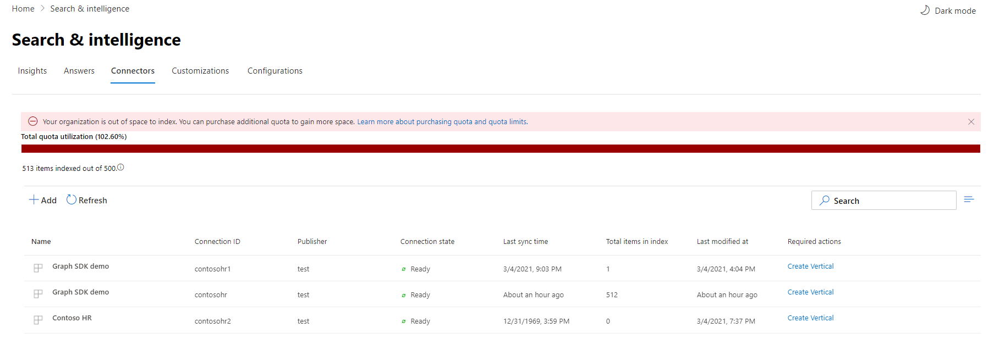

# Verwalten des Connectors für Microsoft Search

Für den Zugriff auf und die Verwaltung Ihrer Connectors müssen Sie als Suchadministrator für Ihren Mandanten festgelegt sein. Wenden Sie sich an Ihren mandantenadministrator, um Sie für die Suchadministrator Rolle zu informieren.

## Erste Schritte

Navigieren Sie zur [Registerkarte Connectors](https://admin.microsoft.com/Adminportal/Home#/MicrosoftSearch/Connectors) im [Microsoft 365 Admin Center](https://admin.microsoft.com).

Für jeden Connectortyp unterstützt das [Microsoft 365 Admin Center](https://admin.microsoft.com) die in der folgenden Tabelle aufgeführten Vorgänge:

Vorgang | Von Microsoft erstellter Connector | Partner oder benutzerdefinierter Connector
--- | --- | ---
Hinzufügen einer Verbindung | : heavy_check_mark: (siehe [Konfigurieren Ihres von Microsoft erstellten Connectors](configure-connector.md)) | : x: (Bezug auf Ihren Partner oder den benutzerdefinierten Connector-Administrator UX)
Löschen einer Verbindung | : heavy_check_mark: | : heavy_check_mark:
Bearbeiten einer veröffentlichten Verbindung | : heavy_check_mark: Name   : heavy_check_mark: Beschreibung   : heavy_check_mark: Authentifizierungsanmeldeinformationen für Ihre externe Datenquelle   : heavy_check_mark: Gateway-Anmeldeinformationen für Ihre lokale Datenquelle   : heavy_check_mark: Aktualisierungszeitplan   | : heavy_check_mark: Name   : heavy_check_mark: Beschreibung
Bearbeiten einer Entwurfs Verbindung | : heavy_check_mark: | x

## Überwachen des Verbindungsstatus

Nachdem Sie eine Verbindung erstellt haben, wird die Anzahl der verarbeiteten Elemente auf der Registerkarte **Connectors** auf der Seite **Microsoft-Suche** angezeigt. Nachdem die anfängliche vollständige Durchforstung erfolgreich abgeschlossen wurde, wird der Fortschritt für periodische inkrementelle Crawls angezeigt. Diese Seite enthält Informationen zu den täglichen Vorgängen des Connectors sowie eine Übersicht über die Protokolle und den Fehler Verlauf.

Vier Zustände werden in der Spalte **Status** für jede Verbindung angezeigt:

* **Synchronisierung**. Der Connector durchforstet die Daten aus der Quelle, um die vorhandenen Elemente zu indizieren und Aktualisierungen vorzunehmen.

* **Aktiviert**: die Verbindung ist aktiviert, und es wird keine aktive Durchforstung ausgeführt. **Letzte Synchronisierungszeit** gibt an, wann die letzte erfolgreiche Durchforstung aufgetreten ist. Die Verbindung ist so aktuell wie die letzte Synchronisierungszeit.

* **Angehalten**. Die durch forstungen werden von den Administratoren durch die Option Pause angehalten. Die nächste Durchforstung wird nur ausgeführt, wenn Sie manuell fortgesetzt wird. Die Daten aus dieser Verbindung sind jedoch weiterhin durchsuchbar.

* **Fehler**. Die Verbindung hatte einen kritischen Fehler. Für diesen Fehler ist ein manueller Eingriff erforderlich. Der Administrator muss die entsprechende Aktion basierend auf der angezeigten Fehlermeldung durchführen. Daten, die bis zum Auftreten des Fehlers indiziert wurden, sind durchsuchbar.

### Überwachen von Fehlern

Für jeden **aktiven Connector** auf der Registerkarte **Connectors** werden alle vorhandenen Durchforstungs Fehler unter der Registerkarte **Fehler** angezeigt. Auf der Registerkarte werden Fehlercodes, die Anzahl der einzelnen und Downloadoptionen für das Fehlerprotokoll aufgelistet. Sehen Sie sich das Beispiel in der folgenden Abbildung an. Wählen Sie einen **Fehlercode** aus, um die Details des Fehlers anzuzeigen.

Um die spezifischen Details eines Fehlers anzuzeigen, wählen Sie den entsprechenden Fehlercode aus. Ein Bildschirm mit Fehlerdetails und einem Link wird angezeigt. Die neuesten Fehler werden oben angezeigt. Siehe das Beispiel in der folgenden Tabelle.

Unten sehen Sie eine Liste mit verschiedenen Fehlern, die für jede Verbindung angezeigt werden können. Wenn diese Lösungen nicht funktionieren, wenden Sie sich an den Support oder senden Sie uns [Feedback](connectors-feedback.md).

Fehlercode | Fehlermeldung | Lösung
--- | --- | ---
1000 | Die Datenquelle ist nicht verfügbar. Überprüfen Sie Ihre Internetverbindung, oder stellen Sie sicher, dass der Connector weiterhin auf die Datenquelle zugreifen kann. | Dieser Fehler tritt auf, wenn die Datenquelle aufgrund eines Netzwerkproblems nicht erreichbar ist oder wenn die Datenquelle selbst gelöscht, verschoben oder umbenannt wird. Überprüfen, ob die bereitgestellten Datenquellendetails noch gültig sind.
1001 | Die Daten können nicht aktualisiert werden, da die Datenquelle die Verbindung drosselt. | Um die Drosselung der Datenquelle zu überprüfen, ob die Skalierungs Grenzwerte erhöht werden können, oder warten Sie, bis eine geringere Datenverkehrs intensive Tageszeit vorliegt.
1002 | Authentifizierung bei der Datenquelle nicht möglich. Stellen Sie sicher, dass die dieser Datenquelle zugeordneten Anmeldeinformationen richtig sind. | Klicken Sie auf **Bearbeiten** , um die Authentifizierungsanmeldeinformationen zu aktualisieren.
1003 | Das dem Connector zugeordnete Konto verfügt nicht über die Berechtigung, auf das Element zuzugreifen. |  Stellen Sie sicher, dass das richtige Konto Zugriff auf das Element hat, das Sie indizieren möchten.
1004 | Das lokale Daten Gateway konnte nicht erreicht werden. Stellen Sie sicher, dass der Gatewaydienst aktiv ist und die Gateway-Details in der Verbindungskonfiguration aktualisiert werden. | Überprüfen Sie den Computer mit dem Gateway, öffnen Sie die Power BI-Gateway-Anwendung, und stellen Sie sicher, dass das Gateway aktiv ist. Stellen Sie sicher, dass das Gateway das gleiche Administratorkonto wie die Microsoft-Suche verwendet, und vergewissern Sie sich, dass alle Gateway-Details in der Verbindungskonfiguration aktualisiert werden.
1005 | Anmeldeinformationen, die dieser Datenquelle zugeordnet sind, sind abgelaufen. Erneuern Sie die Anmeldeinformationen, und aktualisieren Sie die Verbindung. | Klicken Sie auf **Bearbeiten** , um die Authentifizierungsanmeldeinformationen zu aktualisieren.
1006 | Ihre Gateway-Version ist veraltet und unterstützt diesen Connector nicht mehr. Das Gateway muss aktualisiert werden. | Besuchen Sie die [Installieren eines lokalen Datengateways](https://docs.microsoft.com/data-integration/gateway/service-gateway-install) , um die neueste Version des Power BI-Gateways auf dem Computer mit dem Gateway herunterzuladen und zu installieren.
1007 | Keine gültige Power BI-Lizenz erkannt. Sie benötigen eine gültige Power BI-Lizenz zum Durchführen dieser Durchforstung. | Sie benötigen eine gültige Power BI-Lizenz zum Durchführen dieser Durchforstung. Stellen Sie sicher, dass Ihre Organisation über eine gültige Lizenz verfügt. Wenn dies der Fall ist, versuchen Sie es erneut. Wenn dies nicht der Fall ist, erhalten Sie eine Lizenz, und versuchen Sie es dann erneut.
1008 | Die Gesamtkontingent Auslastung Ihres Mandanten hat seinen Grenzwert erreicht. Versuchen Sie, eine Verbindung zu löschen, um einen Teil ihres Kontingents freizugeben oder ihre Einnahme Filter anzupassen, um geringere Daten zu erzielen. | Versuchen Sie, eine Verbindung zu löschen, um einen Teil ihres Kontingents freizugeben oder ihre Einnahme Filter anzupassen, um geringere Daten zu erzielen. Wenn das Problem dadurch nicht behoben wird, wenden Sie sich an den Microsoft-Support.
2001 | Die Indizierung wird aufgrund einer großen Anzahl von Updates in der Warteschlange eingeschränkt. Je nach Warteschlange kann es einige Zeit dauern, bis die Aktualisierungen abgeschlossen sind. | Warten Sie, bis die Warteschlange gelöscht wird.
2002 | Die Indizierung ist aufgrund einer nicht unterstützten Element Formatierung fehlgeschlagen. | Weitere Informationen finden Sie in der Connector-spezifischen Dokumentation.
2003 | Die Indizierung ist aufgrund eines nicht unterstützten Elementinhalts fehlgeschlagen. | Weitere Informationen finden Sie in der Connector-spezifischen Dokumentation.
5000 | Etwas ist schief gelaufen. Wenn dieser Vorgang fortgesetzt wird, wenden Sie sich an den Support. |

## Überwachen der Auslastung des Index Kontingents 
Während des Vorschauzeitraums verfügt jede Organisation über ein festes Kontingent von bis zu 2 Millionen Elementen für die Indizierung von Inhalten aus externen Systemen über alle Verbindungen hinweg.

> [!NOTE]
> Graph Connectors Quota steht für die Dauer der Vorschau kostenlos zur Verfügung. Dies ändert sich bei allgemeiner Verfügbarkeit. 

Das verfügbare Index Kontingent und der Verbrauch werden auf der Zielseite für Konnektoren angezeigt.

In der Kontingent Auslastungs Leiste werden verschiedene Zustände basierend auf dem Kontingent Verbrauch in Ihrer Organisation angegeben:

Status | Kontingent Verbrauch
--- | ---
Normal | 1-69%
Hoch | 70-89%
Kritisch | 90%-99%
Vollständig | 100 %

Die Anzahl der indizierten Elemente wird auch bei jeder Verbindung angezeigt. Die Anzahl von Elementen, die von den einzelnen Verbindungen indiziert werden, trägt zum Gesamtkontingent bei, das für Ihre Organisation verfügbar ist.

Wenn das Index Kontingent für Ihre Organisation überschritten wird, werden alle aktiven Verbindungen beeinträchtigt, und diese Verbindungen werden das Aufnehmen von Inhalten beenden. Um dies zu beheben, können Sie eine der folgenden Aktionen ausführen:

* Identifizieren Sie Verbindungen, bei denen zu viele Inhalte aufgenommen werden, und aktualisieren Sie diese, um weniger Elemente zu indizieren, um Platz für Kontingente zu geben. Um die Verbindung zu aktualisieren, müssen Sie löschen und eine neue Verbindung mit einem neuen Einnahme Filter erstellen, der weniger Elemente einbringt.

* Dauerhaftes Löschen einer oder mehrerer Verbindungen

* Wenden Sie sich an Microsoft, wenn Sie die Index Kontingentgrenze für Ihre Organisation erweitern müssen.

## Vorschau Einschränkungen

* Wenn Sie einen von Microsoft erstellten Connector **veröffentlichen** , kann es einige Minuten dauern, bis die Verbindung erstellt wurde. Während dieser Zeit zeigt die Verbindung den Status als ausstehend an. Außerdem gibt es keine automatische Aktualisierung, Sie müssen also manuell aktualisieren.

* Das [Microsoft 365 Admin Center](https://admin.microsoft.com) unterstützt das Anzeigen und Bearbeiten des **Suchschemas** nach dem Veröffentlichen einer Verbindung nicht. Um das Suchschema zu bearbeiten, löschen Sie die Verbindung, und erstellen Sie dann eine neue.

* Wenn Sie den **Aktualisierungszeitplan**ihrer Verbindung verwalten, wird die Anzahl der Elemente angezeigt, die während jeder Sitzung synchronisiert werden. Der Synchronisierungsverlauf ist jedoch nicht verfügbar.

* Wenn die Kontingent Nutzung für Ihre Organisation kritische oder höhere Grenzwerte einschlägt, werden Sie **nicht** über das Nachrichten Center benachrichtigt.  Überprüfen Sie regelmäßig die Seite Connectors Management, um sicherzustellen, dass die konfigurierten Verbindungen nicht die allgemeinen Kontingents Grenzwerte für Ihre Organisation überschritten haben.