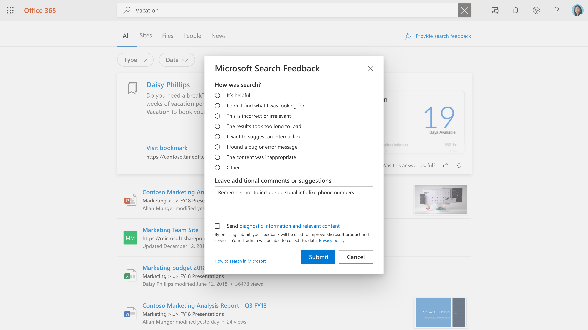

# Verwalten von Benutzerfeedback

Das Erstellen einer hervorragenden Suchumgebung für Ihre Benutzer ist eine Partnerschaft zwischen Microsoft und dem Suchadministrator. Mit dem Feedback Ihrer Benutzer können wir das Produkt kontinuierlich auswerten und optimieren, um die beste Erfahrung zu erzielen. Feedback wird jedoch am besten von Ihnen beantwortet.

Wir bieten jetzt Tools an, mit denen Sie das Feedback ihrer Benutzer zur Suchumgebung überprüfen und verwalten können.

## Übermitteln von Feedback durch Benutzer

Wenn Personen in Ihrer Organisation Microsoft Search verwenden, haben sie möglicherweise Feedback zu der Erfahrung. Wenn sie auf der Ergebnisseite auf einen Feedbacklink klicken, können sie ihr Feedback kategorisieren und zusätzliche Kommentare hinzufügen.

Benutzer haben auch die Möglichkeit, ihre Abfrage und andere Diagnoseinformationen zusammen mit der Kategorie und den Kommentaren an Microsoft zu senden. [Erfahren Sie mehr](https://privacy.microsoft.com/en-US/privacystatement) über den Datenschutz und wie wir diese Daten schützen. Die Diagnosedaten enthalten die wichtigsten Informationen, die Microsoft benötigt, um das Feedbackelement für die Produktverbesserung zu verwenden.

Die meisten Feedbackübermittlungen werden im [Feedback-Abschnitt](https://admin.microsoft.com/Adminportal/Home#/MicrosoftSearch/feedback) des Microsoft Search Admin Centers angezeigt. Feedback, das mit der **Kategorie "Ich möchte eine interne Linkkategorie vorschlagen"** gesendet wird, wird als vorgeschlagenes Lesezeichen im Abschnitt ["Lesezeichen"](https://admin-ignite.microsoft.com/Adminportal/Home#/MicrosoftSearch/bookmarks) angezeigt und kann durch Filtern nach dem Status **"Vorgeschlagen"** angezeigt werden.

## Feedback überprüfen

Auf der [Feedbackseite](https://admin.microsoft.com/Adminportal/Home#/MicrosoftSearch/feedback) können Sie Feedback überprüfen und exportieren, das Personen in Ihrer Organisation in den letzten 30 Tagen gesendet haben. Nachdem ein Benutzer Feedback übermittelt hat, wird es innerhalb von 20 Minuten in dieser Liste angezeigt. Sie können die Schaltfläche "Aktualisieren" verwenden, um sicherzustellen, dass Sie die aktuellsten Daten betrachten.

Mithilfe eines Filters können Sie Feedback für bestimmte Antworttypen anzeigen. Sie können auch nach Quelle und Datumsbereich filtern.

Sie können das Suchfeld über der Feedbackliste verwenden, um nach Feedback für eine bestimmte Abfrage zu suchen.

In der Feedbackliste gibt die Spalte Verbatim an, welches Feedback des Benutzers auch einen Kommentar oder Vorschlag enthält. Klicken Sie zum Lesen auf die Abfrage, um den **Detailbereich** zu öffnen.

## Aktualisieren des Feedbackstatus

Wenn Feedback eingeht, befindet es sich in einem *neuen* Zustand und bleibt dort, bis Sie es in *Aufgelöst* oder *Duplizieren* ändern.

So ändern Sie diesen Zustand:

1. Wählen Sie neben der Abfrage **weitere Optionen** (drei vertikale Punkte) aus.
1. Wählen Sie im Menü **"Als aufgelöst** markieren" oder **"Als dupliziert markieren" aus.**
1. Die Liste wird aktualisiert und zeigt den aktualisierten Zustand an.

Sie können auch den Status für mehrere Elemente aktualisieren, wählen Sie sie einfach aus, und wählen Sie dann neben jedem dieser Elemente weitere Optionen aus.

## Exportieren von Feedback

Wenn Sie Suchfeedback mit anderen personen teilen oder diese länger als 30 Tage aufbewahren möchten, klicken Sie auf **"Exportieren".** Eine .csv Datei mit dem Namen "Feedbacks" mit dem Datum, z. B. "Feedbacks_10_31_2020.csv", wird automatisch heruntergeladen.

## Senden von Benutzerfeedback an Microsoft

Standardmäßig wird das gesamte Benutzerfeedback an Microsoft und zusätzlich zu Ihnen gesendet. Wenn Sie das Senden von Feedback an Microsoft beenden möchten, klicken Sie auf **Einstellungen verwalten,** und deaktivieren Sie das Kontrollkästchen **"Benutzerfeedback automatisch an Microsoft senden".** Es kann bis zu 24 Stunden dauern, bis diese Änderung wirksam wird.

Wenn Sie sich entschieden haben, feedback nicht automatisch an Microsoft zu senden, können Sie weiterhin einzelne Feedbackelemente an Microsoft senden.

1. Wählen Sie das Feedback aus, das Sie teilen möchten.
1. Wählen Sie in der Aktionsleiste weitere (drei Punkte) aus, und klicken Sie auf **"Feedback an Microsoft senden".**

1. Der Status in der Spalte "An Microsoft gesendet" wird in "Ausstehend" geändert. Wenn das Feedback gesendet wird, wird es zu "Ja" geändert.

Wenn Sie Feedback automatisch oder manuell freigeben, enthält es niemals Abfragen und andere Diagnoseinformationen für Benutzer, die sich entschieden haben, diese Informationen nicht einzuschließen.

## Vorschläge zur Verwendung von Feedback

Als Suchadministrator sollten Sie die wichtigsten Personas in Ihrer Organisation verstehen und wissen, mit welchen Arten von Inhalten diese Personen in der Regel interagieren und nach denen sie suchen. Mit diesem Verständnis können Sie Feedback verwenden, um die Sucherfahrung Ihrer Benutzer gezielt zu verbessern.

1. "Ich habe nicht gefunden, wonach ich gesucht habe" und ähnliches Feedback kann verwendet werden, um inhalte zu identifizieren, die Benutzer wünschen, aber derzeit nicht im Suchindex enthalten sind. Dies zu bestimmen, erfordert häufig Untersuchungen und Schlussfolgerungen, die auf dem Verständnis Ihrer Benutzer basieren. Nachdem Sie gefunden wurden, entscheiden Sie, welche Methoden zum Einschließen dieses Inhalts am besten geeignet sind:
    1. Lesezeichen eignen sich für Inhaltsquellen mit einer qualitativ hochwertigen Zielseite und einer begrenzten Auswahl an Suchbegriffen, sodass die Benutzercommunity ein qualitativ hochwertiges Ergebnis aus dem Lesezeichen erhält und dann effizient finden kann, wonach sie suchen.
    1. F&A sind nützlich für individuelle Antworten, die relativ häufig, aber nicht geändert werden.
    1. Connectors eignen sich für Inhaltsquellen mit einer Vielzahl von Inhalten und einer vielzahl von Suchbegriffen.
1. "Das Laden der Ergebnisse hat zu lange gedauert", & "Ich habe ein Problem gefunden" kann ein Anzeichen für ein umfassenderes Problem sein. Die tägliche Suche nach diesem Feedback kann hilfreich sein, und wenn mehrere Fälle auftreten, können Sie die Suchumgebung für sich selbst überprüfen und bei Bedarf einen Supportfall bei Microsoft öffnen. Diese Art von Feedback ist auch für Microsoft wichtig und ein hervorragender Grund, uns das gesamte Feedback zu senden.
1. "Ich möchte einen internen Link vorschlagen" kann als Lesezeichen oder verbundener Inhalt ausgewertet werden. Ihr erster Wähnt sollte ein Lesezeichen sein. wenn das Lesezeichen stark verwendet wird, können Sie erwägen, Inhalte über einen Connector einzubringen, um eine noch umfangreichere Suchumgebung zu ermöglichen.
