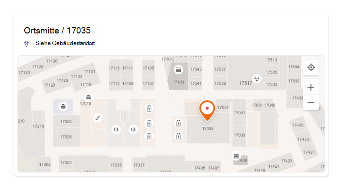
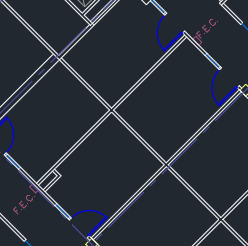

# Verwalten von Grundrissenplänen

Grundrisse in Microsoft Search Benutzern helfen, Personen, Räume und Räume in einem Gebäude zu finden. Abfragemuster, die wie die folgenden Beispiele den vollständigen Namen, Vornamen, Raumnamen oder Raumstandort einer Person enthalten, geben einen Grundriss zurück:

- Wo befindet sich allan Deyoungs Büro?
- Wo befindet sich Daisys Büro?
- Gebäude 2 Stockwerk 3
- Arbeitsbereich-1
- B1/1.20

## Benutzerfreundlichkeit

Benutzer können die Antworten auf Grundrisse auf [Bing,](https://bing.com) [SharePoint](http://sharepoint.com/)und [Office 365](https://office.com)sehen. Andere Einstiegspunkte, die Bing Ergebnisse zurückgeben, einschließlich Windows Suche und der Microsoft Edge Adressleiste, werden ebenfalls unterstützt. Wenn Benutzer nach einem Raumnamen oder -ort suchen, wird der interessante Punkt in der Antwort auf den Grundriss angezeigt.

> [!div class="mx-imgBorder"]
> 

Wenn sie nach dem Büro einer Person suchen, wird eine ähnliche Antwort mit dem Profilbild der Person auf dem Marker angezeigt.

> [!div class="mx-imgBorder"]
> 

## Hinzufügen von Grundrissen

Führen Sie die folgenden Schritte aus, um die Antworten auf Grundrisse in Microsoft Search einzurichten.

### Schritt 1: Ermitteln der Gebäudecodes

Gebäudecodes werden als Teil des Bürostandorts eines Benutzers verwendet. Sie verwenden diese Codes beim Aktualisieren von Benutzerprofilen. Angenommen, Ihre Organisation hat ein Gebäude an dieser Adresse: *Building 2, 350 5th Avenue, New York City, NY 10016*

Hier sind einige gute Beispiele für den Code des Gebäudes: 2, B2, Building2, Building 2 oder NYCB2. Jedes Gebäude muss einen eindeutigen Code aufweisen.

### Schritt 2: Überprüfen Ihrer Grundrisse

Grundrissedateien müssen im DWG-Format vorliegen, das Textbeschriftungen unterstützt. Wenn eine Textbeschriftung einen Raum kennzeichnet, wird dies als Raumbeschriftung bezeichnet. Hier sind einige Beispiele für DWG-Dateien mit verschiedenen Bezeichnungstypen:

| Textbeschriftungen einschließlich Raumbeschriftungen | Textbeschriftungen, aber keine Raumbeschriftungen | Keine Textbeschriftungen |
|:-----:|:-----:|:-----:|
||||

Als bewährte Methode sollten DWG-Textbeschriftungen Bodennummern, Wing-Nummern (falls relevant) und Raumnummern in dieser Reihenfolge enthalten. Weitere Beispiele für Textbeschriftungsformate sowie Informationen zum Anzeigen und Aktualisieren von DWG-Dateien finden Sie in den [häufig gestellten Fragen.](#frequently-asked-questions)

### Schritt 3: Aktualisieren von Office-Speicherorten in Benutzerprofilen

Der Bürostandort eines Benutzers ist eine Kombination aus einem Gebäudecode und einer Raumbezeichnung. Wenn die Gebäudecode beispielsweise *2* und die Raumbeschriftung *1173* ist, würde der Bürostandort *2/1173* sein.

Hinzufügen oder Aktualisieren von Bürostandorten für Benutzer mit einem zugewiesenen Arbeitsstandort. Sie können dies über das Benutzerprofil im [Microsoft 365](https://admin.microsoft.com) oder [Azure Active Directory](https://portal.azure.com/) Admin Center oder in Ihrem lokalen Active Directory tun (wird mit Azure Active Directory synchronisiert). *PhysicalDeliveryOfficeName* ist das Feld, das für den Bürostandort verwendet wird. Wenn Ihre Raumbeschriftungen keine Bodennummern enthalten, finden Sie in den [HÄUFIG gestellten Fragen](#frequently-asked-questions) Tipps.

In diesem Beispiel befindet sich das Büro von Allan im Raum 1173 im Stock 1 von Gebäude 2.

> [!div class="mx-imgBorder"]
> 

Um Grundrisse für Besprechungsräume einzurichten, fügen Sie im Abschnitt ["Räume & Geräte"](https://admin.microsoft.com/Adminportal/Home#/ResourceMailbox) des Microsoft 365 Admin Center Bürostandorte für sie hinzu. Weitere Informationen finden Sie unter [Einrichten von Raum- und Gerätepostfächern.](/microsoft-365/admin/manage/room-and-equipment-mailboxes#set-up-room-and-equipment-mailboxes) Wenn Personen in Ihrer Organisation den Raum oder die Ressource für eine Besprechung oder ein Ereignis planen können, lesen Sie Informationen dazu, [wie ein Raumpostfach Besprechungsanfragen verarbeitet.](/Exchange/recipients/room-mailboxes#change-how-a-room-mailbox-handles-meeting-requests) Informationen zum Konfigurieren von Arbeitsbereichen, einschließlich des Einrichtens von Raumpostfächern, finden Sie im Beitrag zum [Reservieren eines Arbeitsbereichs in Outlook.](https://techcommunity.microsoft.com/t5/exchange-team-blog/book-a-workspace-in-outlook/ba-p/1524560)

### Schritt 4: Überprüfen des Bürostandorts

Verwenden Sie Microsoft Search, um einen Benutzer zu finden und zu überprüfen, ob sein Büroort korrekt angezeigt wird. Möglicherweise müssen Sie bis zu **72 Stunden** warten, bis die Updates in den Suchergebnissen angezeigt werden.

> [!div class="mx-imgBorder"]
> 

### Schritt 5: Hinzufügen von Gebäudestandorten

Grundrisse verwenden [Standorte,](manage-locations.md) um Ihre Gebäude zu definieren. Wechseln [Sie](https://admin.microsoft.com)im Microsoft 365 Admin Center zu [**Speicherorte,**](https://admin.microsoft.com/Adminportal/Home#/MicrosoftSearch/locations)und wählen Sie dann **Hinzufügen** aus. Geben Sie den Namen, die Adresse und die Schlüsselwörter für das Gebäude ein. Fügen Sie beliebig viele Gebäude hinzu.

> [!div class="mx-imgBorder"]
> 

Weitere Informationen zu Speicherorten finden Sie unter [Verwalten von Standorten](manage-locations.md)

### Schritt 6: Sammeln und Organisieren von Bürostandorten

Bevor Sie Grundrisse hochladen können, müssen Bürostandorte indiziert werden. Dieser einmalige Vorgang kann bis zu 48 Stunden dauern. Die Gesamtzeit hängt von der Größe Ihrer Organisation ab.

Wechseln [Sie im Admin Center](https://admin.microsoft.com)zu [**"Grundrisse",**](https://admin.microsoft.com/Adminportal/Home#/MicrosoftSearch/floorplans)und wählen Sie dann **"Indizierung beginnen"** aus. Wenn dieser Hinweis nicht angezeigt wird, wurde dieser Schritt bereits für Ihre Organisation abgeschlossen.

### Schritt 7: Hochladen Grundrisse

1. Wechseln [Sie](https://admin.microsoft.com)im Admin Center zu [**"Grundrisse".**](https://admin.microsoft.com/Adminportal/Home#/MicrosoftSearch/floorplans)

2. Wählen Sie in der Dropdownliste ein Gebäude aus, und wählen Sie **"Weiter"** aus. Wenn das Gebäude nicht aufgeführt ist, wechseln Sie zurück, und [fügen Sie Gebäudestandorte hinzu.](#step-5-add-building-locations)

3. Wählen Sie **Hochladen Dateien** aus, und wählen Sie dann den Grundplan aus, den Sie hochladen möchten.

4. Wenn der Upload abgeschlossen ist, müssen Sie die Floor-Nummer eingeben, die in der Grundrissdatei dargestellt ist. Wählen Sie dann **Weiter** aus.

5. (Optional) Wenn Ihr Stockwerk Über- oder Zonen verfügt, geben Sie dieses Detail ein.

6. Es wird ein Prüfbildschirm mit der Anzahl der Bürostandorte angezeigt, die den Grundrissen zugeordnet wurden. Wählen Sie **Details** aus, um sicherzustellen, dass die Zuordnung korrekt ist.
    - Wenn keine Benutzer zugeordnet sind oder Sie mit der Zuordnung nicht zufrieden sind, wählen Sie **"Zuordnung fortsetzen"** aus.
    - Wählen Sie zum Veröffentlichen **"Überspringen" und "Veröffentlichen"** aus.

1. Geben Sie den Gebäudecode für diesen Grundriss ein. Der Gebäudecode befindet sich in der Office Location-Eigenschaft des Benutzers. Wenn beispielsweise der Bürostandort eines Benutzers **2/1173** ist, ist der Gebäudecode **2**.

1. Wiederholen Sie auf dem Prüfbildschirm Schritt 6, um sicherzustellen, dass die Zuordnung korrekt ist. Wenn Sie mit der Zuordnung zufrieden sind, wählen Sie **"Zuordnung fortsetzen"** und **"Überspringen und veröffentlichen"** aus. Wenn nicht, wählen Sie **"Zuordnung fortsetzen"** aus, und wechseln Sie zum Bildschirm "Standortmuster angeben".

1. (Optional) Überprüfen und identifizieren Sie die Benennungslogik für alle eindeutigen Standortmuster für dieses Gebäude in Ihrem Azure-Verzeichnis, und wählen Sie dann **"Weiter"** aus.

1. Wiederholen Sie auf dem Prüfbildschirm Schritt 6, um sicherzustellen, dass die Zuordnung korrekt ist.

1. Wenn Sie bereit sind, wählen Sie **"Veröffentlichen"** aus, um den Grundriss in Microsoft Search verfügbar zu machen.

> [!NOTE]
> **Es dauert 48 Stunden, bis die Grundrisse veröffentlicht wurden.** Danach sehen Ihre Benutzer ein Stockwerksplanergebnis ähnlich dem unten stehenden, wenn sie nach einem Büro eines Kollegen suchen.

> [!div class="mx-imgBorder"]
> 

### Schritt 8: (Optional) Angeben von Standortmustern

Nach dem Hochladen eines Grundrisses werden die Raumtextbeschriftungen mit den Bürostandorten in den Profilen Ihrer Benutzer verglichen. Wenn die Bürostandorte oder Textbeschriftungen nicht konsistent den empfohlenen Benennungsmustern in [Schritt 2](#step-2-review-your-floor-plans) und [Schritt 3](#step-3-update-office-locations-on-user-profiles)folgen, verwenden Sie den Bildschirm **"Speicherortmuster angeben",** um weitere Informationen zum Abschließen der Zuordnung hinzuzufügen. Standortmuster werden verwendet, um Boden-, Wing- und Rauminformationen aus AAD-Bürostandorten zu extrahieren.

> [!div class="mx-imgBorder"]
> 

Boden und Wing sind optional, es ist nur Platz erforderlich, und Sie können standorte nach Bedarf überspringen.

## Aktualisieren von Grundrissenplänen

Stellen Sie vor dem Aktualisieren eines vorhandenen Grundplans sicher, dass Ihre AAD-Bürostandorte aktuell sind und Sie 48 Stunden lang gewartet haben, bis AAD-Updates verarbeitet werden. Um einen Grundriss zu aktualisieren, wechseln Sie zu "Grundrisse", wählen Sie das Gebäude für den Grundriss aus, und wählen Sie **"Bearbeiten"** aus. Wenn sich der Grundplan strukturell geändert hat, entfernen Sie z. B. aufgrund eines Umgestaltens die alte Datei, laden Sie die neue DWG-Datei hoch und veröffentlichen Sie sie.

> [!NOTE]
> Sie müssen Grundrisse nicht aktualisieren, wenn Benutzer zu einem Bereits zugeordneten Stockwerk wechseln. Aktualisieren Sie einfach das Benutzerprofil, um den neuen Bürostandort widerzuspiegeln:
>
> - Im Microsoft 365 Admin Center (Aktive Benutzer > Konto > Kontaktinformationen verwalten)
> - Im Azure Active Director Admin Center (Benutzer > Profil > Kontaktinformationen bearbeiten)
> - In Ihrem lokalen Active Directory (wird mit Azure Active Directory synchronisiert)

## Löschen von Grundrissen

Um einen einzelnen Grundriss zu löschen, wechseln Sie zu ["Grundrisse",](https://admin.microsoft.com/Adminportal/Home#/MicrosoftSearch/floorplans) und wählen Sie das Gebäude aus. Wählen Sie als Nächstes den Grundriss aus, und wählen Sie **"Entfernen" aus.** Um alle Grundrisse für ein Gebäude zu löschen, wechseln Sie zu ["Standorte",](https://admin.microsoft.com/Adminportal/Home#/MicrosoftSearch/locations)wählen Sie das Gebäude aus, und wählen Sie **"Löschen"** aus.  

## Problembehandlung

| Schritt | Fehlermeldung | Typ | Aktion |
|:-----|:-----|:-----|:-----|
|Hochladen Grundrisse|CC_1.dwg kann nicht gelesen werden. Laden Sie den Grundplan erneut hoch oder löschen Sie ihn.|Fehler|Versuchen Sie erneut, die Datei hochzuladen. Wenn dies nicht funktioniert, löschen Sie die Datei, und versuchen Sie es erneut.|
|Hochladen Grundrisse|Es gibt zwei Dateien mit dem Namen CC_1.dwg. Löschen Sie einen dieser Elemente, oder laden Sie ihn mit einem anderen Namen erneut hoch.|Fehler|Wenn der Dateiname falsch ist, fügen Sie die Boden- oder Wing-Nummer hinzu, um einen eindeutigen Dateinamen zu erstellen und ihn erneut hochzuladen. Wenn Sie versehentlich die gleiche Datei zweimal hinzugefügt haben, löschen Sie einfach eine dieser Dateien.|
|Hochladen Grundrisse|Es wurden keine Daten gefunden.|Fehler|Überprüfen Sie Ihre Datei, um sicherzustellen, dass sie die richtige ist, und laden Sie sie dann erneut hoch, oder löschen Sie sie.|
|Hochladen Grundrisse|Externe Verweise fehlen in dieser Datei. Laden Sie entweder CC_1_furniture.dwg hoch, oder löschen Sie diese Datei.|Warnung|Hochladen externen Referenzdateien oder löschen.|
|Hochladen Grundrisse|Raumnummern oder Tags in der DWG-Datei konnten nicht gelesen werden. Löschen Sie diese Datei.|Warnung|Überprüfen Sie Ihre DWG-Datei, um sicherzustellen, dass die Daten enthalten sind, löschen Sie die Datei, und versuchen Sie es erneut.|
|Verknüpfen von Bürostandorten|In Azure Active Directory wurden keine Bürostandorte gefunden. Fügen Sie Standortdaten zu Azure Active Directory hinzu, bevor Sie Grundrisse einrichten.|Fehler|[Aktualisieren von Office-Speicherorten in Benutzerprofilen](#step-3-update-office-locations-on-user-profiles) |

## Häufig gestellte Fragen

**F:** Wie kann ich DWG-Dateien anzeigen und bearbeiten?

**A:** Verwenden Sie eine der folgenden Optionen, um DWG-Dateien anzuzeigen:

- Hochladen die Datei, um sie zu SharePoint und zu öffnen.
- Öffnen Sie die Datei in [Microsoft Visio](https://support.office.com/article/Open-insert-convert-and-save-DWG-and-DXF-AutoCAD-drawings-60cab691-0f4c-4fc9-b775-583273c8dac5) oder [Einem DWG TrueView](https://www.autodesk.com/products/dwg).
- Hochladen Sie die Datei an [den Online Viewer weiter.](https://viewer.autodesk.com/)

Sie können eine DWG-Datei in einem beliebigen DWG-Editor erstellen oder bearbeiten, einschließlich Visio oder AutoCAD. Informationen zur Verwendung von Visio finden Sie unter [Erstellen eines Grundplans.](https://support.microsoft.com/office/create-a-floor-plan-ec17da08-64aa-4ead-9b9b-35e821645791) Die maximale Dateigröße für eine einzelne DWG-Datei beträgt 16 MB.

**F:** Wie füge ich Textbeschriftungen zu nicht gekennzeichneten Räumen hinzu?

**A:** Öffnen Sie die DWG-Datei in einem Editor, und [fügen Sie Raumbeschriftungen hinzu.](https://knowledge.autodesk.com/support/autocad-map-3d/learn-explore/caas/CloudHelp/cloudhelp/2019/ENU/MAP3D-Learn/files/GUID-4854F184-6279-4E0C-9487-34A4759017F6-htm.html)

**F:** Was ist das beste Format für Textbeschriftungen in DWG-Dateien?

**A:** Um die besten Ergebnisse zu erzielen, sollten DWG-Textbeschriftungen eine einzelne Zeile sein, die Bodennummern, Wing-Nummern (falls relevant) und Raumnummern in dieser Reihenfolge enthält. Die beispiele unten verwenden 2 oder CITY CENTER für den Gebäudecode.
<!-- markdownlint-disable no-inline-html -->
|Raumbeschriftungstypen|Untergrenze|Wing/Zone|Raum|Beispieltextbeschriftung|Office Speicherort (Gebäudecode/Textbeschriftung)|
|:-----|:-----|:-----|:-----|:-----|:-----|
|Hat Stockwerk und Raumnummer|1| |173|1173|2/1173|
|| 21| |45|21045|2/21045|
||23| |100 KB|23-100 KB|23.02.100 KB|
||1| |G06-07|1G06-07|CITY CENTER/1G06-07|
||2| |1024A|02.1024A|CITY CENTER/02.1024A|
|Hat Boden, Wing und Raumnummer|1|A|173|1A173|1.02.1A173
||2|Z1|128b|2Z1128b|2/2Z1128b

Fügen Sie in der DWG-Datei auch keine zusätzlichen Textbeschriftungen hinzu, z. B. Raumabmessungen oder Name des Architekten.

**F:** Gibt es Zeichenbeschränkungen für Textbeschriftungen?

**A:** Textbeschriftungen müssen eine einzelne Zeile sein. Sonderzeichen können für Gebäudecodes oder Raumbeschriftungen verwendet werden, jedoch nicht für Boden- oder Wing-Werte.

**F:** Kann ich eine DWG-Datei verwenden, die keine Bodennummern enthält?

**A:** Wir empfehlen, dass die DWG-Textbeschriftungen Bodennummern enthalten, die jedoch nicht erforderlich sind, siehe Benennungsmuster in [Schritt 2.](#step-2-review-your-floor-plans) Außerdem sollten Sie die Bodenfläche weiterhin als Teil des Bürostandorts in die Kontaktinformationen des Benutzers einschließen. Nachdem Sie die DWG-Datei hochgeladen haben, müssen Sie den optionalen Bildschirm **"Speicherortmuster angeben"** verwenden, um den Zuordnungsprozess für diese nicht standardmäßigen Bezeichnungen abzuschließen.

Eine DWG-Datei, die Raumnummern, aber keine Bodennummern enthält, sieht z. B. wie folgt aus:

> [!div class="mx-imgBorder"]
> 

Der Bürostandort im Profil des Benutzers lautet 2/1175, wobei "2" der Gebäudecode, "1" die Stockzahl und "175" die Raumnummer ist.

**F:** Ich habe einen Gebäudestandort hinzugefügt. Warum wird die Option zum Hinzufügen eines Grundrisses nicht angezeigt?

**A:** Kürzlich hinzugefügte oder aktualisierte Gebäudestandorte befinden sich möglicherweise noch nicht im Suchindex. Es kann mehrere Stunden dauern, bis neue oder geänderte Speicherorte in suchergebnissen angezeigt werden. Wenn das Gebäude einen Entwurf oder einen veröffentlichten Grundriss hat, wählen Sie außerdem den Gebäudenamen aus, und fügen Sie dann weitere Pläne hinzu.

**F:** Warum wird in der Liste "Gebäude auswählen" meine vollständige Liste der Standorte nicht angezeigt?

**A:** In der Liste "Gebäude auswählen" werden nur Gebäude ohne Grundrisse angezeigt. Fügen Sie für Gebäude mit mindestens einem Entwurf oder veröffentlichten Grundrissen weitere Grundrisse hinzu, indem Sie das Gebäude in der Liste auswählen und dann hochladen.

**F:** Gibt es Beschränkungen für die Anzahl der Grundrisse, die ich hochladen kann?

**A:** Nein. Es gibt kein Maximum, weder pro Gebäude noch pro Organisation.

**F:** Kann ich eine DWG-Datei verwenden, die Pläne für mehrere Zonen innerhalb einer einzelnen Ebene enthält?

**A:** Solange alle Pläne für die gleiche Fläche gelten, können Sie eine DWG-Datei hochladen, die Grundrisse für mehrere Flächen/Zonen enthält. Stellen Sie sicher, dass die Textbeschriftungen und Office-Speicherorte den bewährten Benennungsmethoden in [Schritt 2](#step-2-review-your-floor-plans) und [Schritt 3](#step-3-update-office-locations-on-user-profiles)entsprechen.

Wenn die DWG-Datei Daten für mehrere Felder enthält, lassen Sie das Wing-Feld beim Hochladen leer.

**F:** Kann ich zwei DWG-Dateien für dieselbe Fläche hochladen, eine mit nur definierter Bodenfläche und eine mit boden- und wing-definierter Fläche?

**A:** Sie können mehrere DWG-Dateien für dieselbe Stockwerksfläche hochladen, aber Sie müssen einen Wing oder eine Zone für jede Datei angeben. Im folgenden Beispiel müssen Sie einen Wing- oder Zonenwert für die Datei FloorPlan1.dwg eingeben, bevor Sie zum nächsten Bildschirm wechseln können. Wenn die Grundriss-Datei keinen Wing hat oder mehrere Laufflächen aufweist, geben Sie einen Wert wie 0 oder X in das Feld "Wing" oder "zone" ein, um fortzufahren.

> [!div class="mx-imgBorder"]
> 

**F:** Kann ich mehrere Grundrisse gleichzeitig hochladen und aktualisieren?

**A:** Sie können mehrere Grundrisse für ein einzelnes Gebäude gleichzeitig hochladen. Massenvorgänge, z. B. das Importieren von Grundrissen für mehrere Gebäude, sind nicht verfügbar.

**F:** Meine Organisation hat Hunderte von Benutzern. Muss ich Speicherortmuster für jedes Angeben angeben?

**A:** Nein. Wenn Sie die Formatierungsempfehlungen für Bezeichnungen und Bürostandorte in [Schritt 2](#step-2-review-your-floor-plans) und [Schritt 3](#step-3-update-office-locations-on-user-profiles)sowie die abgeschlossenen Elemente 1 bis 8 in [Schritt 7](#step-7-upload-floor-plans)befolgt haben, sollten Sie keine Speicherortmuster angeben müssen.

Wenn Ihre Benutzer jedoch weiterhin nicht zugeordnet sind oder Sie mit der Zuordnung nicht zufrieden sind, führen Sie den optionalen [Schritt 8](#step-8-optional-specify-location-patterns)aus. In Schritt 8 müssen Sie jedes *eindeutige* Standortmuster definieren, das sich in Azure AD für diesen Gebäudecode befindet. Sie laden beispielsweise einen Grundplan für das Gebäude A hoch, das über 1.000 Büros verfügt. Fünf verschiedene Standortmuster werden für die Büros in Gebäude A verwendet. Beim Angeben von Standortmustern müssen Sie die fünf Muster definieren, die in Ihrem Azure AD für das Gebäude angezeigt werden.

**F:** Kann ich Grundplanantworten für Konferenzräume, Besprechungsräume oder Räume erstellen, denen keine Person zugewiesen ist?

**A:** Ja, sie können dies. Fügen Sie einfach den Besprechungsraum zu Ihrer Liste der Räume und Geräte hinzu. Weitere Informationen finden Sie unter [Einrichten von Raum- und Gerätepostfächern.](/microsoft-365/admin/manage/room-and-equipment-mailboxes#set-up-room-and-equipment-mailboxes) Wenn Personen in Ihrer Organisation den Raum oder die Ressource für eine Besprechung oder ein Ereignis planen können, lesen Sie Informationen dazu, [wie ein Raumpostfach Besprechungsanfragen verarbeitet.](/Exchange/recipients/room-mailboxes#change-how-a-room-mailbox-handles-meeting-requests) Informationen zum Konfigurieren von Arbeitsbereichen, einschließlich des Einrichtens von Raumpostfächern, finden Sie im Beitrag zum [Reservieren eines Arbeitsbereichs in Outlook.](https://techcommunity.microsoft.com/t5/exchange-team-blog/book-a-workspace-in-outlook/ba-p/1524560) Befolgen Sie für Grundrisse die Empfehlungen für die DWG-Raumbeschriftungen in [Schritt 2](#step-2-review-your-floor-plans) und den Profilstandort in [Schritt 3.](#step-3-update-office-locations-on-user-profiles) Nachdem Sie einen Raum oder Arbeitsbereich hinzugefügt haben, müssen Sie 72 Stunden warten, bis der Index aktualisiert wird, bevor Sie den Grundriss hochladen.

**F:** Ich habe alle Schritte zum Hinzufügen eines Grundplans abgeschlossen. Warum werden sie nicht in Microsoft Search Ergebnissen angezeigt?

**A:** Ein Link zur Antwort auf den Grundriss wird möglicherweise in der Mitte der Suchergebnisseite angezeigt. Diese Art der Rangfolge kann auftreten, wenn die Wahrscheinlichkeit geringer ist, dass die Antwort der Suchabsicht entspricht. Wenn auf der Ergebnisseite keine Informationen angezeigt werden, überprüfen Sie, ob die Suchvorgänge einem unterstützten Abfragemuster folgen: einem Office-Namen, einem Benutzernamen oder einem Bürostandort, wie er in AAD angezeigt wird. Teil- oder Fuzzywortüberstimmungen werden für Bodenplansuchen nicht unterstützt.

**F:** Ich habe Grundrisse für die Arbeitsbereiche meiner Organisation hinzugefügt. Warum werden sie nicht angezeigt, wenn sie einen Arbeitsbereich in Outlook buchen?

**A:** Derzeit unterstützt nur Outlook Mobile Arbeitsbereich-Grundrisse. Sie sind in der Desktop- oder Web-App nicht verfügbar. Weitere Informationen finden Sie im Beitrag zum [Buch eines Arbeitsbereichs in Outlook.](https://techcommunity.microsoft.com/t5/exchange-team-blog/book-a-workspace-in-outlook/ba-p/1524560)

**F:** Können meine Benutzer einen Besprechungsraum über eine Grundplanantwort reservieren?

**A:** Die Antworten auf den Grundplan umfassen nicht die Möglichkeit, einen Raum zu reservieren oder zu reservieren. Verwenden Sie den [Planungsassistenten oder raumsuche in Outlook,](https://support.microsoft.com/office/use-the-scheduling-assistant-and-room-finder-for-meetings-in-outlook-2e00ac07-cef1-47c8-9b99-77372434d3fa) um einen Besprechungsraum zu reservieren.

**F:** Können Sie ein Szenario beschreiben, in dem ich Standortmuster angeben müsste?

**A:** Angenommen, Sie haben ein Gebäude mit dem Code "Design B", und Sie versuchen, einen Plan für das erste Stockwerk hinzuzufügen, "F1". Die Bürostandorte in den Profilen der Benutzer weisen die folgenden Werte auf, die ihre Zellennummern auf dem Boden angeben:

- Benutzer 1: DesignB/F121
- Benutzer 2: DesignB/F122
- Benutzer 3: DesignB/F123
- Benutzer 4: DesignB/F124
- Benutzer 5: DesignB/F1-25
- Benutzer 6: DesignB/F1-26

Die DWG-Datei für den Boden weist die folgenden Textbeschriftungen für dieselben Schränke auf:

-  21
- 22
- 23
- 24
- 25
- 26

Aufgrund der Unterschiede zwischen den Bürostandorten, die in den Profilen der Benutzer angezeigt werden, und den entsprechenden Textbeschriftungen (DesignB/F121 und 21, DesignB/F1-25 und 25) können Microsoft Search nicht mit diesen übereinstimmen. Nach dem Hochladen der Datei zeigt die erste Überprüfung an, dass keine Speicherorte zugeordnet wurden. Fahren Sie mit der Zuordnung fort, und geben Sie in der Phase "Bürostandorte verknüpfen" den Gebäudecode DesignB ein.

In der zweiten Überprüfungsphase ignoriert Microsoft Search den Gebäudecodewert in den Bürostandorten der Benutzer und versucht erneut, die Bürostandorte und Textbeschriftungen (F121 und 21, F1-25 und 25) zuzuordnen. Die zweite Überprüfung zeigt, dass keine Standorte zugeordnet wurden. Sie müssen die Zuordnung erneut fortsetzen. An diesem Punkt werden Sie aufgefordert, Standortmuster anzugeben.

Wenn Sie Standortmuster angeben, müssen Sie nicht für jedes Büro Informationen hinzufügen, nur für die *eindeutigen Muster,* die in Azure AD angezeigt werden. In dieser Phase bestimmt Microsoft Search alle eindeutigen Standortmuster für das Gebäude, es ist nicht auf den Grundriss beschränkt, den Sie hochgeladen haben. Für die Benutzer in diesem Szenario gibt es zwei eindeutige Standortmuster. Für jedes Muster wird ein zufällig ausgewählter Speicherort angezeigt. Geben Sie die entsprechenden Boden- und Raumwerte ein:

|Ort|&nbsp;|Untergrenze|Wing oder Zone|Raum|
|:-----|:-----|:-----|:-----|:-----|
|DesignB/F123| |F1 | |23|
|DesignB/F1-26| |F1| |-26|

Als Nächstes wendet Microsoft Search die übereinstimmende Logik auf alle Speicherorte im Gebäude an, die diese Muster verwenden, und führt zwei Überprüfungen durch:

1. Stimmen die Werte für Räume mit einer der Textbeschriftungen in der DWG-Datei überein?
1. Stimmen die Werte "Floor", "Wing" und "Room" nach der Verkettung mit den Textbeschriftungen in der DWG-Datei überein?

Wenn eine der beiden Überprüfungen eine Übereinstimmung zurückgibt, ist die Standortzuordnung für dieses Muster erfolgreich, und Sie wechseln zur letzten Phase. In der Phase "Bereit für Los" wird die Anzahl der Benutzer angezeigt, die den Grundrisse-Standorten zugeordnet sind. Um dies zu überprüfen, wechseln Sie zum Detailbereich. In diesem Szenario würden nur benutzer 1 bis 4 zugeordnet. Die bevorzugte Methode zum Zuordnen von Benutzern 5 und 6 besteht darin, ihr Benutzerprofil so zu aktualisieren, dass es dem angegebenen Muster DesignB/F125 entspricht. Sie können auch die Textbeschriftungen in der DWG-Datei so bearbeiten, dass sie dem eindeutigen Muster entsprechen, -25 anstelle von 25.
