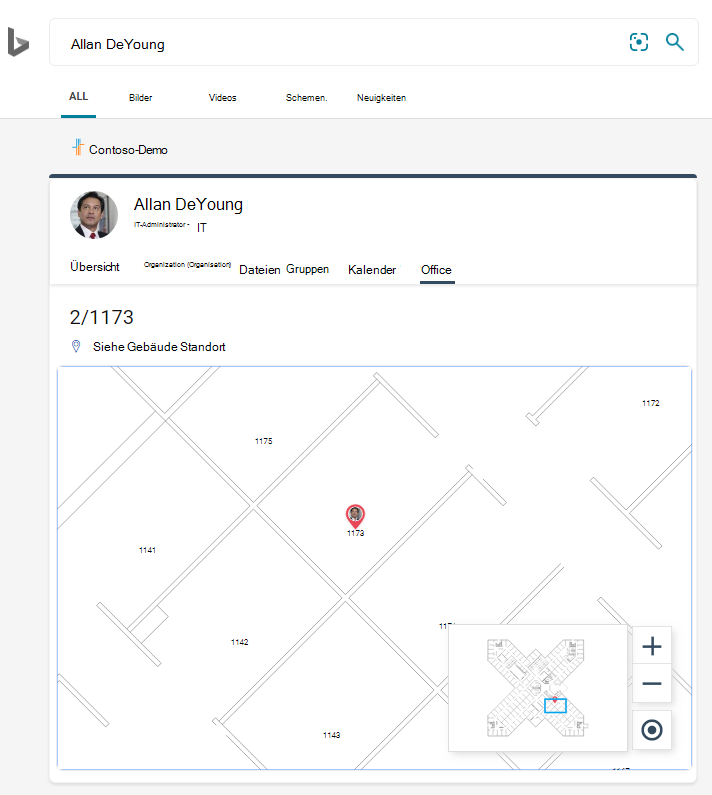
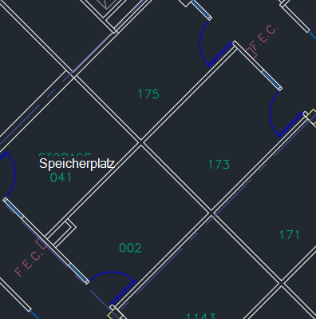

# Verwalten von Grundrissen

Grundrisse in der **Microsoft-Suche** helfen Benutzern, Personen und Besprechungsräume in einem Gebäude zu finden. Grundrisse beantworten Sie die folgenden Fragen:

- Wo ist Allan deyoungs Büro?
- Erstellen 2 Etage 3
- Suchen 2/11173

## Hinzufügen von Grundrissen

Führen Sie die folgenden Schritte aus, um die Antworten auf Grundrisse in **Microsoft Search**einzurichten.

### Schritt 1: Bestimmen der Gebäude Codes

Gebäude Codes werden als Teil des Office-Standorts eines Benutzers verwendet. Sie verwenden diese Codes beim Aktualisieren von Benutzerprofilen. Angenommen, Ihre Organisation verfügt über ein Gebäude an diesem Standort: *Building 2, 350 5th Avenue, New York City, NY 10016*

Hier sind einige gute Beispiele für den Code dieses Gebäudes: 2, B2, Building2, Building 2 oder NYCB2. Jedes Gebäude muss einen eindeutigen Code aufweisen.

### Schritt 2: Überprüfen der Grundrisse

Die Grund Riss Dateien müssen im DWG-Format vorliegen; DWG-Dateien können Textbeschriftungen enthalten. Wenn eine Textbeschriftung einen Raum markiert, wird Sie als raumbeschriftung bezeichnet. Die DWG-Datei muss mindestens **10 Räume** aufweisen, die mit Beschriftungen gekennzeichnet sind. Im folgenden finden Sie einige Beispiele für DWG-Dateien mit unterschiedlichen Beschriftungstypen:

|**Text Beschriftungen einschließlich Raumbeschriftungen**|**Text Beschriftungen, aber keine Raumbeschriftungen**|**Keine Textbeschriftungen**|
|:-----:|:-----:|:-----:|
||||

Weitere Informationen zum Anzeigen und Aktualisieren von DWG-Dateien finden Sie im Abschnitt [häufig gestellte Fragen](#frequently-asked-questions) .

### Schritt 3: Aktualisieren von Office-Speicherorten in Benutzerprofilen

Der Bürostandort eines Benutzers ist eine Kombination aus einem GEBÄUDECODE und einer raumbeschriftung. Wenn der GEBÄUDECODE beispielsweise *2* ist und die raumbeschriftung *1173*ist, lautet der Office-Standort *2/1173*.

Hinzufügen oder Aktualisieren von Office-Speicherorten für jeden Benutzer in Ihrer Organisation. Sie können den Office-Standort im Benutzerprofil im Microsoft 365 [Admin Center](https://admin.microsoft.com) ändern, oder Sie können sich in Ihrer lokalen Active Directory ändern, um Sie in Azure Active Directory zu synchronisieren. *PhysicalDeliveryOfficeName* ist das Feld, das für Office-Standort verwendet wird. Wenn Ihre Raumbeschriftungen keine Boden Nummern enthalten, lesen Sie die FAQ für Tipps.

In diesem Beispiel befindet sich Allans Büro in Raum 1173 auf der ersten Etage des Gebäudes 2.

> [!NOTE]
> Wenn Sie aktualisierte Office-Standorte bei der Suche nach Grundrissen anzeigen möchten, müssen Sie die Office-Standorte für mindestens **10 Personen** auf jeder Etage aktualisieren.

### Schritt 4: Überprüfen des Office-Standorts

Verwenden Sie die **Microsoft-Suche** , um nach einem Benutzer zu suchen und zu überprüfen, ob der Office-Standort ordnungsgemäß angezeigt wird. Wenn Sie nur Standorte aktualisiert haben, müssen Sie möglicherweise bis zu **72 Stunden** warten, bis die Updates in den Suchergebnissen angezeigt werden.

### Schritt 5: Hinzufügen von Erstellungs Standorten

In den Grundrissen werden [Standorte](manage-locations.md) verwendet, um ihre Gebäude zu definieren. Wechseln Sie im Microsoft 365 [Admin Center](https://admin.microsoft.com)zu **Einstellungen**  >  **Microsoft-Such**  >  **Speicherorte**, und wählen Sie dann **Hinzufügen**aus. Geben Sie den Namen, die Adresse und die Schlüsselwörter für das Gebäude ein. Fügen Sie so viele Gebäude hinzu, wie Sie benötigen.

Weitere Informationen zu Speicherorten finden Sie unter [Verwalten von Speicherorten](manage-locations.md) .

### Schritt 6: sammeln und organisieren von Office-Speicherorten

Bevor Sie Grundrisse verwenden können, müssen die Office-Standorte indiziert werden. Hierbei handelt es sich um einen einmaligen Vorgang, der bis zu 48 Stunden dauern kann. Die Gesamtzeit hängt von der Größe Ihrer Organisation ab.

Wechseln Sie in [Admin Center](https://admin.microsoft.com)zu **Einstellungen**  >  **Microsoft-Such**  >  **Bodenpläne**, und wählen Sie dann **Erste Schritte**aus. Wenn dieser Hinweis nicht angezeigt wird, wurde dieser Schritt bereits für Ihre Organisation abgeschlossen.

### Schritt 7: Hochladen von Grundrissen

1. Wechseln Sie im [Admin Center](https://admin.microsoft.com)zu **Einstellungen**  >  **Microsoft-Such**  >  **Bodenpläne**, und wählen Sie dann **Hinzufügen**aus.
2. Wählen Sie in der Dropdownliste ein Gebäude aus, und wählen Sie **weiter**aus. Wenn das Gebäude nicht aufgeführt ist, gehen Sie zurück und [fügen Sie Gebäudestandorte hinzu](#step-5-add-building-locations).
3. Wählen Sie **Dateien hochladen**aus, und wählen Sie dann den Grundriss aus, den Sie hochladen möchten.
4. Wenn der Upload abgeschlossen ist, müssen Sie die in der Grundriss Datei dargestellte Boden Nummer eingeben. Wählen Sie dann **Weiter** aus.
5. Optional Wenn Ihre Etage über Flügel oder Zonen verfügt, geben Sie diese Details ein.
6. Es wird ein Übersichtsbild angezeigt, in dem aufgeführt ist, wie viele Office-Standorte den Grundrissen zugeordnet wurden. Wählen Sie **Details** aus, um sicherzustellen, dass die Zuordnung korrekt ist.
    - Wenn keine Benutzer zugeordnet sind oder Sie mit der Zuordnung nicht zufrieden sind, wählen Sie **Zuordnung fortsetzen**aus. Wählen Sie zum Veröffentlichen die Option **überspringen und veröffentlichen**aus.
7. Geben Sie den GEBÄUDECODE für den Grundriss ein. Der GEBÄUDECODE befindet sich auf der Office-Standorteigenschaft des Benutzers. Wenn beispielsweise der Bürostandort eines Benutzers **2/1173**ist, lautet der GEBÄUDECODE **2**.
8. Wiederholen Sie auf dem Bildschirm Review Schritt 6, um sicherzustellen, dass die Zuordnung korrekt ist.
9. Optional Überprüfen und identifizieren Sie die Standort Muster für alle hochgeladenen Grundrisse, und wählen Sie dann **weiter**aus.
10. Wiederholen Sie auf dem Bildschirm Review Schritt 6, um sicherzustellen, dass die Zuordnung korrekt ist.
11. Wenn Sie bereit sind, wählen Sie **veröffentlichen** aus, um den Grundriss in der **Microsoft-Suche**zur Verfügung zu stellen.

> [!NOTE]
> **Es dauert 48 Stunden, bis die Grundrisse veröffentlicht werden.** Anschließend sehen die Benutzer ein Grundriss Ergebnis ähnlich dem unten, wenn Sie nach einem Mitarbeiter Büro suchen.

### Schritt 8: (optional) angeben von Standort Mustern

Nachdem Sie einen Grundriss hochgeladen haben, werden die Textbeschriftungen mit den Bürostandorten in den Profilen Ihrer Benutzer verglichen. Wenn weniger als 10 Übereinstimmungen vorhanden sind, wird der Bildschirm **Speicherortmuster angeben** angezeigt. Standort Muster werden zum Extrahieren von Boden-, Flügel-und Rauminformationen aus Office-Standorten verwendet.

Es sind nur Räume erforderlich, Boden und Flügel sind optional, und Sie können die Standorte bei Bedarf überspringen.

## Bearbeiten von Grundrissen

Zum Aktualisieren eines vorhandenen Grundrisses wählen Sie den Grundriss aus, den Sie ändern möchten, und wählen Sie dann **Bearbeiten**aus. Nehmen Sie die gewünschten Änderungen vor, und speichern Sie Sie.

## Problembehandlung

|**Schritt**|**Fehlermeldung**|**Typ**|**Action**|
|:-----|:-----|:-----|:-----|
|Hochladen von Grundrissen|CC_1. DWG kann nicht gelesen werden. Laden Sie den Grundriss erneut hoch oder löschen Sie ihn.|Error|Versuchen Sie erneut, die Datei hochzuladen. Wenn dies nicht funktioniert, löschen Sie die Datei, und versuchen Sie es erneut.|
|Hochladen von Grundrissen|Es gibt zwei Dateien mit dem Namen CC_1. dwg. Löschen Sie eine dieser oder laden Sie Sie mit einem anderen Namen erneut hoch.|Error|Wenn der Dateiname falsch ist, machen Sie den Dateinamen durch Hinzufügen von Floor-oder Wing-Informationen eindeutig, und laden Sie die Datei erneut hoch. Wenn Sie versehentlich dieselbe Datei zweimal hinzugefügt haben, löschen Sie Sie einfach.|
|Hochladen von Grundrissen|Keine Daten gefunden.|Error|Überprüfen Sie Ihre Datei, um sicherzustellen, dass Sie richtig ist, und laden Sie Sie dann erneut hoch, oder löschen Sie Sie.|
|Hochladen von Grundrissen|In dieser Datei fehlen externe Verweise. Laden Sie CC_1_furniture. DWG entweder hoch, oder löschen Sie diese Datei.|Warnung|Externe Referenzdateien hochladen oder löschen.|
|Hochladen von Grundrissen|In der DWG-Datei konnten keine Raumnummern oder Tags gelesen werden. Löschen Sie diese Datei.|Warnung|Überprüfen Sie Ihre DWG-Datei, um sicherzustellen, dass die Daten enthalten sind, und löschen Sie die Datei, und versuchen Sie es erneut.|
|Verknüpfen von Office-Standorten|Keine Office-Speicherorte in Azure Active Directory gefunden. Hinzufügen von Standortdaten zu Azure Active Directory vor dem Einrichten von Grundrissen.|Error|[Aktualisieren von Office-Speicherorten in Benutzerprofilen](#step-3-update-office-locations-on-user-profiles) |

## Häufig gestellte Fragen

**Q:** Wie kann ich DWG-Dateien anzeigen und bearbeiten?

**A:** Verwenden Sie eine der folgenden Optionen, um DWG-Dateien anzuzeigen:

- Laden Sie die Datei in SharePoint hoch, und öffnen Sie Sie.
- Öffnen Sie die Datei in [Microsoft Visio](https://support.office.com/article/Open-insert-convert-and-save-DWG-and-DXF-AutoCAD-drawings-60cab691-0f4c-4fc9-b775-583273c8dac5) oder [Autodesk DWG TrueView](https://www.autodesk.com/products/dwg).
- Laden Sie die Datei in [AutoDesks Online Viewer](https://viewer.autodesk.com/)hoch.

**Q:** Wie füge ich Textbeschriftungen zu nicht gekennzeichneten Räumen hinzu?

**A:** Öffnen Sie die DWG-Datei in einem Editor, und [fügen Sie Raumbeschriftungen hinzu](https://knowledge.autodesk.com/support/autocad-map-3d/learn-explore/caas/CloudHelp/cloudhelp/2019/ENU/MAP3D-Learn/files/GUID-4854F184-6279-4E0C-9487-34A4759017F6-htm.html).

**Q:** Wie kann ich DWG-Dateien zu Testzwecken erstellen oder bearbeiten?

**A:** Erstellen Sie eine DWG-Datei in Microsoft Visio, Autodesk AutoCAD oder einem anderen DWG-Editor. Stellen Sie sicher, dass 10 oder mehr Räume in der Datei beschriftet sind.

**F:** * * Was ist das beste Format für Textbeschriftungen in DWG-Dateien?

**A:** Um die besten Ergebnisse zu erzielen, sollten Textbeschriftungen Boden Nummern und Raumnummern enthalten. Die folgenden Beispiele verwenden 2 oder SC für den GEBÄUDECODE.
<!-- markdownlint-disable no-inline-html -->
|Raum Beschriftungstypen|Untergrenze|Raum|Beispieltext Bezeichnung|Office-Standort (GEBÄUDECODE/Textbezeichnung)|
|:-----|:-----|:-----|:-----|:-----|
|Verfügt über eine Boden-und Raumnummer|1 |173|1173|2/1173|
|| 21|45|21045|2/21045|
||23|100K|23-100K|2/23-100K|
||1 |G06-07|1G06-07|2/1G06-07|
||2 |1024A|02.1024|2/02.1024 a|
||2 |1024A|02.1024|2/02.1024 a|
||2 |105,01|2105,01|2/2105.01|
|Verfügt über GEBÄUDECODE, Boden und Raumnummer|0|X-11-M-12|2-0-X-11-M-12|2/2 -0-X-11-M-12 2-0-X-11-M-12|
||2 |128A|22128A|2/22128A 22128A|
||1 |B2-11|21-B2-11|2/21-B2-11 21-B2-11|
||2 |45|SC2045|SC/SC2045 SC2045|

**Q:** Kann ich eine DWG-Datei verwenden, die keine Boden Nummern enthält?

**A:** Ja, das können Sie. Wenn Sie Office-Standorte im Azure-Active Directory Profil des Benutzers aktualisieren, fügen Sie die Boden Nummer als Teil der Raumzahl hinzu, auch wenn Sie in der DWG-Datei fehlt. Nachdem Sie die Datei hochgeladen haben, wird der Bildschirm "Speicherortmuster angeben" angezeigt, und Sie können beide Werte angeben.

Beispielsweise kann eine DWG-Datei, die Raumnummern, aber keine Boden Nummern enthält, wie folgt aussehen:

Der Office-Standort im Profil des Benutzers sollte 2/1175 sein, wobei "2" der GEBÄUDECODE ist, ' 1 ' ist die Nummer des Stockwerks, und ' 175 ' ist die Raumnummer.
