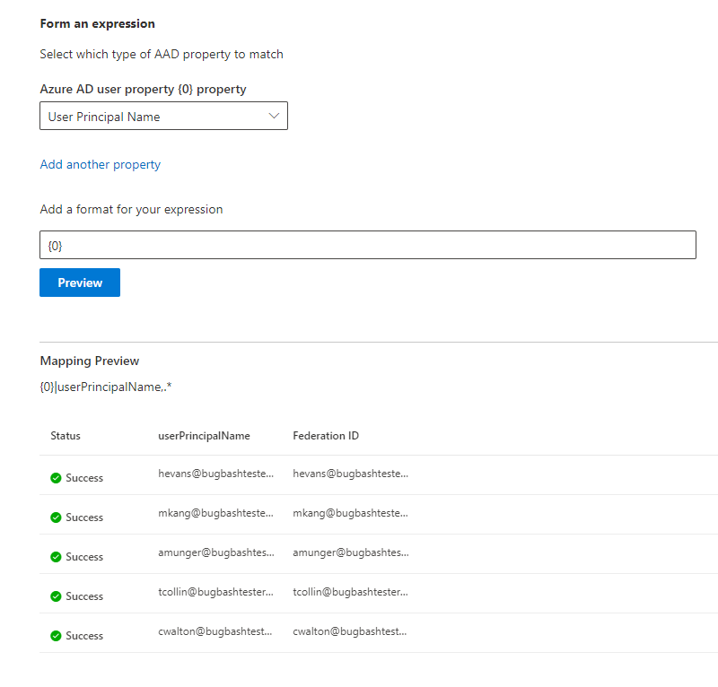

# Zuordnen Ihrer Azure AD IdentitätenMap your Azure AD Identities  

Dieser Artikel führt Sie durch die Schritte zum Zuordnen Ihrer Azure AD Identitäten zu einem eindeutigen Bezeichner für die Datenquelle (nicht Azure AD Identität), sodass Personen in ihrer Zugriffssteuerungsliste (ACL) mit nicht Azure Aden Identitäten Konnektor-Suchergebnisse auf Sie überprüfen können.This article walks you through the steps of mapping your Azure AD identities to a unique identifier for your data source (non-Azure AD identity) so that people in your Access Control List (ACL) with non-Azure AD identities can see connector search results scoped to them.

Diese Schritte sind nur für Suchadministratoren relevant, die einen [Salesforce](salesforce-connector.md) Connector von Microsoft mit Suchberechtigungen für "nur Personen mit Zugriff auf diese Datenquelle" und dem Identitätstyp "Aad" einrichten.These steps are only relevant to search administrators who are setting up a [Salesforce](salesforce-connector.md) connector by Microsoft with search permissions for "Only people with access to this data source" and identity type "AAD." In den folgenden Schritten erfahren Sie, wie Sie die Azure AD Benutzereigenschaften den **Verbund-IDs** Ihrer Benutzer zuordnen.The following steps walk you through how to map your Azure AD user properties to your users' **Federation IDs**.

>[!NOTE]
>Wenn Sie einen [Salesforce Connector](salesforce-connector.md) einrichten und **nur Personen mit Zugriff auf diese Datenquelle** und den Identitätstyp " **nicht Aad** " auf dem Bildschirm "Suchberechtigungen" auswählen, lesen Sie den Artikel [zuordnen Ihres nicht Azure AD Identitäten](map-non-aad.md) , um Schritte zum Zuordnen von nicht Azure Aden Identitäten zu erhalten.If you are setting up a [Salesforce connector](salesforce-connector.md) and select **Only people with access to this data source** and identity type **non-AAD** on the search permissions screen, refer to the [Map your non-Azure AD Identities](map-non-aad.md) article for steps on how to map non-Azure AD identities.  

## Schritte zum Zuordnen Ihrer Azure AD EigenschaftenSteps for mapping your Azure AD properties

### 1. Wählen Sie Azure AD Benutzereigenschaften zur Zuordnung aus.1. Select Azure AD user properties to map

Sie können die Azure AD Eigenschaften auswählen, die Sie der Verbund-ID zuordnen müssen.You can select the Azure AD properties you need to map to the Federation ID.

Sie können eine Azure AD Benutzereigenschaft aus der Dropdownliste auswählen.You can select an Azure AD user property from the dropdown. Sie können auch so viele Azure AD Benutzereigenschaften hinzufügen, wie Sie möchten, wenn diese Eigenschaften zum Erstellen der Verbund-ID-Zuordnung für Ihre Organisation erforderlich sind.You can also add as many Azure AD user properties as you would like if these properties are necessary to create the Federation ID mapping for your organization.

### 2. Formel erstellen, um die Zuordnung abzuschließen2. Create formula to complete mapping

Sie können die Werte der Azure AD Benutzereigenschaften kombinieren, um die eindeutige Verbund-ID zu bilden.You can combine the values of the Azure AD user properties to form the unique Federation ID.

Im Feld Formel {0} entspricht "" der *ersten* Azure AD Eigenschaft, die Sie ausgewählt haben.In the formula box, "{0}" corresponds to the *first* Azure AD property you selected. " {1} " entspricht der *zweiten* Azure AD Eigenschaft, die Sie ausgewählt haben."{1}" corresponds to the *second* Azure AD property you selected. " {2} " entspricht der *dritten* Azure AD-Eigenschaft usw."{2}" corresponds to the *third* Azure AD property, and so on.  

Im folgenden finden Sie einige Beispiele von Formeln mit Ausgaben für Sample reguläre Ausdrücke und Formel Ausgaben:Below are some examples of formulas with sample regular expression outputs and formula outputs:

| BeispielformelSample formula                  | Wert der Eigenschaft {0} für einen Beispiel BenutzerValue of property {0} for a sample user                 | Wert der Eigenschaft {1} für einen Beispiel BenutzerValue of property {1} for a sample user           | Ausgabe von FormelOutput of formula                  |
| :------------------- | :------------------- |:---------------|:---------------|
| {0}.{1} @contoso. com{0}.{1}@contoso.com  | FirstNamefirstname | LastNamelastname |firstname.lastname@contoso.comfirstname.lastname@contoso.com
| {0}@Domain. com{0}@domain.com                 | UserIDuserid                 |             |userid@domain.comuserid@domain.com

Nachdem Sie Ihre Formel bereitgestellt haben, können Sie optional auf **Vorschau** klicken, um eine Vorschau von fünf zufälligen Benutzern aus der Datenquelle anzuzeigen, deren jeweilige Benutzerzuordnungen angewendet wurden.After you provide your formula, you can optionally click **Preview** to see a preview of 5 random users from your data source with their respective user mappings applied. Die Ausgabe der Vorschau enthält den Wert der Azure AD Benutzereigenschaften, die in Schritt 1 für diese Benutzer ausgewählt wurden, und die Ausgabe der letzten Formel, die in Schritt 2 für diesen Benutzer bereitgestellt wurde.The output of the preview includes the value of the Azure AD user properties selected in step 1 for those users and the output of the final formula provided in step 2 for that user. Er gibt auch an, ob die Ausgabe der Formel über ein "Success"-oder "failed"-Symbol in einen Azure AD-Benutzer in Ihrem Mandanten aufgelöst werden kann.It also indicates whether the output of the formula could be resolved to an Azure AD user in your tenant via a "Success" or "Failed" icon.  

>[!NOTE]
>Sie können weiterhin mit dem Erstellen Ihrer Verbindung fortfahren, wenn eine oder mehrere Benutzerzuordnungen den Status "Fehler" aufweisen, nachdem Sie auf " **Vorschau**" klicken.You can still proceed with creating your connection if one or more user mappings have a "Failed" status after you click **Preview**. In der Vorschau werden 5 zufällige Benutzer und deren Zuordnungen aus der Datenquelle angezeigt.The preview shows 5 random users and their mappings from your data source. Wenn die von Ihnen bereitgestellten Zuordnungen nicht alle Benutzer zuordnen, kann dieser Fall auftreten.If the mapping you provide does not map all users, you may experience this case.

## Beispiel Azure AD ZuordnungSample Azure AD mapping

Eine Beispiel Azure AD Zuordnung finden Sie im folgenden Snapshot.See the snapshot below for a sample Azure AD mapping.

## EinschränkungenLimitations  

- Für alle Benutzer wird nur eine Zuordnung unterstützt.Only one mapping is supported for all users. Bedingte Zuordnungen werden nicht unterstützt.Conditional mappings are not supported.  

- Sie können die Zuordnung nicht mehr ändern, nachdem die Verbindung veröffentlicht wurde.You cannot change your mapping once the connection is published.  

- Regex-basierte Ausdrücke für die Azure AD Benutzereigenschaften werden für die Transformation der Azure AD zu Verbund-ID nicht unterstützt.Regex-based expressions against the Azure AD user properties are not supported for the Azure AD to Federation ID transformation.