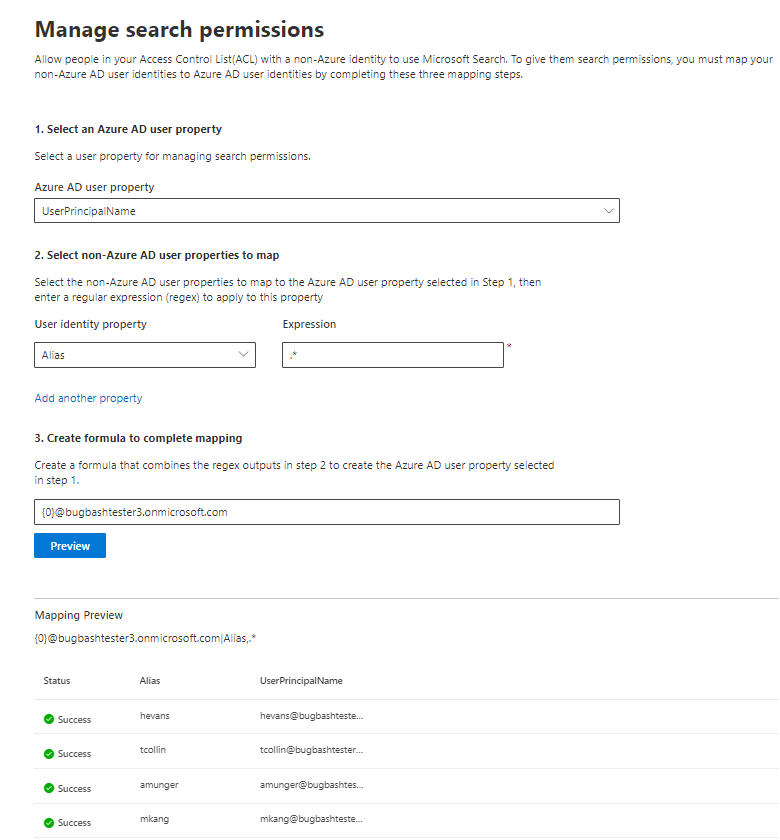

# Zuordnen Ihrer Nicht-Azure AD-Identitäten  

In diesem Artikel werden Sie durch die Schritte zum Zuordnen Ihrer Nicht-Azure AD-Identitäten zu Ihren Azure AD-Identitäten geführt, sodass Personen in Ihrer Zugriffssteuerungsliste (Access Control List, ACL) mit Nicht-Azure AD-Identitäten die ihnen zugeordneten Connectorsuchergebnisse anzeigen können.

Diese Schritte sind nur für Suchadministratoren relevant, die eine [Confluence Cloud,](confluence-cloud-connector.md) [ServiceNow Knowledge,](servicenow-knowledge-connector.md) [ServiceNow Catalog](servicenow-catalog-connector.md) oder [Salesforce](salesforce-connector.md) Connectors von Microsoft mit Suchberechtigungen für "Nur Personen mit Zugriff auf diese Datenquelle" und Identitätstyp "Non-AAD" einrichten.

>[!NOTE]
>Wenn Sie einen Salesforce-Connector einrichten und auf dem Bildschirm mit den Suchberechtigungen **nur Personen mit Zugriff** auf diese Datenquelle und den Identitätstyp **AAD** auswählen, finden Sie im Artikel ["Zuordnen Ihrer Azure AD-Identitäten"](map-aad.md) Schritte zum Zuordnen von Azure AD-Identitäten.  

## Schritte zum Zuordnen Ihrer Nicht-Azure AD-Eigenschaften

### 1. Auswählen einer Azure AD-Benutzereigenschaft  

Sie können die Azure AD-Benutzereigenschaft auswählen, für die Sie die Zuordnung erstellen. Dies ist die Zieleigenschaft, der Sie Ihre Nicht-Azure AD-Identitäten zuordnen möchten.  

Sie können eine der folgenden Azure AD-Eigenschaften auswählen:

| Azure AD-Eigenschaft    | Definition           | Beispiel         |
| :------------------- | :------------------- |:--------------- |
| Benutzerprinzipalname (UPN)  | Ein UPN besteht aus einem UPN-Präfix (dem Benutzerkontonamen) und einem UPN-Suffix (einem DNS-Domänennamen). Das Präfix wird mithilfe des "@"-Symbols mit dem Suffix verknüpft. | us1@contoso.onmicrosoft.com |
| Azure AD-ID                 | Eine Azure AD-ID für einen bestimmten Benutzer ist die eindeutige GUID des Benutzers.                 | 58006c96-9e6e-45ea-8c88-4a56851eefad            |
| Active Directory-Sicherheits-ID (SID)                  | DIE SID (Sicherheits-ID) ist ein eindeutiger Bezeichner, den Active Directory verwendet, um Objekte als Sicherheitsprinzipal zu identifizieren.                  | S-1-5-21-453406510-812318184-4183662089             |

### 2. Auswählen von Nicht-Azure AD-Benutzereigenschaften, die zugeordnet werden sollen

Sie können Nicht-Azure AD-Eigenschaften auswählen, die aus Ihrer Datenquelle abgerufen werden, um reguläre Ausdrücke anzuwenden. Weitere Informationen dazu, wo Sie diese Eigenschaften in Ihrer Datenquelle finden, finden Sie auf den Seiten [Confluence Cloud,](confluence-cloud-connector.md) [ServiceNow Knowledge,](servicenow-knowledge-connector.md) [ServiceNow Catalog](servicenow-catalog-connector.md) und [Salesforce.](salesforce-connector.md)  

Sie können eine Nicht-Azure AD-Benutzereigenschaft aus der Dropdownliste auswählen und einen regulären Ausdruck bereitstellen, der auf diese Benutzereigenschaftswerte angewendet werden soll.

Nachfolgend finden Sie einige Beispiele für reguläre Ausdrücke und deren Ausgaben, die auf eine Beispielzeichenfolge angewendet werden: 

| Beispielzeichenfolge                  | Regulärer Ausdruck                 | Ausgabe eines regulären Ausdrucks in einer Beispielzeichenfolge           |
| :------------------- | :------------------- |:---------------|
| Alexis Vasquez  | .* | Alexis Vasquez |
| Alexis Vasquez                 | ..$                 | Ez            |
| Alexis Vasquez                  | (\w+)$                  | Vasquez             |

Sie können so viele Nicht-Azure AD-Benutzereigenschaften hinzufügen, für die Sie Ausdrücke verwenden möchten. Sie können unterschiedliche reguläre Ausdrücke auf dieselbe Benutzereigenschaft anwenden, wenn die endgültige Formel dies zulässt.  

### 3. Erstellen einer Formel zum Abschließen der Zuordnung

Sie können die Ausgaben der regulären Ausdrücke kombinieren, die auf jede Ihrer Nicht-Azure AD-Benutzereigenschaften angewendet werden, um die in Schritt 1 ausgewählte Azure AD-Eigenschaft zu bilden.

In the formula box, {0} " corresponds to the output of the regular expression applied to the *first* non-Azure AD property you selected. " {1} " entspricht der Ausgabe des regulären Ausdrucks, der auf die *zweite* ausgewählte Nicht-Azure AD-Eigenschaft angewendet wurde. " {2} " entspricht der Ausgabe des regulären Ausdrucks, der auf die *dritte* Nicht-Azure AD-Eigenschaft angewendet wird usw.  

Nachfolgend finden Sie einige Beispiele für Formeln mit Beispielausgabe für reguläre Ausdrücke und Formelausgabe: 

| Beispielformel                  | Wert des {0} Beispielbenutzers                 | Wert des {1} Beispielbenutzers           | Ausgabe der Formel                  |
| :------------------- | :------------------- |:---------------|:---------------|
| {0}.{1} @contoso.com  | Firstname | Lastname |firstname.lastname@contoso.com
| {0}@domain.com                 | Userid                 |             |userid@domain.com

Nachdem Sie Ihre Formel bereitgestellt haben, können Sie optional auf **"Vorschau"** klicken, um eine Vorschau von 5 zufälligen Benutzern aus Ihrer Datenquelle mit angewendeten entsprechenden Benutzerzuordnungen anzuzeigen. Die Ausgabe der Vorschau enthält den Wert der Nicht-Azure AD-Benutzereigenschaften, die in Schritt 2 für diese Benutzer ausgewählt wurden, und die Ausgabe der endgültigen Formel, die in Schritt 3 für diesen Benutzer bereitgestellt wurde. Außerdem wird angegeben, ob die Ausgabe der Formel über das Symbol "Erfolgreich" oder "Fehlgeschlagen" an einen Azure AD-Benutzer in Ihrem Mandanten aufgelöst werden kann.  

>[!NOTE]
>Sie können weiterhin mit dem Erstellen der Verbindung fortfahren, wenn eine oder mehrere Benutzerzuordnungen den Status "Fehlgeschlagen" aufweisen, nachdem Sie auf **"Vorschau"** geklickt haben. In der Vorschau werden 5 zufällige Benutzer und deren Zuordnungen aus Ihrer Datenquelle angezeigt. Wenn die von Ihnen bereitgestellte Zuordnung nicht allen Benutzern zugeordnet ist, kann dieser Fall auftreten.

## Beispiel für eine Nicht-Azure AD-Zuordnung

Eine Beispiel-Nicht-Azure AD-Zuordnung finden Sie in der nachstehenden Momentaufnahme.

## Einschränkungen  

- Es wird nur eine Zuordnung für alle Benutzer unterstützt. Bedingte Zuordnungen werden nicht unterstützt.  

- Sie können ihre Zuordnung nicht mehr ändern, nachdem die Verbindung veröffentlicht wurde.  

- Für die Transformation werden derzeit nur regex-basierte Ausdrücke für die Nicht-AAD-Benutzereigenschaften unterstützt.

- Sie können nur drei Azure AD-Identitäten zuordnen (UPN, Azure AD-ID und AD-SID).