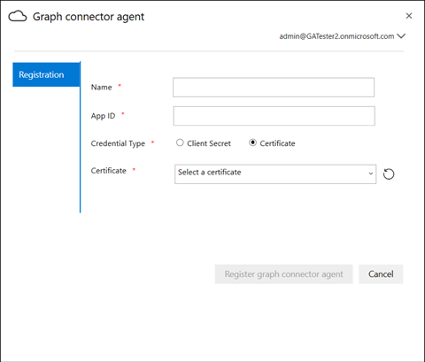

# On-Prem-Agent

## Grafik-Connector-Agent

Für on-Prem Graph Connectors müssen Sie die *Graph Connector Agent* -Software installieren. Es ermöglicht eine schnelle und sichere Datenübertragung zwischen lokalen Daten und Cloud-Diensten. Dieser Artikel führt Sie durch die Schritte zum Installieren und Konfigurieren der Software. Sobald die Konfiguration konfiguriert wurde, ist Sie für die Erstellung von Verbindungen mit Ihren on-Prem-Datenquellen aus dem [Microsoft 365 Admin Center](https://admin.microsoft.com)verfügbar.

## Installation

Laden Sie die neueste Version des Graph Connector-Agents mithilfe [dieses Links](https://download.microsoft.com/download/d/d/e/dde18236-9c67-437d-a864-894a0a888ef2/AgentPackage.msi) herunter, und installieren Sie die Software mithilfe des Installations-Assistenten. Mit der empfohlenen Konfiguration des unten beschriebenen Computers kann die Software nahtlos bis zu drei Verbindungen verarbeiten. Verbindungen darüber hinaus können die Leistung beeinträchtigen.

Empfohlene Konfiguration:

* Windows 10, Windows Server 2012 R2 und höher
* 8 Kerne, 3GHz
* 16GB RAM, 1GB Festplattenspeicherplatz
* Netzwerkzugriff auf Datenquelle und Internet über 443

## Erstellen einer APP für den Agent  

Die Agent-Instanz muss vor dem Erstellen von Verbindungen nur wenige wichtige Parameter eingezogen werden. Diese Parameter umfassen Authentifizierungsdetails, die für die Verwendung von Graph-Einnahme-APIs erforderlich sind.  

Schritte zum Erstellen einer APP für den Agent.

1. Wechseln Sie zum [Azure-Portal](https://portal.azure.com) , und melden Sie sich mit den Administratoranmeldeinformationen für den Mandanten an.
2. Navigieren Sie im Navigationsbereich zu **Azure Active Directory**  ->  **App-Registrierungen** , und wählen Sie **neue Registrierung** aus.
3. Geben Sie einen Namen für die APP ein, und wählen Sie **registrieren** aus.
4. Notieren Sie sich die Anwendungs-ID (Client).
5. Öffnen Sie **API-Berechtigungen** aus dem Navigationsbereich, und wählen Sie **Berechtigung hinzufügen** aus.
6. Wählen Sie **Microsoft Graph** und dann **Anwendungsberechtigungen** aus.
7. Suchen Sie nach "ExternalItem. ReadWrite. all" und "Directory. Read. all" aus den Berechtigungen, und wählen Sie **Berechtigungen hinzufügen** aus.
8. Wählen Sie **Administrator Zustimmung für [Mandanten] erteilen** aus, und bestätigen Sie mit **Ja**.
9. Stellen Sie sicher, dass die Berechtigungen den Status erteilt aufweisen.
     

## Konfigurieren des Graph Connector-Agents

Nachdem Sie die APP für den Agent erstellt haben, müssen Sie den Agent mit den entsprechenden Authentifizierungsdetails konfigurieren.

Authentifizierungsdetails können in einem der folgenden Formulare bereitgestellt werden.

### Konfigurieren des geheimen Client Schlüssels für authentation

1. Wechseln Sie zum [Azure-Portal](https://portal.azure.com) , und melden Sie sich mit den Administratoranmeldeinformationen für den Mandanten an.
2. Öffnen Sie die **App-Registrierung** im Navigationsbereich, und wechseln Sie zur entsprechenden app. Wählen Sie unter **Verwalten** die Option **Zertifikate und Geheimnisse** aus.
3. Wählen Sie **neuer geheimer Client Schlüssel** aus, und wählen Sie einen Ablaufzeitraum für den geheimen Schlüssel aus. Kopieren Sie den generierten geheimen Schlüssel, und speichern Sie ihn, da er nicht erneut angezeigt wird.
4. Verwenden Sie diesen geheimen Client Schlüssel zusammen mit der Anwendungs-ID, um den Agent zu konfigurieren. Verwenden Sie im Feld **Name** des Agents keine Leerzeichen. Alpha numerische Zeichen werden akzeptiert.

## Verwenden des Fingerabdruck Zertifikats für die Authentifizierung

Wenn Sie die Authentifizierungsdetails bereits konfiguriert haben, indem Sie [den geheimen Client Schlüssel für authentation konfigurieren](#Configuring-the-client-secret-for-authentication) , können Sie direkt zur [Setup Übersicht](configure-connector.md)springen.

1. Öffnen Sie die **App-Registrierung** , und wählen Sie im Navigationsbereich **Zertifikate und Geheimnisse** aus. Kopieren Sie den Fingerabdruck des Zertifikats.

2. Verwenden Sie entweder den geheimen Client Schlüssel oder den Fingerabdruck, um den Graph Connector-Agent zu registrieren.

