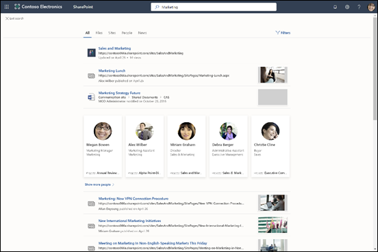

# Übersicht über Microsoft Search 

Microsoft Search ist die einheitliche Suchfunktion in den Microsoft 365-Produktivitäts-Apps und in der umfassenderen Microsoft-Umgebung. Mit der Zeit wird Microsoft Search in mehr und mehr Microsoft 365-Apps verfügbar sein.

Microsoft Search unterstützt Benutzer beim Finden der richtigen Antworten, Personen und Inhalte, um ihre Aufgaben in der App zu erledigen, in der sie bereits arbeiten.

- Benutzer erhalten Ergebnisse, die im **Kontext** der App relevant sind, aus der heraus sie suchen. Wenn sie z. B. in Outlook suchen, erhalten sie E-Mails, keine Websites wie in SharePoint. Bei der Suche in SharePoint erhalten sie Websites, Seiten und Dateien.
- Ungeachtet der App, in der Benutzer arbeiten, ist Microsoft Search **privat**.  Microsoft Search verwendet Informationen aus Microsoft Graph, um Ergebnisse anzuzeigen, die für die einzelnen Benutzer relevant sind. Benutzer sehen möglicherweise andere Ergebnisse, auch wenn sie nach denselben Wörtern suchen. Sie sehen nur Ergebnisse, auf die sie bereits Zugriff haben. Microsoft Search ändert keine Berechtigungen.
- Benutzer müssen sich nicht merken, wo die Informationen gespeichert sind. Beispiel: Ein Benutzer arbeitet in Word und möchte Informationen aus einer Präsentation wiederverwenden, die ein Kollege über OneDrive geteilt hat. Es ist nicht erforderlich, zu OneDrive zu wechseln und nach dieser Präsentation zu suchen. Er kann einfach aus Word suchen.  
- In Bing erhalten Benutzer sowohl aus dem Internet als auch aus ihrer Organisation Ergebnisse.

## Anzeige für Benutzer

In Bing können Benutzer dasselbe Suchfeld wie für Websuchen verwenden. In den Microsoft 365-Apps wird Benutzern das Microsoft Suchfeld in der Kopfzeile angezeigt. Das sieht ungefähr so aus:

Wenn Benutzer in das Suchfeld klicken, schlägt die Suche Ergebnisse basierend auf ihren vorherigen Aktivitäten in Office 365 und basierend auf Inhalten vor, die in Ihrer Organisation im Trend sind. Dateien, an denen sie zuletzt gearbeitet haben, Befehle, die sie kürzlich verwendet haben, sowie Personen, mit denen sie zusammenarbeiten, sind Beispiele für Aktivitäten, die die Suche berücksichtigt. Wenn Benutzer mit der Eingabe im Suchfeld beginnen, werden die vorgeschlagenen Ergebnisse aktualisiert. Benutzer können direkt über das Suchfeld Suchergebnisse öffnen. Hier ein Beispiel für eine Suche in SharePoint.

Wenn die Vorschläge im Suchfeld nicht dem entsprechen, wonach sie suchen, wird durch Drücken der **EINGABETASTE** eine vollständige Liste der Ergebnisse angezeigt. Sie können Metadaten verwenden, beispielsweise wer das Element zuletzt geändert hat und wann, wo sich das Element befindet, und es in der Vorschau anzeigen, um zu verifizieren, ob es sich um das richtige Element handelt.

## Vorteile von Microsoft Search

**Suche in Microsoft 365 über jedes beliebige Microsoft Search-Feld** – Benutzer können über ein beliebiges Microsoft Search-Feld suchen und schnell zu der Aufgabe zurückkehren, die sie gerade durchgeführt haben. Microsoft Search vereint Ergebnisse aus Datenquellen in Office 365, einschließlich SharePoint, OneDrive for Business und Exchange.

**Einfache Suche** – Microsoft Search empfiehlt Ergebnisse basierend auf den vorherigen Aktivitäten von Benutzern in Office 365, direkt im Suchfeld.

**Suche nach freigegebenen Dateien** – Microsoft Search verwendet erweiterte Abfragen, um die Suche nach freigegebenen Dateien zu vereinfachen. Benutzer können ganz einfach Dateien suchen, an denen sie gemeinsam arbeiten.

**Anzeige relevanter Inhalte** – Stellen Sie die Informationen und Antworten bereit, die Ihre Benutzer für ihre Arbeit benötigen, zum Beispiel Richtlinien, Vorteile, Ressourcen, Tools und mehr. Sie können auch bestimmte Zielgruppen festlegen, wie neue Mitarbeiter oder Remotemitarbeiter.

**Microsoft Search-Weiterentwicklung** – Der Satz an Inhaltstypen, nach denen Benutzer suchen können, und die Funktionalität des Suchfelds werden immer weiter verbessert.

**Verwaltung in allen Apps** – Microsoft Search ist standardmäßig **aktiviert** und Administrationsvorgänge werden in allen Apps auf Microsoft Search angewendet.

## Diese Apps verfügen derzeit über Microsoft Search.

 Die folgenden Office 365-Apps bieten derzeit Microsoft Search:

- SharePoint Online
- OneDrive for Business
- Outlook im Web
- Office-Apps unter Windows

Darüber hinaus finden Benutzer Microsoft Search in:

- Bing
- Office.com
- Startseiten für Word, Excel und PowerPoint Online

Benutzer können eine Suche auch in Bing aus der Edge-Adressleiste initiieren.

## Voraussetzungen

Ihre Organisation muss einen Office 365-Mandanten mit einem der folgenden Abonnements haben:

- Office 365 Business Essentials und Business Premium
- Office 365 A1/A3/A5
- Office 365 Education E1/E3
- Office 365 Enterprise E1/E3/E3 Developer/E5
- Office 365 F1
- Microsoft 365 Business
- Microsoft 365 A3/A5
- Microsoft 365 F1/E3/E5

Sowohl Benutzer als auch Suchadministratoren müssen durch eines dieser Abonnements lizenziert werden. Nur Benutzer mit aktiven Konten können Microsoft Search verwenden. Sie müssen **angemeldet** sein.

## Anpassen von Microsoft Search an Ihre Organisation

Als Administrator können Sie Ihren Benutzern das Abrufen nützlicher organisationsspezifischer Ergebnisse erleichtern, wenn sie über ihre SharePoint-Startseite, office.com oder Bing suchen. Sie können Microsoft Search im Microsoft 365 Admin Center verwalten.

**Anzeige nützlicher Inhalte** – Unterstützen Sie Benutzer dabei, wichtige Tools und Ressourcen in Ihrer Organisation durch Lesezeichen zu finden. Genauso, wie Sie ein Lesezeichen zu einer öffentlichen Webseite erstellen können, können Sie ein Lesezeichen für alle internen Webseiten erstellen, die Ihre Benutzer suchen können. Sie können auch eine Power-App in das Lesezeichen integrieren, damit Benutzer ihre Aufgabe direkt aus dem Lesezeichen abschließen können.

**Antworten auf häufig gestellte Fragen** – Geben Sie die beste Antwort für die in Ihrer Organisation am häufigsten gestellten Fragen. Wenn Benutzer häufig eine Frage in das Suchfeld eingeben, zeigt Microsoft Search die Antwort als Ergebnis an, statt nur einen Link zu der Webseite bereitstellen.

**Anzeige nützlicher Orte** – Zeigen Sie Kartenergebnisse und Adressinformationen für Gebäude, Büros und andere Arbeitsbereiche Ihrer Organisation auf einer Karte an. Benutzer können die Karten verwenden, um eine Wegbeschreibung zu erhalten, zu sehen, was es in der Nähe gibt, und vieles mehr.

## Wir werden Inhalte durchsucht?

Microsoft Search durchsucht Inhalte, die in SharePoint Online, OneDrive for Business und Exchange gespeichert sind, einschließlich Personen aus der globalen Adressliste und Office 365-Gruppen. Wenn Ihre Organisation eine hybride SharePoint-Umgebung eingerichtet hat und die Cloud-Hybridsuche verwendet, liefert Microsoft Search sowohl Suchergebnisse aus Onlineinhalten als auch aus lokalen SharePoint-Inhalten, einschließlich aller externen Inhalte, die Sie mit Ihrer SharePoint Server-Umgebung verbunden haben. [Weitere Informationen zu hybriden Suchumgebungen](https://docs.microsoft.com/sharepoint/hybrid/learn-about-cloud-hybrid-search-for-sharepoint).

Wenn Benutzer über die SharePoint-Startseite oder office.com suchen, durchsucht Microsoft Search die gesamten Inhalte Ihrer Organisation, und präsentiert alle gefundenen Ergebnisse. Dies wird als **globaler Suchbereich** bezeichnet.

Wenn Benutzer mit Bing suchen, erhalten Sie die relevantesten Ergebnisse aus dem gesamten Inhalt Ihrer Organisation, der in die Liste der Ergebnisse aus dem **Internet** eingebettet wird. Wenn sie **alle** Organisationsergebnisse anzeigen lassen wollen, ist der globale Suchbereich nur einen Klick entfernt.

## Nach welchen Ergebnistypen können Benutzer suchen?
Benutzer finden folgende Ergebnistypen bei der Suche in:

**SharePoint**: Dateien, Ordner, Personen in Ihrer Organisation, Organigramme, Websites, Websiteseiten, Neuerungen, Listen und Listenelemente. Wenn definiert, Antworten auf häufig gestellte Fragen, Lesezeichen, die zu verlässlichen Informationen führen, Orte sowie Tools. 
  [Erfahren Sie, welche Typen von Dateien Sie suchen können.](https://docs.microsoft.com/de-DE/SharePoint/technical-reference/default-crawled-file-name-extensions-and-parsed-file-types)

**Office.com- und Word-, Excel- und PowerPoint Online-Startseiten**: Apps, Dateien, Ordner, Personen, Organigramme, SharePoint-Websites, Websiteseiten, Listen und Listenelemente. Wenn definiert, Antworten auf häufig gestellte Fragen, Lesezeichen, die zu verlässlichen Informationen führen, Orte sowie Tools. Dateien desselben Typs wie in SharePoint werden gefunden.

**Bing**: Inhalt im Internet, Dateien, Office 365-Gruppen, Personen, Unterhaltungen in Yammer und Teams, Organigramme, SharePoint-Websites. Wenn definiert, Antworten auf häufig gestellte Fragen, Lesezeichen, die zu verlässlichen Informationen führen, Orte sowie Tools.  Word-, Excel-, PowerPoint-, Visio-, OneNote- und PDF-Dateien werden gefunden.

**Outlook**: E-Mails, Anhänge und Personen in Ihrer Organisation.

**Office-Apps unter Windows**: Aktionen in der App, Personen in Ihrer Organisation und im Internet, Dateien, Worterläuterungen, Übereinstimmungen für die Abfrage in der Datei oder im Hilfeinhalt, Inhalte im Internet. Word-, Excel-, PowerPoint-, Visio- und OneNote-Dateien werden gefunden.

**OneDrive**: Dateien desselben Typs wie in SharePoint werden gefunden.

## Wie funktioniert Microsoft Search?

Wenn ein Benutzer sucht, verarbeitet Microsoft Search die Abfrage und analysiert die Suchabsicht aus längeren Ausdrücken. Dabei kommt künstliche Intelligenz (AI) zum Einsatz, um gängige überflüssige Ausdrücke zu erlernen, die Benutzer ihren Abfragen hinzufügen und die keine Auswirkung auf die Suchabsicht haben. Wenn ein Benutzer beispielsweise nach „wie kann ich mein Kennwort ändern“ sucht, extrahieren wir die weniger wichtigen Wörter aus der Abfrage und lösen die Suche basierend auf den relevanten Wörtern wie „Kennwort ändern“ aus.  

Die Suchergebnisse, für die der Benutzer die **Berechtigung** hat, werden auf der Suchergebnisseite präsentiert. Microsoft Search verwendet intelligente Rangfolgealgorithmen, um Ergebnisse basierend auf Relevanz anzufordern.

## Microsoft Search in SharePoint

Microsoft Search in SharePoint ist die moderne Suchoberfläche in SharePoint Online. SharePoint Online bietet auch eine klassische Oberfläche. Beide Oberflächen sind standardmäßig aktiviert, sodass beide dieselben Inhalte durchsuchen. Als Administrator können Sie keine der beiden Suchumgebungen aktivieren. Welche Suchoberfläche den Benutzern angezeigt wird, hängt davon ab, von wo aus sie die Suche verwenden:

- Das Microsoft Search-Suchfeld wird Benutzern auf der SharePoint-Startseite, auf Hubwebsites, Kommunikationswebsites und modernen Teamwebsites angezeigt.
- Das klassische Suchfeld wird Benutzern auf Veröffentlichungsseiten, klassischen Teamwebsites und im Suchcenter angezeigt.

Sie können die klassische Suchumgebung anpassen, z. B. indem Sie benutzerdefinierte Einschränkungen zur Suchergebnisseite hinzufügen oder bestimmte Arten von Ergebnissen anders darstellen. In SharePoint können Sie Microsoft Search so nicht anpassen. Einige der Anpassungen, die Sie für die klassische Suche vornehmen, können sich auf die Microsoft Search in SharePoint auswirken. Wenn Ihre Organisation beide Suchfunktionen in SharePoint verwendet, [informieren Sie sich bitte über die Unterschiede, und wie Sie Auswirkungen auf Microsoft Search in SharePoint vermeiden können](https://docs.microsoft.com/de-DE/sharepoint/differences-classic-modern-search).

## Microsoft Search in Bing

Da arbeitsbezogene Suchvorgänge vertraulich sein können, besitzt Microsoft Search eine Reihe von Vertrauensmaßnahmen zur Handhabung der öffentlichen Webergebnisse von Bing.

Unabhängig davon, ob eine Benutzerabfrage ein oder mehrere arbeitsbezogene Ergebnisse in der zurückgegebenen Antwort enthält, werden folgende Maßnahmen getroffen:

**Protokollierung** – alle Suchprotokolle, die sich auf den Microsoft-Such-Datenverkehr beziehen, werden für 18 Monate in nicht identifizierbarem Zustand aufbewahrt. Abfragen, die in diesen Systemprotokollen gespeichert werden, werden lediglich zum Modellieren und Trainieren von öffentlichen Features wie der Vorschlagssuche oder bei verwandten Suchvorgängen für öffentliche Webergebnisse verwendet, wenn eine Reihe von Einschränkungen und Frequenz-Schwellenwerten erfüllt sind, was uns das Vertrauen gibt, dass diese Abfragen allgemein und nicht für eine bestimmte Organisation spezifisch sind. Die Abfrage muss in einer bedeutenden Anzahl von Fällen in Verbindung mit Daten von Benutzern vorkommen, welche die Microsoft Suchfunktion nicht verwenden und die Abfrage darf nicht ausschließlich Enterprise-Suchergebnisse auslösen. Abfragen, die diese Anforderungen nicht erfüllen, werden getrennt vom öffentlichen, nicht von Microsoft durchgeführten Such Datenverkehr gespeichert. Der eingeschränkte Zugriff wird über verschiedene Sicherheitsmechanismen verwaltet, einschließlich Sicherheitsgruppen und anderen Ebenen innerhalb des Engineering-Systems.

**Suchverlauf** – Wenn Sie mit einem Geschäfts- oder Schulkonto angemeldet sind, steht der Suchverlauf eines Benutzers nicht auf anderen Computern oder Geräten zur Verfügung.

**Werbung** – Suchabfragen von Unternehmen werden nie für Werbetreibende freigegeben und diesen auch nicht vorgeschlagen.
Werbung wird nie basierend auf der Arbeitsidentität oder Organisation eines Benutzers ausgerichtet.

## Siehe auch

[Einrichten von Microsoft Search](setup-microsoft-search.md)

[Inhalte leicht auffindbar machen](make-content-easy-to-find.md)