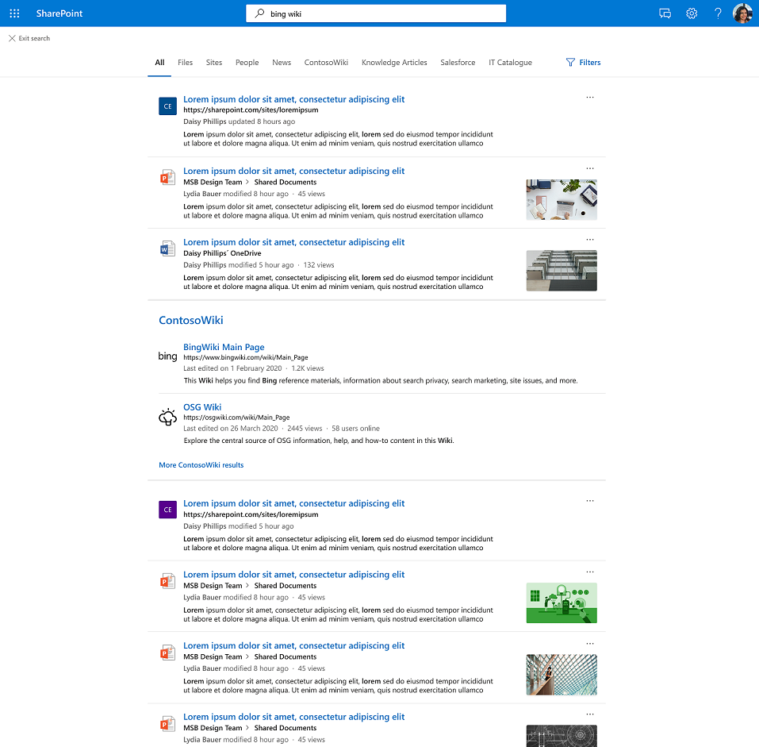

# ergebniscluster für Graph Connectors

## Übersicht über den Ergebniscluster Graph Connectors  

Mit Graph Connectors-Ergebnisclustern können Unternehmen in ihrer Standardansicht, der Registerkarte **"Alle",** in SharePoint, Office.com und Microsoft Search in Bing nach Inhalten aus Datenquellen von Drittanbietern suchen.

Ergebniscluster helfen Benutzern, alle Inhalte von Drittanbietern an einem Ort zu finden. Die in einem Ergebniscluster angezeigten Ergebnisse werden basierend auf der vertikalen Suchkonfiguration gruppiert.

## Auswählen und Anzeigen der Connectorergebnisse

Die im Ergebniscluster bereitgestellten Connectorergebnisse werden von einzelnen Such-Vertikalen mit Connectorinhalt abgeleitet. Jede Such vertical provides a set of relevant results which becomes a candidate result cluster. Relevante Ergebnisse werden basierend auf der Eigenschaft "title" und "content" jedes Elements ausgewählt. Die Inhaltseigenschaft ist im Schema als *"isContent=true"* gekennzeichnet.

Um die Erkennung von Inhalten aus den Such-Vertikalen sicherzustellen, empfehlen wir die Bereitstellung aussagekräftiger Titel für Ihre Elemente. Dies wirkt sich positiv auf die Vermittlung von Ergebnisclusterkandidaten und die Wahrscheinlichkeit aus, dass Ihre Inhalte in einem Ergebniscluster angezeigt werden. Vermeiden Sie beispielsweise die Verwendung von IDs als Werte für den Eigenschaftstitel, es sei denn, Ihre Benutzer verwenden IDs, um nach Inhalten zu suchen.

Wie oft ein Ergebniscluster angezeigt wird, hängt von Faktoren wie der Anzahl der von Ihnen konfigurierten Such-Vertikalen und dem Inhaltstyp ab. Durch die Interaktion oder das Ignorieren eines Ergebnisclusters geben Benutzer implizit Hinweise an, die die Auslösung im Laufe der Zeit anpassen.

Die Suchergebnisoberfläche für die in Ihrem Ergebniscluster angezeigten Connectorelemente verwendet von Ihnen definierte [Ergebnistypen.](./customize-search-page.md#create-your-own-result-type) Wenn kein Ergebnistyp konfiguriert ist, wird ein [vom System generiertes Layout](./customize-search-page.md#default-search-result-layout) verwendet.

Es wird empfohlen, die Eigenschaft "title" als Suchergebnistitel und die Eigenschaft "content" als Suchbeschreibung zu verwenden. Dies bietet Ihren Benutzern die beste Erfahrung durch genaues Auslösen des Ergebnisclusters und der relevantesten Ergebnisse im Cluster.

Ergebniscluster werden in der Mitte der Seite in der Vertikalen Alle angezeigt. Beispielsweise wird unten ein Ergebniscluster aus einer "MediaWiki"-Vertikalen angezeigt.

## Standardeinstellungen für Ergebniscluster
  
Die Ergebniscluster-Erfahrung ist standardmäßig aktiviert.  

Wenn Sie es deaktivieren möchten, führen Sie die folgenden Schritte aus, um die Benutzeroberfläche auf Organisationsebene zu deaktivieren:

1. Wechseln [Sie](https://admin.microsoft.com)im Microsoft 365 Admin Center zu [**"Verticals".**](https://admin.microsoft.com/Adminportal/Home#/MicrosoftSearch/verticals)
1. Wählen Sie die Vertikale **Alle** aus, und aktivieren Sie dann die **Verbinderergebnisse ausblenden.**

Führen Sie die folgenden Schritte aus, um die Benutzeroberfläche auf SharePoint Websiteebene zu deaktivieren:

1. Wechseln Sie zu **Einstellungen** auf der SharePoint Website
2. Wechseln Sie zu **"Websiteinformationen** > **Anzeigen aller Websiteeinstellungen".**
3. Wechseln Sie zum Abschnitt Microsoft Search, und wählen Sie dann **Microsoft Search für diese Websitesammlung konfigurieren** aus.
4. Wechseln Sie im Navigationsbereich zu **"Benutzerdefinierte Oberfläche",** und wählen Sie dann **"Vertikal" aus.**
5. Wählen Sie die Vertikale **Alle** aus, und aktivieren Sie dann die **Verbinderergebnisse ausblenden.**
