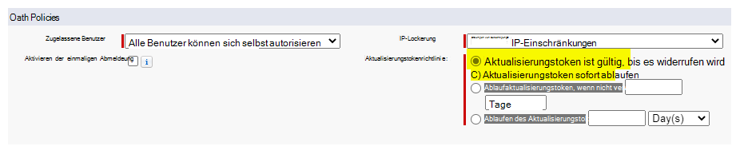
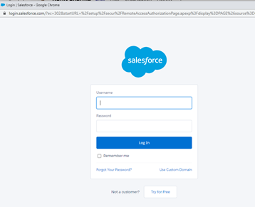
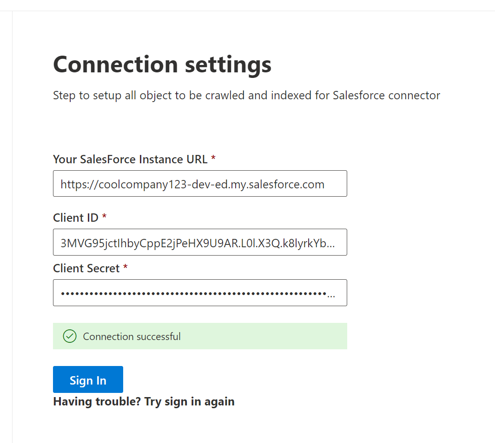
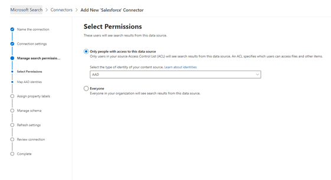

<!---Previous ms.author: rusamai --->

# Salesforce Graph Connector

Der Salesforce Graph Connector ermöglicht Es Ihrer Organisation, Kontakte, Verkaufschancen, Leads, Fälle und Kontenobjekte in Ihrer Salesforce-Instanz zu indizieren. Nachdem Sie den Connector konfiguriert und Inhalte von Salesforce indiziert haben, können Endbenutzer von jedem Microsoft Search Client nach diesen Elementen suchen.

> [!NOTE]
> Lesen Sie den Artikel [**"Setup for your Graph connector",**](configure-connector.md) um die allgemeinen Anweisungen zum Einrichten Graph Connectors zu verstehen.

Dieser Artikel richtet sich an alle Personen, die einen Salesforce-Graph Connector konfigurieren, ausführen und überwachen. Es ergänzt den allgemeinen Einrichtungsprozess und zeigt Anweisungen, die nur für den Salesforce Graph Connector gelten. Dieser Artikel enthält auch Informationen zu [Einschränkungen.](#limitations)

>[!IMPORTANT]
>Der Salesforce Graph Connector unterstützt derzeit Summer '19 oder höher.

## Bevor Sie beginnen

Um eine Verbindung mit Ihrer Salesforce-Instanz herzustellen, benötigen Sie ihre Salesforce-Instanz-URL, die Client-ID und den geheimen Clientschlüssel für die OAuth-Authentifizierung. In den folgenden Schritten wird erläutert, wie Sie oder Ihr Salesforce-Administrator diese Informationen aus Ihrem Salesforce-Konto abrufen können:

- Melden Sie sich bei Ihrer Salesforce-Instanz an, und wechseln Sie zum Setup

- Navigieren Sie zum App-> App-Manager.

- Wählen Sie **"Neue verbundene App" aus.**

- Führen Sie den API-Abschnitt wie folgt aus:

    - Aktivieren Sie das Kontrollkästchen für **Oauth Einstellungen aktivieren.**

    - Geben Sie die Rückruf-URL folgendermaßen an: [https://gcs.office.com/v1.0/admin/oauth/callback](https://gcs.office.com/v1.0/admin/oauth/callback)

    - Wählen Sie diese erforderlichen OAuth-Bereiche aus.

        - Zugreifen auf und Verwalten Ihrer Daten (API)

        - Führen Sie Anforderungen jederzeit in Ihrem Auftrag aus (refresh_token, offline_access)

    - Aktivieren Sie das Kontrollkästchen für **"Geheimen Schlüssel für Webserverfluss anfordern".**

    - Speichern Sie die App.
    
      > [!div class="mx-imgBorder"]
      > 

- Kopieren Sie den Verbraucherschlüssel und den geheimen Verbraucherschlüssel. Diese Informationen werden als Client-ID und geheimer Clientschlüssel verwendet, wenn Sie die Verbindungs-Einstellungen für Ihren Graph Connector im Microsoft 365 Admin-Portal konfigurieren.

  > [!div class="mx-imgBorder"]
  > 
  
- Führen Sie vor dem Schließen der Salesforce-Instanz die folgenden Schritte aus, um sicherzustellen, dass Aktualisierungstoken nicht ablaufen:
    - Wechseln Sie zu Apps – > App-Manager
    - Suchen Sie die von Ihnen erstellte App, und wählen Sie die Dropdownliste auf der rechten Seite aus. Wählen Sie **"Verwalten" aus.**
    - Auswählen von **Bearbeitungsrichtlinien**
    - Wählen Sie für die Aktualisierungstokenrichtlinie die Option **"Aktualisierungstoken ist gültig bis widerrufen"** aus.

  > [!div class="mx-imgBorder"]
  > 

Sie können jetzt das [Microsoft 365 Admin Center](https://admin.microsoft.com/) verwenden, um den restlichen Setupprozess für Ihren Graph Connector abzuschließen.

## Schritt 1: Hinzufügen eines Graph Connectors in der Microsoft 365 Admin Center

Folgen Sie den allgemeinen [Setupanweisungen.](./configure-connector.md)
<!---If the above phrase does not apply, delete it and insert specific details for your data source that are different from general setup instructions.-->

## Schritt 2: Benennen der Verbindung

Folgen Sie den allgemeinen [Setupanweisungen.](./configure-connector.md)
<!---If the above phrase does not apply, delete it and insert specific details for your data source that are different from general setup instructions.-->

## Schritt 3: Konfigurieren der Verbindungseinstellungen

Verwenden Sie für die Instanz-URL https://[domäne].my.salesforce.com</a0>, wobei domäne die Salesforce-Domäne für Ihre Organisation wäre.

Geben Sie die Client-ID und den geheimen Clientschlüssel ein, die Sie von Ihrer Salesforce-Instanz erhalten haben, und wählen Sie "Anmelden" aus.

Wenn Sie zum ersten Mal versucht haben, sich mit diesen Einstellungen anzumelden, erhalten Sie ein Popup, in dem Sie aufgefordert werden, sich mit Ihrem Administratorbenutzernamen und -kennwort bei Salesforce anzumelden. Der screenshot unten zeigt das Popup. Geben Sie Ihre Anmeldeinformationen ein, und wählen Sie "Anmelden" aus.

  

  >[!NOTE]
  >Wenn das Popup nicht angezeigt wird, wird es möglicherweise in Ihrem Browser blockiert. Daher müssen Sie Popups und Umleitungen zulassen.

Überprüfen Sie, ob die Verbindung erfolgreich war, indem Sie nach einem grünen Banner suchen, das "Verbindung erfolgreich" anzeigt, wie im screenshot unten gezeigt.

  > [!div class="mx-imgBorder"]
  > 

## Schritt 4: Auswählen von Eigenschaften

Wählen Sie die Salesforce-Objekte aus, die der Connector durchforsten und in suchergebnisse einschließen soll. Wenn "Kontakt" ausgewählt ist, wird auch das Konto automatisch ausgewählt.

>[!NOTE]
>Wenn für ein Feld die Sicherheit auf Feldebene (FLS) für ein Profil festgelegt ist, erfasst der Connector dieses Feld nicht für Profile in dieser Salesforce-Organisation. Daher können Benutzer weder nach Werten für diese Felder suchen noch in den Ergebnissen angezeigt werden.

## Schritt 5: Verwalten von Suchberechtigungen

Sie müssen auswählen, welche Benutzer Suchergebnisse aus dieser Datenquelle sehen. Wenn Sie nur bestimmten Azure Active Directory (Azure AD) oder Nicht-Azure AD-Benutzern erlauben, die Suchergebnisse anzuzeigen, stellen Sie sicher, dass Sie die Identitäten zuordnen.

### Schritt 5.a: Auswählen von Berechtigungen

Sie können auswählen, ob Sie Zugriffssteuerungslisten (Access Control Lists, ACLs) aus Ihrer Salesforce-Instanz erfassen möchten, oder allen Benutzern in Ihrer Organisation ermöglichen, Suchergebnisse aus dieser Datenquelle anzuzeigen. ACLs können Azure Active Directory (AAD)-Identitäten (Benutzer, die von Azure AD mit Salesforce verbunden sind), Nicht-Azure AD-Identitäten (systemeigene Salesforce-Benutzer, die über entsprechende Identitäten in Azure AD verfügen) oder beides umfassen.

>[!NOTE]
>Wenn Sie einen Identitätsanbieter eines Drittanbieters wie Ping-ID oder secureAuth verwenden, sollten Sie "Nicht-AAD" als Identitätstyp auswählen.

> [!div class="mx-imgBorder"]
> 

Wenn Sie sich entschieden haben, eine ACL aus Ihrer Salesforce-Instanz zu erfassen, und "nicht-AAD" für den Identitätstyp ausgewählt haben, finden Sie anweisungen zum Zuordnen der Identitäten zu [Ihren Nicht-Azure AD-Identitäten.](map-non-aad.md)

### Schritt 5.b: Zuordnen von AAD-Identitäten

Wenn Sie sich entschieden haben, eine ACL aus Ihrer Salesforce-Instanz zu erfassen, und "AAD" für den Identitätstyp ausgewählt haben, finden Sie unter ["Zuordnen Ihrer Azure AD-Identitäten"](map-aad.md) Anweisungen zum Zuordnen der Identitäten. Informationen zum Einrichten von Azure AD SSO für Salesforce finden Sie in diesem [Lernprogramm.](/azure/active-directory/saas-apps/salesforce-tutorial)

### Anwenden der Benutzerzuordnung zum Synchronisieren Ihrer Salesforce-Identitäten mit Azure AD-Identitäten

In diesem Video erfahren Sie, wie Sie sich bei Ihrer Salesforce-Instanz authentifizieren, Ihre nicht Azure Active Directory Identitäten mit Ihren Azure Active Directory Identitäten synchronisieren und die richtigen Sicherheitskürzungen auf Ihre Salesforce-Elemente anwenden.

> [!VIDEO https://www.youtube-nocookie.com/embed/SZYiFxZMKcM]

## Schritt 6: Zuweisen von Eigenschaftenbeschriftungen

Sie können jeder Bezeichnung eine Quelleigenschaft zuweisen, indem Sie aus einem Menü mit Optionen auswählen. Dieser Schritt ist zwar nicht zwingend erforderlich, aber einige Eigenschaftenbezeichnungen verbessern die Suchrelevanz und stellen bessere Suchergebnisse für Endbenutzer sicher. Standardmäßig wurden einigen Bezeichnungen wie "Title", "URL", "CreatedBy" und "LastModifiedBy" bereits Quelleigenschaften zugewiesen.

## Schritt 7: Verwalten des Schemas

Sie können auswählen, welche Quelleigenschaften indiziert werden sollen, damit sie in suchergebnissen angezeigt werden. Der Verbindungs-Assistent wählt standardmäßig ein Suchschema aus, das auf einer Reihe von Quelleigenschaften basiert. Sie können sie ändern, indem Sie die Kontrollkästchen für jede Eigenschaft und jedes Attribut auf der Suchschemaseite aktivieren. Zu den Suchschemaattributen gehören Suche, Abfrage, Abrufen und Verfeinern.
Mit der Verfeinerung können Sie die Eigenschaften definieren, die später als benutzerdefinierte Einschränkungen oder Filter in der Suchumgebung verwendet werden können.  

> [!div class="mx-imgBorder"]
> 

## Schritt 8: Festlegen des Aktualisierungszeitplans

Der Salesforce-Connector unterstützt derzeit nur Aktualisierungszeitpläne für vollständige Durchforstungen.

>[!IMPORTANT]
>Eine vollständige Durchforstung findet gelöschte Objekte und Benutzer, die zuvor mit dem Microsoft Search Index synchronisiert wurden.

Der empfohlene Zeitplan ist eine Woche für eine vollständige Durchforstung.

## Schritt 9: Überprüfen der Verbindung

Folgen Sie den allgemeinen [Setupanweisungen.](./configure-connector.md)

>[!TIP]
>**Standardergebnistyp**
>* Der Salesforce-Connector registriert automatisch einen [Ergebnistyp,](./customize-search-page.md#step-2-create-result-types) nachdem der Connector veröffentlicht wurde. Der Ergebnistyp verwendet ein dynamisch generiertes [Ergebnislayout](./customize-results-layout.md) basierend auf den in Schritt 3 ausgewählten Feldern.
>* Sie können den Ergebnistyp verwalten, indem Sie im [Microsoft 365 Admin Center](https://admin.microsoft.com)zu [**Ergebnistypen**](https://admin.microsoft.com/Adminportal/Home#/MicrosoftSearch/resulttypes) navigieren. Der Standardergebnistyp wird als `ConnectionId` "Standard" bezeichnet. Wenn Ihre Verbindungs-ID beispielsweise `Salesforce` lautet, wird ihr Ergebnislayout wie folgt benannt: "SalesforceDefault".
>* Sie können bei Bedarf auch einen eigenen Ergebnistyp erstellen.
<!---If the above phrase does not apply, delete it and insert specific details for your data source that are different from general setup instructions.-->

<!---## Troubleshooting-->
<!---Insert troubleshooting recommendations for this data source-->

## Einschränkungen

- Der Graph Connector unterstützt derzeit keine Apex-basierte, gebietsbasierte Freigabe und Freigabe mit persönlichen Gruppen von Salesforce.
- Es gibt einen bekannten Fehler in der Salesforce-API, den der Graph Connector verwendet, bei dem die privaten organisationsweiten Standardwerte für Leads derzeit nicht berücksichtigt werden.  
- Wenn für ein Feld die Sicherheit auf Feldebene (FLS) für ein Profil festgelegt ist, erfasst der Graph Connector dieses Feld nicht für Profile in dieser Salesforce-Organisation. Daher können Benutzer weder nach Werten für diese Felder suchen noch in den Ergebnissen angezeigt werden.  
- Im Bildschirm "Schema verwalten" werden diese allgemeinen Standardeigenschaftsnamen einmal aufgelistet. Die Optionen sind **"Abfrage",** **"Suchen",** **"Abrufen"** und **"Verfeinern"** und gelten für alle oder keine.
    - Name
    - Url
    - Beschreibung
    - Fax
    - Telefon
    - MobilePhone
    - E-Mails
    - Typ
    - Title
    - Accountid
    - AccountName
    - AccountUrl
    - AccountOwner
    - AccountOwnerUrl
    - Besitzer
    - OwnerUrl
    - CreatedBy
    - CreatedByUrl
    - LastModifiedBy
    - LastModifiedByUrl
    - LastModifiedDate
    - ObjectName
