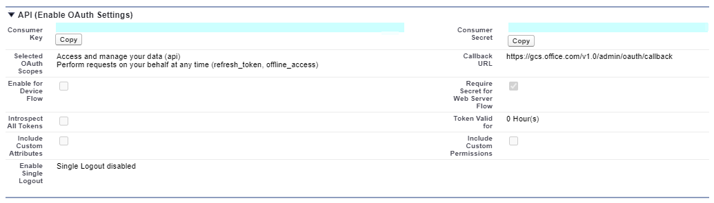
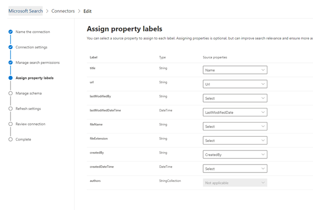

# Salesforce ConnectorSalesforce connector

Mit dem Salesforce Graph-Konnektor kann Ihre Organisation Kontakte, Verkaufschancen, Leads und Accounts-Objekte in ihrer Salesforce-Instanz indizieren.With the Salesforce Graph connector, your organization can index Contacts, Opportunities, Leads and Accounts objects in your Salesforce instance. Nachdem Sie den Connector-und den Index Inhalt von Salesforce konfiguriert haben, können Endbenutzer nach diesen Elementen von einem beliebigen Microsoft Search-Client aus suchen.After you configure the connector and index content from Salesforce, end users can search for those items from any Microsoft Search client

Dieser Artikel richtet sich an [Microsoft 365](https://www.microsoft.com/microsoft-365) -Administratoren oder Personen, die einen Salesforce Connector konfigurieren, ausführen und überwachen.This article is for [Microsoft 365](https://www.microsoft.com/microsoft-365) administrators or anyone who configures, runs, and monitors a Salesforce connector. Es wird erläutert, wie Sie die Connector-und connectorfunktionen, Einschränkungen und Techniken zur Problembehandlung konfigurieren.It explains how to configure your connector and connector capabilities, limitations, and troubleshooting techniques.

>[!IMPORTANT]
>Der Salesforce Graph Connector unterstützt derzeit die 19 Versionen Sommer 20, Frühling 20, Winter 20 und Sommer.The Salesforce Graph connector currently supports Summer ’20, Spring’20, Winter’20, and Summer ’19 versions.

## VerbindungseinstellungenConnection settings

Zum Herstellen einer Verbindung mit ihrer Salesforce-Instanz benötigen Sie die Salesforce-Instanz-URL, die Client-ID und den geheimen Client Schlüssel für die OAuth-Authentifizierung.To connect to your Salesforce instance, you need your Salesforce instance URL, the Client ID, and Client Secret for OAuth authentication. In den folgenden Schritten wird erklärt, wie Sie oder Ihr Salesforce-Administrator diese Informationen von Ihrem Salesforce-Konto abrufen können:The following steps explain how you or your Salesforce administrator can get this information from your Salesforce account:

- Melden Sie sich bei ihrer Salesforce-Instanz an, und wechseln Sie zu SetupLog in to your Salesforce instance and go to Setup

- Navigieren Sie zu apps-> App-Manager.Navigate to Apps -> App Manager.

- Wählen Sie **neue verbundene App** aus.Select **New connected app**.

- Schließen Sie den API-Abschnitt wie folgt ab:Complete the API section as follows:

    - Aktivieren Sie das Kontrollkästchen für **OAuth-Einstellungen aktivieren**.Select the checkbox for **Enable Oauth Settings**.

    - Geben Sie die Rückruf-URL wie folgt an: [https://gcs.office.com/v1.0/admin/oauth/callback](https://gcs.office.com/v1.0/admin/oauth/callback)Specify the Callback URL as: [https://gcs.office.com/v1.0/admin/oauth/callback](https://gcs.office.com/v1.0/admin/oauth/callback)

    - Wählen Sie diese erforderlichen OAuth-Bereiche aus.Select these required OAuth scopes. 

        - Zugreifen auf und Verwalten von Daten (API)Access and manage your data (api) 

        - Ausführen von Anforderungen in Ihrem Namen zu einem beliebigen Zeitpunkt (refresh_token, offline_access)Perform requests on your behalf at any time (refresh_token, offline_access) 

    - Aktivieren Sie das Kontrollkästchen für **geheimen Webserver Fluss erforderlich**.Select the checkbox for **Require secret for web server flow**.

    - Speichern Sie die app.Save the app.
    
      

- Kopieren Sie den Consumer-Schlüssel und das Consumer-Geheimnis.Copy the consumer key and the consumer secret. Diese werden als Client-ID und den geheimen Client Schlüssel verwendet, wenn Sie die Verbindungseinstellungen für Ihren Graph-Konnektor im Microsoft 365-Verwaltungsportal konfigurieren.These will be used as the Client ID and the Client Secret when you configure the Connection Settings for your Graph Connector in the Microsoft 365 admin portal.

  
- Führen Sie vor dem Schließen der Salesforce-Instanz die folgenden Schritte aus, um sicherzustellen, dass Aktualisierungstoken nicht ablaufen:Before closing your Salesforce instance, perform the following steps to ensure that refresh tokens do not expire: 
    - Wechseln Sie zu apps-> App-ManagerGo to Apps -> App Manager
    - Suchen Sie die soeben erstellte APP, und wählen Sie die Dropdownliste rechts aus.Find the app you just created and select the drop down on the right. Wählen Sie **Verwalten** aus.Select **Manage**
    - Auswählen von **Richtlinien bearbeiten**Select **edit policies**
    - Wählen Sie für Aktualisierungstoken-Richtlinie **die Option Aktualisierungstoken gilt bis zum Widerruf** aus.For refresh token policy, select **Refresh token is valid until revoked**

  

Sie können jetzt das [M365 Admin Center](https://admin.microsoft.com/) verwenden, um den restlichen Setupvorgang für Ihren Graph-Konnektor abzuschließen.You can now use the [M365 Admin Center](https://admin.microsoft.com/) to complete the rest of the setup process for your Graph connector.  

Konfigurieren Sie die Verbindungseinstellungen für Ihren Graph-Konnektor wie folgt:Configure the Connection settings for your Graph connector as follows:

- Verwenden Sie für die Instanz-URL https://[Domäne]. My. salesforce. com, wobei Domäne die Salesforce-Domäne für Ihre Organisation wäre.For the Instance URL, use https://[domain].my.salesforce.com where domain would be the Salesforce domain for your organization. 
- Geben Sie die von ihrer Salesforce-Instanz abgerufene Client-ID und den geheimen Client Schlüssel ein, und wählen Sie anmelden aus.Enter the Client ID and Client Secret you obtained from your Salesforce instance and select Sign in.
- Wenn Sie zum ersten Mal versucht haben, sich mit diesen Einstellungen anzumelden, erhalten Sie ein Popup, in dem Sie aufgefordert werden, sich mit Ihrem Administrator-Benutzernamen und-Kennwort bei Salesforce anzumelden.If this is the first time you have attempted to Sign in with these settings, you will get a pop up asking you to login to Salesforce with your admin username and password. Das folgende Screenshot zeigt das Popup.The screenshot below shows the popup. Geben Sie Ihre Anmeldeinformationen ein, und wählen Sie anmelden aus.Enter your credentials and select Log in.

  

  >[!NOTE]
  >Wenn das Popup nicht angezeigt wird, wird es möglicherweise in Ihrem Browser blockiert, sodass Sie Popups und Umleitungen zulassen müssen.If the pop up does not appear, it might be getting blocked in your browser, so you must allow pop-ups and redirects.

  >[!NOTE]
  >Wenn Ihre Organisation einmaliges Anmelden (SSO) verwendet, können Sie in der unteren rechten Ecke der Anmelde Schnittstelle die Option **benutzerdefinierte Domäne verwenden** auswählen.If your organization uses single sign-on (SSO), you can select **Use Custom Domain** in the bottom, right-hand corner of the login interface. Geben Sie die Domäne ein, und wählen Sie dann **weiter** aus.Enter the domain and then select **Continue**. Sie wird auf Ihrer organisationsspezifischen Anmeldeseite angezeigt, auf der Sie eine Option zur Anmeldung bei SSO haben.It will go to your organization specific login page where you will have an option to login with SSO.

- Überprüfen Sie, ob die Verbindung erfolgreich war, indem Sie nach einem grünen Banner suchen, das besagt, dass die Verbindung erfolgreich verläuft, wie im Screenshot unten dargestellt.Check that the connection was successful by searching for a green banner that says "Connection successful" as show in the screenshot below.

  

## Verwalten von SuchberechtigungenManage search permissions
Sie müssen auswählen, welche Benutzer Suchergebnisse aus dieser Datenquelle erhalten.You will need to choose which users will see search results from this data source. Wenn Sie nur bestimmten Azure-Active Directory (AAD) oder nicht-Aad-Benutzern das Anzeigen der Suchergebnisse gestatten, müssen Sie die Identitäten zuordnen.If you allow only certain Azure Active Directory (AAD) or Non-AAD users to see the search results, you will then need to map the identities.

### Auswählen von BerechtigungenSelect Permissions
Sie können Zugriffssteuerungslisten (Access Control Lists, ACLs) aus ihrer Salesforce-Instanz aufnehmen oder jedem in Ihrer Organisation die Möglichkeit geben, Suchergebnisse aus dieser Datenquelle anzuzeigen.You can choose to ingest Access Control Lists (ACLs) from your Salesforce instance, or you can allow everyone in your organization to see search results from this data source. ACLs können Azure Active Directory (AAD)-Identitäten, nicht-Aad-Identitäten oder beides umfassen.ACLs can include Azure Active Directory (AAD) identities, Non-AAD identities, or both.

### Zuordnen von nicht Aad IdentitätenMap non-AAD identities 
Wenn Sie eine ACL aus ihrer Salesforce-Instanz aufnehmen und "nicht-Aad" für den Identitätstyp ausgewählt haben, finden Sie Anweisungen zum Zuordnen der Identitäten unter [Zuordnen der nicht Azure AD Identitäten ](map-non-aad.md) .If you chose to ingest an ACL from your Salesforce instance and selected "non-AAD" for the identity type see [Map your non-Azure AD Identities ](map-non-aad.md) for instructions on mapping the identities.

### Zuordnen von Aad-IdentitätenMap AAD identities
Wenn Sie eine ACL aus ihrer Salesforce-Instanz aufnehmen und "Aad" für den Identitätstyp ausgewählt haben, finden Sie Anweisungen zum Zuordnen der Identitäten unter [Zuordnen der Azure AD Identitäten](map-aad.md) .If you chose to ingest an ACL from your Salesforce instance and selected "AAD" for the identity type see [Map your Azure AD Identities](map-aad.md) for instructions on mapping the identities.

## Zuweisen von Eigenschaften BezeichnungenAssign property labels 
Sie können jeder Beschriftung eine Source-Eigenschaft zuweisen, indem Sie in einem Menü mit Optionen auswählen.You can assign a source property to each label by choosing from a menu of options. Dieser Schritt ist zwar nicht zwingend erforderlich, aber einige Eigenschaften Bezeichnungen verbessern die Suchrelevanz und stellen genauere Suchergebnisse für Endbenutzer sicher.While this step is not mandatory, having some property labels will improve the search relevance and ensure more accurate search results for end users. Standardmäßig wurden einigen Bezeichnungen wie "Title", "URL" und "LastModifiedBy" bereits Quelleigenschaften zugewiesen.By default, some of the Labels like ”Title”, “url”, and  “LastModifiedBy” have already been assigned source properties.

## Verwalten des SchemasManage Schema
Sie können auswählen, welche Quelleigenschaften indiziert werden sollen, damit Sie in den Suchergebnissen angezeigt werden können.You can select what source properties should be indexed so that they can show up in search results. Der Verbindungs-Assistent wählt standardmäßig ein Suchschema basierend auf einer Reihe von Quelleigenschaften aus.The connection wizard by default selects a search schema based on a set of source properties. Sie können ihn ändern, indem Sie die Kontrollkästchen für jede Eigenschaft und jedes Attribut auf der Seite Suchschema aktivieren.You can modify it by selecting the check boxes for each property and attribute in the search schema page. Suchschema Attribute umfassen Suche, Abfrage, abrufen und verfeinern.Search schema attributes include Search, Query, Retrieve and Refine. Mit verfeinern können Sie die Eigenschaften definieren, die später als benutzerdefinierte Einschränkungen oder Filter in der Suchumgebung verwendet werden können.Refine allows you to define the properties which can be later used as custom refiners or filters in the search experience.  

## Festlegen des AktualisierungszeitplansSet the refresh schedule

Der Salesforce Connector unterstützt derzeit nur Aktualisierungs Zeitpläne für vollständige Durchforstungen.The Salesforce connector only supports refresh schedules for full crawls currently.

>[!IMPORTANT]
>Bei einer vollständigen Durchforstung werden gelöschte Objekte und Benutzer gesucht, die zuvor mit dem Microsoft-Suchindex synchronisiert wurden.A full crawl finds deleted objects and users that were previously synced to the Microsoft Search index.

Der empfohlene Zeitplan beträgt eine Woche für eine vollständige Durchforstung.The recommended schedule is one week for a full crawl.

## EinschränkungenLimitations

- Der Graph Connector unterstützt derzeit keine Apex-basierte, Gebiets basierte Freigabe und Freigabe mithilfe persönlicher Gruppen von salesforce.The Graph connector does not currently support Apex based , territory-based sharing and sharing using personal groups from Salesforce.
- Es gibt einen bekannten Bug in der Salesforce-API, den der Grafik-Konnektor verwendet, wobei die privaten org Wide-Standardwerte für Leads derzeit nicht berücksichtigt werden.There is a known bug in the Salesforce API that the Graph connector uses where the private org wide defaults for leads is not honored currently.  
- Wenn ein Feld für ein Profil auf Field Level Security (FLS) festgelegt ist, nimmt der Graph Connector dieses Feld nicht für Profile in dieser Salesforce-Organisation auf. Benutzer können daher nicht nach Werten für diese Felder suchen, noch wird Sie in den Ergebnissen angezeigt.If a field has field level security (FLS) set for a profile, the Graph connector will not ingest that field for any profiles in that Salesforce org. Users will thus not be able to search on values for those fields, nor will it  show up in the results.  
- Alle FLS-Einstellungen werden während der vollständigen Synchronisierung des Connectors berücksichtigt.Any FLS set up will be honored during the Full syncs of the connector.
- Auf dem Bildschirm "Schema verwalten" werden diese allgemeinen Standardeigenschaften Namen einmal aufgeführt, und die Auswahl erfolgt, damit Sie abgefragt, durchsuchbar und abrufbar ist, für alle oder keine.In the Manage Schema screen these common standard property names are listed once and the selection done to make them queryable, searchable and retrievable apply to all or none.
    - NameName
    - UrlUrl 
    - BeschreibungDescription
    - FaxFax
    - PhonePhone
    - MobilePhoneMobilePhone
    - E-MailsEmail
    - TypType
    - TitelTitle
    - AccountIdAccountId
    - AccountnameAccountName
    - AccountUrlAccountUrl
    - AccountOwnerAccountOwner
    - AccountOwnerUrlAccountOwnerUrl
    - BesitzerOwner
    - OwnerUrlOwnerUrl
    - CreatedByCreatedBy 
    - CreatedByUrlCreatedByUrl 
    - LastModifiedByLastModifiedBy 
    - LastModifiedByUrlLastModifiedByUrl 
    - LastModifiedDateLastModifiedDate
    - ObjectNameObjectName 
