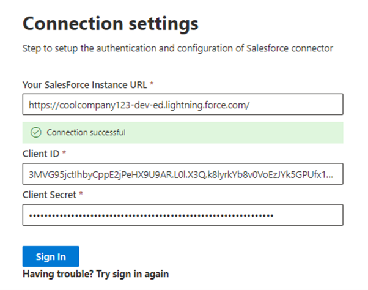

<!---Previous ms.author: rusamai --->

# Salesforce Graph Connector (Vorschau)

Der Salesforce Graph-Connector ermöglicht Ihrer Organisation das Indizieren von Kontakten, Verkaufschancen, Leads und Kontenobjekten in Ihrer Salesforce-Instanz. Nachdem Sie den Connector konfiguriert und Inhalte aus Salesforce indiziert haben, können Endbenutzer in einem beliebigen Microsoft Search-Client nach diesen Elementen suchen.

> [!NOTE]
> Lesen Sie [**den Artikel "Setup für Ihren Graph-Connector",**](configure-connector.md) um den allgemeinen Einrichtungsprozess für Graph Connectors zu verstehen.

Dieser Artikel ist für jeden benutzer, der einen ServiceNow Graph Connector konfiguriert, ausgeführt und überwacht. Sie ergänzt den allgemeinen Einrichtungsprozess und zeigt Anweisungen, die nur für den Salesforce -Graph-Connector gelten. Dieser Artikel enthält auch Informationen zu [Einschränkungen.](#limitations)

>[!IMPORTANT]
>Der Salesforce -Graph-Connector unterstützt derzeit Summer '19 oder höher.

## Bevor Sie beginnen

Zum Herstellen einer Verbindung mit Ihrer Salesforce-Instanz benötigen Sie die Salesforce-Instanz-URL, die Client-ID und den geheimen Clientgeheimnis für die OAuth-Authentifizierung. In den folgenden Schritten wird erläutert, wie Sie oder Ihr Salesforce-Administrator diese Informationen aus Ihrem Salesforce-Konto erhalten können:

- Melden Sie sich bei Ihrer Salesforce-Instanz an, und wechseln Sie zu Setup.

- Navigieren Sie zu "Apps > App-Manager".

- Wählen Sie **"Neue verbundene App" aus.**

- Schließen Sie den Abschnitt "API" wie folgt ab:

    - Aktivieren Sie das Kontrollkästchen für **"Oauth-Einstellungen aktivieren".**

    - Geben Sie die Rückruf-URL wie folgt an: [https://gcs.office.com/v1.0/admin/oauth/callback](https://gcs.office.com/v1.0/admin/oauth/callback)

    - Wählen Sie diese erforderlichen OAuth-Bereiche aus.

        - Zugreifen auf und Verwalten Ihrer Daten (API)

        - Ausführen von Anforderungen in Ihrem Auftrag zu einem beliebigen Zeitpunkt (refresh_token, offline_access)

    - Aktivieren Sie das Kontrollkästchen "Schlüssel für **Webserverfluss erforderlich".**

    - Speichern Sie die App.
    
      > [!div class="mx-imgBorder"]
      > 

- Kopieren Sie den Verbraucherschlüssel und das Verbrauchergeheimnis. Diese Informationen werden als Client-ID und geheimer Clientgeheimnis verwendet, wenn Sie die Verbindungseinstellungen für Ihren Graph Connector im Microsoft 365-Verwaltungsportal konfigurieren.

  > [!div class="mx-imgBorder"]
  > 
  
- Führen Sie vor dem Schließen Ihrer Salesforce-Instanz die folgenden Schritte aus, um sicherzustellen, dass Aktualisierungstoken nicht ablaufen:
    - Wechseln sie zu "Apps" -> App Manager
    - Suchen Sie die von Ihnen erstellte App, und wählen Sie die Dropdownliste auf der rechten Seite aus. Auswählen von **"Verwalten"**
    - Auswählen **von Bearbeitungsrichtlinien**
    - Wählen Sie für die Aktualisierungstokenrichtlinie die Option **"Aktualisierungstoken ist gültig" aus, bis sie widerrufen wird.**

  > [!div class="mx-imgBorder"]
  > 

Sie können jetzt das [M365 Admin Center](https://admin.microsoft.com/) verwenden, um den restlichen Setupprozess für Ihren Graph Connector abzuschließen.

## Schritt 1: Hinzufügen eines Graph-Connectors im Microsoft 365 Admin Center

Befolgen Sie die allgemeinen [Setupanweisungen.](https://docs.microsoft.com/microsoftsearch/configure-connector)
<!---If the above phrase does not apply, delete it and insert specific details for your data source that are different from general setup instructions.-->

## Schritt 2: Benennen der Verbindung

Befolgen Sie die allgemeinen [Setupanweisungen.](https://docs.microsoft.com/microsoftsearch/configure-connector)
<!---If the above phrase does not apply, delete it and insert specific details for your data source that are different from general setup instructions.-->

## Schritt 3: Konfigurieren der Verbindungseinstellungen

Verwenden Sie für die Instanz-URL https://[domain].my.salesforce.com, wobei domäne die #A0 für Ihre Organisation wäre.

Geben Sie die Client-ID und den geheimen Clientgeheimnis ein, die Sie von Ihrer Salesforce-Instanz erhalten haben, und wählen Sie "Anmelden" aus.

Wenn Sie das erste Mal versucht haben, sich mit diesen Einstellungen anmelden, erhalten Sie ein Popupfenster, in dem Sie aufgefordert werden, sich mit Ihrem Administratorbenutzernamen und -kennwort bei Salesforce zu anmelden. Der folgende Screenshot zeigt das Popup. Geben Sie Ihre Anmeldeinformationen ein, und wählen Sie "Anmelden" aus.

  

  >[!NOTE]
  >Wenn das Popup nicht angezeigt wird, wird es möglicherweise in Ihrem Browser blockiert, sodass Sie Popups und Umleitungen zulassen müssen.

Überprüfen Sie, ob die Verbindung erfolgreich war, indem Sie nach einem grünen Banner mit der Aufl tzung "Verbindung erfolgreich" suchen, wie im folgenden Screenshot dargestellt.

  > [!div class="mx-imgBorder"]
  > 

## Schritt 4: Verwalten von Suchberechtigungen

Sie müssen auswählen, welche Benutzer Suchergebnisse aus dieser Datenquelle sehen. Wenn Sie nur bestimmten Azure Active Directory (Azure AD)- oder Nicht-Azure AD-Benutzern erlauben, die Suchergebnisse anzuzeigen, stellen Sie sicher, dass Sie die Identitäten zuordnungen.

## Schritt 4a: Auswählen von Berechtigungen

Sie können zugriffssteuerungslisten (Access Control Lists, ACLs) aus Ihrer Salesforce-Instanz ingestieren oder allen Benutzern in Ihrer Organisation erlauben, Suchergebnisse aus dieser Datenquelle zu sehen. ACLs können Azure Active Directory (AAD)-Identitäten (Benutzer, die von Azure AD zu Salesforce im Verbund sind), Nicht-Azure AD-Identitäten (systemeigene Salesforce-Benutzer, die entsprechende Identitäten in Azure AD haben) oder beides enthalten.

>[!NOTE]
>Wenn Sie einen Identitätsanbieter eines Drittanbieters wie Ping ID oder secureAuth verwenden, sollten Sie "nicht AAD" als Identitätstyp auswählen.

> [!div class="mx-imgBorder"]
> 

Wenn Sie eine ACL aus Ihrer Salesforce-Instanz aufgenommen und für den Identitätstyp "Nicht-AAD" ausgewählt haben, finden Sie unter "Zuordnen ihrer [Nicht-Azure AD-Identitäten"](map-non-aad.md) Anweisungen zum Zuordnen der Identitäten.

## Schritt 4b: Zuordnung von AAD-Identitäten

Wenn Sie eine ACL aus Ihrer Salesforce-Instanz aufgenommen und "AAD" für den Identitätstyp ausgewählt haben, finden Sie unter "Zuordnen Ihrer [Azure AD-Identitäten"](map-aad.md) Anweisungen zum Zuordnen der Identitäten. Informationen zum Einrichten von Azure AD SSO für Salesforce finden Sie in diesem [Lernprogramm.](https://docs.microsoft.com/azure/active-directory/saas-apps/salesforce-tutorial)

## Schritt 5: Zuweisen von Eigenschaftsbezeichnungen

Sie können jeder Bezeichnung eine Quelleigenschaft zuweisen, indem Sie aus einem Menü mit Optionen auswählen. Dieser Schritt ist zwar nicht zwingend erforderlich, aber einige Eigenschaftsbezeichnungen verbessern die Suchrelevanz und sorgen für bessere Suchergebnisse für Endbenutzer. Standardmäßig wurden einigen Bezeichnungen wie "Titel", "URL", "CreatedBy" und "LastModifiedBy" bereits Quelleigenschaften zugewiesen.

## Schritt 6: Verwalten des Schemas

Sie können auswählen, welche Quelleigenschaften indiziert werden sollen, damit sie in den Suchergebnissen angezeigt werden. Der Verbindungsassistent wählt standardmäßig ein Suchschema basierend auf einer Reihe von Quelleigenschaften aus. Sie können dies ändern, indem Sie die Kontrollkästchen für jede Eigenschaft und jedes Attribut auf der Suchschemaseite aktivieren. Zu den Suchschemaattributen gehören "Suche", "Abfrage", "Abrufen" und "Einschränkung".
Mithilfe von Einschränkungen können Sie die Eigenschaften definieren, die später als benutzerdefinierte Einschränkungen oder Filter in der Sucherfahrung verwendet werden können.  

> [!div class="mx-imgBorder"]
> 

## Schritt 7: Festlegen des Aktualisierungszeitplans

Der Salesforce Connector unterstützt derzeit nur Aktualisierungszeitpläne für vollständige Durchforstungen.

>[!IMPORTANT]
>Bei einer vollständigen Durchforstung werden gelöschte Objekte und Benutzer gefunden, die zuvor mit dem Microsoft Search-Index synchronisiert wurden.

Der empfohlene Zeitplan ist eine Woche für eine vollständige Durchforstung.

## Schritt 8: Überprüfen der Verbindung

Befolgen Sie die allgemeinen [Setupanweisungen.](https://docs.microsoft.com/microsoftsearch/configure-connector)
<!---If the above phrase does not apply, delete it and insert specific details for your data source that are different from general setup instructions.-->

<!---## Troubleshooting-->
<!---Insert troubleshooting recommendations for this data source-->

## Einschränkungen

- Der Graph Connector unterstützt zurzeit keine Apex-basierte, gebietsbasierte Freigabe und Freigabe mit persönlichen Gruppen aus Salesforce.
- Es gibt einen bekannten Fehler in der Salesforce-API, die der #A0 verwendet, wobei die privaten organisationsweiten Standardwerte für Leads derzeit nicht berücksichtigt werden.  
- Wenn für ein Feld die Sicherheit auf Feldebene (Field Level Security, FLS) für ein Profil festgelegt ist, wird dieses Feld vom Graph Connector nicht für Profile in dieser Salesforce-Organisation aufgenommen. Daher können Benutzer nicht nach Werten für diese Felder suchen, und sie werden auch nicht in den Ergebnissen angezeigt.  
- Auf dem Bildschirm "Schema verwalten" werden diese allgemeinen Standardeigenschaftsnamen einmal aufgeführt. Die Optionen sind **"Abfrage",** "Suche", **"Abrufen"** und "Verfeinern" und gelten für alle oder keine.
    - Name
    - Url
    - Beschreibung
    - Fax
    - Phone
    - MobilePhone
    - E-Mails
    - Typ
    - Titel
    - AccountId
    - AccountName
    - AccountUrl
    - AccountOwner
    - AccountOwnerUrl
    - Besitzer
    - OwnerUrl
    - CreatedBy
    - CreatedByUrl
    - LastModifiedBy
    - LastModifiedByUrl
    - LastModifiedDate
    - ObjectName
