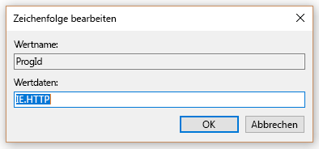
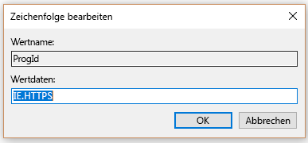

# Standardbrowser festlegen

Konfigurieren der Standard-Browser, Standard-Suchmaschine und Standard-Homepage helfen Ihre Benutzer entdecken Sie Microsoft Search-Funktionen, weitere Verwendung fördern und bieten einen reibungsloseren.
  
Wenn als Standardbrowser für Ihre Organisation festlegen möchten, führen Sie die folgenden Schritte aus.
  
## Windows 8 und höher

Wenn Internet Explorer oder Microsoft Edge als Standardbrowser festlegen möchten, gehen Sie folgendermaßen vor:
  
### Erstellen von Zuordnungen-Standarddatei

1. Öffnen Sie eine PowerShell-Verwaltungskonsole.
    
2.  `New-Item -Path "\\$env:USERDOMAIN\SYSVOL\$env:USERDNSDOMAIN" -Type Directory -Name "Settings"`
    
3.  `$SettingsPath="\\$env:USERDOMAIN\SYSVOL\$env:USERDNSDOMAIN\Settings"`
    
4.  `Start-Process Dism.exe -PassThru "/Online /Export-DefaultAppAssociations:$SettingsPath\AppAssoc.xml"`
    
Diese Schritte testen und erstellen Sie die Standarddatei Zuordnungen im Ordner SYSVOL des Domänencontrollers.
  
### Fügen Sie hinzu oder bearbeiten Sie die Zuordnungen-Standarddatei

1. `Notepad "$SettingsPath\AppAssoc.xml"`
    
2. Bearbeiten Sie die folgenden Einträge (.htm, .html, http, Https), und entfernen Sie andere Einträge zu, wenn sie nicht benötigt werden.
    
  - **Microsoft Edge**
    
     `<Association Identifier=".htm" ProgId="AppX4hxtad77fbk3jkkeerkrm0ze94wjf3s9" ApplicationName="Microsoft Edge" />`
  
     `<Association Identifier=".html" ProgId="AppX4hxtad77fbk3jkkeerkrm0ze94wjf3s9" ApplicationName="Microsoft Edge" />`
  
     `<Association Identifier="http" ProgId="AppXq0fevzme2pys62n3e0fbqa7peapykr8v" ApplicationName="Microsoft Edge" />`
    
  - **Internet Explorer**
    
     `<Association Identifier=".htm" ProgId="htmlfile" ApplicationName="Internet Explorer" />`
  
     `<Association Identifier=".html" ProgId="htmlfile" ApplicationName="Internet Explorer" />`
  
     `<Association Identifier="http" ProgId="IE.HTTP" ApplicationName="Internet Explorer" />`
  
     `<Association Identifier="https" ProgId="IE.HTTPS" ApplicationName="Internet Explorer" />`
    
3. Öffnen Sie die Gruppenrichtlinien-Verwaltungskonsole (gpmc.msc), und wechseln Sie zum Erstellen einer neuen oder bearbeiten die vorhandene Richtlinie.
    
1. Navigieren Sie zu **Computer Vorlagen\Windows-Components\File Explorer**
    
2. Doppelklicken Sie auf **eine Standardkonfigurationsdatei Zuordnungen festlegen**, legen Sie es auf **aktiviert**und geben Sie den Pfad zum AppAssoc.xml (zum Beispiel %USERDOMAIN%\SYSVOL\%USERDNSDOMAIN%\Settings\AppAssoc.xml)
    
4. Erzwingen Sie das resultierende GPO durch Verknüpfung mit der entsprechenden Domäne.
    
Benutzer können den Browser ändern, nachdem diese Richtlinie festgelegt ist.
  
## Windows 7

1. Konfigurieren Sie den lokalen Computer, der zum Festlegen des Gruppenrichtlinienobjekts verwendet werden.
    
1. **Steuerelement Panel\Programs\Default Programs\Set Programme** öffnen und Internet Explorer als Standard festgelegt. 
    
2. Öffnen Sie die Gruppenrichtlinien-Verwaltungskonsole (gpmc.msc), und wechseln Sie zum Erstellen einer neuen oder bearbeiten die vorhandene Richtlinie.
    
1. Navigieren Sie zu ** \<Computerbenutzers/\> Configuration\Policies\Preferences\Windows Einstellungen**.
    
2. Mit der rechten Maustaste auf **Registry\New** , und wählen Sie **Registry Wizard**.
    
3. Wählen Sie aus der Registrierung Browserfenster **Lokaler Computer** , und klicken Sie auf **Weiter**.
    
4. Navigieren Sie zu **HKEY_CURRENT_USER\Software\Microsoft\Windows\Shell\Associations\UrlAssociations\https** , und wählen Sie die ProgId Wert aus. Stellen Sie sicher, dass der Wert das unten abgebildete aussieht: 
    
    
  
5. Navigieren Sie zu **HKEY_CURRENT_USER\Software\Microsoft\Windows\Shell\Associations\UrlAssociations\https** , und wählen Sie die ProgId Wert aus. Stellen Sie sicher, dass der Wert der aussieht unten: 
    
    
  
3. Erzwingen Sie das resultierende GPO durch Verknüpfung mit der entsprechenden Domäne.
    
Benutzer können den Browser ändern, nachdem diese Richtlinie festgelegt ist.