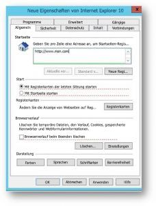

# Festlegen der standardmäßigen Startseite

Das Konfigurieren des Standardbrowsers, der Standardsuchmaschine und der standardmäßigen Startseite hilft Ihren Benutzern, die Microsoft Search-Funktionen zu entdecken, fördert deren Verwendung und ermöglicht eine gleichmäßigere Erfahrung.
  
Führen Sie zum Festlegen der standardmäßigen Startseite für Ihre Organisation die folgenden Schritte aus.
  
## Internet Explorer

### Internet Explorer 5.0 oder höher

1. Öffnen Sie die Gruppenrichtlinien-Verwaltungskonsole (gpmc.msc), und wechseln Sie zum Bearbeiten einer vorhandenen Richtlinie oder zum Erstellen einer neuen.
    
2. Navigieren Sie zu **Benutzerkonfiguration\Einstellungen\Systemsteuerungseinstellungen\Internet-Einstellungen**.
    
3. Klicken Sie mit der rechten Maustaste auf **Internet-Einstellungen**, und wählen Sie **Internet Explorer 10** aus.
    
    > [!NOTE]
    > Sie müssen die Option „Internet Explorer 10“ auswählen, um die Einstellungen für Internet Explorer 11 anzuwenden, da dieselben Einstellungen für Internet Explorer 11 gelten. 
  
4. Einstellungen, die rot unterstrichen sind, werden auf dem Zielrechner nicht konfiguriert, während grün unterstrichene Einstellungen auf dem Zielrechner konfiguriert werden. Um die Unterstreichung zu ändern, verwenden Sie die folgenden Funktionstasten:
    
    F5 – alle Einstellungen auf der aktuellen Registerkarte aktivieren
    
    F6 – die aktuell ausgewählte Einstellung aktivieren
    
    F7 – die aktuell ausgewählte Einstellung deaktivieren
    
    F8 – alle Einstellungen auf der aktuellen Registerkarte deaktivieren
    
5. Drücken Sie **F8**, um alle Einstellungen zu deaktivieren, bevor Sie irgendetwas konfigurieren. Der Bildschirm sollte wie folgt aussehen: 
    
    
  
6. Drücken Sie für die Einstellung der Startseite **F6**, und geben Sie `https://www.bing.com/business?form=BFBSPR` ein.
    
7. Erzwingen das resultierende GPO, indem Sie es mit der entsprechenden Domäne verknüpfen.
    
> [!NOTE]
> Benutzer können die Startseite weiterhin ändern, nachdem diese Richtlinie festgelegt ist. 
  
## Microsoft Edge

### Windows 10, Version 1511 oder höher

1. Öffnen Sie die Gruppenrichtlinien-Verwaltungskonsole (gpmc.msc), und wechseln Sie zum Bearbeiten einer vorhandenen Richtlinie oder zum Erstellen einer neuen.
    
2. Navigieren Sie zu **Administrative Vorlagen\Windows-Komponenten\Microsoft Edge**.
    
1. Doppelklicken Sie auf **Startseiten konfigurieren**, legen Sie es auf **Aktiviert** fest, und geben Sie `https://www.bing.com/business` ein.
    
3. Erzwingen das resultierende GPO, indem Sie es mit der entsprechenden Domäne verknüpfen.
    
> [!CAUTION]
> Benutzer können den Suchanbieter nicht mehr ändern, nachdem diese Richtlinie festgelegt wurde. 
  
## Google Chrome

### Windows XP SP2 oder höher

Den Windows Support-Artikel zum Verwalten von ADMX-Dateien und die neuesten ADMX-Dateien für verschiedene Windows-Versionen finden Sie [auf der Microsoft-Supportwebsite](https://support.microsoft.com/de-DE/help/3087759/how-to-create-and-manage-the-central-store-for-group-policy-administra).

Sie benötigen auch die neueste Google-Richtliniendatei. Sie finden sie unter [Hilfe zu Google Chrome Enterprise](https://support.google.com/chrome/a/answer/187202).
  
Wenn Sie die in diesem Abschnitt beschriebenen Einstellungen in der Gruppenrichtlinien-Verwaltungskonsole nicht finden, laden Sie die entsprechenden ADMX herunter, und kopieren Sie sie in den [zentralen Speicher](https://docs.microsoft.com/de-DE/previous-versions/windows/it-pro/windows-vista/cc748955%28v%3dws.10%29). Der zentrale Speicher auf dem Controller ist ein Ordner mit der folgenden Benennungskonvention:
  
 **%systemroot%\sysvol\\<domain\>\policies\PolicyDefinitions**
  
Jede Domäne, die Ihr Controller verarbeitet, sollte einen separaten Ordner erhalten. Mit dem folgenden Befehl kann die ADMX-Datei aus der Befehlszeile kopiert werden:
  
 `Copy <path_to_ADMX.ADMX> %systemroot%\sysvol\<domain>\policies\PolicyDefinitions`
  
1. Öffnen Sie die Gruppenrichtlinien-Verwaltungskonsole (gpmc.msc), und wechseln Sie zum Bearbeiten einer vorhandenen Richtlinie oder zum Erstellen einer neuen.
    
2. Stellen Sie sicher, dass die folgenden Ordner im Abschnitt **Administrative Vorlagen** der *Benutzer- und der Computerkonfiguration* angezeigt werden: Google Chrome und Google Chrome – Standardeinstellungen (Benutzer können diese überschreiben).
    
   - Die Einstellungen des ersten Abschnitts sind festgelegt, und der lokale Administrator kann sie nicht ändern.
    
   - Die Einstellungen im nachfolgenden Richtlinienabschnitt können von Benutzern in ihren Browsereinstellungen geändert werden. Entscheiden Sie, ob Benutzer Ihre Standardeinstellung außer Kraft setzen können. Ändern Sie in den folgenden Schritten die Einstellung in den Ordner, welcher der Richtlinie und den Anforderungen in Ihrer Organisation entspricht. Die folgenden Schritte verwenden „Google Chrome – Standardeinstellungen“ als Standard.
    
3. Navigieren Sie zu **&lt;Computer/Benutzerkonfiguration&gt;\Administrative Vorlagen\Google Chrome – Standardeinstellungen\Startseite**.
    
4. Doppelklicken Sie auf **Neue Registerkartenseite als Startseite verwenden**, und legen Sie es auf **Aktiviert** fest.
    
5. Navigieren Sie zu **&lt;Computer/Benutzerkonfiguration&gt;\Administrative Vorlagen\Google Chrome – Standardeinstellungen\Neue Registerkartenseite**.
    
6. Doppelklicken Sie auf **URL der neuen Registerkartenseite konfigurieren**, legen Sie es auf **Aktiviert** fest, und geben Sie `https://www.bing.com/business?form=BFBSPR` ein.
    
7. Erzwingen das resultierende GPO, indem Sie es mit der entsprechenden Domäne verknüpfen.
    
Benutzer können die Startseite ändern, nachdem diese Richtlinie festgelegt ist.