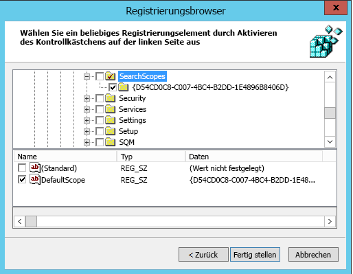

# Festlegen von Bing als StandardsuchmaschineMake Bing the default search engine
  
In diesem Artikel wird erläutert, wie Sie Bing als Standardsuchmaschine für Microsoft Edge, Google Chrome und Internet Explorer festlegen.This article explains how you can make Bing the default search engine for Microsoft Edge, Google Chrome, and Internet Explorer. 
  
## Microsoft Edge unter Windows 10, Version 1703 oder höherMicrosoft Edge on Windows 10, Version 1703 or later

Auch wenn Sie Bing als Standardsuchmaschine festgelegt haben, können Benutzer unter Microsoft Edge ihre Einstellungen so ändern, dass eine andere Suchmaschine verwendet wird.Although you'll set Bing as the default search engine, Microsoft Edge allows users to change their settings to use a different search engine.
  
Die neuesten ADMX-Dateien für verschiedene Windows-Versionen finden Sie unter [Erstellen und Verwalten des zentralen Speichers für administrative Vorlagen für Gruppenrichtlinien unter Windows](https://support.microsoft.com/help/3087759/how-to-create-and-manage-the-central-store-for-group-policy-administra).For the latest ADMX files for various versions of Windows, see [How to create and manage the Central Store for Group Policy Administrative Templates in Windows](https://support.microsoft.com/help/3087759/how-to-create-and-manage-the-central-store-for-group-policy-administra).
  
Wenn die in diesem Abschnitt beschriebene Einstellung nicht in der GPMC gefunden werden kann, laden Sie die entsprechende ADMX herunter, und kopieren Sie sie in den zentralen Speicher.If the setting described in this section cannot be found inside of GPMC, download the appropriate ADMX and copy them to the central store. Weitere Informationen finden Sie unter [Editing Domain-Based GPOs Using ADMX Files](https://docs.microsoft.com/previous-versions/windows/it-pro/windows-vista/cc748955%28v%3dws.10%29).For more information, see [Editing Domain-Based GPOs Using ADMX Files](https://docs.microsoft.com/previous-versions/windows/it-pro/windows-vista/cc748955%28v%3dws.10%29). Der zentrale Speicher auf dem Controller ist ein Ordner mit der folgenden **Benennungskonvention: %systemroot%\sysvol \\<Domäne \> \policies\PolicyDefinitions**Central store on the controller is a folder with the following naming convention: **%systemroot%\sysvol\\<domain\>\policies\PolicyDefinitions**
  
Jede Domäne, die Ihr Controller verarbeitet, sollte einen separaten Ordner erhalten. Mit dem folgenden Befehl kann die ADMX-Datei aus der Befehlszeile kopiert werden:Each domain that your controller handles should get a separate folder. The following command can be used to copy the ADMX file from the command prompt:
  
 `Copy <path_to_ADMX.ADMX> %systemroot%\sysvol\<domain>\policies\PolicyDefinitions`
  
1. Öffnen Sie die Gruppenrichtlinien-Verwaltungskonsole (gpmc.msc), und wechseln Sie zum Bearbeiten einer vorhandenen Richtlinie oder zum Erstellen einer neuen.Open the Group Policy Management Console (gpmc.msc) and switch to editing an existing policy or creating a new one.
2. Navigieren Sie zu **&lt;Computer/Benutzerkonfiguration&gt;\Administrationsvorlagen\Windows-Komponenten\Microsoft Edge**.Navigate to **&lt;Computer/User Configuration&gt;\Administrative Templates\Windows Components\Microsoft Edge**.
3. Doppelklicken Sie auf **Festlegen der Standardsuchmaschine**, wählen Sie **Aktiviert** aus, und geben Sie `https://www.bing.com/sa/osd/bfb.xml` ein.Double-click **Set default search engine**, set to **Enabled**, and enter `https://www.bing.com/sa/osd/bfb.xml`
4. Erzwingen das resultierende GPO, indem Sie es mit der entsprechenden Domäne verknüpfen.Enforce the resultant GPO by linking it to the appropriate domain.

## Google Chrome unter Windows 10, Version 1507 oder höherGoogle Chrome on Windows 10, Version 1507 or later

Benutzer können die Standardsuchmaschine nicht mehr ändern, nachdem diese Richtlinie festgelegt wurde.Users won't be able to change the default search engine after this policy is set.
  
Chrome verfügt über einen eigenen Satz von Gruppenrichtlinieneinstellungen, die in Form einer ADMX-Datei aus der [Google Chrome Enterprise-Hilfe heruntergeladen werden können.](https://support.google.com/chrome/a/answer/187202)Chrome comes with its own set of group policy settings which can be downloaded in the form of an ADMX file from [Google Chrome Enterprise Help](https://support.google.com/chrome/a/answer/187202).
  
Kopieren Sie die Vorlagendatei in einen zentralen Speicher für ADMX-Dateien auf dem Domänencontroller.Copy the template file to a central store for ADMX files on the domain controller. Weitere Informationen finden Sie unter [Editing Domain-Based GPOs Using ADMX Files](https://docs.microsoft.com/previous-versions/windows/it-pro/windows-vista/cc748955%28v%3dws.10%29).For more information, see [Editing Domain-Based GPOs Using ADMX Files](https://docs.microsoft.com/previous-versions/windows/it-pro/windows-vista/cc748955%28v%3dws.10%29). Der zentrale Speicher auf dem Controller ist ein Ordner mit der folgenden **Benennungskonvention: %systemroot%\sysvol \\<Domäne \> \policies\PolicyDefinitions**Central store on the controller is a folder with the following naming convention: **%systemroot%\sysvol\\<domain\>\policies\PolicyDefinitions**
  
Jede Domäne, die Ihr Controller verarbeitet, sollte einen separaten Ordner erhalten. Mit dem folgenden Befehl kann die ADMX-Datei aus der Befehlszeile kopiert werden:Each domain that your controller handles should get a separate folder. The following command can be used to copy the ADMX file from the command prompt:
  
 `Copy <path_to_Chrome.ADMX> %systemroot%\sysvol\<domain>\policies\PolicyDefinitions`
  
1. Öffnen Sie die Gruppenrichtlinien-Verwaltungskonsole (gpmc.msc), und wechseln Sie zum Bearbeiten einer vorhandenen Richtlinie oder zum Erstellen einer neuen.Open the Group Policy Management Console (gpmc.msc) and switch to editing any existing policy or creating a new one.
2. Stellen Sie sicher, dass die folgenden Ordner im Abschnitt Administrationsvorlagen der Benutzer- und Computerkonfiguration angezeigt werden: Google Chrome und Google Chrome - Standardeinstellungen.Make sure the following folders appear in the Administrative Templates section of both User/Computer Configuration: Google Chrome and Google Chrome - Default Settings.

    - Die Einstellungen des ersten Abschnitts wurden festgelegt, und lokale Administratoren können sie nicht im Browser ändern.The settings of the first section are fixed and local administrators won't be able to change them in the browser.
    - Die Einstellungen im nachfolgenden Abschnitt der Richtlinien können von Benutzern in den Browsereinstellungen geändert werden.The settings of the latter section of policies can be changed by users in the browser settings.

3. Navigieren Sie **\<Computer/User\> zu Configuration\Administrative Templates\Google Chrome\Default search provider**Navigate to **\<Computer/User\> Configuration\Administrative Templates\Google Chrome\Default search provider**
4. Doppelklicken Sie auf **Aktivieren des Standardsuchanbieters**, und wählen Sie **Aktiviert** aus.Double-click **Enable the default search provider**, and set it to **Enabled**.
5. Doppelklicken Sie auf das **Standardsuchanbieter-Symbol**, wählen Sie **Aktiviert** aus, und geben Sie `https://www.bing.com/sa/simg/bb.ico` ein.Double-click **Default search provider icon**, set it to **Enabled**, and enter `https://www.bing.com/sa/simg/bb.ico`
6. Doppelklicken Sie auf die **Standardsuchanbieter-Instant-URL**, und geben Sie `https://www.bing.com/business/search?q={searchTerms}&amp;form=BFBSPR` ein.Double-click **Default search provider instant URL**, and enter `https://www.bing.com/business/search?q={searchTerms}&amp;form=BFBSPR`
7. Doppelklicken Sie auf den **Standardsuchanbieter-Namen**, wählen Sie Aktiviert aus, und geben Sie „Microsoft Search in Bing“ ein.Double-click **Default search provider name**, set it to Enabled, and enter 'Microsoft Search in Bing'
8. Doppelklicken Sie auf die **Standardsuchanbieter-Such-URL**, wählen Sie **Aktiviert** aus, und geben Sie `https://www.bing.com/business/search?q={searchTerms}&amp;form=BFBSPR` ein.Double-click **Default search provider search URL**, set it to **Enabled**, and enter `https://www.bing.com/business/search?q={searchTerms}&amp;form=BFBSPR`
9. Erzwingen das resultierende GPO, indem Sie es mit der entsprechenden Domäne verknüpfen.Enforce the resultant GPO by linking it to the appropriate domain.

## Internet Explorer 11 oder höherInternet Explorer 11 or later

Benutzer können den Suchanbieter ändern, nachdem diese Richtlinie festgelegt wurde.Users will be able to change the search provider after this policy is set.
  
### SCHRITT 1:STEP 1. Konfigurieren Sie den lokalen Computer, der verwendet wird, um das Gruppenrichtlinienobjekt festzulegen.Configure the local machine that will be used to set the GPO

Fügen Sie den folgenden Text in eine REG-Datei (\*.reg) ein.Paste the following text into a reg(\*.reg) file.
  
Windows-Registrierungs-Editor, Version 5.00Windows Registry Editor Version 5.00
  
<pre>[HKEY_CURRENT_USER\Software\Microsoft\Internet Explorer\SearchScopes]
"DefaultScope"="{D54CD0C8-C007-4BC4-B2DD-1E4896B8406D}"
[HKEY_CURRENT_USER\Software\Microsoft\Internet Explorer\SearchScopes\{D54CD0C8-C007-4BC4-B2DD-1E4896B8406D}]
"Codepage"=dword:0000fde9
"DisplayName"="Microsoft Search in Bing"
"OSDFileURL"="https://www.bing.com/sa/osd/bfb.xml"
"FaviconURL"="https://www.bing.com/sa/simg/bb.ico"
"URL"="https://www.bing.com/business/search?q={searchTerms}&amp;form=BFBSPR"</pre>
  
Doppelklicken Sie auf die erstellte Datei, und befolgen Sie die Schritte zum Importieren der Datei. Nach einem erfolgreichen Import wird der folgende Dialog angezeigt:Double-click the file created and follow the steps to import the file. A successful import should result in the following dialog:
  

  
### SCHRITT 2:STEP 2. Öffnen Sie die Gruppenrichtlinien-Verwaltungskonsole (gpmc.msc), und wechseln Sie zum Bearbeiten einer vorhandenen Richtlinie oder zum Erstellen einer neuen.Open the Group Policy Management Console (gpmc.msc) and switch to editing an existing policy or creating a new one

1. Navigieren Sie zu **Benutzerkonfiguration\Richtlinien\Einstellungen\Windows-Einstellungen**.Navigate to **User Configuration\Policies\Preferences\Windows Settings**.
2. Klicken Sie mit der rechten Maustaste auf **Registrierung\Neu** und **Registrierungsassistent**. Wählen Sie im Fenster "Registrierungsbrowser" **Lokaler Computer**, und klicken Sie auf **Weiter**.Right-click on **Registry\New** and select **Registry Wizard**. From the Registry Browser window, select **Local Computer** and click **Next**.
3. Navigieren Sie zu **HKEY_CURRENT_USER\SOFTWARE\Microsoft\Internet Explorer\SearchScopes**.Navigate to **HKEY_CURRENT_USER\SOFTWARE\Microsoft\Internet Explorer\SearchScopes**.
4. Wählen Sie aus diesem Schlüssel DefaultScope aus.From this key, make sure to select DefaultScope.

    
5. Überprüfen Sie alle untergeordneten Schlüssel, die die GUID für Microsoft Search in Bing enthalten, und jeden Wert unter dem Schlüssel mit Ausnahme von Pfaden zu Benutzerprofilen. Scrollen Sie nach unten, um weitere Elemente auszuwählen.Check all sub keys containing the GUID for Microsoft Search in Bing and every value under the key except any path to user profiles. Scroll down to select other items.
6. Klicken Sie auf Fertig stellen, um die Konfiguration abzuschließen.Click Finish to complete this configuration.

### SCHRITT 3:STEP 3. Richten Sie Benutzereinstellungen ein, um eine Warnung zu vermeiden, die der Benutzer möglicherweise erhält, wenn die DefaultScope-Suche erzwungen wird.Set up User Preferences to help eliminate a warning the user may get when DefaultScope search is enforced

Diese Warnung warnt Benutzer eines Programmes davor, ihre Einstellungen zu ändern.This warning is by design and alerts users of a program trying to modify their settings.
  
1. Klicken Sie im gleichen Gruppenrichtlinienobjekt mit der rechten Maustaste auf **Registrierung\Neu**, und wählen Sie **Registrierungsassistent** aus.Within the same GPO, right click on **Registry\New** and select **Registry Wizard**.
2. Navigieren Sie zu **HKEY_CURRENT_USER\SOFTWARE\Microsoft\Internet Explorer\User Preferences**.Navigate to **HKEY_CURRENT_USER\SOFTWARE\Microsoft\Internet Explorer\User Preferences**.
3. Wählen Sie den Schlüssel **Benutzereinstellung**.Select the **User Preference** key.
4. Klicken Sie auf **Fertig stellen**.Click **Finish**.
5. Klicken Sie auf das neu erstellte Objekt. Doppelklicken Sie im Bereich rechts auf das Benutzereinstellungen-Objekt, und ändern Sie die **Aktion** in **Löschen und Speichern**.Click on the newly created object. On the right-side pane double click on the User Preferences object, change the **Action** to **Delete and Save**.
6. Erzwingen das resultierende GPO, indem Sie es mit der entsprechenden Domäne verknüpfen.Enforce the resultant GPO by linking it to the appropriate domain.
