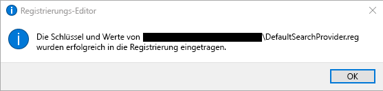

# Festlegen der Standardsuchmaschine

Konfigurieren der Standard-Browser, Standard-Suchmaschine und Standard-Homepage helfen Ihre Benutzer entdecken Sie Microsoft Search-Funktionen, weitere Verwendung fördern und bieten einen reibungsloseren.
  
Wenn die Standard-Suchmaschine für Ihre Organisation festlegen möchten, führen Sie die folgenden Schritte aus.
  
## Internet Explorer

### Internet Explorer 11

Benutzer können Suchanbieter ändern, nachdem diese Richtlinie festgelegt ist.
  
#### 1 Konfigurieren Sie 1 den lokalen Computer, der zum Festlegen des Gruppenrichtlinienobjekts verwendet werden

Fügen Sie den folgenden Text in einer Reg (\*reg) Datei.
  
Windows-Registrierungs-Editor, Version 5.00
  
<pre>[HKEY_CURRENT_USER\Software\Microsoft\Internet Explorer\SearchScopes]
"DefaultScope"="{D54CD0C8-C007-4BC4-B2DD-1E4896B8406D}"
[HKEY_CURRENT_USER\Software\Microsoft\Internet Explorer\SearchScopes\{D54CD0C8-C007-4BC4-B2DD-1E4896B8406D}]
"Codepage"=dword:0000fde9
"DisplayName"="Microsoft Search in Bing"
"OSDFileURL"="https://www.bing.com/sa/osd/bfb.xml"
"FaviconURL"="https://www.bing.com/sa/simg/bb.ico"
"SuggestionsURL_JSON"="https://business.ing.com/api/v2/browser/suggest?q={searchTerms}&amp;form=BFBSPA"
"ShowSearchSuggestions"=dword:00000001
"URL"="https://www.bing.com/business/search?q={searchTerms}&amp;form=BFBSPR"</pre>
  
Doppelklicken Sie auf die Datei erstellt, und führen Sie die Schritte zum Importieren der Datei. Das folgende Dialogfeld sollte ein erfolgreicher Import führen:
  

  
#### 2. Öffnen Sie die Gruppenrichtlinien-Verwaltungskonsole (gpmc.msc), und wechseln Sie zum Erstellen einer neuen oder Bearbeiten einer vorhandenen Richtlinie

1. Navigieren Sie zu **Configuration\Policies\Preferences\Windows Benutzereinstellungen**.
    
2. Mit der rechten Maustaste auf **Registry\New** , und wählen Sie **Registry Wizard**. Wählen Sie aus der Registrierung Browserfenster **Lokaler Computer** , und klicken Sie auf **Weiter**.
    
3. Navigieren Sie zu **HKEY_CURRENT_USER\SOFTWARE\Microsoft\Internet Explorer\SearchScopes**.
    
4. Dieser Schlüssel ist Vergewissern Sie sich, um DefaultScope auszuwählen.
    
    
  
5. Überprüfen Sie alle Sub-Schlüssel, die mit der GUID für Microsoft Search in Bing und jeder Wert unter dem Schlüssel mit Ausnahme der Pfad zum von Benutzerprofilen. Führen Sie einen Bildlauf nach unten, andere Elemente auszuwählen.
    
    
  
6. Klicken Sie auf Fertig stellen, um diese Konfiguration abzuschließen.
    
#### 3. Einrichten von Voreinstellungen des Benutzers zu eine Warnung zu löschen, die der Benutzer angezeigt wird, wenn DefaultScope Suche erzwungen wird

Diese Warnung ist entwurfsbedingt und Sie warnt Benutzer, der ein Programm versucht, können Sie ihre Einstellungen ändern.
  
1. Innerhalb der gleichen Gruppenrichtlinienobjekt klicken Sie mit der rechten Maustaste auf **Registry\New** , und wählen Sie **Registry Wizard**.
    
2. Navigieren Sie zu **HKEY_CURRENT_USER\SOFTWARE\Microsoft\Internet Explorer\User Voreinstellungen**.
    
3. Wählen Sie den Schlüssel **Benutzervoreinstellungen** .
    
4. Klicken Sie auf **Fertig stellen**.
    
5. Klicken Sie auf das neu erstellte Objekt. Klicken Sie im rechten Bereich einen Doppelklick auf das Objekt Benutzervoreinstellungen, ändern Sie die **Aktion** **Löschen**und zu speichern.
    
Erzwingen Sie das resultierende GPO durch Verknüpfung mit der entsprechenden Domäne.
  
## Microsoft Edge

### Windows-10, Version 1703 oder höher

Benutzer können Suchanbieter ändern, nachdem diese Richtlinie festgelegt ist.
  
Die neuesten ADMX-Dateien für die verschiedenen Versionen von Windows finden Sie unter [Erstellen und verwalten den zentralen Speicher für Administrative Vorlagendateien für Gruppenrichtlinien in Windows](https://support.microsoft.com/en-us/help/3087759/how-to-create-and-manage-the-central-store-for-group-policy-administra).
  
Wenn die Einstellung in diesem Abschnitt beschriebenen innerhalb der Gruppenrichtlinien-Verwaltungskonsole nicht gefunden werden kann, laden Sie das entsprechende ADMX, und kopieren Sie sie in der zentralen Speicher. Weitere Informationen finden Sie unter [Bearbeiten domänenbasierter Gruppenrichtlinienobjekte mithilfe von ADMX-Dateien](https://docs.microsoft.com/en-us/previous-versions/windows/it-pro/windows-vista/cc748955%28v%3dws.10%29). Zentralen Speicher auf dem Domänencontroller ist ein Ordner mit der folgenden Benennungskonvention:
  
 **%systemroot%\sysvol\\<domain\>\policies\PolicyDefinitions**
  
Jede Domäne, die Ihren Controller behandelt sollte einen gesonderten Ordner abrufen. Der folgende Befehl kann verwendet werden, zum Kopieren von ADMX-Datei von der Befehlszeile aus:
  
 `Copy <path_to_ADMX.ADMX> %systemroot%\sysvol\<domain>\policies\PolicyDefinitions`
  
1. Öffnen Sie die Gruppenrichtlinien-Verwaltungskonsole (gpmc.msc), und wechseln Sie zum Erstellen einer neuen oder Bearbeiten einer vorhandenen Richtlinie.
    
2. Navigieren Sie zu ** &lt;Computer/Benutzerkonfiguration&gt;\Administrative Templates\Windows Komponenten\Microsoft Edge**.
    
1. Doppelklicken Sie auf **Standard-Suchmaschine festlegen**, legen Sie auf **aktiviert**, und geben Sie`https://www.bing.com/sa/osd/bfb.xml`
    
3. Erzwingen Sie das resultierende GPO durch Verknüpfung mit der entsprechenden Domäne.
    
## Google Chrome

### Windows XP SP2 oder höher

Benutzer möglich nicht Suchanbieter ändern, nachdem diese Richtlinie festgelegt ist.
  
Chrome verfügt über einen eigenen Satz von gruppenrichtlinieneinstellungen, die in Form einer ADMX-Datei aus der [Hilfe zu Google Chrome Enterprise](https://support.google.com/chrome/a/answer/187202)heruntergeladen werden kann. Wenn das Betriebssystem Windows Vista/Server 2008 oder höher dienen zum Verwalten des GPO für die Domäne, die in diesem Paket bereitgestellte ADMX-Datei kümmert Chrome-Einstellungen unter Windows XP SP2 oder höher.
  
Kopieren Sie die Vorlagendatei in einem zentralen Speicher für ADMX-Dateien auf dem Domänencontroller. Weitere Informationen finden Sie unter [Bearbeiten domänenbasierter Gruppenrichtlinienobjekte mithilfe von ADMX-Dateien](https://docs.microsoft.com/en-us/previous-versions/windows/it-pro/windows-vista/cc748955%28v%3dws.10%29). Zentralen Speicher auf dem Domänencontroller ist ein Ordner mit der folgenden Benennungskonvention:
  
 **%systemroot%\sysvol\\<domain\>\policies\PolicyDefinitions**
  
Jede Domäne, die Ihren Controller behandelt sollte einen gesonderten Ordner abrufen. Der folgende Befehl kann verwendet werden, zum Kopieren von ADMX-Datei von der Befehlszeile aus:
  
 `Copy <path_to_Chrome.ADMX> %systemroot%\sysvol\<domain>\policies\PolicyDefinitions`
  
1. Öffnen Sie die Gruppenrichtlinien-Verwaltungskonsole (gpmc.msc), und wechseln Sie zum Erstellen einer neuen oder bearbeiten die vorhandene Richtlinie.
    
2. Stellen Sie sicher, dass die folgenden Ordner werden in den beide Benutzer/Computerkonfiguration im Bereich Administrative Vorlagen: Google Chrome und Google Chrome - Standardeinstellungen.
    
  - Die Einstellungen des ersten Abschnitts behoben werden, und lokale Administratoren nicht möglich, um sie im Browser zu ändern.
    
  - Die Einstellungen des zweiten Abschnitts der Richtlinien können von Benutzern in den Browsereinstellungen geändert werden.
    
3. Navigieren Sie zu ** \<Computerbenutzers/\> Benutzerkonfiguration\Administrative Templates\Google Chrome\Default Suchanbieter**
    
4. Doppelklicken Sie auf **den Standardanbieter für die Suche zu aktivieren**, und legen sie auf **aktiviert**.
    
5. Doppelklicken Sie auf **Standard-Anbieter Suchsymbol**, legen Sie es auf **aktiviert**, und geben`https://www.bing.com/sa/simg/bb.ico`
    
6. Doppelklicken Sie auf **Standard instant Suche Provider-URL**, und geben Sie`https://www.bing.com/business/search?q={searchTerms}&amp;form=BFBSPR`
    
7. Doppelklicken Sie auf **Standard-Anbieter Suchbegriff**, legen Sie es auf aktiviert, und geben Sie 'Microsoft Search in Bing'
    
8. Doppelklicken Sie auf **Standard-URL für die Suche Anbieter suchen**, legen Sie es auf **aktiviert**, und geben`https://www.bing.com/business/search?q={searchTerms}&amp;form=BFBSPR`
    
9. Doppelklicken Sie auf **Standard-Suchanbieter vorschlagen URL**, legen Sie es auf **aktiviert**, und geben`https://business.bing.com/api/v2/browser/suggest?q={searchTerms}&amp;form=BFBSPA`
    
10. Erzwingen Sie das resultierende GPO durch Verknüpfung mit der entsprechenden Domäne.
    
Standard-Suchmaschine festlegen, wird die Suchfunktion Vorschläge Microsoft Search in der Adressleiste des Browsers hinzufügen. Dies unterstützt derzeit nur Lesezeichen. Die oberen zwei Textmarke Vorschläge oberhalb der öffentlichen Website Vorschläge wird angezeigt, während sie in der Adressleiste eingeben.