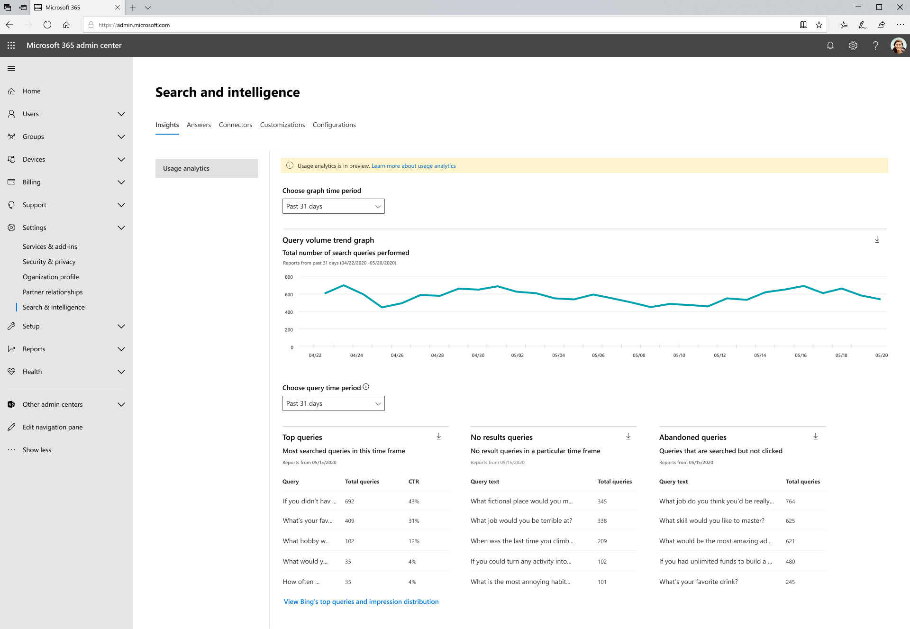

# Verwendungsberichte für Microsoft-Suche

Suchverwendungsberichte ermöglichen Ihnen ein besseres Verständnis der Funktionsweise der Suchfunktion in Ihrer Organisation. Die aus diesen Berichten generierten Einblicke helfen Ihnen, [Inhalte leicht zu finden](https://docs.microsoft.com/microsoftsearch/make-content-easy-to-find) und Maßnahmen zu ergreifen, mit denen die Suche für Ihre Benutzer eine nützlichere und erfreulichere Erfahrung macht.

> [!IMPORTANT]
> Microsoft Search-Verwendungsberichte befinden sich derzeit in der Vorschau.

Die [Verwendungsberichte für Microsoft-Suche](https://admin.microsoft.com/Adminportal/Home?#/MicrosoftSearch/insights) umfassen Diagramme und Tabellen, die aus Suchvorgängen generiert werden, die in SharePoint-Start-und Office.com-Suchfeldern ausgeführt werden. Sie können Daten aus den letzten 31 Tagen, pro Tag oder monatlich für das vorherige Jahr anzeigen. Diese Berichte werden nur bereitstellen, damit es Zeit nimmt, um die Verlaufsdaten zu sammeln.

Eine frühere Version dieser Seite enthielt Daten aus Suchvorgängen, die für Microsoft Search in Bing on Bing.com ausgeführt wurden. Diese Daten werden in Kürze in diese Berichte integriert, aber im Moment können Sie diese Berichte dennoch anzeigen, indem Sie auf den Link unten auf der Seite klicken, um die **Top-Abfragen und die Impression-Verteilung von Bing anzuzeigen**.

## Übersicht über suchberichte

|**Bericht**|**Beschreibung**|
|:-----|:-----|
|Abfragevolumen|Dieser Bericht zeigt die Anzahl der ausgeführten Suchabfragen an. Verwenden Sie diesen Bericht, um die Mengen Trends der Suchabfrage zu identifizieren und Zeiträume mit hoher und niedriger Suchaktivität zu bestimmen.|
|Häufigste Suchvorgänge|Dieser Bericht enthält die beliebtesten Suchabfragen. Verwenden Sie diesen Bericht, um zu verstehen, nach welchen Arten von Informationen Ihre Benutzer suchen.|
|Abgebrochene Abfragen|In diesem Bericht werden beliebte Suchabfragen angezeigt, die einen niedrigen Mausklick erhalten. Mithilfe dieses Berichts können Sie Suchvorgänge identifizieren, die unzufriedene Benutzer erzeugen, und das Auffinden von Inhalten verbessern. Sie können dann feststellen, ob eine Antwort wie eine Textmarke erstellt oder neue Inhalte über einen Graph-Konnektor aufgenommen werden, ist die richtige Aktion.|
|Keine Ergebnis Abfragen|Dieser Bericht zeigt beliebte Suchabfragen, die keine Ergebnisse zurückgegeben. Mithilfe dieses Berichts können Sie Suchvorgänge identifizieren, die unzufriedene Benutzer erzeugen, und das Auffinden von Inhalten verbessern. Sie können dann feststellen, ob eine Antwort wie eine Textmarke erstellt oder neue Inhalte über einen Graph-Konnektor aufgenommen werden, ist die richtige Aktion.|

## Anzeigen von Berichten

Wenn Sie zur Seite Verwendungsberichte navigieren, stehen alle Berichte zur Verfügung, die angezeigt werden können. Sie können den Datumsfilter verwenden, um einen bestimmten Tag oder Monat für die Anzeige auszuwählen.

Durch das Herunterladen eines Berichts können Sie Berichte aus einer größeren Zeitspanne anzeigen. Klicken Sie auf den Download Pfeil, und wählen Sie die **letzten 31 Tage** oder **letzten 12 Monate** aus. Der Bericht wird als Excel-Arbeitsblatt heruntergeladen. Wenn Sie die letzten 31 Tage ausgewählt haben, ist das Arbeitsblatt für jeden Tag eine einzelne Registerkarte. Der Download der letzten 12 Monate enthält einen Tab für jeden Monat.

Klicken Sie zum Anzeigen der Top-Abfragen und Impression-verteilungsberichte von Bing auf den Link auf der Seite.

## Häufig gestellte Fragen

**Wenn ich vergangene 31 Tage oder vergangene 12 Monate wähle, muss ich dann einen bestimmten Tag oder einen bestimmten Monat auswählen.**

Die Kalenderansicht heute in Microsoft Search-Nutzungsberichten ist ein zweistufiger Prozess. Wählen Sie zuerst den Datumsbereich aus der Dropdownliste (nach 31 Tagen oder letzten 12 Monaten) aus, und wählen Sie dann den Starttag oder-Monat aus.

Die oberen, aufgegebenen und fehlgeschlagenen Abfragetabellen zeigen Ergebnisse entweder aus dem Tag oder aus dem Monat, den Sie auswählen.

**Wann werde ich aggregierte Daten für vergangene 7 Tage, vergangene 30 Tage usw. sehen, wie Bing es Top-Abfragen-Berichte?**

Wir erwägen diese Art von Aggregation und vereinfachen die Datenbereichs Filterung für zukünftige Versionen dieser Berichte.

**Warum kann ich keine Aufschlüsselung der Verwendungsberichte durch unterschiedliche Apps (Quellen) anzeigen?**

Derzeit ist das Filtern nach Quelle nicht verfügbar. Die Berichte kombinieren Suchvorgänge von SharePoint Home und Office.com. Unsere nächste Version umfasst die Quell Filterung, sodass Sie die für jede Anwendung spezifischen Metriken anzeigen können.

**Welche anderen Filter für Verwendungsberichte werden verwendet?**

Wir arbeiten an zusätzlichen Filtern, die einen Sinn für die Such Nutzung auf einer granulareren Ebene Ihrer Organisation ermöglichen. Beispielsweise können Sie das Abfragevolumen für eine bestimmte Geografie oder Abteilung anzeigen.

**Warum ist die Microsoft-Suche in Bing-Berichten auf einer separaten Seite?**

Wenn Sie die Suche in Office 365 Anwendungen auf die Microsoft-Suche modernisieren, müssen wir uns an zuvor unterschiedlichen Systemen beteiligen, einschließlich der Berichtsgenerierung. Dies erfordert Zeit, und wir hielten es für wichtiger, diese Berichte jetzt im Vergleich zu warten, bis die Integration der Bing-Daten abgeschlossen werden konnte. Nachdem wir die Integration abgeschlossen haben, werden die Daten aus allen Such Endpunkten in die gleichen Berichte aufgenommen.
